# Broker App Case Studies — SSI / VPS / TCBS

<div class="lesson-meta">
  <span><strong>Mục tiêu</strong> Nhìn broker app và hiểu business/backend phía sau</span>
  <span><strong>Phạm vi</strong> SSI iBoard · VPS SmartOne · TCInvest</span>
  <span><strong>Cách học</strong> UI → Business → State → Data → Failure</span>
</div>

Module này kết hợp **public documentation + read-only UI inspection**. SSI và VPS đã được khảo sát trên authenticated session ngày **19/08/2026**; TCBS / TCInvest hiện dùng public/official evidence và **chưa xác minh authenticated UI**.

> Screenshot và menu chỉ chứng minh **capability / UI evidence**. Chúng không chứng minh broker dùng database, microservice, Kafka, FIX engine hay topology nội bộ nào cụ thể.

## 1. Chọn case study để học

<div class="broker-card-grid">
  <a class="broker-card" href="./ssi-iboard">
    
    <div class="broker-card-body">
      <strong>SSI iBoard</strong>
      <div class="evidence-row">
        <span class="evidence-badge evidence-green">🟢 Authenticated</span>
        <span class="evidence-badge evidence-yellow">🟡 Official</span>
      </div>
      <p><strong>Học tốt nhất:</strong> Margin, Cash Advance, Market Analytics, Derivatives.</p>
      <span>Trading + Asset + Cash + Risk/Post-trade.</span>
    </div>
  </a>

  <a class="broker-card" href="./vps-smartone">
    
    <div class="broker-card-body">
      <strong>VPS SmartOne</strong>
      <div class="evidence-row">
        <span class="evidence-badge evidence-green">🟢 Authenticated</span>
        <span class="evidence-badge evidence-yellow">🟡 Official</span>
      </div>
      <p><strong>Học tốt nhất:</strong> Order State, Buying Power, Sellable Quantity, Pending Settlement.</p>
      <span>Order lifecycle + account/cash state.</span>
    </div>
  </a>

  <a class="broker-card" href="./tcbs-tcinvest">
    
    <div class="broker-card-body">
      <strong>TCBS / TCInvest</strong>
      <div class="evidence-row">
        <span class="evidence-badge evidence-yellow">🟡 Public / Official</span>
        <span class="evidence-badge evidence-red">🔴 Auth chưa verify</span>
      </div>
      <p><strong>Học tốt nhất:</strong> Multi-asset, Bonds, Funds, Conditional Orders / TWAP.</p>
      <span>Wealth platform với nhiều product-specific domain.</span>
    </div>
  </a>
</div>

<div class="course-grid">
  <a class="course-card" href="./broker-domain-matrix"><strong>Broker Domain Matrix</strong><span>So SSI · VPS · TCBS theo 8 Core Domains và mức evidence 🟢 🟣 🟡 🔴.</span></a>
  <a class="course-card" href="./visual-gallery"><strong>Visual Gallery</strong><span>Xem ảnh theo broker, provenance, domain và bài học nghiệp vụ.</span></a>
  <a class="course-card" href="./screenshots/"><strong>Screenshot Inventory</strong><span>Audit source, capture date, PII status và nơi ảnh được sử dụng.</span></a>
</div>

## 2. Visual comparison

<div class="visual-grid">
  <figure class="visual-card">
    
    <figcaption><span class="evidence-badge evidence-green">🟢 Authenticated · Redacted</span><strong>SSI — Margin Overview</strong><span>Tỷ lệ KQ, trạng thái an toàn, tổng nợ, lãi tạm tính → Securities Core + Risk.</span></figcaption>
  </figure>

  <figure class="visual-card">
    
    <figcaption><span class="evidence-badge evidence-green">🟢 Authenticated · Redacted</span><strong>VPS — Market Insight</strong><span>Dòng chảy, khối ngoại, chuyển động ngành → Realtime Analytics.</span></figcaption>
  </figure>

  <figure class="visual-card">
    
    <figcaption><span class="evidence-badge evidence-yellow">🟡 Public / Official</span><strong>TCBS — Multi-product</strong><span>Stock, Bond, Fund, Derivatives trong một customer experience nhưng không phải một domain model.</span></figcaption>
  </figure>
</div>

Xem toàn bộ ảnh tại [Visual Gallery](./visual-gallery). Ảnh authenticated đã được redact/crop; các màn hình có holdings, số dư, lệnh thật hoặc bank/PII đã được bỏ qua.

## 3. Cách đọc evidence và thuật ngữ

| Thuật ngữ | Nghĩa trong course | Ví dụ |
|---|---|---|
| **Capability** | Khả năng nghiệp vụ mà hệ thống cung cấp | Đặt lệnh, ứng trước tiền bán, quản lý quỹ |
| **State** | Trạng thái nghiệp vụ tại một thời điểm | `PARTIALLY_FILLED`, `PENDING_SETTLEMENT` |
| **Invariant** | Điều kiện bắt buộc không được phá | `SellQty <= SellableQty` |
| **Projection** | Read model tổng hợp để đọc nhanh; không mặc định là source of truth | Portfolio, P&L, Buying Power UI |
| **Reconciliation** | Đối chiếu internal state với nguồn authoritative bên ngoài | Trade nội bộ ↔ venue; cash ↔ bank |
| **Client evidence** | Label/route/menu/component tồn tại trong SPA sau login nhưng screen/workflow chưa inspect đầy đủ | Menu `Lệnh điều kiện` tồn tại nhưng không tạo rule thật |
| **Authenticated UI** | Screen thực sự mở trong session đã đăng nhập | SSI Margin Overview |
| **Reference design** | State/API/model do course đề xuất để học | `POST /orders`, `CashReservation` — không phải API thật của broker |

Evidence taxonomy dùng xuyên suốt module:

- 🟢 **Observed screen** — màn hình thực sự đã mở và nhìn thấy.
- 🟣 **Authenticated client evidence** — label/route/menu/component sau login; workflow chưa verify đầy đủ.
- 🟡 **Official documentation** — help/product page/hướng dẫn chính thức.
- 🔵 **Reference design** — thiết kế minh họa của course.
- 🔴 **Not verified** — chưa có đủ evidence.
- — **Not found** — không thấy trong phạm vi khảo sát.

## 4. Mental model: từ UI xuống core nghiệp vụ

Khi dùng app chứng khoán, user thấy **Bảng giá, Đặt lệnh, Sổ lệnh, Sức mua, Danh mục, Tiền, Margin, Lệnh điều kiện**. Securities engineer cần nhìn sâu hơn:

```text
Màn hình người dùng
        ↓
Business capability
        ↓
Business state + invariant
        ↓
API / command / event
        ↓
Database / ledger / projection
        ↓
External authority
        ↓
Failure / recovery / reconciliation
```

Một BUY minh họa:

```mermaid
flowchart LR
    UI[Broker UI] --> API[Trading API]
    API --> AUTH[Auth / Account]
    AUTH --> RISK[Buying Power / Risk]
    RISK --> RES[Reserve Cash]
    RES --> OMS[OMS]
    OMS --> GW[Exchange Gateway]
    GW --> MKT[Market]
    MKT --> EXE[Execution]
    EXE --> BOOK[Trade Booking]
    BOOK --> SET[Settlement]
    SET --> PORT[Cash / Position / Portfolio]
```



User có thể thấy:

```text
Đặt lệnh thành công
→ Chờ khớp
→ Khớp một phần
→ Khớp hết
```

Nhưng backend phải phân biệt:

```text
Broker accepted request
        ≠
Market accepted / working lifecycle
        ≠
Execution happened
        ≠
Order fully filled
        ≠
Trade settled
```

## 5. Feature → Domain Map

| Feature trên app | Domain phía sau | Câu hỏi engineering |
|---|---|---|
| Bảng giá | Market Data / Realtime Analytics | sequence gap, stale feed, snapshot/incremental? |
| Đặt lệnh | Securities Core / OMS | idempotency, buying power, reservation? |
| Sửa/Hủy | OMS | cancel race, replace race, unknown outcome? |
| Sổ lệnh | Order Read Model | projection lấy từ source nào? |
| Sức mua | Cash / Margin / Risk | cash, credit, reserved, pending được tính ra sao? |
| CK khả dụng | Position | settled, pending, reserved khác nhau thế nào? |
| Danh mục | Portfolio Projection | price source nào? P&L realized/unrealized? |
| Tiền chờ về | Settlement | trade date, settlement date, receivable? |
| Ứng trước tiền bán | Securities + Financing + Workflow + Ledger/Settlement | receivable nào eligible? fee/offset/reconcile thế nào? |
| Phái sinh | Derivatives Core | position, margin, MTM, liquidation? |
| Lệnh điều kiện | Conditional Order Engine | duplicate trigger sinh order hai lần không? |
| Trái phiếu | Bond Core | accrued interest, yield, settlement, maturity? |
| Quỹ | Fund Core | NAV, cut-off, subscription/redemption? |
| Thực hiện quyền | Corporate Actions + Workflow | entitlement, record date, election, allocation? |

## 6. Ví dụ: “Sức mua” không phải `Balance`

Giả sử UI hiển thị:

```text
Sức mua = 380.000.000
```

Không nên model thành:

```csharp
Account.Balance = 380_000_000;
```

Reference mental model:

```text
Settled Cash                 200m
+ Margin Credit Available    250m
+ Eligible Receivable         30m
- Reserved Cash               80m
- Risk / Fee Buffer           20m
-------------------------------
Buying Power                 380m
```

Con số và policy thật phụ thuộc broker/product/account. Bài học engineering là:

> **Buying Power là derived business value, không đồng nghĩa cash balance.**

## 7. Ví dụ: Total Position không phải Sellable Quantity

Một portfolio projection có thể cần:

```text
Total Position       2.000
Settled               1.500
Pending Receive         500
Reserved for Sell       300
Sellable              1.200
```

Do đó:

```text
TotalPosition != SellableQuantity
```

Nếu SELL validation chỉ check `SellQty <= TotalPosition`, hệ thống có thể cho dùng cùng resource nhiều lần.

## 8. Trạng thái UI Inspection

| Nền tảng | Phiên khảo sát gần nhất | Evidence chính | Chi tiết |
|---|---|---|---|
| **SSI iBoard** | Authenticated 19/08/2026 | 🟢 Bảng giá, Margin, Market Analytics + 🟣 SPA labels + 🟡 docs | [UI Inspection](./ui-inspection-ssi-iboard) |
| **VPS SmartOne** | Authenticated 19/08/2026 | 🟢 Bảng giá, `/market` + 🟣 SPA labels + 🟡 guide | [UI Inspection](./ui-inspection-vps-smartone) |
| **TCBS / TCInvest** | Public 18/08/2026 | 🟡 Public/official; authenticated 🔴 | [UI Inspection](./ui-inspection-tcbs-tcinvest) |

Xem [Broker Domain Matrix](./broker-domain-matrix) để biết capability nào là screen thật, client evidence hay chỉ official documentation.

## 9. Cross-Broker Deep Dives

### Order State

VPS wording (🟡 guide + 🟣 labels): *chờ tại VPS / chờ tại sàn / khớp một phần / khớp hết* minh họa **Broker Received ≠ Market Handoff ≠ Execution**. “Chờ tại sàn” không được suy thành “đã nằm trong central order book”. → [VPS inspection](./ui-inspection-vps-smartone) · [Bài 13 OMS](/lectures/13-oms-internals-state-machine/)

SSI: 🟣 Sổ lệnh capability; partial-fill + cancel-race example trong inspection. → [SSI inspection](./ui-inspection-ssi-iboard)

### Buying Power

VPS có evidence cho *Sức mua* và *Sức mua từ tiền mặt* — case tốt để nhớ **Cash ≠ Buying Power**. → [Bài 08](/lectures/08-account-cash-position-buying-power/)

### Sellable Quantity

VPS 🟡 guide: CK khả dụng khác tổng vị thế; invariant tham chiếu `SellQty <= SellableQty`. → [VPS case](./vps-smartone)

### Pending Settlement / VSD

VPS: 🟣 *Tiền chờ VSD* → `FILLED → Trade → PendingReceivable → Settlement`. → [Bài 07](/lectures/07-clearing-settlement-krx-fix-vsdc/) · [Bài 17](/lectures/17-clearing-netting-settlement/)

### Margin (Risk / Credit)

SSI 🟢 Margin Tổng quan: Tỷ lệ KQ, trạng thái An toàn, Tổng nợ, Lãi tạm tính, Gói vay. Margin overview thuộc **Securities Core + Risk**; workflow *Tăng sức mua* mới liên quan Domain 08. → [Bài 11](/lectures/11-risk-margin-controls/)

### Cash Advance

SSI/VPS 🟣 labels + 🟡 docs: `PendingReceivable + Financing + Workflow + Ledger + Settlement`. → [Broker Domain Matrix](./broker-domain-matrix) · [Bài 18 Ledger](/lectures/18-ledger-accounting-projections/)

### Conditional Orders

Rule sống lâu hơn trading order; duplicate market event không được sinh hai order. → [Domain 06](/domains/06-conditional-orders)

### Portfolio Projection

Danh mục / P&L UI là projection để đọc nhanh, không mặc định là source of truth. → [Bài 18](/lectures/18-ledger-accounting-projections/)

## 10. Cách review một feature broker app

```text
1. User muốn business outcome gì?
2. Entity chính là gì?
3. State machine ra sao?
4. Invariant nào không được phá?
5. Resource nào phải reserve?
6. External authority là ai?
7. Timeout có tạo UNKNOWN outcome không?
8. Duplicate/retry xử lý thế nào?
9. Source of truth là gì trong boundary này?
10. Reconcile bằng nguồn nào?
```

Ví dụ **Ứng trước tiền bán**:

```text
Business outcome
→ dùng tiền trước settlement

Source
→ pending sale receivable

Financing effect
→ advance principal + fee

Risk
→ không ứng vượt eligible amount

Audit
→ principal + fee + request status

Reconciliation
→ settlement proceeds phải offset đúng advance obligation
```

## 11. Điều không được suy luận từ UI

Không viết:

```text
"SSI chắc dùng service X"
"VPS chắc lưu bảng Y"
"TCBS chắc dùng Kafka cho feature Z"
```

Chỉ nên viết:

```text
UI/docs chứng minh capability hoặc evidence tồn tại.
Capability đó đòi hỏi một số business state/invariant.
Ta thiết kế reference architecture để học cách đáp ứng chúng.
```

## 12. Nguồn chính thức tham khảo

### SSI
- https://www.ssi.com.vn/khach-hang-ca-nhan/nen-tang-giao-dich/nen-tang-giao-dich-web-trading/iboard-web
- https://www.ssi.com.vn/khach-hang-ca-nhan/giao-dich-chung-khoan-ib-web
- https://www.ssi.com.vn/khach-hang-ca-nhan/giao-dich-tien-iboard-web
- https://www.ssi.com.vn/khach-hang-ca-nhan/quan-ly-tai-san-iboard-web

### VPS
- https://smartone.vps.com.vn/vi-VN/Home/BriefUserGuide

### TCBS
- https://www.tcbs.com.vn/ca-nhan/he-thong/
- https://www.tcbs.com.vn/ca-nhan/san-pham/
- https://help.tcbs.com.vn/lenh-dieu-kien/
- https://help.tcbs.com.vn/dat-lenh-chien-luoc-twap/
- https://help.tcbs.com.vn/ufaq/huong-dan-giao-dich-lo-le-tren-tcinvest/
- https://www.tcbs.com.vn/ca-nhan/san-pham/dau-tu-dinh-ky/
- https://www.tcbs.com.vn/ca-nhan/san-pham/ipo/

## Bài tập

Chọn `Sức mua`, `Sổ lệnh`, `Tiền chờ VSD`, `Margin` hoặc `Lệnh điều kiện`, rồi mô tả:

```text
UI / Evidence
→ Business Meaning
→ State Machine
→ Invariants
→ Commands / Events
→ Ledger / Projections
→ Failure Modes
→ Reconciliation
```

Đừng bắt đầu bằng microservices. Bắt đầu bằng business meaning và invariant.