```mermaid
flowchart LR
    UI[Broker UI] --> API[Trading API]
    API --> AUTH[Auth / Account]
    AUTH --> RISK[Buying Power / Risk]
    RISK --> RES[Reserve Cash]
    RES --> OMS[OMS]
    OMS --> GW[Exchange Gateway]
    GW --> MKT[Market]
    MKT --> EXE[Execution]
    EXE --> BOOK[Trade Booking]
    BOOK --> SET[Settlement]
    SET --> PORT[Cash / Position / Portfolio]
```

# Broker App Case Studies — SSI / VPS / TCBS

<div class="lesson-meta">
  <span><strong>Mục tiêu</strong> Nhìn một broker app và hiểu backend phía sau</span>
  <span><strong>Phạm vi</strong> SSI iBoard · VPS SmartOne · TCInvest</span>
  <span><strong>Cách học</strong> UI → Business → State → Data → Failure</span>
</div>

Khi dùng app chứng khoán, người dùng chỉ thấy các màn hình như **Bảng giá, Đặt lệnh, Sổ lệnh, Sức mua, Danh mục, Tiền, Lãi/Lỗ, Margin, Lệnh điều kiện**. Một securities engineer phải nhìn sâu thêm một lớp:

```text
Màn hình người dùng
        ↓
Business capability
        ↓
Business state + invariant
        ↓
API / command / event
        ↓
Database / ledger / projection
        ↓
External system
        ↓
Failure / recovery / reconciliation
```

Ba case study này dùng **tính năng và hướng dẫn công khai chính thức** của SSI, VPS và TCBS làm ví dụ. Nội dung không khẳng định kiến trúc nội bộ, schema database, service topology hay protocol production riêng của từng công ty.

> UI cho ta biết **business capability** tồn tại; UI không cho ta quyền suy ra chính xác họ có bao nhiêu microservice, dùng database gì hay triển khai FIX gateway thế nào.

## 1. Bản đồ nhanh ba nền tảng

| Nền tảng | Những capability công khai nổi bật | Dùng để học tốt nhất |
|---|---|---|
| **SSI iBoard** | cơ sở, phái sinh, lệnh điều kiện, cash transfer, ứng trước tiền bán, tài sản, P&L, SBOND, quyền | Order lifecycle, derivatives, cash state, post-trade |
| **VPS SmartOne / HomeTrade** | đặt/hủy lệnh, bảng giá, trạng thái lệnh, sức mua, CK khả dụng, tiền/CK chờ về, chuyển tiền, danh mục | Order state machine, buying power, available vs pending |
| **TCInvest** | cổ phiếu, trái phiếu, quỹ, phái sinh, chứng quyền, margin, lệnh điều kiện, odd-lot, IPO, đầu tư quỹ định kỳ | Multi-product brokerage / wealth platform |

## 2. Cùng một thao tác BUY nhưng backend phải làm gì?

Ví dụ khách đặt:

```text
BUY 1.000 FPT @ 120.000
```

UI trên ba app có thể khác nhau, nhưng mental model nghiệp vụ chung là:



### User nhìn thấy

```text
Đặt lệnh thành công
Chờ khớp
Khớp một phần
Khớp hết
```

### Backend phải phân biệt

```text
Request accepted by broker
        ≠
Order accepted by market
        ≠
Execution happened
        ≠
Order fully filled
        ≠
Trade settled
```

Đây là lý do một field `Order.Status` không thể đại diện cho toàn bộ business lifecycle.

## 3. Feature → Domain Map

| Feature trên app | Domain phía sau | Câu hỏi engineering |
|---|---|---|
| Bảng giá | Market Data | sequence gap, stale feed, snapshot/incremental? |
| Đặt lệnh | Securities Core / OMS | idempotency, buying power, reservation? |
| Sửa/Hủy | OMS | cancel race, replace race, unknown outcome? |
| Sổ lệnh | Order Read Model | projection lấy từ source nào? |
| Sức mua | Cash / Margin / Risk | cash, loan, reserved, pending được tính ra sao? |
| CK khả dụng | Position | settled, pending, reserved khác nhau thế nào? |
| Danh mục | Portfolio Projection | price source nào? P&L realized/unrealized? |
| Tiền chờ về | Settlement | trade date, settlement date, receivable? |
| Ứng trước tiền bán | Financing / Cash | biến receivable tương lai thành cash usable ra sao? |
| Phái sinh | Derivatives Core | position, margin, MTM, liquidation? |
| Lệnh điều kiện | Conditional Order Engine | trigger exactly once thế nào? |
| Trái phiếu | Bond Core | accrued interest, yield, settlement, maturity? |
| Quỹ | Fund Core | NAV, cut-off, subscription/redemption? |
| Thực hiện quyền | Corporate Actions | entitlement, record date, election, allocation? |

## 4. Một ví dụ chi tiết: “Sức mua” không phải `Balance`

Giả sử UI hiển thị:

```text
Sức mua = 380.000.000
```

Không nên model thành:

```csharp
Account.Balance = 380_000_000;
```

Một mental model hợp lý hơn:

```text
Settled Cash                 200m
+ Margin Credit Available    250m
+ Eligible Receivable         30m
- Reserved Cash               80m
- Risk / Fee Buffer           20m
-------------------------------
Buying Power                 380m
```

Con số thật và rule phụ thuộc broker/product/account, nhưng bài học engineering là:

> **Buying Power là một derived business value, không phải đồng nghĩa với cash balance.**

## 5. Một ví dụ chi tiết: Danh mục có nhiều loại quantity

Nếu UI cho thấy khách sở hữu `2.000 FPT`, backend vẫn có thể cần:

```text
Total Position       2.000
Settled               1.500
Pending Receive         500
Reserved for Sell       300
Sellable              1.200
```

Do đó:

```text
TotalPosition != SellableQuantity
```

Nếu SELL API chỉ check `SellQty <= TotalPosition`, hệ thống có thể cho khách bán nhiều hơn resource hợp lệ.

## 6. Case Studies

<div class="course-grid">
<a class="course-card" href="./ssi-iboard">
<strong>SSI iBoard</strong>
<span>Trading, phái sinh, tiền, tài sản, P&L, ứng trước, lệnh điều kiện và post-trade.</span>
</a>
<a class="course-card" href="./vps-smartone">
<strong>VPS SmartOne</strong>
<span>Order lifecycle, buying power, CK khả dụng, pending settlement và account transfer.</span>
</a>
<a class="course-card" href="./tcbs-tcinvest">
<strong>TCBS / TCInvest</strong>
<span>Multi-product wealth platform: stock, bond, fund, margin, conditional order, IPO.</span>
</a>
</div>

## 7. Cách review một tính năng broker app

Mỗi khi thấy một menu mới, dùng checklist này:

```text
1. User đang muốn đạt business outcome gì?
2. Entity chính là gì?
3. State machine ra sao?
4. Invariant nào không được phá?
5. Resource nào cần reserve?
6. External authority là ai?
7. Timeout có tạo UNKNOWN outcome không?
8. Duplicate/retry xử lý thế nào?
9. Source of truth là gì?
10. Reconcile bằng nguồn nào?
```

Ví dụ **Ứng trước tiền bán**:

```text
Business outcome
→ dùng tiền trước settlement

Source
→ pending sale receivable

New effect
→ cash advance receivable / financing effect

Risk
→ không được ứng vượt eligible amount

Audit
→ principal + fee + request status

Reconciliation
→ settlement proceeds phải bù đúng khoản advance
```

## 8. Điều không được suy luận từ UI

Không viết:

```text
"SSI chắc dùng service X"
"VPS chắc lưu bảng Y"
"TCBS chắc dùng Kafka cho feature Z"
```

Chỉ nên viết:

```text
UI chứng minh capability tồn tại.

Capability đó đòi hỏi một số business state/invariant.

Ta thiết kế một reference architecture có thể đáp ứng chúng.
```

## 9. Nguồn chính thức tham khảo

### SSI
- https://www.ssi.com.vn/khach-hang-ca-nhan/nen-tang-giao-dich/nen-tang-giao-dich-web-trading/iboard-web
- https://www.ssi.com.vn/khach-hang-ca-nhan/giao-dich-chung-khoan-ib-web
- https://www.ssi.com.vn/khach-hang-ca-nhan/giao-dich-tien-iboard-web
- https://www.ssi.com.vn/khach-hang-ca-nhan/quan-ly-tai-san-iboard-web

### VPS
- https://smartone.vps.com.vn/vi-VN/Home/BriefUserGuide

### TCBS
- https://www.tcbs.com.vn/ca-nhan/he-thong/
- https://www.tcbs.com.vn/ca-nhan/san-pham/
- https://help.tcbs.com.vn/lenh-dieu-kien/
- https://help.tcbs.com.vn/ufaq/huong-dan-giao-dich-lo-le-tren-tcinvest/

## Bài tập

Chọn một feature trong app bạn đang dùng, ví dụ `Sức mua`, `Sổ lệnh`, `Tiền chờ về` hoặc `Lệnh điều kiện`, rồi mô tả theo mẫu:

```text
UI
→ Business Rule
→ State Machine
→ Commands
→ Events
→ Tables/Ledger
→ Failure Modes
→ Reconciliation
```

Đừng bắt đầu bằng microservices. Bắt đầu bằng business meaning.