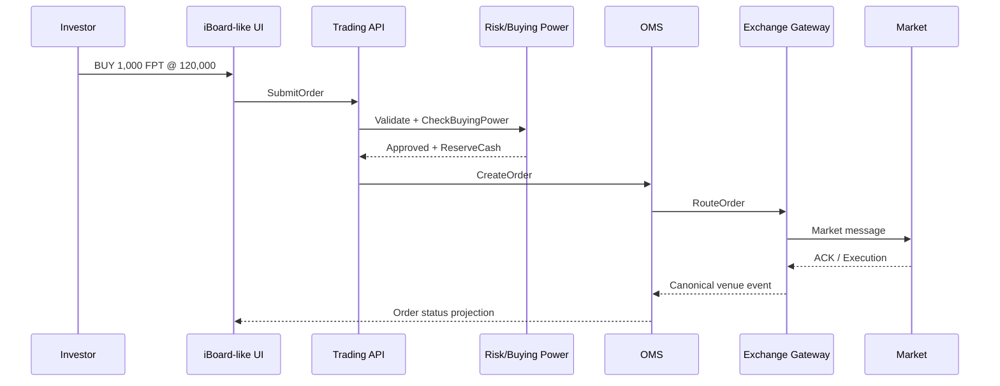

# Case Study — SSI iBoard

<div class="lesson-meta">
  <span><strong>Nền tảng</strong> SSI iBoard</span>
  <span><strong>Góc nhìn</strong> Trading + Asset + Cash + Derivatives</span>
  <span><strong>Nguyên tắc</strong> Chỉ suy luận business capability, không suy luận architecture nội bộ</span>
  <span><strong>UI Inspection</strong> <a href="./ui-inspection-ssi-iboard">Playwright 19/08/2026 authenticated</a></span>
</div>

SSI iBoard là case study tốt để học vì tài liệu công khai cho thấy một broker web platform có khá đầy đủ các capability: giao dịch cơ sở, phái sinh, lệnh điều kiện, giao dịch tiền, quản lý tài sản, hiệu suất đầu tư, SBOND và nhiều tiện ích khác.


> Ảnh minh họa từ trang công khai SSI (Web Trading / iBoard). Dùng để giới thiệu bối cảnh sản phẩm — **không** chứng minh architecture nội bộ. **Source:** 🟡 Public Marketing Page.

## 1. Feature inventory công khai

Theo các hướng dẫn chính thức của SSI, iBoard có các nhóm chức năng đáng chú ý:

```text
Market / Research
├── Bảng giá
├── Thông tin thị trường
├── Biểu đồ kỹ thuật
└── Phân tích

Trading
├── Giao dịch cơ sở
├── Giao dịch phái sinh
├── Đặt lệnh điều kiện
├── Sổ lệnh
├── Sửa / Hủy
└── Fast Connect API

Cash Operations
├── Nộp tiền
├── Chuyển tiền
├── Ứng trước tiền bán
├── Ký quỹ phái sinh
└── Sao kê tiền

Asset Management
├── Danh mục cơ sở
├── Danh mục phái sinh
├── Tài sản
├── Hiệu suất đầu tư
└── Lãi/Lỗ theo giao dịch

Other Products / Operations
├── Thực hiện quyền
├── Chuyển chứng khoán
├── IPO chứng quyền
└── SBOND
```

## 2. Đặt lệnh cơ sở — từ UI đến OMS

Flow public của iBoard:

```text
Đăng nhập
→ Đặt lệnh
→ Mã CK / Loại lệnh / Khối lượng / Giá
→ Mua hoặc Bán
→ Xác thực
→ Xác nhận
→ Sổ lệnh
→ Sửa / Hủy nếu còn chờ khớp
```

### Reference backend mental model



Không được hiểu `Xác nhận` trên UI là trade đã hình thành. Nó chỉ bắt đầu một lifecycle dài hơn.

## 3. Sổ lệnh — read model, không phải toàn bộ truth

UI Sổ lệnh cần trả lời nhanh:

```text
OrderId
Symbol
Side
Price
OrderQty
MatchedQty
RemainingQty
Status
CreatedAt
```

Nhưng backend có thể còn cần:

```text
ClientOrderId
VenueOrderId
RequestVersion
CumQty
LeavesQty
AveragePrice
LastExecId
RejectReason
PendingCancel
PendingReplace
BusinessDate
```

Mental model:

```text
OMS write model / venue events
          ↓
Order projection
          ↓
Sổ lệnh trên UI
```

## 4. Sửa/Hủy — UI đơn giản, backend có race condition

Giả sử:

```text
BUY 1.000 FPT
đã khớp 300
còn 700
```

User bấm Hủy.

Có thể xảy ra:

```text
T0  User click Cancel
T1  Market match thêm 200
T2  Cancel request tới market
T3  Market cancel phần còn lại 500
```

Kết quả hợp lệ:

```text
OrderQty      = 1.000
CumQty        = 500
CancelledQty  = 500
Status        = CANCELLED/PARTIALLY_FILLED_CANCELLED tùy model
```

Sai lầm là model:

```text
click Cancel → lập tức coi toàn bộ 1.000 là cancelled
```

## 5. Tài sản / Danh mục — nhiều state hơn một con số

SSI công khai các màn hình tài sản và danh mục cho cơ sở/phái sinh.

Với equity, reference model nên phân biệt:

```text
Position
├── TotalQty
├── SettledQty
├── PendingReceiveQty
├── PendingDeliverQty
├── ReservedSellQty
└── SellableQty
```

Ví dụ:

```text
Total FPT            2.000
Settled              1.500
Pending receive        500
Reserved sell          300
--------------------------
Sellable             1.200
```

`TotalQty` không đồng nghĩa `SellableQty`.

## 6. Lãi/Lỗ — realized và unrealized khác nhau

Nếu mua:

```text
1.000 FPT @ 100.000
```

Giá thị trường hiện tại:

```text
110.000
```

Unrealized P&L đơn giản:

```text
(110.000 - 100.000) × 1.000
= +10.000.000
```

Nếu đã bán 400 cổ phiếu ở `112.000`, cần tách:

```text
Realized P&L   → phần đã đóng vị thế
Unrealized P&L → phần 600 cổ phiếu còn giữ
```

Production còn phải xử lý fee, tax, corporate action adjustment và cost-basis convention.

## 7. Ứng trước tiền bán — ví dụ post-trade rất quan trọng

SSI có chức năng công khai **Ứng trước tiền bán**.

Đây là feature rất tốt để hiểu rằng:

```text
Trade đã khớp
≠ Cash đã settled
```

Ví dụ khách SELL:

```text
1.000 FPT @ 120.000
Gross sale proceeds = 120.000.000
```

Sau trade có thể hình thành:

```text
Pending Sale Receivable = 120m - fee/tax adjustments
```

Nhưng tiền settlement chưa tới.

Nếu khách dùng ứng trước:

```text
Pending Receivable
        ↓
Eligibility Check
        ↓
Advance Principal
        ↓
Advance Fee
        ↓
Available Cash tăng trước settlement
```

Reference data model:

```text
cash_receivable
cash_advance_request
cash_advance_contract/effect
cash_ledger_entry
settlement_instruction
```

### Invariants

```text
AdvanceAmount <= EligibleReceivable
Một receivable không được advance vượt limit
Settlement về phải reconcile với outstanding advance
Fee calculation phải versioned/auditable
```

## 8. Phái sinh — Close và Reverse Position

SSI công khai chức năng quản lý danh mục phái sinh, bao gồm đóng và đảo chiều vị thế.

Ví dụ đang:

```text
LONG 2 contracts
```

Nếu đảo chiều, hướng dẫn công khai minh họa việc tạo lượng SHORT đủ để:

```text
2 SHORT → đóng LONG 2
2 SHORT → mở SHORT mới 2
-------------------------
Tổng lệnh SHORT = 4
```

Đây là ví dụ giúp phân biệt:

```text
Order Quantity
≠ Final Net Position Change theo cách nhìn đơn giản
```

Derivatives engine cần theo dõi:

```text
OpenQty
CloseQty
Long/Short Position
AveragePrice
Realized PnL
Unrealized PnL
Margin
```

## 9. Lệnh điều kiện — rule tồn tại trước trading order

SSI có lệnh điều kiện như một capability công khai.

Reference model:

```text
ConditionalOrder
    ↓ ACTIVE
Market Data
    ↓
Condition Evaluator
    ↓ matched
TRIGGERING
    ↓
Risk / Buying Power
    ↓
Generated Trading Order
    ↓
OMS
```

Điểm quan trọng:

```text
ConditionalOrderId
!= TradingOrderId
```

Rule có thể sống nhiều giờ/ngày; trading order chỉ sinh ra khi trigger theo rule sản phẩm.

### Exactly-once business effect

Nếu trigger engine gọi OMS rồi timeout:

```text
Trigger matched
→ OMS CreateOrder thành công
→ response bị mất
→ trigger engine retry
```

Phải có deterministic key, ví dụ:

```text
GeneratedOrderKey = ConditionalOrderId + TriggerVersion
```

để retry không sinh order thứ hai.

## 10. Cash Statement — vì sao ledger quan trọng

SSI có chức năng sao kê tiền. Một reference backend tốt không nên chỉ lưu:

```text
CurrentBalance = 200m
```

mà phải giải thích được lịch sử:

```text
+500m  Deposit
-120m  Buy Settlement
-180k  Trading Fee
+80m   Sale Settlement
-50k   Transfer Fee
```

Projection:

```text
CurrentBalance = SUM(eligible ledger effects)
```

Sao kê chính là một read model có tính audit rất cao.

## 11. Fast Connect API — nhiều channel cùng đi vào trading core

SSI công khai Fast Connect API cho tích hợp market information và/hoặc chuyển lệnh vào hệ thống SSI.

Bài học architecture:

```text
Web UI
Mobile App
Partner API
Algorithmic Client
       ↓
Canonical Trading Boundary
       ↓
OMS / Risk / Market Connectivity
```

Không nên viết business rule quan trọng chỉ trong frontend iBoard.

## 12. Suggested reference API

```http
POST /trading/orders
GET  /trading/orders/{id}
POST /trading/orders/{id}/cancel
POST /trading/orders/{id}/replace

GET  /accounts/{id}/buying-power
GET  /accounts/{id}/positions
GET  /accounts/{id}/cash
GET  /accounts/{id}/settlements

POST /cash-advances
GET  /cash-advances/{id}

POST /conditional-orders
POST /conditional-orders/{id}/cancel
```

Không phải API thật của SSI; đây là **reference design để học**.

## 13. Failure scenarios nên test

1. User double-click Đặt lệnh.
2. Broker accepted nhưng exchange gateway timeout.
3. Partial fill xảy ra trong lúc cancel.
4. Duplicate execution replay lại.
5. Cash reservation không release sau reject.
6. Market data stale nhưng conditional order vẫn active.
7. Cash advance được tạo hai lần cho cùng receivable.
8. Settlement về nhưng cash projection không update.
9. P&L projection dùng stale price.
10. Derivatives reverse position chỉ khớp một phần.

## 14. Những gì SSI iBoard giúp ta học

```text
Trading UI
→ OMS

Sổ lệnh
→ read model / projection (không phải source of truth duy nhất)

Ứng trước tiền bán
→ pending settlement + financing

Danh mục / P&L
→ projections

Phái sinh
→ position + margin

Lệnh điều kiện
→ long-lived rule + generated order

Sao kê
→ ledger / audit

Fast Connect API
→ multi-channel trading boundary
```

## 15. SSI / VPS liên quan tới 8 Core Domains thế nào? (SSI)

Chi tiết feature card: [ui-inspection-ssi-iboard](./ui-inspection-ssi-iboard) · [broker-domain-matrix](./broker-domain-matrix).

### 01 Securities Core

🟢 Observed screens: Bảng giá, board filters (lô lẻ, thỏa thuận trên board).

🟣 Authenticated client evidence: Đặt lệnh, Sổ lệnh, lệnh điều kiện, ứng trước, cash labels.

🟡 Official: flow đặt/sửa/hủy lệnh trên tài liệu SSI.

### 02 Derivatives Core

🟢 board tab Phái sinh · 🟣 menu Giao dịch phái sinh.

### 03 Bonds Core

🟢 filter trái phiếu riêng lẻ trên board · 🟣 SBOND labels.

### 04 Funds Core

🟣 CCQ labels — authenticated screen 🔴.

### 05 Realtime Analytics

🟢 board VN30/HOSE, submenu Thông tin thị trường (DOM popup).

### 06 Conditional Orders

🟣+🟡 labels — screen/form 🔴.

### 07 Rewards

🔴 / — (không thấy trong phiên 19/08).

### 08 Enterprise Workflow

🟣 Tăng sức mua, IPO, quyền, chuyển tiền (không submit). Margin **overview** thuộc 01+Risk, không map toàn bộ margin vào 08.

## 16. Visual Gallery

Inventory đầy đủ: [screenshots/README](./screenshots/README).

### Public Product Images


**Source:** 🟡 Public Documentation — hướng dẫn giao dịch trên iBoard.

**Why this image matters:** liệt kê capability bảng giá, watchlist, công cụ phân tích mà không cần login.


**Source:** 🟡 Public Documentation — Giao dịch tiền.

**Why this image matters:** Ứng trước tiền bán và sao kê là capability post-trade / financing, không phải matching. Cross-link: [Domain 01](/domains/01-securities-core) · [Domain 08](/domains/08-enterprise-workflow) · [Bài 18 Ledger](/lectures/18-ledger-accounting-projections/).

### Authenticated UI Screenshots


**Source:** 🟢 Authenticated UI (redacted — đã ẩn số tài khoản).

**Why this image matters:** Trần/Sàn/TC, 3 mức bid/ask, phiên Liên tục minh họa [Domain 05 Realtime Analytics](/domains/05-realtime-analytics) · [Bài 10 Market Data](/lectures/10-market-data-engineering/). Ảnh không chứng minh FIX feed nội bộ.


**Source:** 🟢 Authenticated UI (redacted).

**Why this image matters:** Tỷ lệ KQ, trạng thái An toàn, Tổng nợ, Lãi tạm tính, Gói vay — **01 + Risk**, không gom toàn bộ vào Domain 08. Nút *Tăng sức mua* là workflow (không click). → [Bài 11 Risk/Margin](/lectures/11-risk-margin-controls/).


**Source:** 🟢 Authenticated UI (redacted).

**Why this image matters:** Top đột phá / vượt đỉnh là fan-out analytics, không phải OMS write path.

Không chụp sổ lệnh / danh mục / sao kê vì holdings và số dư thật.

## 17. Nguồn chính thức

- https://www.ssi.com.vn/khach-hang-ca-nhan/nen-tang-giao-dich/nen-tang-giao-dich-web-trading/iboard-web
- https://www.ssi.com.vn/khach-hang-ca-nhan/giao-dich-chung-khoan-ib-web
- https://www.ssi.com.vn/khach-hang-ca-nhan/giao-dich-tien-iboard-web
- https://www.ssi.com.vn/khach-hang-ca-nhan/quan-ly-tai-san-iboard-web

## Bài tập

Thiết kế model cho feature **Ứng trước tiền bán** gồm:

```text
SaleReceivable
CashAdvance
AdvanceFeeRule
CashLedgerEntry
SettlementResult
```

Sau đó chứng minh bằng invariant rằng cùng một khoản tiền bán không thể được ứng hai lần ngoài policy.