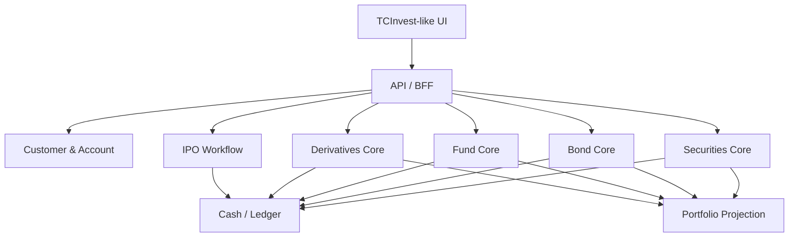

# Case Study — TCBS / TCInvest

<div class="lesson-meta">
  <span><strong>Nền tảng</strong> TCInvest</span>
  <span><strong>Góc nhìn</strong> Multi-product Brokerage / Wealth Platform</span>
  <span><strong>Ví dụ</strong> Cổ phiếu · Trái phiếu · Quỹ · Margin · Conditional Order</span>
  <span><strong>UI Inspection</strong> <a href="./ui-inspection-tcbs-tcinvest">Playwright 18/08/2026 — public only</a></span>
</div>

TCInvest là case study tốt để học một điểm rất quan trọng: **brokerage platform không chỉ có equity OMS**. Tài liệu công khai của TCBS cho thấy một tài khoản có thể tiếp cận nhiều sản phẩm như cổ phiếu, trái phiếu, quỹ đầu tư, phái sinh, chứng quyền và các tính năng quản lý tài sản.


> Ảnh minh họa trang hệ thống iWealth công khai. **Source:** 🟡 Public Marketing Page. Authenticated TCInvest: **not verified**.

## 1. Feature / product inventory công khai

```text
TCBS (brokerage business)
└── TCInvest / iWealth (customer platform)
    ├── iStock — cổ phiếu, CW, CCQ niêm yết, odd-lot, lệnh điều kiện, TWAP, margin
    ├── iBond / iConnect / AllConnect — trái phiếu
    ├── iFund / Fundmart — quỹ mở, ETF, đầu tư định kỳ, Micro Saving
    ├── iFuture — phái sinh
    ├── iPO — đăng ký mua IPO
    ├── TCAnalysis / TCPrice — research + bảng giá
    ├── TCWealth / iPlan — kế hoạch / robo
    ├── iXu / iWealth Partner / iCopy — rewards / copy-trading
    └── Onboarding / quyền / tiền — enterprise workflow
```

Không phải tất cả các sản phẩm này dùng cùng một trading lifecycle. Đây chính là bài học lớn nhất.

## 2. “Một app” không có nghĩa “một domain model”

UI có thể gom nhiều sản phẩm trong cùng TCInvest:

```text
TCInvest
├── Stock
├── Bond
├── Fund
├── Derivatives
└── IPO
```

Nhưng backend reference model nên tôn trọng bounded contexts:

```text
Identity / Customer / Account
          ↓
Product-specific domains
├── Securities Core
├── Bond Core
├── Fund Core
├── Derivatives Core
└── IPO / Subscription Workflow
          ↓
Shared supporting capabilities
├── Cash / Ledger
├── Portfolio Projection
├── Market / Reference Data
├── Notifications
└── Audit
```

## 3. Cổ phiếu — order lifecycle vẫn là nền tảng

TCBS hướng dẫn khách đặt lệnh cổ phiếu và quản lý lệnh chưa khớp trong Sổ lệnh.

Reference flow:

```text
User đặt BUY
→ validate instrument/session/order type
→ check buying power
→ reserve cash
→ OMS
→ market
→ execution(s)
→ trade booking
→ settlement
→ portfolio
```

Những concept cốt lõi vẫn giống mọi brokerage core:

```text
Order != Execution != Trade
FILLED != SETTLED
Total Position != Sellable Quantity
Cash != Buying Power
```

## 4. Price-Time Priority — tại sao thấy giá phù hợp chưa chắc khớp ngay?

TCBS có tài liệu giải thích nguyên tắc ưu tiên giá và thời gian.

Ví dụ cùng mức SELL `120.000`:

```text
10:00:00  A SELL 400
10:00:01  B SELL 500
10:00:02  C SELL 300
```

Một BUY đối ứng 700 đến sau:

```text
A fill 400
B fill 300

B leaves 200
C leaves 300
```

Cùng giá nhưng A/B đứng trước C theo time priority trong mental model đơn giản này.

Bài học backend:

```text
Matching priority
≠ chỉ so sánh price
```

## 5. Odd-lot 1–99 — market rules là configuration, không phải magic number

TCBS công khai hỗ trợ giao dịch lô lẻ `1–99` tại giao diện cổ phiếu, với rule riêng cho lô lẻ.

Đây là ví dụ rất tốt để tránh code kiểu:

```csharp
if (quantity % 100 != 0)
    reject;
```

Reference validation nên dựa vào:

```text
Venue
Board / Market Segment
Instrument
Order Type
Trading Session
Lot Type
Effective Rule Version
```

Ví dụ object:

```text
OrderValidationContext
├── Market = HOSE
├── LotType = ODD_LOT
├── Qty = 37
├── OrderType = LO
├── Session = CONTINUOUS
└── RuleVersion = 2026-xx
```

## 6. Margin — cash account và margin account không giống nhau

TCBS public help phân biệt tiểu khoản thường và tiểu khoản ký quỹ.

Mental model:

```text
Cash Account
Buying Power ≈ Eligible Cash - Reservations

Margin Account
Buying Power
≈ Cash
+ Eligible Credit
+ Collateral Effect
- Existing Debt/Risk Usage
- Reservations
```

Ví dụ:

```text
Cash                  100m
Eligible Margin Loan  150m
Existing Usage         40m
Reserved               20m
--------------------------
Reference BuyingPower 190m
```

Số thật/rule thật phụ thuộc chính sách broker; ví dụ chỉ nhằm giải thích structure.

## 7. Lệnh điều kiện — một rule có lifecycle riêng

TCBS có tài liệu về lệnh điều kiện cổ phiếu, bao gồm chốt lãi/cắt lỗ và các tính năng chiến lược như TWAP.

Reference state:

```text
DRAFT
→ ACTIVE
→ TRIGGERING
→ TRIGGERED
→ ORDER_SUBMITTED
→ COMPLETED
```

Ví dụ:

```text
Nếu FPT <= 100.000
→ SELL 1.000
```

Engine cần:

```text
Market Data
→ Price Source Validation
→ Condition Evaluation
→ Atomic Trigger
→ Risk / Sellable Check
→ GeneratedOrder
→ OMS
```

### TWAP khác stop-loss

Stop-loss:

```text
price condition → tạo order
```

TWAP mental model:

```text
Parent Quantity
→ chia thành nhiều child orders theo schedule/time slices
→ theo dõi fills
→ điều chỉnh phần còn lại
```

Do đó cùng nằm dưới “advanced/conditional trading” trên UX nhưng domain state khác nhau đáng kể.

## 8. Quỹ — không dùng equity matching model

TCBS có iFund/Fundmart và tính năng đầu tư chứng chỉ quỹ định kỳ.

Ví dụ đầu tư định kỳ:

```text
Mỗi tháng 1.000.000 VND
→ đến ngày schedule
→ tạo fund subscription request
→ kiểm tra tiền
→ chờ valuation/NAV theo product rule
→ allocate units
```

Không nên model như:

```text
BUY Fund @ current market price
→ exchange fill immediately
```

Fund lifecycle có thể là:

```text
SCHEDULED
→ REQUEST_CREATED
→ VALIDATED
→ WAITING_NAV
→ PRICED
→ ALLOCATED
→ SETTLED
```

## 9. NAV — người dùng mua tiền, hệ thống allocate units

Ví dụ:

```text
Investment Amount = 10.000.000
Fee              = 0
NAV/Unit          = 20.000
```

Reference:

```text
Allocated Units = 10.000.000 / 20.000
                = 500 units
```

Nếu NAV chưa có lúc user submit thì request phải sống ở trạng thái chờ pricing thay vì “filled” ngay.

## 10. Đầu tư định kỳ — scheduler là business feature

TCBS công khai hỗ trợ đầu tư quỹ định kỳ theo các chu kỳ.

Reference model:

```text
RecurringInvestmentPlan
├── FundId
├── Amount
├── Frequency
├── NextRunDate
├── Status
└── RuleVersion
```

Mỗi kỳ:

```text
Plan
→ Due Date
→ Generate Subscription Request
→ Check Funding
→ Process Fund Lifecycle
→ Record Result
→ Calculate NextRunDate
```

Nếu thiếu tiền một kỳ, plan không nhất thiết biến mất; behavior phải theo product contract.

## 11. Bond — cùng nút “Mua” nhưng economics khác equity

TCBS có các sản phẩm/trải nghiệm trái phiếu như iBond/iConnect.

Bond order cần các concept equity core không đủ:

```text
Face Value
Coupon
Accrued Interest
Clean / Dirty Price
Yield
Maturity
Settlement Convention
Cash-flow Schedule
```

Ví dụ:

```text
Face Value    = 100m
Coupon        = 8%/year
Accrued       = 2m
Clean Price   = 99m
```

Reference dirty consideration:

```text
Dirty Price ≈ Clean Price + Accrued Interest
            ≈ 101m
```

Ví dụ đơn giản để hiểu concept; production phải theo contract/day-count/product rules.

## 12. iConnect — marketplace/workflow có thể khác exchange order book

Một bond trading capability online không nên mặc định dùng cùng equity matching engine.

Reference questions:

```text
Is it exchange-traded or negotiated?
Who is counterparty?
How is price/yield quoted?
What is settlement date?
What confirmation/evidence is authoritative?
Can order be partially filled?
Can it be cancelled?
```

Architecture phải bắt đầu từ contract của product, không từ việc UI cũng có nút Mua/Bán.

## 13. IPO — subscription workflow, không phải normal secondary-market order

TCBS có luồng iPO công khai với trạng thái đăng ký/đặt mua.

Mental model:

```text
IPO Offering
→ Customer Subscription
→ Validate Eligibility
→ Reserve / Collect Cash
→ Offering Close
→ Allocation
→ Refund Unallocated Amount
→ Securities Entitlement / Listing lifecycle
```

State có thể giống:

```text
DRAFT
→ SUBMITTED
→ FUNDED
→ ACCEPTED
→ ALLOCATED
→ REFUND_PENDING
→ COMPLETED
```

Đây là workflow dài ngày, không phải order `NEW → FILLED` trong vài mili-giây.

## 14. Portfolio tổng thể — một projection đa sản phẩm

TCInvest định vị như nền tảng quản lý nhiều loại tài sản.

Reference projection:

```text
Portfolio
├── Equity Market Value
├── Bond Valuation
├── Fund NAV Value
├── Derivatives PnL / Margin
├── Cash
└── Pending Receivables/Payables
```

Thách thức là mỗi asset class có valuation semantics khác nhau.

Không nên:

```text
PortfolioValue = SUM(quantity × lastPrice)
```

cho mọi sản phẩm.

## 15. Product Catalog / Security Master trở nên quan trọng

Multi-product platform cần biết:

```text
ProductType
InstrumentType
TradingVenue
Currency
SettlementRule
ValuationRule
FeeRule
TaxRule
RiskRule
Eligibility
EffectiveDate
```

Một `Security` table 5 cột thường không đủ.

## 16. Suggested reference architecture



Đây là reference architecture để học, không phải mô tả hệ thống nội bộ TCBS.

## 17. Failure scenarios

1. Odd-lot order bị validate bằng round-lot rule.
2. Conditional order trigger hai lần do duplicate market tick.
3. TWAP scheduler restart tạo duplicate child order.
4. Margin buying power stale khi hai order submit đồng thời.
5. Fund recurring plan tạo hai subscription trong cùng kỳ.
6. NAV correction nhưng historical allocation bị overwrite.
7. Bond accrued interest tính sai day-count.
8. IPO allocation nhỏ hơn subscription nhưng refund không tạo.
9. Portfolio cộng sai giá trị vì dùng lastPrice cho fund/bond.
10. Cash ledger update thành công nhưng product projection fail.

## 18. Những gì TCInvest giúp ta học

```text
Một UI nhiều sản phẩm
≠ một domain model

Equity
→ OMS / Matching lifecycle

Margin
→ Credit + Collateral + Risk

Conditional / TWAP
→ Strategy / Trigger Engine

Fund
→ NAV / Allocation / Cut-off / Scheduler

Bond
→ Cash-flow / Yield / Accrued Interest

IPO
→ Long-running subscription/allocation workflow

Portfolio
→ Multi-asset projection
```

## 19. TCBS / TCInvest liên quan tới 8 Core Domains thế nào?

Chi tiết feature card: [ui-inspection-tcbs-tcinvest](./ui-inspection-tcbs-tcinvest). Matrix: [broker-domain-matrix](./broker-domain-matrix).

### 01 Securities Core

Observed/public: iStock, đặt lệnh cổ phiếu, sổ lệnh, lô lẻ 1–99, sức mua, margin, ứng trước tiền bán chờ về, thỏa thuận.

Business flow: User → Trading API → Account/Buying Power → Reservation → OMS → Market → Execution → Booking → Settlement → Position.

Xem [01 Securities Core](/domains/01-securities-core), [Bài 06](/lectures/06-order-matching/), [Bài 08](/lectures/08-account-cash-position-buying-power/), [Bài 13](/lectures/13-oms-internals-state-machine/).

### 02 Derivatives Core

Observed/public: iFuture; help lãi/lỗ, long/short, T+0, ngưỡng 85/87/90%, multiplier HĐTL chỉ số 100,000.

Chưa xác minh: ticket đặt lệnh phái sinh sau login.

Xem [02 Derivatives Core](/domains/02-derivatives-core), [Bài 11](/lectures/11-risk-margin-controls/).

### 03 Bonds Core

Observed/public: iBond, iConnect, AllConnect, đặt lệnh trái phiếu, coupon định kỳ.

Chưa xác minh: màn hình holding/yield sau login.

Xem [03 Bonds Core](/domains/03-bonds-core).

### 04 Funds Core

Observed/public: iFund, Fundmart, đầu tư định kỳ từ 10,000 VND, NAV/unit, cut-off, auto-hủy sau 5 kỳ thiếu tiền.

Xem [04 Funds Core](/domains/04-funds-core).

### 05 Realtime Analytics

Observed/public: Bảng giá TCPrice, guest module Bảng giá, TCAnalysis, bộ lọc, đồ thị.

Xem [05 Realtime Analytics](/domains/05-realtime-analytics), [Bài 10](/lectures/10-market-data-engineering/).

### 06 Conditional Orders

Observed/public: Lệnh điều kiện (chốt lãi/cắt lỗ), Lệnh 24/7, TWAP.

Chưa xác minh: form trigger/TWAP slice trên authenticated UI.

Xem [06 Conditional Orders](/domains/06-conditional-orders).

### 07 Rewards

🟡 Public: iXu, giới thiệu bạn bè, iWealth Partner, copy lịch sử chi trả iXu.

🔴 Authenticated reward ledger / redemption workflow **chưa verified** — product copy ≠ đủ evidence Domain 07 end-to-end (Campaign, Points, Voucher, Reversal…).

Xem [07 Rewards](/domains/07-rewards).

### 08 Enterprise Workflow

Observed/public: mở tài khoản 3 phút, iPO (đặt cọc, iOTP, phân bổ, hoàn tiền), thực hiện quyền online, HĐ điện tử phái sinh.

Xem [08 Enterprise Workflow](/domains/08-enterprise-workflow), [Bài 09](/lectures/09-security-master-corporate-actions/), [Bài 12](/lectures/12-eod-reconciliation-operations/), [Bài 17](/lectures/17-clearing-netting-settlement/), [Bài 18](/lectures/18-ledger-accounting-projections/).

## 20. One App ≠ One Domain

```text
TCInvest UI
    ↓
Unified Customer Experience
    ↓
Domain-specific capabilities
    ├── Securities
    ├── Bonds
    ├── Funds
    ├── Derivatives
    ├── Conditional Orders
    └── Workflow
          ↓
Shared cross-cutting
    ├── Customer
    ├── Account
    ├── Cash
    ├── Portfolio (projection)
    ├── Ledger
    ├── Identity
    └── Notifications
```

Không nên tạo `UniversalInvestmentEntity { Type, Amount, Status }` cho mọi sản phẩm chỉ vì UI gom chúng vào một màn hình. Portfolio trên UI là **projection**.

## 21. Visual Gallery

Inventory: [screenshots/README](./screenshots/README). **Authenticated UI:** not verified.

### Public Product Images


**Source:** 🟡 Public Marketing Page — catalog đa sản phẩm.


**Source:** 🟡 Public — iStock. Domain [01](/domains/01-securities-core) + [05](/domains/05-realtime-analytics) + [06](/domains/06-conditional-orders).


**Source:** 🟡 Public — iBond. Domain [03](/domains/03-bonds-core).


**Source:** 🟡 Public — Fundmart. Domain [04](/domains/04-funds-core).


**Source:** 🟡 Public — iFuture. Domain [02](/domains/02-derivatives-core).


**Source:** 🟡 Public — đầu tư định kỳ quỹ. Domain 04.

### Public Documentation


**Source:** 🟡 Public Documentation — lệnh điều kiện, link TWAP. Domain [06](/domains/06-conditional-orders).

### Authenticated UI Screenshots

Chưa có — TCInvest redirect `guest/login` (18/08/2026).

## 22. Nguồn chính thức

- https://www.tcbs.com.vn/ca-nhan/he-thong/
- https://www.tcbs.com.vn/ca-nhan/san-pham/
- https://www.tcbs.com.vn/ca-nhan/co-phieu-istock/
- https://www.tcbs.com.vn/ca-nhan/trai-phieu-ibond/
- https://www.tcbs.com.vn/ca-nhan/ifund/
- https://help.tcbs.com.vn/hoi-nhanh-dap-hay/co-phieu/
- https://help.tcbs.com.vn/lenh-dieu-kien/
- https://help.tcbs.com.vn/dat-lenh-chien-luoc-twap/
- https://help.tcbs.com.vn/ufaq/huong-dan-giao-dich-lo-le-tren-tcinvest/
- https://help.tcbs.com.vn/giao-dich-va-thanh-toan-lai-lo-krx/
- https://www.tcbs.com.vn/ca-nhan/san-pham/dau-tu-dinh-ky/
- https://www.tcbs.com.vn/ca-nhan/san-pham/ipo/

## Bài tập

Thiết kế `PortfolioSnapshot` cho một khách có đồng thời:

```text
500 FPT
1 trái phiếu doanh nghiệp
2.000 units quỹ mở
1 vị thế futures
50m cash
```

Với mỗi asset class, ghi rõ **valuation source**, **timestamp**, **currency**, **pending state** và cách phát hiện dữ liệu stale.