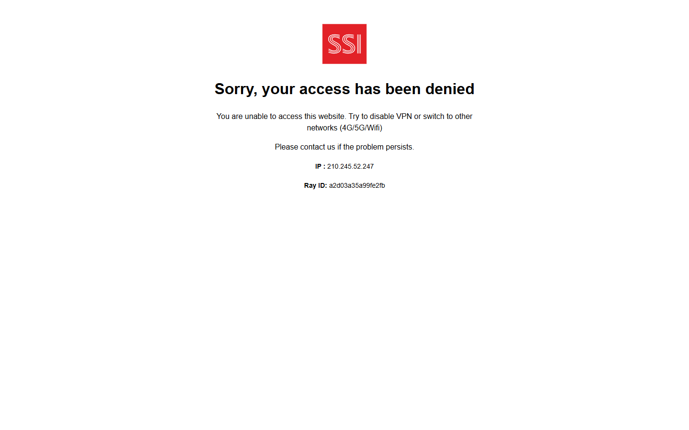

# UI Inspection — SSI iBoard

<div class="lesson-meta">
  <span><strong>Ngày khảo sát</strong> 18/08/2026</span>
  <span><strong>Phương pháp</strong> Playwright MCP + Chrome DevTools MCP — chỉ đọc</span>
  <span><strong>Trạng thái truy cập</strong> ❌ Blocked (HTTP 403 / WAF)</span>
</div>

## Kết quả truy cập

Playwright và Chrome DevTools MCP **đều bị chặn** khi truy cập `https://iboard.ssi.com.vn/`:

```text
Sorry, your access has been denied

You are unable to access this website.
Try to disable VPN or switch to other networks (4G/5G/Wifi)

IP : 210.245.52.247
Ray ID: a2d03a35a99fe2fb
```



### Ý nghĩa kỹ thuật

| Quan sát 🟢 | Suy luận 🟡 |
|---|---|
| Cloudflare/WAF block theo IP automation | iBoard có lớp bảo vệ bot/VPN/datacenter IP |
| Không thấy UI iBoard | Menu, terminology, workflows **không** được xác nhận trực tiếp phiên này |
| User tab đăng nhập riêng | Playwright MCP **không** dùng chung session Chrome của user |

> **Không khẳng định** kiến trúc nội bộ SSI. Phần dưới dùng **tài liệu công khai SSI** + case study hiện có, đánh dấu 🔵.

## Navigation map (🔵 — tài liệu công khai SSI)

Theo trang giới thiệu và hướng dẫn SSI iBoard:

```text
Market / Research
├── Bảng giá
├── Thông tin thị trường
├── Biểu đồ kỹ thuật
└── Phân tích

Trading
├── Giao dịch cơ sở
├── Giao dịch phái sinh
├── Đặt lệnh điều kiện
├── Sổ lệnh
├── Sửa / Hủy
└── Fast Connect API

Cash Operations
├── Nộp tiền
├── Chuyển tiền
├── Ứng trước tiền bán
├── Ký quỹ phái sinh
└── Sao kê tiền

Asset Management
├── Danh mục cơ sở
├── Danh mục phái sinh
├── Tài sản
├── Hiệu suất đầu tư
└── Lãi/Lỗ theo giao dịch

Other Products / Operations
├── Thực hiện quyền
├── Chuyển chứng khoán
├── IPO chứng quyền
└── SBOND
```

## Feature cards (🔵 public capability → reference model 🟡)

### 1. Giao dịch cơ sở — Đặt lệnh Mua/Bán

**Core Domain:** Securities Core

| Trường | Nội dung |
|---|---|
| 🔵 UI feature | Mã CK / Loại lệnh / Khối lượng / Giá → Mua hoặc Bán → Xác thực → Xác nhận |
| Giải thích nghiệp vụ | Tạo **lệnh giao dịch cơ sở** trên HSX/HNX/UPCOM |
| Thuật ngữ | **Loại lệnh** (LO/ATO/ATC/…) · **Khớp lệnh** · **Sổ lệnh** |
| Ví dụ số | BUY **1,000 FPT @ 120,000** → giá trị **120,000,000đ** (+ phí) |
| Entity / state | `Order`: CREATED → PENDING_NEW → NEW → PARTIALLY_FILLED → FILLED / CANCELLED / REJECTED |
| Invariant 🟡 | `OrderQty = CumQty + LeavesQty`; BUY cần buying power; SELL cần sellable qty |
| API/command 🟡 | `POST /trading/orders` · `POST /trading/orders/{id}/cancel` |
| DB/projection 🟡 | `orders`, `executions`, `cash_reservations`, `security_reservations` |
| External dependency | OMS → Exchange Gateway → HOSE/HNX/UPCOM |
| Failure scenarios | Double-click đặt lệnh; gateway timeout sau broker accept; cancel race với partial fill |
| Reconciliation | Đối chiếu sổ lệnh UI vs OMS vs báo cáo sàn |

---

### 2. Sổ lệnh

**Core Domain:** Securities Core

| Trường | Nội dung |
|---|---|
| 🔵 UI feature | OrderId, Symbol, Side, Price, OrderQty, MatchedQty, RemainingQty, Status, CreatedAt |
| Giải thích nghiệp vụ | **Read model** trạng thái lệnh intraday |
| Ví dụ số | BUY 1,000 FPT — khớp 300 → MatchedQty=300, RemainingQty=700, Status=PARTIALLY_FILLED |
| Entity / state | Projection từ OMS events, không phải toàn bộ write model |
| Invariant 🟡 | UI status phải traceable về venue events |
| Failure scenarios | Projection lag; duplicate event làm CumQty sai |
| Reconciliation | Replay OMS event log |

---

### 3. Sửa / Hủy lệnh

**Core Domain:** Securities Core

| Trường | Nội dung |
|---|---|
| 🔵 UI feature | Sửa/Hủy khi lệnh còn chờ khớp |
| Ví dụ số | BUY 1,000 — khớp 300, user Hủy → hợp lệ: CumQty=500 (nếu thêm khớp 200), CancelledQty=500 |
| Invariant 🟡 | Không coi cancel click = toàn bộ qty bị hủy ngay lập tức |
| Failure scenarios | Cancel vs match race condition |
| Reconciliation | So venue order state cuối ngày |

---

### 4. Giao dịch phái sinh + Đóng/Đảo chiều vị thế

**Core Domain:** Derivatives Core

| Trường | Nội dung |
|---|---|
| 🔵 UI feature | Danh mục phái sinh; **Close** và **Reverse Position** |
| Giải thích nghiệp vụ | Quản lý **net position** hợp đồng tương lai |
| Ví dụ số | LONG **2** hợp đồng → Reverse → tổng lệnh SELL **4** (2 đóng + 2 mở SHORT) |
| Entity / state | `DerivativePosition`: OpenQty, Long/Short, AvgPrice, Realized/Unrealized PnL, Margin |
| Invariant 🟡 | Net position thay đổi theo fills, không theo ý định UI đơn giản |
| External dependency | HNX derivatives; margin engine |
| Failure scenarios | Reverse chỉ khớp một phần |
| Reconciliation | Position vs clearing house statement |

---

### 5. Lệnh điều kiện

**Core Domain:** Conditional Orders

| Trường | Nội dung |
|---|---|
| 🔵 UI feature | Tạo rule → kích hoạt → sinh lệnh giao dịch |
| Giải thích nghiệp vụ | **Long-lived rule** tách khỏi trading order |
| Thuật ngữ | **ConditionalOrderId** ≠ **TradingOrderId** |
| Entity / state | ACTIVE → TRIGGERING → GENERATED_ORDER → COMPLETED / CANCELLED |
| Invariant 🟡 | Trigger exactly-once: `GeneratedOrderKey = ConditionalOrderId + TriggerVersion` |
| Failure scenarios | Trigger timeout + retry → duplicate order nếu thiếu idempotency |
| External dependency | Market data feed cho condition evaluator |

---

### 6. Ứng trước tiền bán

**Core Domain:** Enterprise Workflow (+ cash financing)

| Trường | Nội dung |
|---|---|
| 🔵 UI feature | Cash Operations → Ứng trước tiền bán |
| Giải thích nghiệp vụ | Biến **pending sale receivable** thành cash usable trước settlement |
| Ví dụ số | SELL 1,000 FPT @ 120,000 → gross **120,000,000đ** → ứng tối đa theo eligible receivable |
| Entity / state | `SaleReceivable` → `CashAdvanceRequest` → `CashAdvanceContract` → ledger entries |
| Invariant 🟡 | `AdvanceAmount ≤ EligibleReceivable`; một receivable không ứng 2 lần |
| Failure scenarios | Settlement về nhưng chưa trừ advance; duplicate advance request |
| Reconciliation | Settlement proceeds vs outstanding advance + fee |

---

### 7. Danh mục / Tài sản / P&L

**Core Domain:** Realtime Analytics + Securities Core

| Trường | Nội dung |
|---|---|
| 🔵 UI feature | Danh mục cơ sở/phái sinh, Hiệu suất đầu tư, Lãi/Lỗ theo giao dịch |
| Ví dụ số | Total FPT **2,000** · Settled **1,500** · Pending receive **500** · Reserved sell **300** → Sellable **1,200** |
| P&L ví dụ | Mua 1,000 @ 100,000 · giá TT 110,000 → Unrealized **+10,000,000đ** |
| Invariant 🟡 | `TotalQty ≠ SellableQty`; tách Realized vs Unrealized |
| Failure scenarios | P&L dùng stale price; corporate action chưa adjust cost basis |

---

### 8. SBOND

**Core Domain:** Bonds Core

| Trường | Nội dung |
|---|---|
| 🔵 UI feature | SBOND — sản phẩm trái phiếu trên iBoard |
| Giải thích nghiệp vụ | Giao dịch/ nắm giữ **trái phiếu** qua broker |
| Entity / state 🟡 | `BondPosition`, accrued interest, yield, maturity |
| External dependency | Bond market / issuer data |
| Failure scenarios | Accrued interest tính sai ngày coupon |

---

### 9. Thực hiện quyền / Chuyển CK / IPO CW

**Core Domain:** Enterprise Workflow

| Trường | Nội dung |
|---|---|
| 🔵 UI feature | Corporate actions, chuyển chứng khoán, IPO chứng quyền |
| Entity / state | `Entitlement`, `CorporateActionElection`, `TransferInstruction` |
| Invariant 🟡 | Entitlement theo record date; election deadline |
| External dependency | VSDC / registrar |

---

### 10. Fast Connect API

**Core Domain:** Securities Core (multi-channel boundary)

| Trường | Nội dung |
|---|---|
| 🔵 UI/API feature | API tích hợp market data và/hoặc routing lệnh |
| Giải thích nghiệp vụ | **Canonical trading boundary** cho web/mobile/partner |
| Invariant 🟡 | Business rules không chỉ nằm ở frontend |
| Failure scenarios | Partner retry không idempotent |

---

### 11. Sao kê tiền / Ký quỹ PS / Chuyển tiền

**Core Domain:** Enterprise Workflow

| Trường | Nội dung |
|---|---|
| 🔵 UI feature | Cash statement, derivative margin deposit, transfers |
| Giải thích nghiệp vụ | **Ledger-backed** cash movements có audit trail |
| Ví dụ số | Balance = SUM(eligible ledger effects), không phải một con số tĩnh |
| Failure scenarios | Transfer timeout ≠ failed; cần status inquiry |

---

## Domain coverage matrix (🔵 public inventory)

| Core Domain | SSI iBoard (public) |
|---|---|
| Securities Core | ✅ Cơ sở, sổ lệnh, sửa/hủy |
| Derivatives Core | ✅ PS + margin + danh mục PS |
| Bonds Core | ✅ SBOND |
| Funds Core | — (không thấy trên iBoard public list) |
| Realtime Analytics | ✅ Bảng giá, biểu đồ, P&L |
| Conditional Orders | ✅ |
| Rewards | — (không thấy) |
| Enterprise Workflow | ✅ Cash, quyền, chuyển CK, sao kê |

---

## Khuyến nghị khảo sát tiếp

Để hoàn thiện UI inspection **trực tiếp** trên tab đang đăng nhập:

1. Bật Chrome remote debugging hoặc cấu hình Playwright MCP attach vào user profile có session SSI.
2. Truy cập iBoard từ mạng residential (tránh datacenter IP bị WAF).
3. Chạy lại checklist read-only trên từng menu sau login.

---

## Nguồn

- WAF block: quan sát Playwright/Chrome DevTools MCP, 18/08/2026
- Feature inventory 🔵: https://www.ssi.com.vn/khach-hang-ca-nhan/nen-tang-giao-dich/nen-tang-giao-dich-web-trading/iboard-web
- Case study: [ssi-iboard.md](./ssi-iboard.md)
