# Visual Gallery — SSI / VPS / TCBS

<div class="lesson-meta">
  <span><strong>Mục tiêu</strong> Học nghiệp vụ từ screen thật / public product UI</span>
  <span><strong>Evidence</strong> 🟢 Authenticated · 🟡 Public/Official</span>
  <span><strong>An toàn</strong> Authenticated screenshots đã redact/crop PII</span>
</div>

Gallery này dùng ảnh như **learning evidence**, không chỉ để trang trí. Mỗi ảnh trả lời ba câu hỏi:

```text
Bạn đang nhìn gì?
→ Business concept nào nằm phía sau?
→ Học sâu ở Domain / Lecture nào?
```

> Ảnh minh họa capability/UI. Không dùng screenshot để suy ra database, service topology, protocol hoặc implementation nội bộ của SSI, VPS hay TCBS.

## Evidence legend

- 🟢 **Authenticated UI · Redacted** — screen đã mở trong session login và đã loại PII/số dư/holdings nhạy cảm.
- 🟡 **Public / Official** — marketing page, product page, help hoặc public web UI chính thức.
- 🟣 **Client evidence** — menu/route/label sau login nhưng không có screenshot trong gallery.
- 🔴 **Not verified** — chưa có bằng chứng đủ mạnh.

Inventory đầy đủ, source URL, capture date và PII status: [Screenshot Inventory](./screenshots/).

## 1. SSI iBoard

**Evidence:** 🟢 Authenticated + 🟡 Official  
**Học tốt nhất:** Margin · Market Analytics · Cash Advance · Derivatives

### Public product context

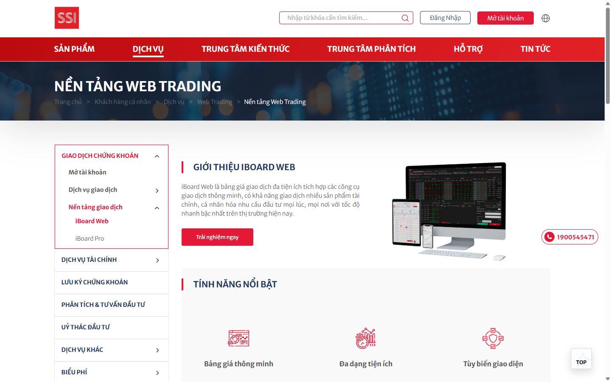

> 🟡 **Public Marketing Page** · SSI iBoard/Web Trading. Dùng để đặt bối cảnh sản phẩm, không chứng minh backend.

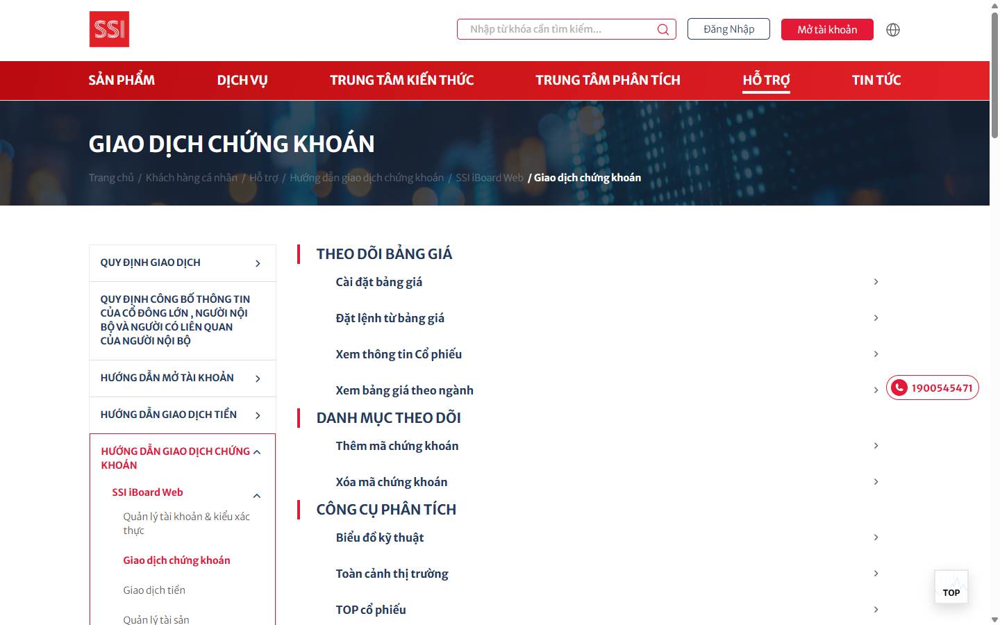

> 🟡 **Public Documentation** · Cho thấy nhóm capability trading/market tools. Đi sâu: [SSI case study](./ssi-iboard).

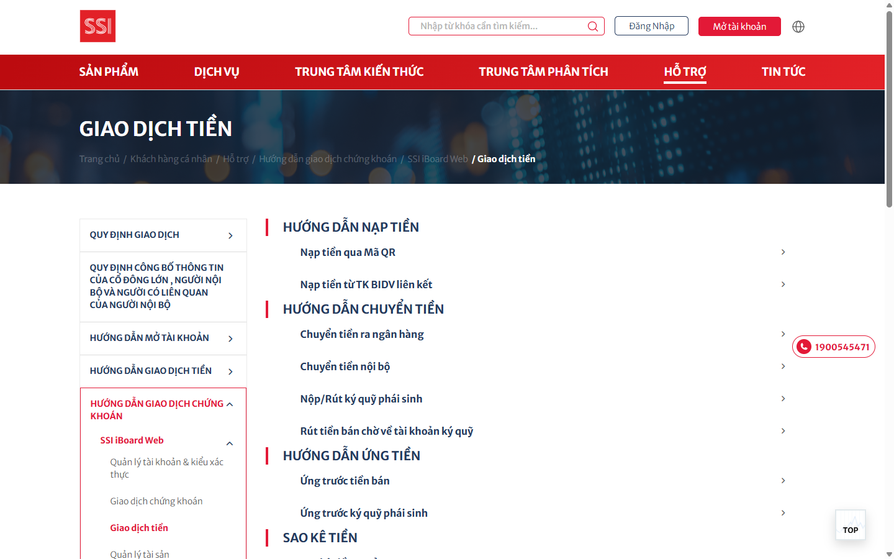

> 🟡 **Public Documentation** · Ứng trước tiền bán, giao dịch tiền, sao kê → Securities Core + Financing + Workflow + Ledger/Settlement. Đi sâu: [Bài 18 Ledger](/lectures/18-ledger-accounting-projections/).

### Authenticated UI

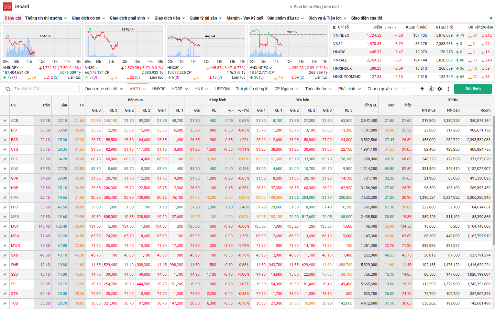

> 🟢 **Authenticated UI · Redacted · READ-ONLY · 19/08/2026**  
> **Bạn đang nhìn:** bảng giá với Trần/Sàn/TC, bid/ask và trạng thái phiên.  
> **Business concept:** market-data snapshot/depth, session-aware price data, stale/gap detection.  
> **Học sâu:** [Domain 05 — Realtime Analytics](/domains/05-realtime-analytics) · [Bài 10 — Market Data](/lectures/10-market-data-engineering/).

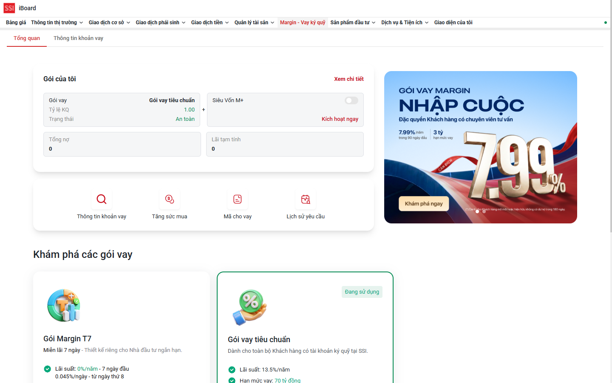

> 🟢 **Authenticated UI · Redacted · READ-ONLY · 19/08/2026**  
> **Bạn đang nhìn:** Tỷ lệ KQ, trạng thái An toàn, Tổng nợ, Lãi tạm tính, gói vay.  
> **Business concept:** collateral/risk/credit state; margin overview thuộc Securities Core + Risk. Workflow *Tăng sức mua* là phần khác và không được click.  
> **Học sâu:** [Bài 11 — Risk, Margin & Controls](/lectures/11-risk-margin-controls/).

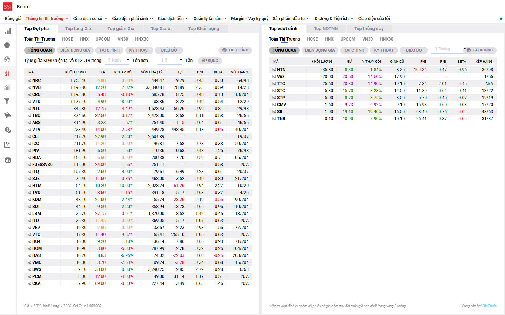

> 🟢 **Authenticated UI · Redacted · READ-ONLY · 19/08/2026**  
> **Bạn đang nhìn:** analytics kiểu top đột phá/vượt đỉnh.  
> **Business concept:** read-heavy analytics/fan-out, khác OMS write path.  
> **Học sâu:** [Domain 05](/domains/05-realtime-analytics).

**Không chụp:** sổ lệnh thật, holdings, danh mục, sao kê, form ứng trước/tăng sức mua — có PII/số dư/side effect risk.

## 2. VPS SmartOne

**Evidence:** 🟢 Authenticated + 🟡 Official  
**Học tốt nhất:** Order State · Buying Power · Sellable Quantity · Pending Settlement

### Public product context

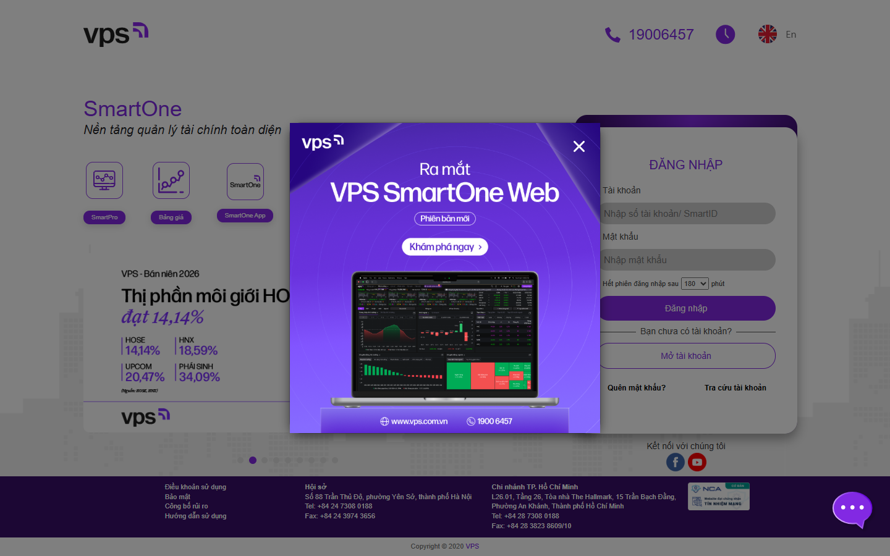

> 🟡 **Public Marketing Page** · SmartOne landing/product context.

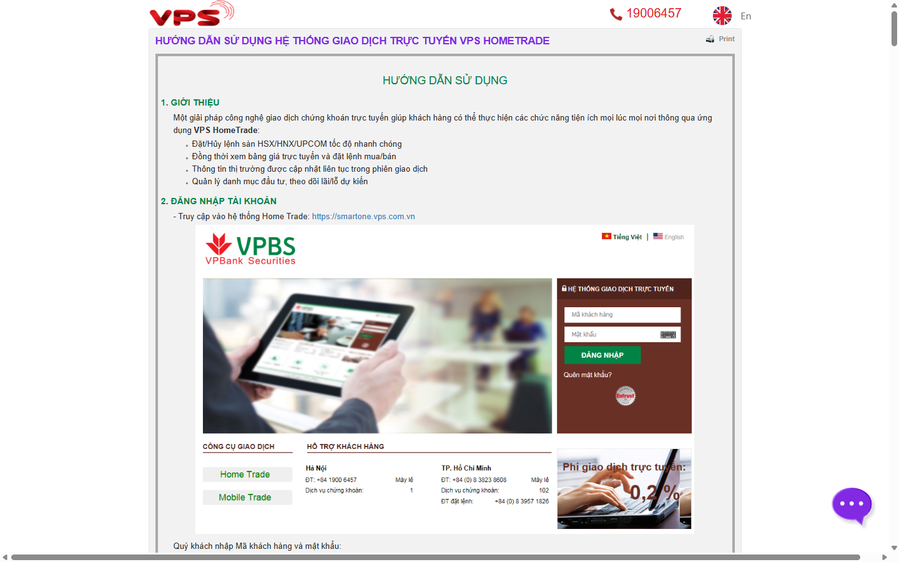

> 🟡 **Public Documentation** · Guide cho trading, order, account/portfolio capability. Dùng cùng SPA labels để phân biệt official evidence với observed screen.

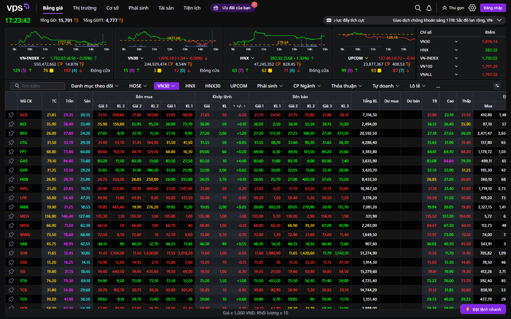

> 🟡 **Public UI** · Bảng giá trước login. **Business concept:** market-data fan-out và read model.

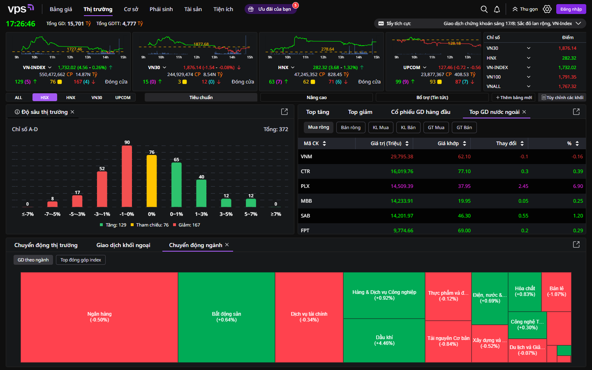

> 🟡 **Public UI** · Market depth widget. **Business concept:** nhiều mức bid/ask; depth là view của market state, không phải OMS database.

### Authenticated UI

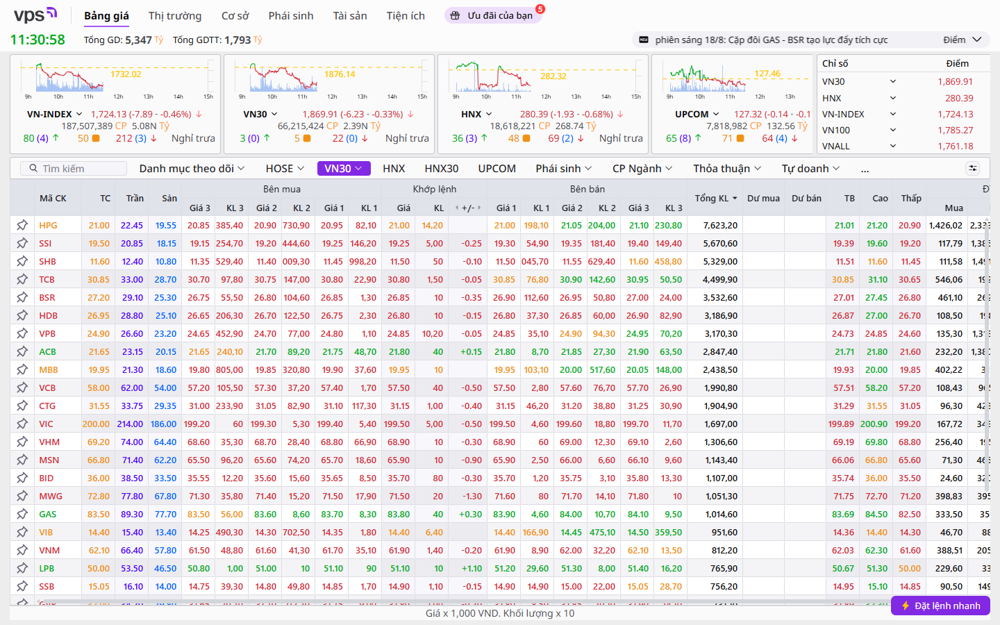

> 🟢 **Authenticated UI · Redacted · READ-ONLY · 19/08/2026**  
> **Bạn đang nhìn:** bảng giá trong session đã login.  
> **Business concept:** quote/depth/session data.  
> **Học sâu:** [Domain 05](/domains/05-realtime-analytics).

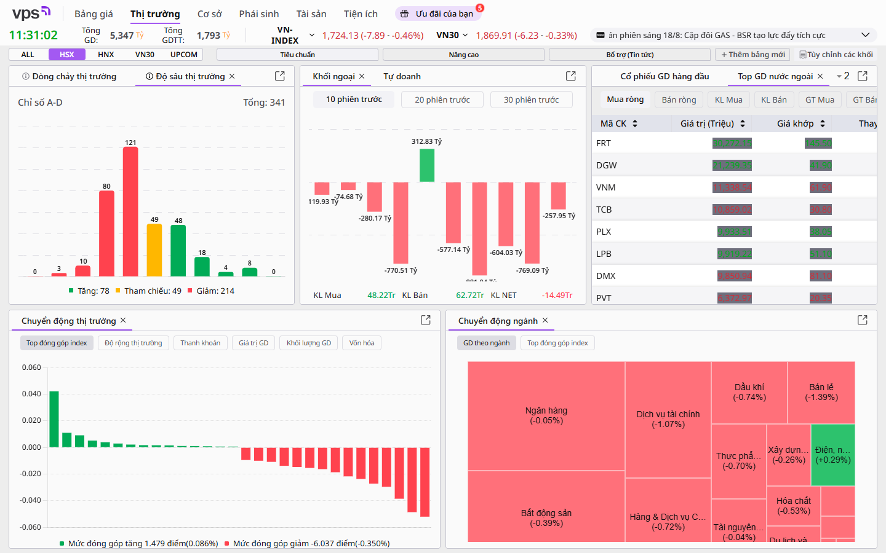

> 🟢 **Authenticated UI · Redacted · READ-ONLY · 19/08/2026**  
> **Bạn đang nhìn:** `/market` với dòng chảy thị trường, khối ngoại, chuyển động ngành.  
> **Business concept:** realtime/near-realtime analytics, không phải order-state screen.  
> **Học sâu:** [Domain 05](/domains/05-realtime-analytics).

### Các concept quan trọng không chụp vì dữ liệu thật

- 🟣+🟡 **Buying Power** — *Sức mua* / *Sức mua từ tiền mặt* → **Cash != Buying Power**. [Bài 08](/lectures/08-account-cash-position-buying-power/)
- 🟡 **Sellable Quantity** — CK khả dụng khác Total Position; reference invariant `SellQty <= SellableQty`.
- 🟣+🟡 **Pending VSD** — `FILLED → Trade → PendingReceivable → Settlement`. [Bài 07](/lectures/07-clearing-settlement-krx-fix-vsdc/) · [Bài 17](/lectures/17-clearing-netting-settlement/)
- 🟣+🟡 **Order State** — *chờ tại VPS / chờ tại sàn / khớp một phần / khớp hết*; không suy `chờ tại sàn = đã nằm trong central order book`. [Bài 13](/lectures/13-oms-internals-state-machine/)

## 3. TCBS / TCInvest

**Evidence:** 🟡 Public / Official · 🔴 Authenticated not verified  
**Học tốt nhất:** Multi-asset Architecture · Bonds · Funds · Conditional Orders / TWAP

### System / product overview

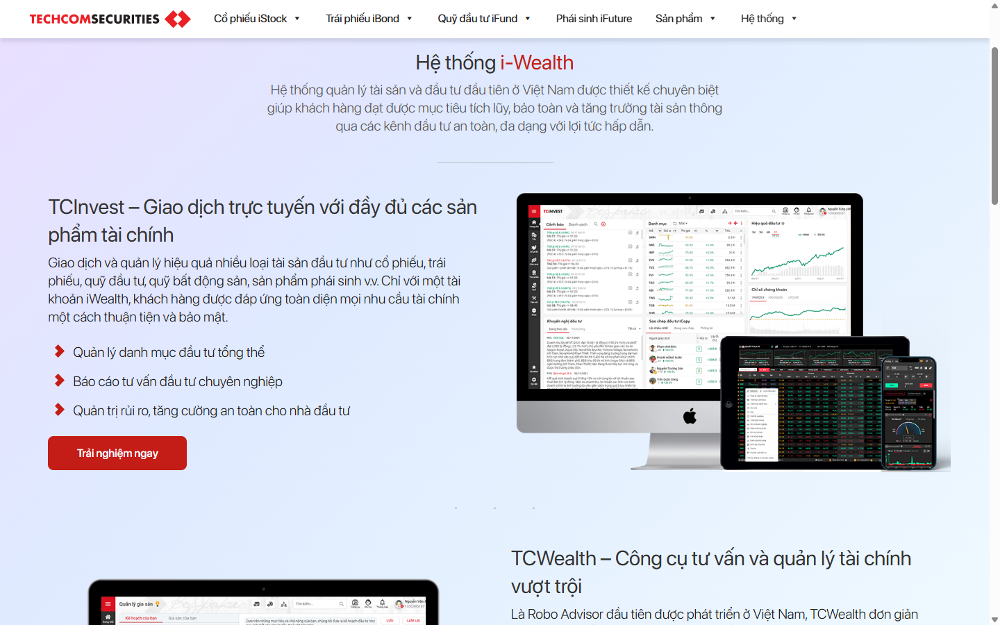

> 🟡 **Public Marketing Page** · iWealth / TCInvest system context.  
> **Business lesson:** một customer experience có thể gom nhiều bounded contexts.

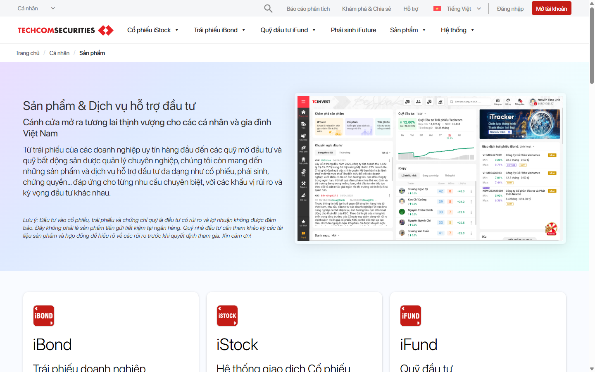

> 🟡 **Public Marketing Page** · product catalog.  
> **Business lesson:** `One App != One Domain Model`.

### Securities / Stock

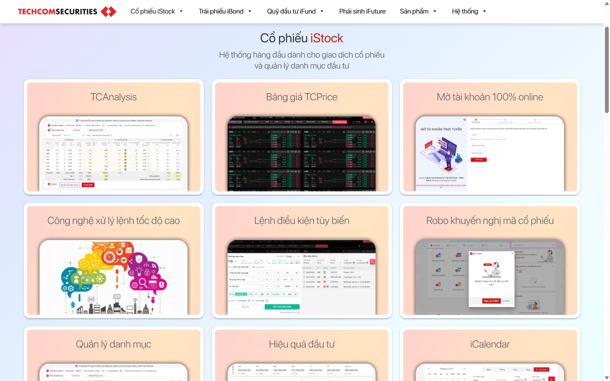

> 🟡 **Public Marketing Page** · iStock.  
> **Business concept:** equity trading + market data + conditional-order capability.  
> **Học sâu:** [Domain 01](/domains/01-securities-core) · [Domain 05](/domains/05-realtime-analytics) · [Domain 06](/domains/06-conditional-orders).

### Bonds

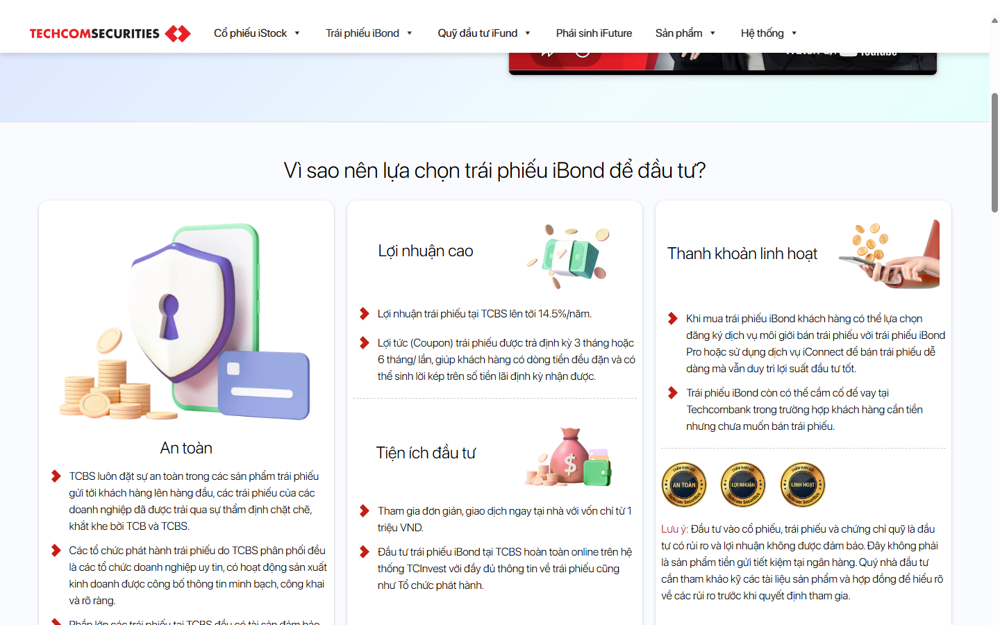

> 🟡 **Public Marketing Page** · iBond.  
> **Business concept:** bond product lifecycle cần coupon/yield/maturity/accrued-interest semantics riêng; không dùng equity order model cho mọi thứ.  
> **Học sâu:** [Domain 03 — Bonds Core](/domains/03-bonds-core).

### Funds

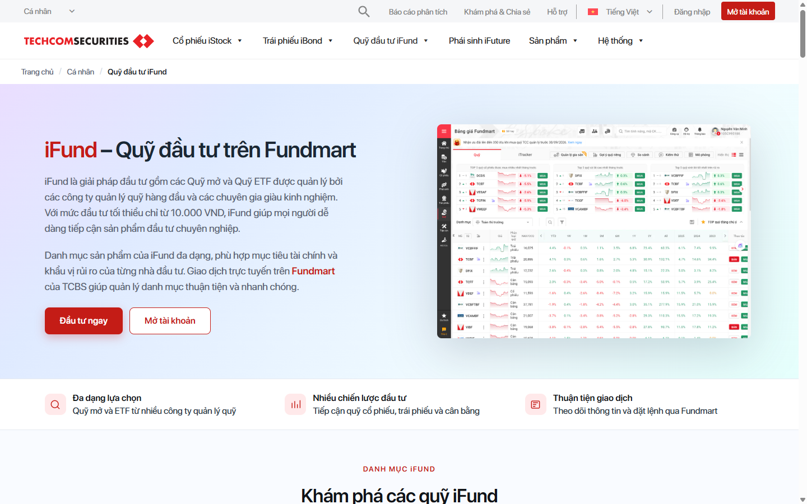

> 🟡 **Public Marketing Page** · iFund/Fundmart.  
> **Business concept:** NAV, subscription/redemption, cut-off, allocation units.  
> **Học sâu:** [Domain 04 — Funds Core](/domains/04-funds-core).

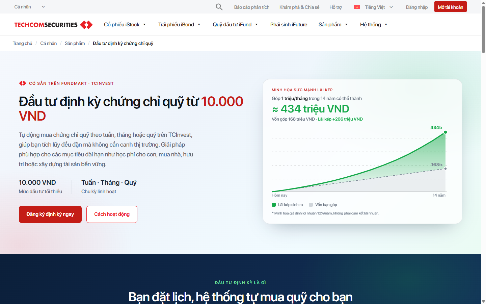

> 🟡 **Public Marketing Page** · đầu tư định kỳ.  
> **Business concept:** scheduler là một phần của business workflow khi nó sinh subscription theo plan/cycle, không chỉ là cron job.

### Derivatives

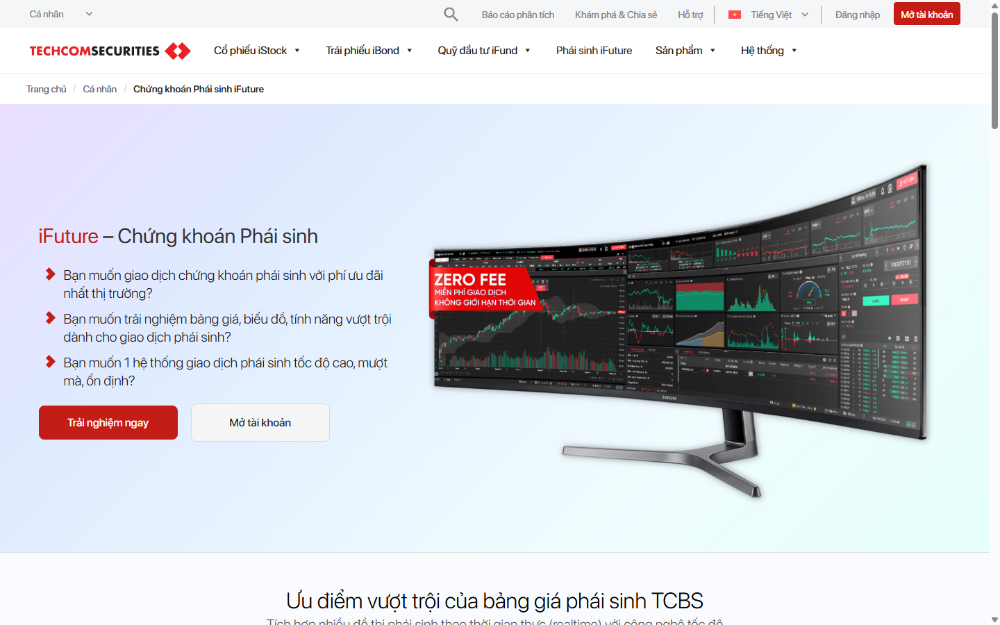

> 🟡 **Public Marketing Page** · iFuture.  
> **Business concept:** position + margin + mark-to-market khác cash-equity position.  
> **Học sâu:** [Domain 02 — Derivatives Core](/domains/02-derivatives-core).

### Conditional Orders / TWAP

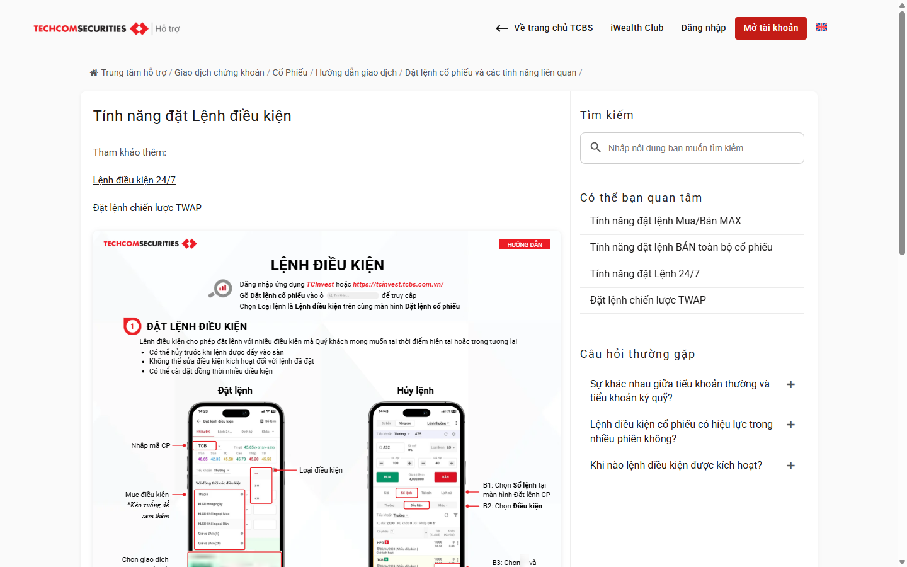

> 🟡 **Public Documentation** · conditional-order/TWAP help.  
> **Business concept:** `ConditionalOrder != TradingOrder`; trigger/scheduler phải chống duplicate generated order.  
> **Học sâu:** [Domain 06](/domains/06-conditional-orders).

## 4. So sánh nhanh bằng hình ảnh

| Broker | Evidence mạnh nhất | Screen / ảnh nên dùng để học | Core lesson |
|---|---|---|---|
| **SSI** | 🟢 Authenticated + 🟡 docs | Margin Overview, Market Analytics | Risk/Credit + realtime analytics |
| **VPS** | 🟢 Authenticated + 🟡 guide | Market Board/Insight + official state wording | Order/account/settlement concepts |
| **TCBS** | 🟡 Official/Public | Product catalog, Bond, Fund, Derivatives | Multi-asset bounded contexts |

## 5. Khi nào không nên dùng screenshot làm evidence?

Không dùng ảnh để kết luận:

```text
"screen này chứng minh broker dùng service X"
"UI realtime chứng minh broker dùng WebSocket Y"
"có Order Book nghĩa là database có bảng Orders như reference model"
```

Dùng ảnh để kết luận đúng mức:

```text
UI cho thấy capability/terminology/state người dùng nhìn thấy.
Official docs mô tả business behavior công khai.
Reference design giải thích cách một securities system có thể model capability đó.
```

## Đi tiếp

- [Broker Domain Matrix](./broker-domain-matrix)
- [SSI iBoard Case Study](./ssi-iboard)
- [VPS SmartOne Case Study](./vps-smartone)
- [TCBS / TCInvest Case Study](./tcbs-tcinvest)
- [Screenshot Inventory](./screenshots/)
