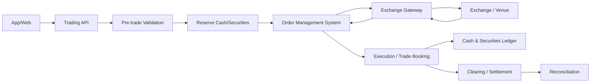
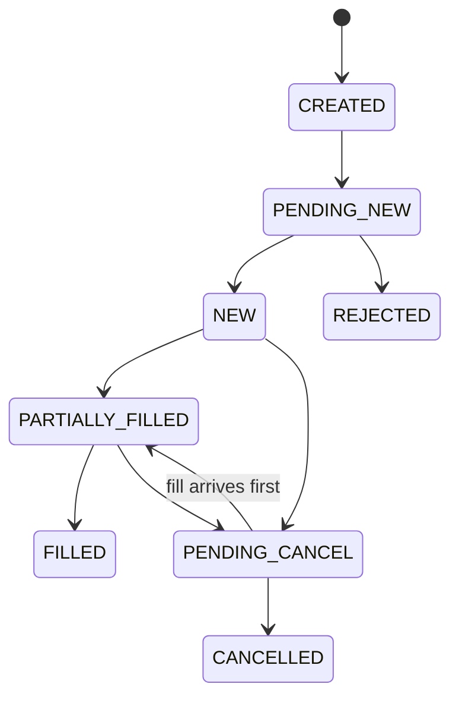

# Domain 01 — Core giao dịch chứng khoán

<div class="lesson-meta">
  <span><strong>Domain</strong> Equity / Securities Trading</span>
  <span><strong>Mức độ</strong> Core</span>
  <span><strong>Ví dụ xuyên suốt</strong> BUY 1.000 FPT @ 120.000</span>
</div>

Hãy bắt đầu từ thao tác rất quen thuộc: khách mở app chứng khoán, nhập:

```text
Mã: FPT
Mua: 1.000 cổ phiếu
Giá: 120.000 đ/cp
```

Nhìn từ UI, đó chỉ là một nút **Đặt lệnh**. Nhìn từ core system, hệ thống phải trả lời đồng thời:

- tài khoản có được phép giao dịch không?
- giá/khối lượng có hợp lệ không?
- khách có đủ sức mua không?
- phải giữ lại bao nhiêu tiền để khách không đặt lệnh khác dùng trùng số tiền đó?
- exchange đã nhận lệnh chưa?
- lệnh khớp một phần thì tiền/vị thế thay đổi thế nào?
- response bị timeout thì order là failed hay chưa biết?
- sau vài ngày, tiền và chứng khoán đã settlement đúng chưa?

Đây là **Securities Core**.

<div class="learning-objectives">
<strong>Sau domain này bạn phải giải thích được:</strong>

- Account, Cash, Buying Power, Position và Sellable Quantity khác nhau thế nào;
- Order khác Execution và Trade ra sao;
- Reservation dùng để giải quyết race condition nào;
- partial fill ảnh hưởng cash/position thế nào;
- FILLED vì sao chưa đồng nghĩa SETTLED;
- duplicate execution và timeout được xử lý thế nào;
- ledger và reconciliation giúp chứng minh hệ thống đúng ra sao.
</div>

<div class="callout">
<strong>Ví dụ broker UI</strong><br/>
SSI iBoard Sổ lệnh minh họa Order Read Model. VPS “chờ tại VPS / chờ tại sàn” minh họa internal vs external order lifecycle. SSI ứng trước tiền bán minh họa PendingSettlementReceivable. VPS CK khả dụng minh họa SellableQuantity. Không suy ra schema nội bộ.
</div>


## 1. Từ điển thuật ngữ trước khi đi vào flow

| Thuật ngữ | Nghĩa dễ hiểu | Ví dụ |
|---|---|---|
| **Broker / Brokerage** | Công ty chứng khoán trung gian cho khách giao dịch | App của CTCK nhận lệnh rồi gửi ra sở giao dịch |
| **Trading Account** | Tài khoản dùng để giao dịch | Tài khoản `A123` của khách |
| **Cash** | Tiền trong hệ thống | 200 triệu đồng |
| **Buying Power** | Số tiền/sức mua thực sự được phép dùng để đặt lệnh | Có 200m cash nhưng policy chỉ cho dùng 180m |
| **Position / Holding** | Số chứng khoán đang sở hữu/được ghi nhận | Có 2.000 FPT |
| **Sellable Quantity** | Số lượng được phép bán ngay | Có 2.000 FPT nhưng 500 đang reserved → sellable 1.500 |
| **Order** | Ý định mua/bán của khách | BUY 1.000 FPT @ 120.000 |
| **Execution / Fill** | Một lần order được khớp một phần hoặc toàn bộ | Khớp 300 FPT @ 119.900 |
| **Trade** | Giao dịch kinh tế được ghi nhận từ execution hợp lệ | Trade `T001` cho 300 FPT |
| **Reservation** | Giữ tạm tiền/chứng khoán để resource không bị dùng hai lần | Giữ ~120,18m cho BUY order |
| **Venue / Exchange** | Nơi order được gửi tới và matching | Sở/market infrastructure |
| **Settlement** | Chuyển giao tiền và chứng khoán sau trade | Buyer trả tiền, nhận cổ phiếu |
| **Ledger** | Sổ lịch sử các business entries tăng/giảm | Deposit, reserve, fee, settlement |
| **Reconciliation** | Đối chiếu internal state với external evidence | Internal trade ↔ venue trade report |
| **Invariant** | Điều kiện nghiệp vụ tuyệt đối không được phá | Không bán > sellable qty |
| **Idempotency** | Retry/duplicate không tạo effect lần hai | ExecID `E01` xử lý 2 lần vẫn chỉ tăng position một lần |

## 2. Mental model tổng thể



`OMS` = **Order Management System** — hệ thống quản lý vòng đời lệnh từ lúc tạo, gửi, nhận ACK, partial fill, cancel, replace cho tới terminal state.

## 3. Ví dụ BUY 1.000 FPT @ 120.000 — từng bước

Giả sử dữ liệu minh họa:

```text
Available Cash = 200.000.000 đ
Order Qty      = 1.000
Limit Price    = 120.000 đ
Order Value    = 120.000.000 đ
Fee buffer     = 0,15% = 180.000 đ   (chỉ là ví dụ minh họa)
Required Cash  = 120.180.000 đ
```

### Bước 1 — Pre-trade validation

Core kiểm tra:

```text
Account ACTIVE?
Market đang mở?
FPT được phép giao dịch?
120.000 có hợp lệ theo price/tick rule?
1.000 có hợp lệ theo lot/quantity rule?
Required Cash <= Buying Power?
```

Nếu `BuyingPower = 100m`, order phải reject trước khi gửi ra venue.

### Bước 2 — Reservation: giữ tiền, không trừ mất tiền ngay

Nếu order hợp lệ:

```text
Before
Available = 200.000.000
Reserved  = 0

After reservation
Available = 79.820.000
Reserved  = 120.180.000
```

**Reservation** không có nghĩa tiền đã settlement. Nó chỉ nói:

> “120,18 triệu này đã được dành cho order X; request khác không được sử dụng lại.”

### Vì sao cần reservation?

Không có reservation, hai request chạy đồng thời có thể cùng đọc `Available = 200m`:

```text
Order A cần 150m → pass
Order B cần 150m → pass
```

Sau đó tổng commitment = 300m dù khách chỉ có 200m.

Đây là **race condition** — kết quả sai vì hai operation cạnh tranh trên cùng state.

## 4. Order khác Execution và Trade

Order của khách:

```text
BUY 1.000 FPT @ 120.000
```

Có thể khớp thành ba execution:

```text
Execution E1: 300 @ 119.900
Execution E2: 200 @ 120.000
Execution E3: 500 @ 120.000
```

Tổng:

```text
OrderQty  = 1.000
CumQty    = 1.000   // đã khớp tích lũy
LeavesQty = 0       // còn lại chưa khớp
Status    = FILLED
```

**Order ≠ Execution ≠ Trade**:

```text
Order      = ý định
Execution  = một lần matching
Trade      = business transaction được book từ execution hợp lệ
```

Một order có thể có nhiều execution và nhiều trade records tùy model/venue contract.

## 5. Partial Fill — khớp một phần

Giả sử mới nhận:

```text
E1: 300 @ 119.900
```

Order state:

```text
OrderQty  = 1.000
CumQty    = 300
LeavesQty = 700
Status    = PARTIALLY_FILLED
```

Core không được release toàn bộ reservation. Một phần đã được **consume** cho 300 cổ phiếu, phần còn lại vẫn cần giữ cho 700 cổ phiếu chưa khớp.

Mental model:

```text
Reserved Cash
├── Consumed by executions
└── Still Reserved for LeavesQty
```

## 6. SELL khác BUY ở resource được giữ

Nếu khách SELL 1.000 FPT, hệ thống quan tâm **Sellable Quantity**.

Ví dụ:

```text
Total Holding     = 2.000
Reserved for Sell = 600
Blocked           = 100
Sellable Qty      = 1.300
```

Request SELL 1.500 phải reject dù `Total Holding = 2.000`.

Khi SELL order được nhận:

```text
Reserve Securities
```

thay vì reserve cash.

## 7. Order State Machine

Một model minh họa:



Tên state thực tế tùy protocol/venue. Điều quan trọng là **transition nào hợp lệ** phải rõ.

## 8. Cancel race — case production rất hay gây bug

Sequence:

```text
09:30:00 Order NEW qty=1.000
09:30:01 Fill 300
09:30:02 Client requests CANCEL
09:30:02.100 Venue matches another 200
09:30:02.200 Cancel accepted for remainder
```

Final state hợp lý:

```text
CumQty       = 500
CancelledQty = 500
```

Nếu code “thấy cancel request → release toàn bộ reservation ngay”, execution 200 tới sau có thể làm cash/position sai.

## 9. Timeout không đồng nghĩa FAILED

```text
Broker → send order → Venue
Broker ← X response lost
```

Có hai khả năng:

```text
A. Venue chưa nhận order
B. Venue đã nhận/order đang live nhưng ACK bị mất
```

Vì thế trạng thái cần có thể là `UNKNOWN` hoặc recovery state tương đương, không được mù quáng retry thành một order mới.

Cần phối hợp:

- stable `ClientOrderId`;
- query/status/recovery theo protocol;
- session replay nếu có;
- reconciliation.

## 10. Duplicate Execution — tại sao cần idempotency

Venue/network có thể replay:

```text
ExecID = E123
Qty    = 300
Price  = 119.900
```

Nếu consumer apply hai lần:

```text
Position +600  // SAI
```

Thay vào đó:

```text
UNIQUE(Venue, ExecID)
```

hoặc business identity tương đương theo contract.

Effect đúng:

```text
Message received twice
Business effect applied once
```

## 11. FILLED chưa phải SETTLED

Sau khi order FILLED:

```text
Order FILLED
   ↓
Trade Booked
   ↓
Clearing xác định nghĩa vụ
   ↓
Settlement chuyển tiền/chứng khoán
   ↓
Reconciliation
```

Vì thế position/cash có thể có nhiều lớp:

```text
Settled
Pending Buy
Pending Sell
Reserved
Receivable
Payable
```

Không nên chỉ có `Balance` và `Quantity`.

## 12. Ledger — sổ lịch sử business effects

Ví dụ cash ledger minh họa:

```text
+200.000.000  DEPOSIT
-120.180.000  RESERVE_FOR_ORDER   // effect lên available bucket
+...          RELEASE_UNUSED_RESERVATION
-...          TRADE_SETTLEMENT
-...          TRADING_FEE
```

Implementation cụ thể có thể là sub-ledger/double-entry tùy hệ thống. Ý chính:

> Đừng chỉ overwrite `Balance = 79.820.000` rồi mất lý do vì sao balance thành con số đó.

Ledger giúp audit, rebuild projection và reconciliation.

## 13. Data model tối thiểu

```text
TradingAccount
CashAccount
SecuritiesAccount
CashReservation
SecuritiesReservation
Order
Execution
Trade
CashEntry
SecuritiesEntry
SettlementInstruction / Obligation
ReconciliationBreak
```

Ví dụ `Order`:

```json
{
  "orderId": "O-1001",
  "clientOrderId": "mobile-abc-001",
  "accountId": "A123",
  "symbol": "FPT",
  "side": "BUY",
  "orderQty": 1000,
  "limitPrice": 120000,
  "cumQty": 300,
  "leavesQty": 700,
  "status": "PARTIALLY_FILLED",
  "version": 4
}
```

## 14. API và Event — ví dụ

Client command:

```http
POST /orders
Idempotency-Key: mobile-abc-001
```

```json
{
  "accountId": "A123",
  "symbol": "FPT",
  "side": "BUY",
  "quantity": 1000,
  "price": 120000,
  "orderType": "LIMIT"
}
```

Execution event nội bộ có thể normalize thành:

```json
{
  "venue": "EXAMPLE",
  "execId": "E123",
  "orderId": "O-1001",
  "lastQty": 300,
  "lastPx": 119900,
  "occurredAt": "..."
}
```

Core domain không nên phải biết raw FIX tag nếu exchange adapter đã normalize contract.

## 15. Invariant — viết bằng tiếng Việt trước khi viết code

```text
1. Không dùng nhiều hơn Buying Power được phép.
2. Không bán nhiều hơn Sellable Quantity.
3. CumQty không vượt OrderQty.
4. Reservation không âm và không leak sau terminal state.
5. Một execution business identity không được book hai lần.
6. Cash/Position phải giải thích được từ business history.
7. Internal state phải reconcile được với venue/VSDC/bank theo flow phù hợp.
```

## 16. Những lỗi thiết kế thường gặp

### Sai: `Account.Balance` là mọi thứ
Không phân biệt available/reserved/pending/settled.

### Sai: `Order == Trade`
Mất khái niệm partial fill và post-trade.

### Sai: timeout = failed
Có thể tạo duplicate order khi retry.

### Sai: cancel là `UPDATE orders SET status='CANCELLED'`
Bỏ qua exchange acceptance và race với execution.

### Sai: portfolio update fail thì “log rồi thôi”
Cần durable trade + recovery/rebuild/reconciliation.

## 17. Metrics nên theo dõi

```text
order_accept_latency
venue_ack_latency
reject_rate_by_reason
unknown_order_count
oldest_unknown_order_age
reservation_age
reservation_leak_count
duplicate_execution_detected
trade_booking_failure
reconciliation_break_count
```

## 18. Checklist tự kiểm tra

- [ ] Tôi giải thích được Buying Power khác Cash.
- [ ] Tôi giải thích được Position khác Sellable Quantity.
- [ ] Tôi giải thích được Order, Execution và Trade.
- [ ] Tôi mô tả được partial fill + cancel race.
- [ ] Tôi biết vì sao cần reservation.
- [ ] Tôi biết timeout có thể là unknown outcome.
- [ ] Tôi biết duplicate execution phải idempotent.
- [ ] Tôi biết FILLED chưa phải SETTLED.
- [ ] Tôi biết ledger/reconciliation dùng để làm gì.

## 19. Bài tập

### Bài 1 — Concurrent BUY

Khách có `100m`. Hai request BUY mỗi request cần `80m` tới cùng lúc. Thiết kế transaction/concurrency strategy để chỉ một request reserve thành công.

### Bài 2 — Partial Fill + Cancel

Order `BUY 10.000`, fill 2.000, cancel requested, fill thêm 3.000, cancel accepted. Viết final quantities và reservation state.

### Bài 3 — Duplicate Execution

Execution `E123` được gửi hai lần. Thiết kế unique key + transaction boundary để position chỉ tăng một lần.

### Bài 4 — Unknown Outcome

Submit order timeout. Viết recovery flow mà không resend mù quáng.

<div class="key-takeaway">
<strong>Mental model cần nhớ:</strong>

Securities Core không phải CRUD `Orders`. Nó là hệ thống bảo vệ **tiền + chứng khoán + vòng đời order/trade** trước concurrency, duplicate, timeout và post-trade mismatch.
</div>

Tiếp theo: [Domain 02 — Derivatives Core](./02-derivatives-core.md).