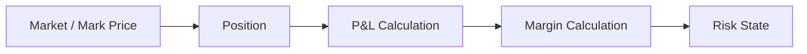

# Domain 02 — Core giao dịch phái sinh

<div class="lesson-meta">
  <span><strong>Domain</strong> Derivatives / Futures</span>
  <span><strong>Mức độ</strong> Core</span>
  <span><strong>Ví dụ xuyên suốt</strong> Long 2 futures contracts</span>
</div>

Nếu equity core xoay quanh câu hỏi **“khách đang sở hữu bao nhiêu cổ phiếu?”**, derivatives core thường xoay quanh câu hỏi khác:

> **“Khách đang có vị thế Long/Short bao nhiêu, lời/lỗ hiện tại bao nhiêu, và còn đủ ký quỹ để giữ vị thế không?”**

Phái sinh không phải chỉ là securities core cộng thêm `ContractCode`.

<div class="learning-objectives">
<strong>Sau domain này bạn phải giải thích được:</strong>

- derivative/futures contract là gì;
- underlying và multiplier dùng làm gì;
- Long khác Short;
- Position khác Order;
- realized P&L khác unrealized P&L;
- Mark-to-Market là gì;
- Initial Margin, Maintenance Margin, Available Margin là gì;
- Margin Call và Forced Liquidation xảy ra khi nào;
- market data stale nguy hiểm với risk engine ra sao.
</div>

## 1. Từ điển thuật ngữ

| Thuật ngữ | Giải thích dễ hiểu | Ví dụ |
|---|---|---|
| **Derivative** | Công cụ tài chính có giá trị phụ thuộc một tài sản/chỉ số khác | Futures theo chỉ số |
| **Futures Contract** | Hợp đồng chuẩn hóa giao dịch trên thị trường phái sinh | Contract đáo hạn tháng 9 |
| **Underlying** | Tài sản/chỉ số cơ sở mà contract tham chiếu | Chỉ số cổ phiếu |
| **Contract Multiplier** | Hệ số biến 1 điểm giá thành giá trị tiền | 100.000 đ/điểm, chỉ là ví dụ minh họa |
| **Long** | Vị thế hưởng lợi khi giá tăng | Mua futures |
| **Short** | Vị thế hưởng lợi khi giá giảm | Bán futures để mở vị thế Short |
| **Position** | Số lượng contract đang mở | Long +2 |
| **Open** | Tạo/tăng vị thế | Long từ 0 → +2 |
| **Close** | Giảm/đóng vị thế | Long +2 → 0 |
| **Realized P&L** | Lãi/lỗ đã được hiện thực hóa khi đóng vị thế | Đóng Long lời 2 triệu |
| **Unrealized P&L** | Lãi/lỗ tạm tính của vị thế vẫn đang mở | Giá tăng nhưng chưa close |
| **Mark Price** | Giá dùng để định giá/risk theo rule | Giá settlement/reference/market-specific |
| **Mark-to-Market (MTM)** | Định giá lại position theo giá hiện tại/mark price | Entry 1.300, mark 1.310 |
| **Margin** | Tài sản ký quỹ để bảo đảm nghĩa vụ | Khách nộp 50 triệu collateral |
| **Initial Margin** | Mức ký quỹ cần có để mở position | Cần 30m để mở 2 contracts |
| **Maintenance Margin** | Mức tối thiểu để tiếp tục giữ position | Equity xuống dưới threshold → warning/call |
| **Available Margin** | Phần ký quỹ còn có thể dùng thêm | 50m collateral - 30m required = 20m |
| **Margin Call** | Yêu cầu bổ sung ký quỹ khi mức an toàn xuống thấp | Market giảm mạnh |
| **Forced Liquidation** | Hệ thống buộc đóng position để giảm risk | Bán/đóng contract thay khách |
| **Expiry** | Ngày contract hết vòng đời giao dịch | Contract tháng 9 đáo hạn |

## 2. Ví dụ Long 2 contracts

Giả sử **ví dụ minh họa**, không đại diện specification của một contract cụ thể:

```text
Entry Price      = 1.300 điểm
Position         = Long 2 contracts
Multiplier       = 100.000 đ / điểm / contract
```

### Giá tăng lên 1.310

Chênh lệch:

```text
1.310 - 1.300 = +10 điểm
```

Unrealized P&L:

```text
10 điểm × 100.000 × 2 = +2.000.000 đ
```

Nếu khách vẫn giữ position, đây là **unrealized P&L** — lời trên position đang mở.

### Giá giảm xuống 1.280

```text
1.280 - 1.300 = -20 điểm
-20 × 100.000 × 2 = -4.000.000 đ
```

Long position lỗ khi giá giảm.

## 3. Short Position

Giả sử khách Short 2 contracts tại 1.300.

Nếu giá xuống 1.280:

```text
Short P&L ≈ (EntryPrice - MarkPrice) × Qty × Multiplier
           = (1.300 - 1.280) × 2 × 100.000
           = +4.000.000 đ
```

Điểm cần nhớ:

```text
Long  → giá tăng thường có lợi
Short → giá giảm thường có lợi
```

Production calculation phải xử lý đúng sign, multiplier, rounding, fee, settlement price và contract rule.

## 4. Position không phải Order

Khách có thể gửi nhiều order nhưng position là kết quả sau executions.

Ví dụ:

```text
BUY 2 → fill 2 → Position Long +2
BUY 1 → fill 1 → Position Long +3
SELL 2 để close → fill 2 → Position Long +1
```

Order lifecycle và Position lifecycle liên quan nhưng không giống nhau.

## 5. Average Price

Giả sử:

```text
Long 1 @ 1.300
Long thêm 1 @ 1.320
```

Average entry đơn giản nếu cùng weight:

```text
Average = (1.300 + 1.320) / 2 = 1.310
```

Nhưng production cần rule chính xác cho partial close, daily settlement, fees và accounting convention.

## 6. Mark-to-Market — “giá thay đổi thì risk thay đổi ngay”

**Mark-to-Market** nghĩa là liên tục/từng kỳ định giá position bằng một `MarkPrice` theo rule.



Nếu price thay đổi, P&L thay đổi; P&L thay đổi thì margin/risk state có thể thay đổi.

## 7. Margin — ký quỹ không phải “phí”

Margin là collateral/tài sản bảo đảm cho risk của position.

Ví dụ minh họa:

```text
Collateral        = 50.000.000
Required Margin   = 30.000.000
Available Margin  = 20.000.000
```

Nếu market move làm required margin/risk exposure tăng:

```text
Required Margin = 45.000.000
Available       = 5.000.000
```

Nếu tiếp tục xấu, tài khoản có thể đi qua warning/margin call.

## 8. Initial Margin và Maintenance Margin

### Initial Margin

Mức cần có khi **mở hoặc tăng position**.

Ví dụ:

```text
Customer wants Long +2
Initial requirement = 30m
Available collateral = 25m
→ Reject new position
```

### Maintenance Margin

Mức an toàn tối thiểu để **tiếp tục giữ position**.

Nếu tài sản/risk ratio xuống dưới policy:

```text
NORMAL
  ↓
WARNING
  ↓
MARGIN_CALL
  ↓
RESTRICTED
  ↓
LIQUIDATION_REQUIRED
```

Tên state/threshold thực tế phải lấy từ rule/config hiện hành, không hard-code ví dụ trên.

## 9. Margin Call là gì?

Margin Call là trạng thái yêu cầu khách bổ sung collateral hoặc giảm position.

Ví dụ:

```text
Collateral after loss = 32m
Maintenance required  = 35m
Shortfall              = 3m
```

System cần biết:

- notify ai;
- deadline/cut-off nào;
- khách nạp thêm tiền thì state chuyển thế nào;
- khách close position một phần thì required margin giảm ra sao;
- rule version nào tạo decision.

## 10. Forced Liquidation không phải `SellAll()`

Nếu khách không khắc phục margin call, system có thể cần forced liquidation.

Nhưng phải giải quyết:

```text
Chọn contract nào đóng trước?
Đóng bao nhiêu?
Market có đang mở?
Order type nào?
Nếu partial fill thì sao?
Nếu order reject thì sao?
Market tiếp tục chạy trong lúc liquidation thì sao?
Hai worker cùng liquidate có tạo duplicate order không?
```

Vì vậy liquidation là một **workflow có state**.

Ví dụ state:

```text
REQUIRED
→ PLANNING
→ ORDERS_SUBMITTED
→ PARTIALLY_REDUCED
→ RECHECK_MARGIN
→ COMPLETED
```

## 11. Stale Market Data — giá cũ có thể nguy hiểm hơn không có giá

Giả sử market feed ngừng 30 giây nhưng order gateway vẫn nhận lệnh.

Risk engine đang thấy:

```text
Last Mark Price = 1.300
Age             = 30 seconds
```

Trong thực tế giá có thể đã xuống 1.260.

Nếu engine vẫn dùng 1.300 như “live”, margin decision có thể sai lớn.

Policy cần explicit:

```text
if priceAge > threshold:
  fail-closed?
  dùng fallback price?
  apply haircut?
  block increase position?
  allow only reduce-risk orders?
```

Đây là business/risk policy, không phải developer tự chọn tùy ý.

## 12. Expiry — contract có ngày kết thúc

Contract có lifecycle:

```text
LISTED
→ TRADABLE
→ NEAR_EXPIRY
→ LAST_TRADING_DAY
→ EXPIRED
→ FINAL_SETTLEMENT
```

`Expiry` không chỉ là field ngày. Nó ảnh hưởng:

- có còn đặt lệnh được không;
- position còn mở xử lý thế nào;
- final settlement price nào;
- rollover sang contract khác có hay không;
- EOD/calendar jobs.

## 13. Data model gợi ý

```text
DerivativeContract
Position
PositionLot / Transaction History
Execution
PnLSnapshot
MarginAccount
MarginRequirement
RiskState
MarginCall
LiquidationCase
LiquidationOrder
SettlementResult
```

Ví dụ position projection:

```json
{
  "accountId": "A123",
  "contractId": "FUT-SEP",
  "netQty": 2,
  "side": "LONG",
  "averagePrice": 1300,
  "markPrice": 1310,
  "unrealizedPnl": 2000000,
  "asOf": "...",
  "priceVersion": 18282771
}
```

## 14. Invariant bằng tiếng Việt

```text
1. Duplicate execution không được tăng position lần hai.
2. P&L phải cho cùng kết quả nếu input + rule version giống nhau.
3. Không mở position mới nếu initial margin không đủ.
4. Margin state phải dùng market data có quality policy rõ.
5. Liquidation retry không được tạo duplicate business effect.
6. Risk parameter phải có effective date/version.
7. Position/P&L/margin phải reconcile được từ history và external evidence phù hợp.
```

## 15. Failure scenarios

### Duplicate fill
Position bị cộng hai lần nếu thiếu dedup.

### Late fill
Execution tới trễ sau khi risk snapshot đã publish → cần recalculation/convergence.

### Stale price
Margin calculation dùng giá cũ → understate risk.

### Crash giữa liquidation
Restart phải biết order nào đã submit, không tạo lại mù quáng.

### Rule change
Threshold hôm nay khác hôm qua → audit phải biết policy version.

## 16. Metrics

```text
position_update_latency
pnl_calculation_latency
mark_price_age
stale_price_count
margin_utilization
margin_call_count
margin_call_age
liquidation_case_count
liquidation_reject_rate
position_reconciliation_breaks
```

## 17. Checklist

- [ ] Tôi giải thích được Long/Short.
- [ ] Tôi tính được P&L đơn giản với multiplier.
- [ ] Tôi hiểu Position khác Order.
- [ ] Tôi hiểu Mark-to-Market.
- [ ] Tôi phân biệt Initial và Maintenance Margin.
- [ ] Tôi hiểu Margin Call không phải ngay lập tức liquidation.
- [ ] Tôi hiểu liquidation là workflow.
- [ ] Tôi biết stale market data ảnh hưởng risk.

## 18. Bài tập

### Bài 1 — P&L
Long 3 contracts @ 1.250, multiplier 100.000, mark price 1.270. Tính unrealized P&L.

### Bài 2 — Margin
Collateral 60m, initial requirement 40m. Sau market move, required margin tăng lên 55m. Tính available margin và mô tả risk state theo policy giả định của bạn.

### Bài 3 — Stale Feed
Feed stale 20 giây. Thiết kế rule cho: new position, close position, liquidation order.

### Bài 4 — Liquidation Recovery
Service crash sau khi submit liquidation order nhưng trước khi lưu response. Viết recovery flow không tạo duplicate order.

<div class="key-takeaway">
<strong>Mental model cần nhớ:</strong>

Derivatives Core = **Position + Mark Price → P&L → Margin → Risk → Action**. Mọi bước phải deterministic, versioned và recoverable.
</div>

Tiếp theo: [Domain 03 — Bonds Core](./03-bonds-core.md).