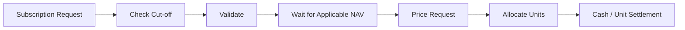

# Domain 04 — Core chứng chỉ quỹ

<div class="lesson-meta">
  <span><strong>Domain</strong> Fund / Fund Certificate</span>
  <span><strong>Mức độ</strong> Core</span>
  <span><strong>Ví dụ xuyên suốt</strong> Đầu tư 100 triệu vào quỹ mở</span>
</div>

Fund Core khác equity trading ở một điểm rất quan trọng:

> Với quỹ mở, khách thường **gửi yêu cầu trước**, còn giá thực hiện có thể chỉ được xác định sau khi NAV của valuation cycle được tính.

Vì vậy `RequestTime`, `Cut-off`, `ValuationDate`, `NAVVersion`, `Allocation` và `Settlement` quan trọng hơn microsecond matching latency.

<div class="learning-objectives">
<strong>Sau domain này bạn phải giải thích được:</strong>

- Fund, Fund Unit/Fund Certificate và NAV;
- NAV per Unit được tính thế nào;
- Subscription, Redemption, Switching là gì;
- Cut-off Time quyết định valuation cycle ra sao;
- ReceivedAt khác AcceptedAt, ValuationDate và SettlementDate;
- allocation units được tính thế nào;
- NAV correction phải version/audit ra sao;
- vì sao fund processing thường là long-running workflow.
</div>

## 1. Từ điển thuật ngữ

| Thuật ngữ | Giải thích dễ hiểu | Ví dụ |
|---|---|---|
| **Fund** | Quỹ đầu tư gom tiền nhiều nhà đầu tư để đầu tư theo chiến lược | Quỹ cổ phiếu/quỹ trái phiếu |
| **Fund Unit / Fund Certificate** | Đơn vị sở hữu của nhà đầu tư trong quỹ | Khách sở hữu 4.950 units |
| **Open-ended Fund** | Quỹ cho phép subscription/redemption theo quy tắc định kỳ thay vì khớp order như cổ phiếu | Gửi lệnh trước cut-off |
| **NAV** | Net Asset Value — giá trị tài sản ròng của quỹ | Assets 1.020 tỷ - liabilities 20 tỷ = NAV 1.000 tỷ |
| **NAV per Unit** | NAV chia cho tổng units đang lưu hành | 1.000 tỷ / 50 triệu units = 20.000 đ/unit |
| **Subscription** | Khách nộp tiền để mua units của quỹ | Đầu tư 100m |
| **Redemption** | Khách bán/trả units về quỹ để nhận tiền | Redeem 1.000 units |
| **Switching** | Chuyển từ quỹ A sang quỹ B theo product rule | Redeem A + subscribe B theo workflow |
| **Cut-off Time** | Mốc giờ xác định request thuộc valuation cycle nào | 14:30 |
| **Valuation Date** | Ngày/kỳ mà NAV dùng để pricing request được xác định | NAV ngày D |
| **Settlement Date** | Ngày units/cash được hoàn tất chuyển giao | D+N theo product terms |
| **Allocation** | Tính số units được cấp cho subscription | 99m / 20.000 = 4.950 units |
| **Unit Holding** | Số units khách đang sở hữu | 10.500 units |
| **NAV Version** | Phiên bản NAV để audit/correction | D-v1, D-v2 corrected |

## 2. NAV là gì?

Mental model:

```text
Portfolio Assets
+ Cash
+ Receivables
- Liabilities
- Payables
= Net Assets (NAV)
```

Sau đó:

```text
NAV per Unit = NAV / Outstanding Units
```

### Ví dụ

```text
Portfolio Assets  = 980 tỷ
Cash              = 40 tỷ
Receivables       = 10 tỷ
Liabilities       = 30 tỷ
---------------------------
NAV               = 1.000 tỷ

Outstanding Units = 50.000.000
NAV/unit          = 20.000 đ
```

NAV không phải market price tick-by-tick như cổ phiếu; nó thường được tính theo valuation process của fund/product.

## 3. Subscription — đầu tư tiền vào quỹ

Giả sử **ví dụ minh họa**:

```text
Customer Investment = 100.000.000
Subscription Fee    = 1% = 1.000.000
Net Amount          = 99.000.000
NAV/unit            = 20.000
```

Allocated Units:

```text
99.000.000 / 20.000 = 4.950 units
```

Flow:



## 4. Cut-off Time — tại sao request 13:00 và 15:00 có thể dùng NAV khác nhau?

Giả sử:

```text
Cut-off = 14:30
```

Request A:

```text
ReceivedAt = 13:00
→ thuộc valuation cycle D
```

Request B:

```text
ReceivedAt = 15:00
→ có thể thuộc valuation cycle kế tiếp
```

Product rule thực tế quyết định chi tiết, nhưng data model phải thể hiện được sự khác nhau.

Không đủ nếu chỉ có:

```text
CreatedAt
```

Nên phân biệt:

```text
ReceivedAt
AcceptedAt
CutoffBucket / ValuationCycle
ValuationDate
PricedAt
SettlementDate
```

## 5. Request State Machine

Một model minh họa:

```text
RECEIVED
→ VALIDATED
→ ACCEPTED
→ WAITING_NAV
→ PRICED
→ ALLOCATED
→ SETTLED
```

Các nhánh:

```text
VALIDATED → REJECTED
WAITING_NAV → CANCELLED   // nếu product rule cho phép
PRICED → ADJUSTMENT_REQUIRED  // nếu NAV correction ảnh hưởng request
```

## 6. Redemption — bán units để nhận tiền

Giả sử khách có 5.000 units và muốn redeem 1.000 units.

NAV dùng để pricing:

```text
NAV/unit       = 21.000
Redeem Qty     = 1.000
Gross Amount   = 21.000.000
Redemption Fee = 0,5% = 105.000   // chỉ là ví dụ minh họa
Net Amount     = 20.895.000
```

Flow:

```text
Redemption Request
→ Validate Eligible/Sellable Units
→ Reserve Units
→ Determine Applicable NAV
→ Price Request
→ Calculate Gross/Fee/Tax
→ Cash Receivable
→ Cash Settlement
→ Reduce Unit Holding
```

**Reserve Units** nghĩa là giữ 1.000 units để khách không gửi thêm một redemption khác dùng trùng cùng units.

## 7. Unit Holding khác Sellable Units

Ví dụ:

```text
Total Units       = 5.000
Reserved          = 1.000
Blocked           = 500
Sellable/Eligible = 3.500
```

Request redeem 4.000 phải reject dù total holding = 5.000.

## 8. Switching — chuyển từ quỹ A sang quỹ B

Mental model dễ hiểu:

```text
Redeem Fund A
   ↓
Determine value
   ↓
Subscribe Fund B
```

Nhưng không nên implement đơn giản bằng hai API độc lập rồi hy vọng.

Cần trả lời:

- cả hai leg dùng valuation date nào?
- nếu redemption A thành công nhưng subscription B fail thì sao?
- fee/rounding/cut-off mỗi quỹ khác nhau không?
- workflow retry có duplicate leg không?

Vì vậy switching là một **coordinated workflow**.

## 9. NAV Correction — case cực kỳ quan trọng

Giả sử NAV ngày D ban đầu:

```text
NAV D v1 = 20.000
```

10.000 subscription đã priced theo v1.

Sau đó fund administrator correction:

```text
NAV D v2 = 19.800
```

Không nên:

```sql
UPDATE nav SET value = 19800 WHERE date = D;
```

rồi mất dấu rằng request nào đã dùng v1.

Nên có version:

```text
NAV D v1 = 20.000  SUPERSEDED
NAV D v2 = 19.800  CURRENT
```

Mỗi priced request lưu:

```text
PricingNavVersion = D-v1
```

Sau correction, system có thể query chính xác request bị ảnh hưởng để tính adjustment/reversal.

## 10. Rounding — nhỏ nhưng không thể xem nhẹ

Allocated units có thể ra số lẻ:

```text
Net Amount = 100.000.000
NAV/unit   = 19.876,54
Units      = 5.031,06...
```

Product terms phải quy định:

- precision bao nhiêu chữ số;
- round down/nearest/up;
- residual cash xử lý thế nào;
- fee tính trước hay sau rounding.

Rounding rule phải version/audit được nếu ảnh hưởng tiền/units.

## 11. Settlement — request priced xong vẫn chưa kết thúc

Subscription:

```text
Cash received
→ Pricing
→ Unit allocation
→ Unit holding update
→ Reconciliation
```

Redemption:

```text
Units reserved/redeemed
→ Pricing
→ Cash receivable
→ Cash paid
→ Reconciliation
```

`PRICED` ≠ `SETTLED`.

## 12. Data model gợi ý

```text
Fund
FundShareClass
FundTermsVersion
NavSnapshot
FundOrder
SubscriptionRequest
RedemptionRequest
SwitchRequest
UnitReservation
UnitAllocation
UnitHolding
CashSettlement
Adjustment
ReconciliationBreak
```

Ví dụ request:

```json
{
  "requestId": "SUB-1001",
  "accountId": "A123",
  "fundId": "FUND-A",
  "type": "SUBSCRIPTION",
  "grossAmount": 100000000,
  "receivedAt": "2026-08-18T13:00:00+07:00",
  "valuationDate": "2026-08-18",
  "status": "WAITING_NAV",
  "pricingNavVersion": null
}
```

## 13. Invariant bằng tiếng Việt

```text
1. Redemption quantity không vượt eligible/sellable units.
2. Một request không được priced hai lần ngoài adjustment flow được thiết kế.
3. Pricing phải ghi rõ NAV version đã dùng.
4. Cut-off phải dùng business calendar/timezone đúng.
5. Unit reservation không được leak.
6. Rerun batch không được allocate/redeem units lần hai.
7. NAV correction không được silently overwrite lịch sử.
8. Allocation/cash settlement phải reconcile được với fund administrator/transfer agent theo flow thực tế.
```

## 14. Failure Scenarios

### Batch pricing chạy lại
Nếu không idempotent → allocate units hai lần.

### NAV đến trễ
Request phải ở `WAITING_NAV`, không fake fail.

### NAV correction
Cần version + adjustment workflow.

### Crash sau allocation trước status update
Retry phải detect allocation đã tồn tại.

### Switching leg B fail
Cần visible intermediate state/manual recovery/compensation policy.

## 15. Metrics

```text
requests_waiting_nav
oldest_waiting_nav_age
pricing_batch_duration
allocation_failure_count
nav_correction_count
adjustment_required_count
unit_reservation_age
cash_settlement_pending
reconciliation_break_count
```

## 16. Checklist

- [ ] Tôi giải thích được NAV và NAV/unit.
- [ ] Tôi phân biệt Subscription và Redemption.
- [ ] Tôi hiểu Cut-off ảnh hưởng valuation cycle.
- [ ] Tôi biết `ReceivedAt != ValuationDate != SettlementDate`.
- [ ] Tôi tính được unit allocation đơn giản.
- [ ] Tôi hiểu NAV correction cần version.
- [ ] Tôi biết switching là coordinated workflow.
- [ ] Tôi biết rounding là business rule.

## 17. Bài tập

### Bài 1 — Subscription
Đầu tư 250m, fee 0,8%, NAV/unit 18.500. Tính net amount và units trước rounding.

### Bài 2 — Redemption
Redeem 2.500 units, NAV 21.200, fee 0,3%. Tính gross/fee/net.

### Bài 3 — Cut-off
Hai request lúc 14:29 và 14:31, cut-off 14:30. Thiết kế fields để chứng minh mỗi request thuộc valuation cycle nào.

### Bài 4 — NAV Correction
NAV v1 dùng cho 50.000 requests; v2 correction tới ngày sau. Thiết kế query/adjustment flow xác định đúng affected requests.

<div class="key-takeaway">
<strong>Mental model cần nhớ:</strong>

Fund Core = **Request → Cut-off/Valuation Cycle → NAV → Pricing → Unit Allocation/Redemption → Settlement → Reconciliation**. Đây là workflow theo business time, không phải exchange matching engine.
</div>

Tiếp theo: [Domain 05 — Realtime Analytics](./05-realtime-analytics.md).