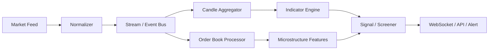

# Domain 05 — Hệ thống phân tích dữ liệu thời gian thực

<div class="lesson-meta">
  <span><strong>Domain</strong> Market Data / Analytics</span>
  <span><strong>Mức độ</strong> Realtime</span>
  <span><strong>Ví dụ xuyên suốt</strong> Tạo candle FPT 10:00–10:01</span>
</div>

Realtime Analytics biến dữ liệu thị trường thô thành thứ người dùng nhìn thấy và hệ thống khác sử dụng:

```text
Tick giá
→ Order book
→ Candle
→ Indicator
→ Signal / Screener
→ Alert / API / WebSocket
```

Nếu xử lý sai sequence, duplicate hoặc late event, chart có thể sai, volume có thể bị cộng đôi, conditional order có thể trigger sai và risk engine có thể dùng giá stale.

<div class="callout">
<strong>Broker UI (🟢)</strong><br/>
SSI iBoard board VN30 hiển thị Trần/Sàn/TC, 3 mức bid/ask, khớp, ĐTNN, phiên <em>Liên tục</em>. VPS SmartOne tương tự trên Bảng giá/Thị trường. Đây là fan-out market data, không phải OMS write path — dù nút Đặt lệnh nằm cạnh bảng.
</div>


<div class="learning-objectives">
<strong>Sau domain này bạn phải giải thích được:</strong>

- Tick, Quote và Order Book là gì;
- OHLCV/Candle được tạo từ tick thế nào;
- Event Time khác Processing Time;
- Sequence Gap, Duplicate, Out-of-order và Late Event;
- Snapshot + Incremental dùng để rebuild state thế nào;
- Watermark trong stream processing nghĩa là gì;
- Backpressure là gì và vì sao tăng thread không giải quyết tận gốc;
- Stale data được phát hiện và propagate ra sao.
</div>

## 1. Từ điển thuật ngữ

| Thuật ngữ | Giải thích dễ hiểu | Ví dụ |
|---|---|---|
| **Market Feed** | Luồng dữ liệu giá/thị trường từ nguồn bên ngoài | Tick, quote, order-book update |
| **Tick** | Một sự kiện thị trường đơn lẻ | Trade 1.000 FPT @ 123.500 |
| **Quote** | Giá chào mua/chào bán | Best Bid 123.400 / Ask 123.500 |
| **Order Book** | Tập hợp các mức giá mua/bán đang chờ | 3 mức bid + 3 mức ask |
| **Sequence** | Số thứ tự message để phát hiện mất/đảo message | 100, 101, 102 |
| **Sequence Gap** | Bị thiếu số thứ tự | nhận 100, 102 → thiếu 101 |
| **Duplicate** | Cùng event nhận nhiều lần | TradeId T1 replay lại |
| **Out-of-order** | Event đến không đúng thứ tự | 100, 102, 101 |
| **Late Event** | Event thuộc thời điểm cũ nhưng đến muộn | trade 10:00:10 đến lúc 10:01:05 |
| **Event Time** | Thời điểm sự kiện xảy ra tại source | 10:00:10.120 |
| **Processing Time** | Thời điểm hệ thống xử lý event | 10:00:10.450 |
| **Candle / OHLCV** | Tóm tắt giá trong một khoảng thời gian | Open, High, Low, Close, Volume |
| **Snapshot** | Ảnh trạng thái đầy đủ tại một thời điểm | toàn bộ order book tại seq 1000 |
| **Incremental Update** | Chỉ phần thay đổi sau snapshot | seq 1001 add bid, 1002 remove ask |
| **Watermark** | Mốc ước lượng event-time đã tiến tới đâu đủ an toàn để đóng window | “khó còn event trước 10:01” |
| **Backpressure** | Downstream xử lý chậm hơn tốc độ dữ liệu vào | input 1m msg/s, consumer 300k/s |
| **Stale Data** | Dữ liệu quá cũ nhưng vẫn tồn tại | price 30 giây chưa update |
| **Indicator** | Chỉ báo tính từ chuỗi giá/volume | SMA, RSI, MACD |
| **WebSocket** | Kết nối giữ mở để server push realtime xuống client | Push giá mới xuống app |

## 2. Raw Tick — event nhỏ nhất để bắt đầu

Ví dụ trade tick:

```json
{
  "symbol": "FPT",
  "tradeId": "T-9001",
  "price": 123500,
  "quantity": 1000,
  "exchangeTimestamp": "2026-08-18T10:00:05.120+07:00",
  "sequence": 18282771
}
```

Ý nghĩa:

```text
Có một trade FPT
Giá = 123.500
Khối lượng = 1.000
Xảy ra lúc 10:00:05.120
Message có sequence 18.282.771
```

## 3. Tick khác Quote

### Trade Tick

Nói rằng giao dịch **đã xảy ra**.

```text
1.000 FPT matched @ 123.500
```

### Quote

Nói rằng thị trường **đang chào**:

```text
Best Bid = 123.400, qty 2.000
Best Ask = 123.500, qty 1.500
```

Không nên nhầm last trade với best bid/ask.

## 4. Order Book

Ví dụ:

```text
ASK
123.700   2.000
123.600   3.500
123.500   1.500  ← best ask
----------------
123.400   2.000  ← best bid
123.300   4.000
123.200   5.000
BID
```

Từ đó tính:

```text
Spread = Best Ask - Best Bid
       = 123.500 - 123.400
       = 100 đ
```

Order-book analytics có thể tính depth, imbalance, liquidity và price impact.

## 5. Tạo Candle 1 phút từ tick

Giả sử các trade trong khoảng 10:00:00–10:00:59:

```text
10:00:05  123.500  qty 1.000
10:00:15  123.700  qty   500
10:00:30  123.300  qty 2.000
10:00:50  123.600  qty 1.500
```

Candle 1m:

```text
Open   = 123.500   // trade đầu tiên
High   = 123.700   // giá cao nhất
Low    = 123.300   // giá thấp nhất
Close  = 123.600   // trade cuối cùng
Volume = 5.000
```

Đó là `OHLCV`:

```text
O = Open
H = High
L = Low
C = Close
V = Volume
```

## 6. Event Time khác Processing Time

Tick xảy ra:

```text
EventTime = 10:00:30.100
```

Do network delay, system nhận lúc:

```text
ProcessingTime = 10:00:31.000
```

Nếu build candle dựa vào processing time, một trade thuộc phút 10:00 có thể bị đẩy nhầm sang phút 10:01.

Vì vậy analytics thường cần **event-time semantics**.

## 7. Sequence Gap — phát hiện mất message

Kỳ vọng:

```text
100
101
102
```

Nhận:

```text
100
102
```

→ thiếu `101`.

Không nên tiếp tục update order book như không có chuyện gì xảy ra. Nếu seq 101 là “remove ask 123.500” mà bị mất, book nội bộ sẽ giữ một order đã không còn tồn tại.

Flow recovery:

```text
Detect gap
→ mark state STALE / RECOVERING
→ obtain missing messages hoặc snapshot mới
→ replay increments hợp lệ
→ verify sequence
→ mark LIVE
```

## 8. Snapshot + Incremental

Mental model:

```text
Snapshot at seq 1.000
+ update 1.001
+ update 1.002
+ update 1.003
= current order book
```

Nếu state bị corrupt hoặc gap không recover được:

```text
discard/rebuild current book
→ load fresh snapshot
→ apply increments sau snapshot
```

Snapshot là “ảnh đầy đủ”; incremental là “delta thay đổi”.

## 9. Duplicate Event

Giả sử trade:

```text
TradeId = T100
Qty = 1.000
```

nhận hai lần.

Nếu candle aggregator cộng volume hai lần:

```text
Volume +2.000  // SAI
```

Cần dedup bằng identity/sequence theo feed contract.

Không tự chế `hash(timestamp+price)` nếu source đã có stable `TradeId` tốt hơn.

## 10. Out-of-order và Late Event

Nhận:

```text
seq 100
seq 102
seq 101
```

`101` là out-of-order.

Hoặc candle 10:00 đã publish, lúc 10:01:05 mới nhận trade có `EventTime=10:00:40` — đó là late event.

Product phải định nghĩa policy:

```text
reorder trong buffer?
update candle cũ?
emit correction event?
recompute indicator?
ignore nếu quá late?
```

Không có một policy đúng cho mọi use case.

## 11. Watermark trong stream processing

Watermark là cách engine nói gần như:

> “Theo policy hiện tại, event-time đã đi tới mốc X; tôi có thể đóng window trước X với mức lateness chấp nhận được.”

Ví dụ:

```text
Max observed event time = 10:01:10
Allowed lateness        = 5s
Watermark               ≈ 10:01:05
```

Một window kết thúc trước watermark có thể được coi là đủ ổn định theo policy.

**Watermark này khác hoàn toàn SQL Change Tracking watermark/checkpoint**. Cùng từ “watermark” nhưng ngữ cảnh khác.

## 12. Indicator — SMA/EMA/RSI/MACD là gì?

### SMA
Simple Moving Average — trung bình giá của N periods.

Ví dụ 3 closes:

```text
100, 110, 120
SMA(3) = 110
```

### EMA
Exponential Moving Average — trung bình nhưng trọng số cao hơn cho dữ liệu gần hiện tại.

### RSI
Relative Strength Index — indicator momentum, thường dùng để mô tả mức mạnh/yếu của biến động giá trong một window.

### MACD
Indicator dựa trên quan hệ giữa các EMA với parameters cụ thể.

### ATR
Average True Range — đo độ biến động theo range.

Engineering cần lưu:

```text
IndicatorName
Parameters
InputSeriesVersion
CorporateActionAdjustmentVersion
CalculatedAt
```

để reproduce kết quả.

## 13. Backpressure — downstream xử lý không kịp

Giả sử:

```text
Feed input       = 1.000.000 events/s
Consumer capacity = 300.000 events/s
```

Mỗi giây backlog tăng:

```text
700.000 events
```

Sau 10 giây:

```text
~7.000.000 events backlog
```

Hệ thống vẫn “running” nhưng dữ liệu đã trễ → không còn realtime.

Giải pháp có thể gồm:

- partitioning;
- batching;
- bounded queue;
- horizontal scale;
- drop/degradation policy cho non-critical consumers;
- isolate critical path;
- monitor consumer lag.

**Không giải quyết bằng tăng thread vô hạn**, vì CPU/memory/context-switch sẽ thành bottleneck mới.

## 14. Stale Data — dữ liệu cũ nhưng nhìn như live

Nếu FPT last update 30 giây trước:

```text
LastEventTime = 10:00:00
Now           = 10:00:30
Age           = 30s
```

System nên expose quality state:

```text
LIVE
STALE
RECOVERING
UNAVAILABLE
```

UI, conditional orders và risk engine có thể có policy khác nhau khi data stale.

## 15. Pipeline tổng quát



**Normalizer** = adapter chuyển dữ liệu vendor/venue-specific thành model nội bộ thống nhất.

## 16. Hot State, History và Storage

Không cần một database cho mọi việc:

```text
Current book / latest price → memory/cache/hot state
Raw/replayable events       → durable event log nếu cần
Historical OHLCV            → analytical/time-series storage
Reference data              → relational/master-data store
```

Storage chọn theo access pattern và correctness requirement.

## 17. Invariant bằng tiếng Việt

```text
1. Sequence gap phải phát hiện được.
2. Duplicate trade không được cộng volume hai lần.
3. Candle phải reproduce được từ cùng raw data + rule version.
4. State corrupt không được tiếp tục publish như LIVE.
5. Stale feed phải observable và propagate theo policy.
6. Indicator phải deterministic với cùng input/parameters/version.
7. Replay không được vô tình trigger external side effect không mong muốn.
```

## 18. Failure Scenarios

### Gap không detect
Order book sai âm thầm.

### Consumer lag
Realtime trở thành delayed nhưng UI không biết.

### Late trade
Candle/indicator đã publish cần correction policy.

### Duplicate tick
Volume/signal bị double count.

### Restart
Nếu hot state chỉ ở RAM, cần snapshot/replay strategy để rebuild.

## 19. Metrics

```text
feed_messages_per_second
feed_lag_ms
sequence_gap_count
resync_count
late_event_count
duplicate_event_count
consumer_backlog
stale_symbol_count
candle_correction_count
indicator_latency_ms
websocket_fanout_lag
```

## 20. Checklist

- [ ] Tôi phân biệt Tick và Quote.
- [ ] Tôi tự tạo được OHLCV từ trade ticks.
- [ ] Tôi hiểu Event Time vs Processing Time.
- [ ] Tôi hiểu Sequence Gap.
- [ ] Tôi hiểu Snapshot + Incremental.
- [ ] Tôi hiểu Duplicate/Out-of-order/Late Event.
- [ ] Tôi giải thích được Watermark.
- [ ] Tôi giải thích được Backpressure.
- [ ] Tôi biết stale data cần quality state.

## 21. Bài tập

### Bài 1 — Candle
Cho 6 ticks trong một phút; tự tính OHLCV.

### Bài 2 — Sequence Gap
Nhận seq `100, 101, 103, 104`. Vẽ recovery flow để quay về LIVE.

### Bài 3 — Late Event
Candle 10:00 đã push, sau đó late trade làm High thay đổi. Thiết kế correction contract cho WebSocket clients.

### Bài 4 — Backpressure
Input 500k msg/s, consumer 350k msg/s. Tính backlog tăng sau 60 giây và đề xuất degradation strategy.

<div class="key-takeaway">
<strong>Mental model cần nhớ:</strong>

Realtime Analytics không chỉ là “Kafka + indicator”. Nó là bài toán **ordering + time + state reconstruction + data quality + backpressure** trước khi là bài toán tính RSI/MACD.
</div>

Tiếp theo: [Domain 06 — Conditional Orders](./06-conditional-orders.md).