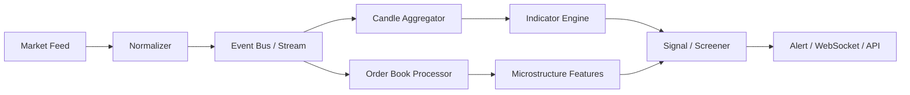

# Domain 05 — Hệ thống phân tích dữ liệu thời gian thực

Real-time analytics là cầu nối giữa **market data engineering** và **investment/trading features**.

## 1. Pipeline tổng quát



## 2. Raw event

Ví dụ tick:

```json
{
  "symbol": "FPT",
  "price": 123500,
  "quantity": 1000,
  "exchangeTimestamp": "...",
  "sequence": 18282771
}
```

Production cần thêm venue/session/trade condition/source/version tùy feed.

## 3. Event Time vs Processing Time

```text
Event Time      = thời điểm sự kiện xảy ra tại source/venue
Processing Time = thời điểm hệ thống của ta xử lý
```

Nếu dùng processing time để build candle, network delay có thể làm candle sai.

## 4. Out-of-order và Late Events

Ví dụ nhận:

```text
seq 100
seq 102
seq 101
```

System phải biết:

- có buffer/reorder không;
- sequence gap recovery thế nào;
- candle đã publish có correction không;
- downstream indicator có recompute không.

## 5. Watermark trong stream processing

Watermark ở stream processing là khái niệm ước lượng “event time đã tiến tới đâu đủ an toàn để đóng window”. Nó **khác** checkpoint/watermark dùng để lưu last processed version trong polling/SQL Change Tracking.

## 6. Candle Aggregation

```text
Ticks
  ↓
1m OHLCV
  ↓
5m / 15m / Daily
```

Cần định nghĩa:

- market timezone;
- trading sessions/break;
- opening/closing auction;
- missing interval;
- correction;
- corporate-action adjustment.

## 7. Indicator Engine

Indicator nên là deterministic function:

```text
IndicatorValue = f(Series, Parameters, Version)
```

Ví dụ:

```text
SMA(20)
EMA(20)
RSI(14)
MACD(12,26,9)
ATR(14)
Bollinger(20,2)
VWAP
```

Lưu parameter/version để kết quả có thể reproduce.

## 8. Order Book Analytics

Ngoài technical indicators:

```text
Spread
Depth
Order Book Imbalance
Trade Imbalance
Liquidity
Volatility
Price Impact
```

Các feature này cần incremental state và sequence correctness.

## 9. Backpressure

Nếu feed = 1 triệu events/s nhưng downstream xử lý 300k/s:

```text
Producer > Consumer
       ↓
Backlog
       ↓
Latency tăng
       ↓
“Real-time” trở thành stale
```

Không giải quyết bằng tăng thread vô hạn. Cần partitioning, batching, bounded queue, horizontal scaling, degradation policy.

## 10. Snapshot + Incremental

Order book thường phù hợp mental model:

```text
Initial Snapshot
      +
Incremental Updates
      ↓
Current Book
```

Khi gap không recover được, resync snapshot thay vì tiếp tục trên state sai.

## 11. Storage

Tùy use case:

```text
Hot state       → memory / Redis-like state
Stream history  → event log
OHLCV/time-series → analytical/time-series store
Reference data  → relational store
```

Một database không tối ưu cho mọi workload.

## 12. Invariants

- sequence gap phải detectable;
- duplicate event không double count volume;
- candle reproducible từ cùng raw data/version;
- stale feed phải observable;
- signal không được phát từ state corrupted mà không có policy rõ.

## Metrics

```text
feed_lag_ms
sequence_gap_count
late_event_count
rebuild_count
indicator_latency_ms
consumer_backlog
stale_symbol_count
```

## Câu hỏi design

Nếu 1-minute candle đã gửi qua WebSocket rồi mới nhận late trade thuộc phút đó, bạn sửa candle cũ hay bỏ late event? Không có câu trả lời chung; hãy định nghĩa SLA và correctness contract của product.