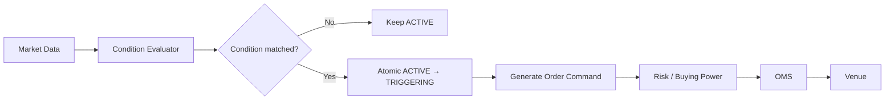
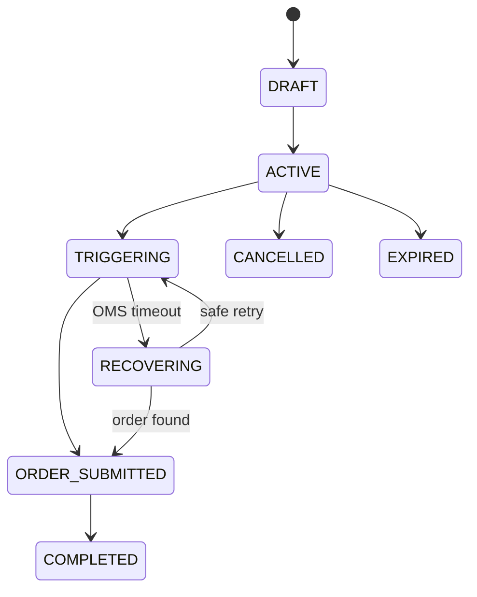

# Domain 06 — Hệ thống lệnh điều kiện thời gian thực

<div class="lesson-meta">
  <span><strong>Domain</strong> Conditional Trading</span>
  <span><strong>Mức độ</strong> Realtime</span>
  <span><strong>Ví dụ xuyên suốt</strong> Stop-loss FPT tại 100.000</span>
</div>

Lệnh điều kiện là rule do khách cấu hình trước. Khi market data thỏa điều kiện, broker mới tạo **order thật** gửi vào Securities Core/OMS.

Ví dụ:

```text
Nếu FPT <= 100.000
→ SELL 1.000 FPT
```

Nếu venue không native-support rule này, chính broker phải theo dõi market, quyết định trigger và đảm bảo **chỉ tạo đúng một order**.

<div class="callout">
<strong>Broker UI (🟢 labels)</strong><br/>
SSI: Đặt lệnh điều kiện / Sổ lệnh điều kiện — rule khác trading order. VPS client có STOP, TCO, Trailing stop, SL/TP. Không mở form thật trong phiên READ-ONLY.
</div>


<div class="learning-objectives">
<strong>Sau domain này bạn phải giải thích được:</strong>

- Conditional Order và Generated Order khác nhau thế nào;
- Trigger là gì;
- Stop-loss, Take-profit, Trailing Stop và OCO;
- Price Source vì sao phải explicit;
- Race Condition khi nhiều tick cùng thỏa rule;
- Atomic Transition dùng để chống double-trigger;
- Idempotency giữa Trigger Engine và OMS;
- stale market data và restart/replay ảnh hưởng trigger ra sao.
</div>

## 1. Từ điển thuật ngữ

| Thuật ngữ | Giải thích dễ hiểu | Ví dụ |
|---|---|---|
| **Conditional Order** | Rule chờ điều kiện, chưa chắc là order đã gửi exchange | Nếu FPT <= 100k thì SELL |
| **Trigger** | Khoảnh khắc rule chuyển từ “đang chờ” sang “phải tạo order” | Tick 99.900 làm rule match |
| **Generated Order** | Order thật được tạo sau trigger | SELL 1.000 FPT |
| **Stop-loss** | Đóng/giảm position khi giá đi ngược quá mức | FPT <= 100k → SELL |
| **Take-profit** | Chốt lời khi giá đạt mục tiêu | FPT >= 130k → SELL |
| **Trailing Stop** | Stop-loss di chuyển theo mức giá tốt nhất đã đạt | Peak 120k, trailing 5% → trigger 114k |
| **OCO** | One-Cancels-the-Other: một nhánh trigger thì nhánh còn lại bị vô hiệu | TP 130k hoặc SL 110k |
| **Price Source** | Loại giá dùng để evaluate condition | Last trade, bid, ask, mark price |
| **Race Condition** | Hai worker/tick cùng thấy rule ACTIVE và cùng trigger | Tạo 2 generated orders |
| **Atomic Transition** | Chuyển state có điều kiện, chỉ một worker thắng | `ACTIVE → TRIGGERING` |
| **Idempotency Key** | Business key để retry không tạo order mới | `ConditionalOrderId + TriggerVersion` |
| **Stale Data** | Giá quá cũ, không nên coi là live | last price 20 giây trước |
| **Replay** | Phát lại events cũ để recovery/rebuild | Không được trigger lịch sử như live nếu policy không cho |

## 2. Conditional Order khác Trading Order

Conditional rule:

```json
{
  "conditionalOrderId": "CO-1001",
  "symbol": "FPT",
  "condition": "LAST_PRICE <= 100000",
  "action": "SELL",
  "quantity": 1000,
  "status": "ACTIVE"
}
```

Chưa có nghĩa exchange đã nhận lệnh.

Khi trigger:

```json
{
  "generatedOrderKey": "CO-1001-v1",
  "symbol": "FPT",
  "side": "SELL",
  "quantity": 1000,
  "source": "CONDITIONAL_ORDER"
}
```

Generated order đi vào OMS và chịu pre-trade/risk giống order khác.

## 3. Pipeline tổng quát



`Condition Evaluator` = component đọc rule + market data rồi trả lời true/false.

## 4. Stop-loss — ví dụ cụ thể

Khách đang có 1.000 FPT và muốn cắt lỗ tại 100.000.

Rule:

```text
Price Source = Last Trade
Condition    = price <= 100.000
Action       = SELL 1.000
```

Ticks:

```text
101.000 → false
100.500 → false
100.100 → false
 99.900 → true → trigger
```

Lưu ý: **trigger price không đảm bảo execution price**. Rule trigger tại 99.900 nhưng order có thể khớp ở giá khác tùy market liquidity và order type.

## 5. Take-profit

Ví dụ:

```text
Customer owns FPT at average 100.000
Take-profit threshold = 130.000
```

Khi price source đạt rule:

```text
price >= 130.000
→ generate SELL order
```

Cần định nghĩa session nào được trigger, loại price nào và generated order type nào.

## 6. Price Source — “giá” không phải chỉ một con số

Có thể có:

```text
Last Trade
Best Bid
Best Ask
Reference Price
Index Price
Mark Price
```

Ví dụ:

```text
Last trade = 100.000
Best Bid   = 99.500
Best Ask   = 100.500
```

Rule `price <= 100.000` cho kết quả khác tùy price source.

Vì vậy condition phải lưu explicit:

```text
priceSource = LAST_TRADE
```

không để developer tự đoán.

## 7. Race Condition — hai tick cùng trigger

Rule đang `ACTIVE`.

Hai tick gần như cùng lúc:

```text
Tick 1001 = 99.900
Tick 1002 = 99.800
```

Worker A và B cùng đọc:

```text
status = ACTIVE
```

Nếu cả hai cùng `CreateOrder()` → có hai SELL orders.

## 8. Atomic Transition — chỉ một worker được quyền trigger

Ví dụ SQL:

```sql
UPDATE conditional_orders
SET status = 'TRIGGERING',
    trigger_version = trigger_version + 1
WHERE id = @id
  AND status = 'ACTIVE';
```

Chỉ worker update được `1 row` mới có quyền tiếp tục.

Mental model:

```text
ACTIVE
  ↓ compare-and-set
TRIGGERING
```

Worker còn lại update `0 rows` → biết rule đã được worker khác claim.

## 9. Idempotency giữa Trigger Engine và OMS

Case khó:

```text
Trigger Engine → OMS CreateOrder
OMS tạo order thành công
Response bị timeout
```

Trigger Engine không biết order đã tồn tại hay chưa.

Nếu retry với ID mới → duplicate order.

Dùng deterministic business key:

```text
GeneratedOrderKey = ConditionalOrderId + TriggerVersion
```

Ví dụ:

```text
CO-1001-v7
```

OMS contract:

```text
Cùng key + cùng semantic payload
→ trả cùng business order
→ không tạo order mới
```

## 10. State Machine

Một model rõ hơn:



`TRIGGERING` và `RECOVERING` quan trọng vì distributed call có unknown outcome.

## 11. Trailing Stop

Trailing stop không có trigger price cố định ngay từ đầu.

Ví dụ Long position, trailing 5%:

```text
Initial price = 100.000
Peak          = 100.000
Trigger       = 95.000
```

Giá tăng:

```text
110.000 → Peak=110.000 → Trigger=104.500
120.000 → Peak=120.000 → Trigger=114.000
```

Sau đó giá giảm:

```text
116.000 → chưa trigger
114.000 → trigger
```

Formula minh họa:

```text
Peak = max(Peak, CurrentPrice)
TriggerPrice = Peak × (1 - 5%)
```

`Peak` là **business state** phải persist/recover; không nên chỉ nằm trong RAM.

## 12. Out-of-order ảnh hưởng Trailing Stop thế nào?

Giả sử actual events:

```text
120.000
118.000
```

nhưng hệ thống nhận:

```text
118.000
120.000
```

Nếu update Peak và evaluate trigger không theo event policy đúng, có thể tạo result khác.

Conditional Engine phải phụ thuộc market-data quality contract: sequence, event time, stale state, replay mode.

## 13. OCO — One Cancels the Other

Khách muốn:

```text
Take Profit = 130.000
Stop Loss   = 110.000
```

Hai nhánh thuộc cùng OCO group:

```text
TP ─┐
    ├─ một nhánh trigger → nhánh kia không còn quyền trigger
SL ─┘
```

Nếu TP và SL là hai rows hoàn toàn độc lập, race có thể khiến cả hai tạo order.

Cần coordinated state:

```text
OCOGroup = ACTIVE
→ claim winner leg atomically
→ disable sibling
```

## 14. Stale Market Data

Giả sử:

```text
LastPrice = 99.900
PriceAge  = 30 seconds
FeedState = STALE
```

Có nên trigger stop-loss không?

Không có câu trả lời chung. Product/risk policy cần nói rõ:

```text
suspend evaluation
hoặc trigger theo fallback source
hoặc block only new conditions
```

Nhưng **không được âm thầm coi stale price là live**.

## 15. Restart / Recovery

Sau restart, engine cần biết:

```text
ACTIVE rules
TRIGGERING rules
RECOVERING rules
Peak của trailing stop
OCO group state
GeneratedOrderKey
Last processed market sequence/checkpoint nếu thiết kế cần
```

Nếu tất cả chỉ nằm RAM, restart có thể làm mất trigger state hoặc trigger lại.

## 16. Replay Mode

Market events cũ có thể được replay để rebuild state.

Nhưng historical replay không nhất thiết được phép tạo order thật.

Nên có execution mode:

```text
LIVE
RECOVERY
HISTORICAL_REPLAY
```

Và side-effect policy explicit.

## 17. Invariant bằng tiếng Việt

```text
1. Một TriggerVersion tạo tối đa một generated order.
2. CANCELLED/EXPIRED rule không được trigger.
3. OCO chỉ có một winning leg gây business effect.
4. Trailing peak/state phải monotonic theo rule phù hợp.
5. Stale/corrupt market data phải theo policy rõ.
6. Retry OMS không được tạo duplicate order.
7. Restart/replay không được kích hoạt lại historical side effect ngoài ý muốn.
```

## 18. Failure Scenarios

### Two workers trigger cùng lúc
Atomic transition phải chọn một winner.

### OMS timeout sau success
Idempotency key + status recovery.

### Feed stale
Suspend/fallback theo policy.

### Restart ở TRIGGERING
Recovery query OMS bằng generated key.

### OCO simultaneous conditions
Atomic group claim.

## 19. Metrics

```text
active_rule_count
trigger_evaluation_latency
trigger_to_order_latency
trigger_duplicate_prevented
rules_in_recovering
oldest_recovering_age
stale_feed_suspensions
oco_conflict_count
trailing_state_rebuild_count
generated_order_timeout_count
```

## 20. Checklist

- [ ] Tôi phân biệt conditional rule và generated order.
- [ ] Tôi hiểu trigger price không phải guaranteed execution price.
- [ ] Tôi biết Price Source phải explicit.
- [ ] Tôi giải thích được race condition double-trigger.
- [ ] Tôi hiểu atomic transition.
- [ ] Tôi hiểu deterministic idempotency key.
- [ ] Tôi tính được trailing trigger đơn giản.
- [ ] Tôi hiểu OCO cần coordinated state.
- [ ] Tôi biết stale/replay cần policy.

## 21. Bài tập

### Bài 1 — Double Trigger
Hai workers cùng nhận tick 99.900. Viết pseudo-code/SQL chứng minh chỉ một worker tạo order.

### Bài 2 — Unknown Outcome
OMS timeout sau `CreateOrder(CO-1001-v5)`. Thiết kế recovery sequence.

### Bài 3 — Trailing Stop
Peak bắt đầu 100k, trailing 7%. Giá đi: 105k → 120k → 116k → 111.5k. Tính trigger price sau mỗi bước và xác định lúc nào trigger.

### Bài 4 — OCO
TP=130k, SL=110k. Thiết kế database state để hai workers không thể activate cả hai legs.

<div class="key-takeaway">
<strong>Mental model cần nhớ:</strong>

Conditional Orders = **Market Data + Stateful Rule + Atomic Trigger + Idempotent Order Creation**. Phần khó không phải `if price <= threshold`, mà là chống duplicate và phục hồi đúng khi distributed failure xảy ra.
</div>

Tiếp theo: [Domain 07 — Rewards](./07-rewards.md).