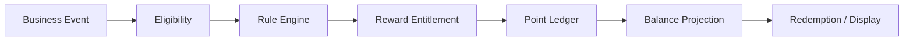

# Domain 07 — Hệ thống thưởng điểm thông minh

<div class="lesson-meta">
  <span><strong>Domain</strong> Rewards / Loyalty</span>
  <span><strong>Mức độ</strong> Enterprise</span>
  <span><strong>Ví dụ xuyên suốt</strong> Giao dịch 120 triệu nhận 500 điểm</span>
</div>

Rewards nhìn có vẻ “không core” bằng trading, nhưng nếu điểm có giá trị đổi quà/fee waiver/cash benefit thì nó cũng là một **financial-like balance** cần audit, idempotency và reversal.

Sai lầm phổ biến:

```csharp
customer.Points += 500;
```

Nếu event bị gửi lại, campaign đổi rule hoặc phải thu hồi điểm đã cấp sai, model này nhanh chóng mất kiểm soát.

<div class="learning-objectives">
<strong>Sau domain này bạn phải giải thích được:</strong>

- Campaign, Eligibility, Rule Engine và Entitlement là gì;
- vì sao point balance không nên là source duy nhất;
- Point Ledger hoạt động thế nào;
- duplicate event phải được dedup ra sao;
- cap/budget có race condition gì;
- expiry/redeem nên trace tới credit entries nào;
- reversal khác overwrite balance;
- deterministic controls phải đi trước ML personalization.
</div>

## 1. Từ điển thuật ngữ

| Thuật ngữ | Giải thích dễ hiểu | Ví dụ |
|---|---|---|
| **Campaign** | Chương trình khuyến khích trong một khoảng thời gian | Trade ≥100m nhận 500 điểm |
| **Eligibility** | Điều kiện khách có đủ quyền tham gia hay không | Chỉ VIP, account active |
| **Rule Engine** | Bộ logic đánh giá điều kiện và tính reward | IF VIP AND TradeValue≥100m THEN +500 |
| **Entitlement** | Quyền nhận reward sau khi điều kiện được xác nhận | Trade T100 được hưởng 500 điểm |
| **Point Ledger** | Sổ ghi từng lần cộng/trừ/hết hạn/điều chỉnh điểm | +500, -300, -200 |
| **Balance Projection** | Tổng điểm hiện tại được tính từ ledger | 500 - 300 = 200 |
| **Redemption** | Dùng điểm để đổi quyền lợi | Dùng 300 điểm đổi voucher |
| **Expiration** | Điểm hết hạn sau một ngày/thời hạn | 100 điểm expire 31/12 |
| **Cap** | Giới hạn reward | Tối đa 2.000 điểm/khách/ngày |
| **Budget** | Tổng ngân sách campaign | 10 triệu điểm |
| **Stacking** | Nhiều campaign có được cộng đồng thời không | VIP + weekend promotion |
| **Idempotency** | Duplicate event không award lần hai | Trade T100 replay vẫn +500 một lần |
| **Reversal** | Ghi một entry ngược để thu hồi effect cũ | -500 `REVERSAL_WRONG_AWARD` |
| **Fraud / Abuse** | Hành vi lợi dụng rule để farm reward | giao dịch vòng chỉ để nhận điểm |

## 2. Mental model



Business event có thể đến từ:

```text
AccountOpened
TradeCompleted
DepositCompleted
ReferralQualified
CampaignAction
```

Rewards không nên chặn critical trading path; thường nhận integration event sau khi business fact đã được xác nhận.

## 3. Ví dụ campaign: Trade ≥100m nhận 500 điểm

Rule minh họa:

```text
Campaign = AUGUST_VIP_TRADE
Active   = 01/08 → 31/08
Customer Segment = VIP
Trade Value >= 100.000.000
Reward = 500 points
Per-customer daily cap = 2.000 points
```

Event:

```json
{
  "eventId": "EV-T100",
  "type": "TradeCompleted",
  "accountId": "A123",
  "customerSegment": "VIP",
  "tradeId": "T100",
  "tradeValue": 120000000,
  "occurredAt": "..."
}
```

Rule result:

```text
eligible = true
reward = 500
```

Ledger entry:

```text
+500  CAMPAIGN_AUGUST_VIP_TRADE  source=T100
```

## 4. Vì sao cần Point Ledger?

Giả sử lịch sử:

```text
+500  TRADE_CAMPAIGN
+100  ACCOUNT_ANNIVERSARY
-300  REDEEM_VOUCHER
-100  EXPIRED
---------------------
Balance = 200
```

Nếu chỉ lưu:

```text
Customer.Points = 200
```

bạn không trả lời được:

- 200 đến từ đâu?
- campaign nào đã award?
- credit nào đã expire?
- redemption đã consume credit nào?
- nếu award +500 sai, phải sửa gì?

Ledger giữ history; balance là projection.

## 5. Duplicate Event — case bắt buộc xử lý

`TradeCompleted(T100)` có thể đến hai lần do retry/replay.

Nếu consumer cứ cộng:

```text
+500
+500
= +1.000  // SAI
```

Dedup identity gợi ý:

```text
CampaignId + BusinessEventId + RewardType
```

Ví dụ:

```text
AUGUST_VIP_TRADE + EV-T100 + POINT
```

Unique constraint/business inbox giúp business effect chỉ apply một lần.

## 6. Entitlement — bước giữa rule và ledger

Thay vì rule engine ghi điểm trực tiếp, có thể model:

```text
RewardEntitlement
-----------------
EntitlementId
CampaignId
BusinessEventId
CustomerId
RewardType
Amount
RuleVersion
Status
```

State:

```text
CALCULATED
→ APPROVED/CONFIRMED
→ POSTED
```

Điều này hữu ích nếu reward cần manual review, budget approval hoặc delayed posting.

## 7. Rule Engine cần version

Campaign hôm nay:

```text
Trade ≥100m → +500
```

Ngày mai marketing đổi:

```text
Trade ≥100m → +800
```

Nếu overwrite config mà không version, khi audit trade hôm qua bạn không biết vì sao khách được 500 thay vì 800.

Nên lưu:

```text
CampaignVersion
EffectiveFrom
EffectiveTo
EligibilityRule
RewardFormula
CapRule
StackingRule
```

Ledger/entitlement giữ `RuleVersion` đã dùng.

## 8. Cap — giới hạn theo khách

Ví dụ:

```text
500 points / qualifying trade
Daily Cap = 2.000
```

Khách có 5 trades đạt điều kiện:

```text
Trade 1 → +500
Trade 2 → +500
Trade 3 → +500
Trade 4 → +500
Trade 5 → +0 vì cap đã đủ 2.000
```

### Race Condition

Hai events xử lý đồng thời khi customer đã ở 1.500 điểm/ngày:

```text
Worker A reads 1.500 → thinks +500 allowed
Worker B reads 1.500 → thinks +500 allowed
```

Nếu cả hai commit → 2.500, vượt cap.

Critical cap cần atomic/serialized strategy ở source of truth.

## 9. Campaign Budget

Campaign tổng budget:

```text
10.000.000 points
```

Nếu nhiều consumers award song song, check-budget + post-ledger cần consistency strategy để không overspend vượt policy.

Có thể cần:

```text
BudgetReservation
BudgetConsumed
```

hoặc atomic counter/transactional ownership tùy thiết kế.

## 10. Expiration

Điểm có thể hết hạn theo từng credit.

Ví dụ:

```text
Entry A +500 expires 31/12
Entry B +300 expires 31/03 năm sau
```

Balance = 800, nhưng khi redeem 600 thì phải biết consume entry nào trước theo policy, ví dụ “earliest expiry first”.

Không thể làm đúng nếu chỉ có tổng balance.

## 11. Redemption

Khách có:

```text
Available Points = 800
```

Đổi voucher cần 300:

```text
Redeem Request
→ validate balance/eligibility
→ reserve/consume points
→ create voucher/benefit
→ ledger -300
→ final status
```

Nếu external voucher service timeout sau khi voucher đã tạo, đây là **unknown outcome**. Retry phải có idempotency key để không tạo hai vouchers rồi trừ điểm hai lần.

## 12. Reversal — sửa sai bằng history, không xóa dấu vết

Campaign config sai và đã award nhầm:

```text
+500  WRONG_AWARD
```

Không nên chỉ:

```sql
UPDATE customer SET points = points - 500;
```

Nên tạo:

```text
-500  REVERSAL_WRONG_AWARD
```

và liên kết với original entry.

Audit nhìn thấy cả original effect lẫn correction.

## 13. Stacking / Exclusivity

Khách đồng thời đủ điều kiện:

```text
Campaign VIP       +500
Campaign Weekend   +300
```

Product phải nói rõ:

```text
stack both → +800?
chỉ campaign priority cao hơn?
chọn reward tốt nhất?
```

Đây là business rule, cần version và deterministic evaluation order.

## 14. Fraud / Abuse

Ví dụ abuse:

- tạo nhiều account referral giả;
- trade vòng chỉ để farm reward;
- deposit/withdraw lặp để nhận campaign;
- transaction reversal sau khi reward đã post.

Bắt đầu bằng deterministic controls:

```text
daily cap
unique customer/KYC checks
minimum holding/settlement conditions
reversal event handling
suspicious velocity rules
```

Sau đó mới dùng ML/scoring nếu có giá trị.

## 15. Personalization và ML

ML có thể đề xuất:

```text
Customer Features
→ Segment / Propensity
→ Next Best Offer
```

Nhưng final entitlement vẫn nên đi qua deterministic rule:

```text
Model says offer X
→ campaign eligibility
→ cap/budget
→ ledger
```

ML không nên tự sửa balance.

## 16. Data model gợi ý

```text
Campaign
CampaignVersion
EligibilityRule
RewardRule
RewardEntitlement
PointAccount
PointLedgerEntry
PointCreditLot
Redemption
BudgetAccount
BudgetReservation
Adjustment / Reversal
FraudFlag
```

Ví dụ ledger entry:

```json
{
  "entryId": "PE-1001",
  "customerId": "C123",
  "amount": 500,
  "entryType": "EARN",
  "campaignId": "AUGUST_VIP_TRADE",
  "campaignVersion": 3,
  "sourceBusinessEventId": "EV-T100",
  "expiresAt": "2026-12-31T23:59:59+07:00"
}
```

## 17. Invariant bằng tiếng Việt

```text
1. Một source event không award nhiều hơn intended multiplicity.
2. Cap/budget không được vượt do concurrent processing.
3. Redemption không được consume cùng points hai lần.
4. Expiry phải trace tới credit entries cụ thể.
5. Reversal không được xóa original history.
6. Rule/campaign phải versioned để audit historical decisions.
7. Retry external benefit creation không được tạo duplicate benefit.
```

## 18. Failure Scenarios

### Duplicate TradeCompleted
Dedup trước business effect.

### Budget race
Atomic consumption/reservation.

### Voucher timeout
Unknown outcome + idempotency.

### Campaign config sai
Bulk reversal workflow + audit.

### Expiry job rerun
Không expire cùng credit hai lần.

## 19. Metrics

```text
reward_events_processed
reward_duplicate_prevented
entitlement_pending_count
campaign_budget_remaining
cap_rejection_count
redemption_failure_count
redemption_unknown_count
expired_points
reversal_count
fraud_flag_count
```

## 20. Checklist

- [ ] Tôi hiểu Campaign/Eligibility/Entitlement.
- [ ] Tôi hiểu Point Ledger khác Balance.
- [ ] Tôi biết duplicate event phải idempotent.
- [ ] Tôi hiểu Cap/Budget có concurrency problem.
- [ ] Tôi biết expiry cần credit-level detail.
- [ ] Tôi hiểu reversal tốt hơn silent overwrite.
- [ ] Tôi biết ML chỉ nên hỗ trợ, không bypass deterministic controls.

## 21. Bài tập

### Bài 1 — Duplicate Event
Một trade event gửi 3 lần. Thiết kế unique key và transaction để award 500 đúng một lần.

### Bài 2 — Daily Cap
Customer đã earn 1.500/2.000 points; hai qualifying events tới đồng thời. Thiết kế concurrency strategy.

### Bài 3 — Expiry
Customer có credit 300 expiring hôm nay và 500 expiring tháng sau; redeem 400. Mô tả consume lots theo earliest-expiry-first.

### Bài 4 — Reversal
1 triệu awards sai rule. Thiết kế bulk reversal có checkpoint, idempotency và audit.

<div class="key-takeaway">
<strong>Mental model cần nhớ:</strong>

Rewards = **Business Event → Eligibility/Rule → Entitlement → Ledger → Balance/Redemption**. Nếu điểm có giá trị, hãy thiết kế nó như một hệ thống tài chính nhỏ, không phải một field `Points`.
</div>

Tiếp theo: [Domain 08 — Enterprise Workflow](./08-enterprise-workflow.md).