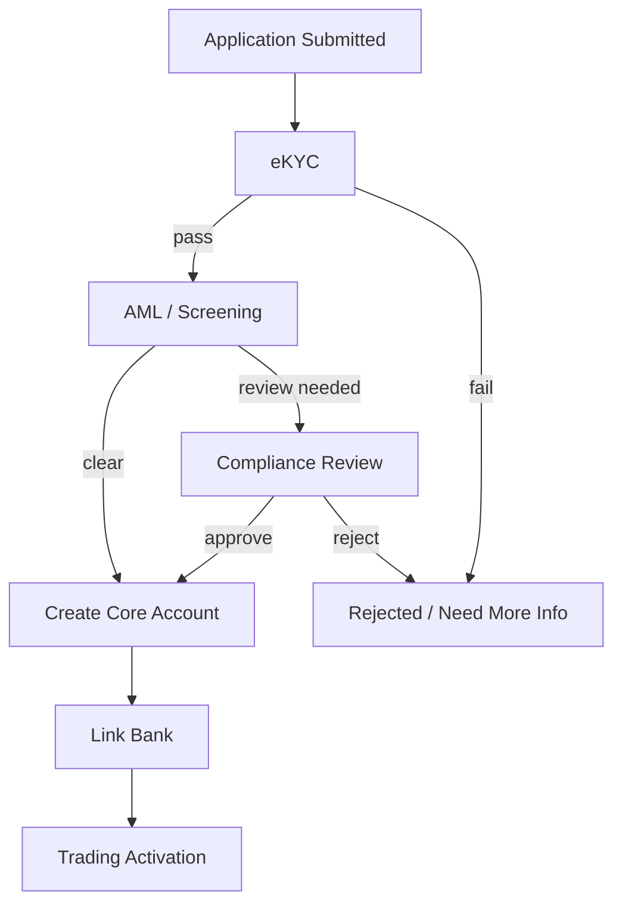
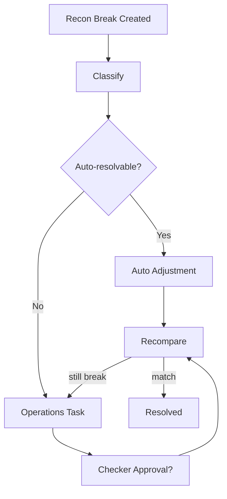

# Domain 08 — Hệ thống quy trình doanh nghiệp

<div class="lesson-meta">
  <span><strong>Domain</strong> Workflow / BPM</span>
  <span><strong>Mức độ</strong> Enterprise</span>
  <span><strong>Ví dụ xuyên suốt</strong> Mở tài khoản chứng khoán</span>
</div>

Một công ty chứng khoán không chỉ có trading. Nó còn có hàng trăm quy trình dài nhiều bước, nhiều người và nhiều hệ thống:

<div class="callout">
<strong>Broker UI (🟢)</strong><br/>
SSI Margin có <em>Lịch sử yêu cầu</em> và lối <em>Tăng sức mua</em> (không click). VPS có Chuyển tiền Napas/nội bộ và Ứng trước — workflow tiền, không phải matching. Timeout bank ≠ failed.
</div>


```text
Mở tài khoản
KYC / AML review
Tăng hạn mức
Fee override
Bond onboarding
Corporate action exception
Settlement exception
Reconciliation break
Customer complaint
```

Nếu tất cả được viết bằng nested `if/else` + cron jobs + email thủ công, hệ thống rất nhanh trở thành legacy khó audit.

<div class="learning-objectives">
<strong>Sau domain này bạn phải giải thích được:</strong>

- Process Definition, Version và Instance;
- Task, Actor, Role và Transition;
- Human Task, Service Task, Timer Task;
- SLA và Escalation;
- Maker-Checker / Segregation of Duties;
- Audit Trail;
- vì sao service task phải idempotent;
- long-running workflow khác local database transaction;
- Saga/Compensation là gì ở mức dễ hiểu;
- restart/recovery phải giữ timer/task state thế nào.
</div>

## 1. Từ điển thuật ngữ

| Thuật ngữ | Giải thích dễ hiểu | Ví dụ |
|---|---|---|
| **Workflow / Process** | Chuỗi bước nghiệp vụ để đạt một kết quả | Mở tài khoản |
| **Process Definition** | Bản thiết kế/template của workflow | `Application → eKYC → AML → Approval` |
| **Process Version** | Phiên bản của definition | v1 không có Risk Review, v2 có |
| **Process Instance** | Một lần workflow cụ thể đang chạy | Hồ sơ mở tài khoản của khách C123 |
| **Task** | Một việc cần hoàn thành trong process | Reviewer approve AML |
| **Actor** | Người/hệ thống thực hiện task | Nhân viên Compliance |
| **Role** | Nhóm quyền/chức năng | `COMPLIANCE_REVIEWER` |
| **Transition** | Chuyển từ state/bước này sang bước khác | `AML_REVIEW → APPROVED` |
| **Human Task** | Bước cần con người quyết định/thao tác | Approve, Reject, Request Info |
| **Service Task** | Bước tự động gọi hệ thống khác | Create Trading Account |
| **Timer Task** | Bước kích hoạt theo thời gian | Reminder sau 15 phút |
| **SLA** | Thời hạn cam kết hoàn thành | Settlement exception xử lý trong 30 phút |
| **Escalation** | Nâng cấp xử lý khi quá hạn/risk cao | Gửi supervisor |
| **Maker-Checker** | Người tạo và người duyệt phải khác nhau | Maker đề xuất limit, Checker approve |
| **Segregation of Duties (SoD)** | Tách nhiệm vụ để một người không tự làm toàn bộ hành động nhạy cảm | Không vừa tạo vừa duyệt fee override |
| **Audit Trail** | Lịch sử ai làm gì, lúc nào, tại sao | A approve lúc 10:05 với reason X |
| **Saga** | Điều phối nhiều local transactions qua nhiều hệ thống, không có một global DB transaction | KYC → CRM → Core → Bank Link |
| **Compensation** | Hành động bù/hoàn tác nghiệp vụ khi bước sau fail | Core account tạo rồi bank-link fail → close/mark pending/manual repair theo policy |
| **Idempotency** | Retry task không tạo effect lần hai | `CreateTradingAccount(ProcessId)` retry vẫn 1 account |

## 2. Ví dụ xuyên suốt — mở tài khoản chứng khoán

Khách bắt đầu application:

```text
Name
Phone
ID document
Address
Bank information
Risk declarations
```

Workflow có thể là:



Không phải mọi khách đi cùng path. Đây là lý do cần conditional transition.

## 3. Process Definition vs Process Instance

### Definition

Giống “bản thiết kế”.

```text
AccountOpening v2
A → B → C → D
```

### Instance

Giống “một hồ sơ đang chạy theo bản thiết kế đó”.

```text
ProcessInstanceId = P-1001
Customer          = C123
DefinitionVersion = AccountOpening-v2
CurrentStep       = AML_REVIEW
```

Một definition có thể sinh hàng triệu instances.

## 4. Versioning — workflow thay đổi nhưng instance cũ không tự biến hình

Ngày 01/08:

```text
v1: Application → KYC → AML → Create Account
```

Ngày 15/08 thêm Risk Review:

```text
v2: Application → KYC → AML → Risk Review → Create Account
```

Instance bắt đầu ngày 10/08 theo v1 không nên tự nhảy sang v2 nếu không có migration rule explicit.

Data cần lưu:

```text
DefinitionId
DefinitionVersion
ProcessInstanceId
```

## 5. Task — đơn vị công việc

Một task có thể có:

```text
TaskId
ProcessInstanceId
TaskType
AssignedRole
AssignedUser
Status
CreatedAt
DueAt
CompletedAt
Decision
ReasonCode
```

State minh họa:

```text
CREATED
→ CLAIMED
→ IN_PROGRESS
→ COMPLETED
```

hoặc:

```text
CREATED → CANCELLED
CREATED → EXPIRED
```

## 6. Human Task

Ví dụ AML screening báo cần review.

Task:

```text
Type      = COMPLIANCE_REVIEW
Assigned  = COMPLIANCE_REVIEWER
DueAt     = 10:30
```

Reviewer có thể:

```text
APPROVE
REJECT
REQUEST_MORE_INFORMATION
```

Decision phải có reason/audit, không chỉ boolean `Approved=true`.

## 7. Service Task

Ví dụ workflow gọi Core Account Service:

```text
CreateTradingAccount(CustomerId, ProcessInstanceId)
```

Workflow engine có thể retry do timeout.

Nếu downstream không idempotent:

```text
retry 3 lần
→ tạo 3 accounts  // SAI
```

Dùng stable business key:

```text
ExternalRequestKey = ProcessInstanceId + "CREATE_TRADING_ACCOUNT"
```

Cùng key → trả cùng business result.

## 8. Timer Task

Ví dụ settlement exception phải được xử lý trong 30 phút.

```text
Task Created = 10:00
DueAt        = 10:30
```

Timer flow:

```text
10:15 → reminder
10:30 → SLA breach
10:31 → escalate supervisor
```

Timer state phải persist. Service restart lúc 10:20 không được làm “quên” deadline.

## 9. SLA — không chỉ là cron

`SLA` = Service Level Agreement/Objective ở đây được dùng như business deadline.

Ví dụ:

```text
Normal case: 30 minutes
High severity: 10 minutes
Weekend/holiday: business calendar rule khác
```

Cần:

```text
BusinessCalendar
DueAt
Pause/Resume rules nếu có
Severity
EscalationPolicy
```

Không chỉ `DateTime.Now.AddMinutes(30)` nếu nghiệp vụ dùng business hours.

## 10. Escalation

Khi task quá hạn:

```text
Level 0 → Assigned Analyst
Level 1 → Team Lead
Level 2 → Operations Manager
```

Escalation có thể:

- reassign task;
- notify;
- raise severity;
- require approval;
- create incident.

Mọi escalation phải trace được.

## 11. Maker-Checker / SoD

Ví dụ tăng credit limit:

```text
Maker  = nhập đề xuất 2 tỷ
Checker = duyệt đề xuất
```

Invariant:

```text
MakerUserId != CheckerUserId
```

Nếu user có cả hai role, policy vẫn có thể cấm cùng một user thực hiện cả hai bước trong cùng instance.

Đây là **Segregation of Duties** — tách nhiệm vụ để giảm fraud/error.

## 12. Audit Trail

Một audit record tốt trả lời:

```text
Ai?              user-123
Làm gì?           APPROVE
Trên object nào?  task T100 / process P1001
Lúc nào?          10:05:22
Từ state nào?     REVIEWING
Sang state nào?   APPROVED
Lý do?            AML_CLEAR
Dùng data nào?    screeningVersion=18
Evidence?         attachment/reference
```

Audit không chỉ là application log. Nó là business evidence.

## 13. Ví dụ thứ hai — Settlement Exception

Reconciliation phát hiện:

```text
Internal expected cash = 1.000.000.000
External bank result    =   999.500.000
Difference              =       500.000
```

Workflow:



Đây là workflow dài, có human task, SLA, audit và rerun.

## 14. Saga — vì sao không dùng một transaction cho tất cả hệ thống?

Account opening có thể gọi:

```text
KYC System
CRM
Core Account
Bank Link
Notification
```

Không có một database transaction ACID xuyên tất cả.

Thay vào đó:

```text
Step 1 commit local
Step 2 commit local
Step 3 timeout
```

Workflow/Saga phải biết current progress và recovery action.

## 15. Compensation là gì?

Compensation **không nhất thiết** là undo bit-for-bit.

Ví dụ:

```text
Core Account created
Bank Link failed permanently
```

Policy có thể là:

```text
Mark account PENDING_ACTIVATION
→ create Ops Task
→ retry bank link
```

hoặc nếu business cho phép:

```text
Close/disable newly created account
```

Compensation là business action làm hệ thống quay về một trạng thái chấp nhận được.

## 16. Retry và Unknown Outcome

Service Task gọi external service timeout:

```text
Workflow → Core CreateAccount
Response lost
```

Không biết account đã tạo chưa.

State không nên chỉ là `FAILED`.

Có thể:

```text
EXECUTING
→ UNKNOWN
→ QUERY_EXTERNAL
→ SUCCESS / SAFE_RETRY / MANUAL_REVIEW
```

Stable request identity + status query/reconciliation giúp recovery.

## 17. Data model gợi ý

```text
ProcessDefinition
ProcessVersion
ProcessInstance
Task
TaskAssignment
TransitionHistory
Decision
Timer
SlaPolicy
EscalationEvent
Attachment
Comment
AuditEntry
ExternalCallAttempt
RecoveryAction
```

Ví dụ task:

```json
{
  "taskId": "T-1001",
  "processInstanceId": "P-1001",
  "type": "AML_REVIEW",
  "status": "IN_PROGRESS",
  "assignedRole": "COMPLIANCE_REVIEWER",
  "dueAt": "2026-08-18T10:30:00+07:00",
  "processVersion": 2
}
```

## 18. Invariant bằng tiếng Việt

```text
1. Transition phải hợp lệ theo đúng process version.
2. Một decision không được apply hai lần.
3. Maker và Checker phải thỏa SoD policy.
4. Retry service task không được tạo duplicate external object/effect.
5. Timer/SLA không được mất khi restart.
6. Audit phải trace được decision/state change.
7. Process instance phải recover được sau crash.
8. Manual repair/compensation phải có reason và evidence.
```

## 19. Build custom hay dùng Workflow/BPM Engine?

### Tự build hợp lý khi

- workflow ít bước;
- logic ổn định;
- chủ yếu automated;
- team hiểu rõ persistence/retry/timer needs.

### Cân nhắc engine khi

- nhiều human tasks;
- nhiều timer/SLA/escalation;
- process thay đổi thường xuyên;
- business muốn visualize/configure;
- cần durable long-running orchestration;
- nhiều branches/parallel steps.

Không chọn BPM chỉ vì “enterprise”, cũng không tự build mọi thứ chỉ vì “đỡ dependency”.

## 20. Failure Scenarios

### Restart lúc timer đang chờ
Timer phải resume đúng deadline.

### Duplicate approve request
Decision apply một lần.

### CreateAccount timeout
Unknown outcome + idempotency/status query.

### Workflow version change
Instance cũ không tự migrate.

### Escalation worker chạy lại
Không spam duplicate escalation effect.

### Manual DB edit
Phá audit — nên dùng first-class correction task.

## 21. Metrics

```text
active_process_count
active_task_count
tasks_near_sla
tasks_breached_sla
oldest_task_age
process_completion_time
service_task_retry_count
unknown_external_call_count
manual_repair_count
escalation_count
maker_checker_violation_attempt
```

## 22. Checklist

- [ ] Tôi phân biệt Definition và Instance.
- [ ] Tôi hiểu Task/Transition.
- [ ] Tôi phân biệt Human/Service/Timer Task.
- [ ] Tôi hiểu SLA và Escalation.
- [ ] Tôi giải thích được Maker-Checker/SoD.
- [ ] Tôi hiểu Audit Trail khác application log.
- [ ] Tôi biết service task phải idempotent.
- [ ] Tôi hiểu Saga không phải distributed DB transaction.
- [ ] Tôi hiểu Compensation là business recovery action.
- [ ] Tôi biết timer/process state phải durable.

## 23. Bài tập

### Bài 1 — Account Opening
Vẽ state machine cho account opening: eKYC pass/fail, AML clear/review, manual approve/reject, account creation timeout.

### Bài 2 — Maker Checker
Thiết kế tables/constraint để user tạo fee override không tự approve cùng request.

### Bài 3 — SLA
Settlement exception có SLA 30 phút, reminder 15 phút, escalation 30 phút. Thiết kế timer persistence để restart không mất schedule.

### Bài 4 — Saga Recovery
KYC success → Core Account success → Bank Link timeout. Viết các state/recovery options, không giả định timeout=failure.

<div class="key-takeaway">
<strong>Mental model cần nhớ:</strong>

Enterprise Workflow = **Durable Process State + Human/Service/Timer Tasks + Versioning + SLA + Audit + Recovery**. Nó biến những quy trình vốn nằm trong email/Excel/if-else thành business state có thể quan sát, retry và kiểm toán.
</div>

Quay lại: [Tổng quan 8 Core Domains](./).