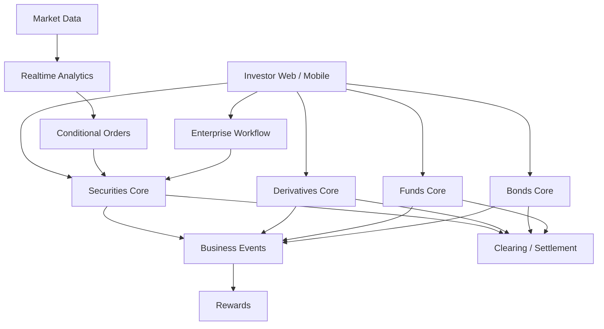

# 8 Core Domains của một công ty chứng khoán

<div class="lesson-meta">
  <span><strong>Đối tượng</strong> Backend developer chưa làm core chứng khoán</span>
  <span><strong>Cách học</strong> Nghiệp vụ → ví dụ → state → failure → architecture</span>
</div>

Nếu mới nhìn vào một sơ đồ công ty chứng khoán, bạn rất dễ gặp hàng loạt từ như `OMS`, `margin`, `NAV`, `settlement`, `ledger`, `watermark`, `entitlement`, `SLA` rồi mất phương hướng.

Phần **8 Domains** được viết lại với một nguyên tắc: **không yêu cầu bạn biết sẵn thuật ngữ**. Mỗi domain sẽ bắt đầu từ một câu chuyện thực tế, sau đó mới đi vào entity, state, API, database, event và failure scenario.

## 1. Trước tiên: “Domain” nghĩa là gì?

Trong tài liệu này, **domain** là một vùng nghiệp vụ đủ lớn, có dữ liệu, quy tắc và vòng đời riêng.

Ví dụ:

```text
Khách đặt lệnh mua cổ phiếu
→ Securities Core

Khách giữ vị thế hợp đồng tương lai và bị thiếu ký quỹ
→ Derivatives Core

Khách mua chứng chỉ quỹ và chờ NAV cuối ngày
→ Fund Core
```

Domain **không đồng nghĩa** với một microservice. Một domain có thể được triển khai bằng một module trong modular monolith hoặc nhiều service tùy scale và consistency requirement.

## 2. Từ điển nền tảng trước khi đọc 8 domain

| Thuật ngữ | Giải thích dễ hiểu | Ví dụ |
|---|---|---|
| **Lifecycle** | Vòng đời của một object từ lúc sinh ra tới khi kết thúc | Order: `NEW → PARTIALLY_FILLED → FILLED` |
| **State** | Trạng thái hiện tại | `ACTIVE`, `CANCELLED`, `SETTLED` |
| **Invariant** | Điều kiện nghiệp vụ tuyệt đối không được phá | Không được bán nhiều hơn số lượng có thể bán |
| **Source of Truth** | Nơi có quyền xác nhận một loại dữ liệu | OMS là nguồn chính cho internal order state; bank là evidence cho tiền bên bank |
| **Ledger** | Sổ ghi lịch sử tăng/giảm thay vì chỉ lưu số dư cuối | `+100m deposit`, `-20m settlement`, `-50k fee` |
| **Projection** | Dữ liệu hiện tại được tính từ history/ledger | `AvailableCash = 79.95m` |
| **Idempotency** | Cùng một request/event gửi lại không tạo business effect lần hai | Execution `E123` gửi lại vẫn chỉ book trade một lần |
| **Settlement** | Bước thực sự chuyển tiền/chứng khoán sau khi trade đã hình thành | Buyer trả tiền, seller giao chứng khoán |
| **Reconciliation** | Đối chiếu nội bộ với hệ thống bên ngoài để phát hiện lệch | Cash ledger nội bộ ↔ settlement bank |
| **Entitlement** | Quyền lợi mà nhà đầu tư được hưởng | Cổ tức tiền mặt hoặc coupon trái phiếu |
| **Reservation** | Giữ tạm resource để không bị dùng hai lần | Giữ 120 triệu khi lệnh BUY đang chờ khớp |
| **Unknown outcome** | Gọi hệ thống ngoài bị timeout nên chưa biết thành công hay thất bại | Gửi lệnh rồi mất ACK |

<div class="key-takeaway">
<strong>Điểm quan trọng:</strong>

Khi gặp một thuật ngữ mới, đừng học thuộc tên. Hãy hỏi: **nó đại diện cho business fact nào, state nào thay đổi, tiền/chứng khoán nào bị ảnh hưởng, và nếu retry/crash thì kết quả phải ra sao?**
</div>

## 3. Bản đồ 8 domain

| # | Domain | Nó giải quyết câu hỏi gì? | Ví dụ đời thực |
|---|---|---|---|
| 1 | [Securities Core](./01-securities-core.md) | Khách đặt lệnh cổ phiếu, khớp lệnh, tiền và chứng khoán thay đổi thế nào? | BUY 1.000 FPT |
| 2 | [Derivatives Core](./02-derivatives-core.md) | Long/Short, P&L, ký quỹ và margin call được tính thế nào? | Long 2 futures contracts |
| 3 | [Bonds Core](./03-bonds-core.md) | Coupon, yield, accrued interest và maturity được quản lý thế nào? | Trái phiếu coupon 8% |
| 4 | [Funds Core](./04-funds-core.md) | Subscription/redemption được pricing theo NAV nào? | Đầu tư 100 triệu vào quỹ mở |
| 5 | [Realtime Analytics](./05-realtime-analytics.md) | Tick giá được biến thành candle, indicator và signal thế nào? | Tạo candle FPT 10:00–10:01 |
| 6 | [Conditional Orders](./06-conditional-orders.md) | Khi giá đạt điều kiện, làm sao tạo đúng một order thật? | Stop-loss FPT tại 100.000 |
| 7 | [Rewards](./07-rewards.md) | Điểm thưởng kiếm, dùng, hết hạn và điều chỉnh thế nào? | Giao dịch 100 triệu nhận 500 điểm |
| 8 | [Enterprise Workflow](./08-enterprise-workflow.md) | Quy trình nhiều bước/người phê duyệt được chạy và audit thế nào? | Mở tài khoản + eKYC + AML + approval |

## 4. Mối quan hệ giữa 8 domain



Không phải tất cả domain đều nằm trên critical path của một order. Ví dụ Rewards có thể nhận event sau trade; nó không nên làm chậm việc gửi order ra exchange.

## 5. Cách đọc mỗi domain

Mỗi bài sẽ theo cùng một khung:

```text
1. Câu chuyện thực tế
2. Từ điển thuật ngữ
3. Mental model
4. Ví dụ số cụ thể
5. Lifecycle / state machine
6. Data model / API / event
7. Invariant bằng tiếng Việt
8. Failure scenario
9. Metrics / observability
10. Checklist + bài tập
```

## 6. Thứ tự nên học

Nếu mục tiêu là **“backend developer → core securities engineer”**, nên đọc:

```text
01 Securities Core
   ↓
02 Derivatives
03 Bonds
04 Funds
   ↓
05 Realtime Analytics
06 Conditional Orders
   ↓
07 Rewards
08 Enterprise Workflow
```

Bốn domain đầu giúp bạn hiểu **tiền, vị thế, sản phẩm và settlement**. Hai domain 05–06 giúp hiểu **real-time/event-driven**. Hai domain cuối giúp hiểu **enterprise integration, ledger và workflow dài hạn**.

Bắt đầu tại [Domain 01 — Securities Core](./01-securities-core.md).