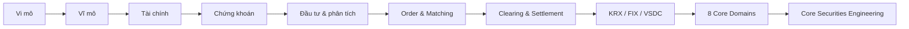

# Securities Engineering — Lộ trình tổng thể

Khóa học này nối ba thế giới thường bị học tách rời: **kinh tế/tài chính**, **nghiệp vụ chứng khoán**, và **software engineering cho hệ thống giao dịch**.



## Phần I — Nền tảng kinh tế và tài chính

1. [Kinh tế học vi mô](./lectures/01-microeconomics/)
2. [Kinh tế học vĩ mô](./lectures/02-macroeconomics/)
3. [Tài chính nền tảng](./lectures/03-finance-foundations/)
4. [Thị trường chứng khoán](./lectures/04-securities-market/)
5. [Phân tích đầu tư: cơ bản + kỹ thuật](./lectures/05-investment-analysis/)

## Phần II — Market Infrastructure

6. [Order lifecycle, order book và khớp lệnh](./lectures/06-order-matching/)
7. [Clearing, Settlement, KRX, FIX 4.4 và VSDC](./lectures/07-clearing-settlement-krx-fix-vsdc/)

## Phần III — 8 domain/hệ thống lớn của công ty chứng khoán

1. [Core giao dịch chứng khoán](./domains/01-securities-core.md)
2. [Core giao dịch phái sinh](./domains/02-derivatives-core.md)
3. [Core giao dịch trái phiếu](./domains/03-bonds-core.md)
4. [Core giao dịch chứng chỉ quỹ](./domains/04-funds-core.md)
5. [Phân tích dữ liệu thời gian thực](./domains/05-realtime-analytics.md)
6. [Lệnh điều kiện thời gian thực](./domains/06-conditional-orders.md)
7. [Hệ thống thưởng điểm thông minh](./domains/07-rewards.md)
8. [Hệ thống quy trình doanh nghiệp](./domains/08-enterprise-workflow.md)

## Phần IV — Engineering

- [Từ backend developer đến core securities engineer](./engineering/core-securities-engineering.md)
- [Reliability, ledger, idempotency và reconciliation](./engineering/reliability-and-ledgers.md)

## Phần V — Project

- [Project 01 — Mô phỏng Order Lifecycle](./projects/project-01-order-lifecycle.md)
- [Project 02 — Thiết kế Brokerage Platform](./projects/project-02-brokerage-platform.md)

## Mental model quan trọng nhất

Một giao dịch không kết thúc khi màn hình hiện **FILLED**.

```text
Investor
  ↓
Order
  ↓
Broker Risk / Reservation
  ↓
Exchange Gateway
  ↓
Matching
  ↓
Execution / Trade
  ↓
Clearing
  ↓
Settlement Obligation
  ↓
Cash + Securities Settlement
  ↓
Reconciliation
```

Nếu chỉ hiểu đến `Order → FILLED`, bạn mới hiểu **front half** của trading. Core securities bắt đầu trở nên thú vị ở nửa sau: money/securities obligations, ledger, settlement, recovery và đối soát.

## Cách đọc mỗi bài

Mỗi bài nên được đọc theo 5 câu hỏi:

1. **Business problem là gì?**
2. **Entity/state nào tồn tại?**
3. **Invariant nào tuyệt đối không được vi phạm?**
4. **Failure mode nào xảy ra trong production?**
5. **System design nào bảo vệ invariant đó?**

Đây là cách biến kiến thức finance thành khả năng thiết kế hệ thống.