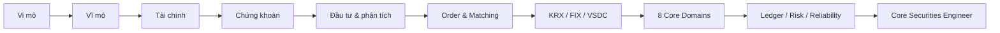

## Một lộ trình, ba thế giới

Khóa học nối ba mảng thường bị học tách rời: **kinh tế/tài chính**, **nghiệp vụ chứng khoán**, và **software engineering cho hệ thống giao dịch**.

<strong>Mental model:</strong> Đừng bắt đầu từ Microservices. Bắt đầu từ business rule → state → invariant → failure mode → recovery → reconciliation; sau đó mới chọn architecture.

## Bắt đầu theo mục tiêu

  <a class="course-card" href="./lectures/01-microeconomics/"><strong>01 — Nền tảng</strong>Vi mô, vĩ mô, finance, securities và phân tích đầu tư.</a>
  <a class="course-card" href="./lectures/06-order-matching/"><strong>02 — Trading</strong>Order lifecycle, order book, matching, partial fill, cancel/replace.</a>
  <a class="course-card" href="./lectures/07-clearing-settlement-krx-fix-vsdc/"><strong>03 — Market Infrastructure</strong>FIX session, KRX connectivity, clearing, settlement và VSDC.</a>
  <a class="course-card" href="./domains/"><strong>04 — 8 Core Domains</strong>Equity, derivatives, bonds, funds, analytics, conditional orders, rewards và workflow.</a>
  <a class="course-card" href="./engineering/"><strong>05 — Engineering</strong>State machine, ledger, idempotency, reconciliation, HA/DR và observability.</a>
  <a class="course-card" href="./projects/"><strong>06 — Projects</strong>Xây OMS simulator và thiết kế brokerage platform end-to-end.</a>

## Khi nào bạn thực sự hiểu core securities?

Không phải khi bạn biết tạo endpoint `POST /orders`, mà khi bạn trả lời chắc được các câu hỏi sau:

- tiền nào **available**, tiền nào **reserved**, tiền nào **pending settlement**?
- một order partial fill 3 lần tạo bao nhiêu trade và ảnh hưởng position thế nào?
- timeout lúc submit là thất bại hay **unknown outcome**?
- duplicate execution có làm tăng position hai lần không?
- trạng thái nội bộ khác KRX/VSDC/bank thì hệ thống phát hiện và sửa bằng cách nào?
- process restart hoặc failover thì session/sequence/replay được khôi phục ra sao?

Nếu các câu trả lời đều dẫn về **invariant + durable state + recovery + reconciliation**, bạn đang đi đúng hướng.
