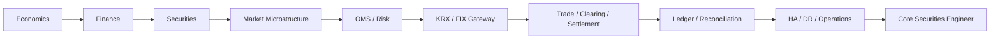

## Một lộ trình, từ nền tảng tới production



<div class="learning-path">
<strong>Mental model:</strong> Đừng bắt đầu từ Microservices. Bắt đầu từ business rule → state → invariant → failure mode → durable identity → recovery → reconciliation; sau đó mới chọn architecture.
</div>

## Track I — Economics & Finance · Bài 01–05

<div class="course-grid">
  <a class="course-card" href="./lectures/01-microeconomics/"><strong>01 — Microeconomics</strong><span>Cung cầu, incentives, market structure và price discovery.</span></a>
  <a class="course-card" href="./lectures/02-macroeconomics/"><strong>02 — Macroeconomics</strong><span>Lãi suất, lạm phát, chính sách và chu kỳ kinh tế.</span></a>
  <a class="course-card" href="./lectures/03-finance-foundations/"><strong>03 — Finance</strong><span>Time value, risk/return, valuation và corporate finance.</span></a>
  <a class="course-card" href="./lectures/04-securities-market/"><strong>04 — Securities</strong><span>Equity, bonds, funds, derivatives và market structure.</span></a>
  <a class="course-card" href="./lectures/05-investment-analysis/"><strong>05 — Investment Analysis</strong><span>Fundamental, technical, portfolio và data lineage.</span></a>
</div>

## Track II — Market & Brokerage Core · Bài 06–12

```text
Order & Matching
→ KRX / FIX / VSDC
→ Account / Cash / Position / Buying Power
→ Security Master / Corporate Actions
→ Market Data
→ Risk / Margin
→ EOD / Reconciliation / Operations
```

Đây là track biến kiến thức chứng khoán thành domain model và business invariants.

## Track III — Production Securities Engineering · Bài 13–24

```text
13 OMS Internals
14 FIX 4.4 Session Recovery
15 Exchange Gateway & KRX Connectivity
16 Trade Capture & Booking
17 Clearing, Netting & Settlement
18 Ledger, Accounting & Projections
19 Event Delivery Semantics
20 HA / DR / BCP / Observability
21 Security / Compliance / Audit
22 Performance / Capacity / Latency
23 Production Runbook & Incidents
24 Architecture Boundaries & DDD
```

Đây là track trả lời câu hỏi khó nhất: **hệ thống làm sao vẫn đúng khi timeout, duplicate, crash, reconnect, replay, overload, failover và external state khác internal state?**

## 8 Core Domains

<div class="course-grid">
  <a class="course-card" href="./domains/01-securities-core"><strong>Securities Core</strong><span>OMS, reservations, trades, cash/position.</span></a>
  <a class="course-card" href="./domains/02-derivatives-core"><strong>Derivatives</strong><span>Position, P&L, margin, liquidation.</span></a>
  <a class="course-card" href="./domains/03-bonds-core"><strong>Bonds</strong><span>Coupon, yield, cash flows, maturity.</span></a>
  <a class="course-card" href="./domains/04-funds-core"><strong>Funds</strong><span>NAV, subscription/redemption, cut-off.</span></a>
  <a class="course-card" href="./domains/05-realtime-analytics"><strong>Realtime Analytics</strong><span>Ticks, candles, indicators, streaming.</span></a>
  <a class="course-card" href="./domains/06-conditional-orders"><strong>Conditional Orders</strong><span>Atomic trigger, generated order, race.</span></a>
  <a class="course-card" href="./domains/07-rewards"><strong>Rewards</strong><span>Rules, campaigns, points ledger.</span></a>
  <a class="course-card" href="./domains/08-enterprise-workflow"><strong>Enterprise Workflow</strong><span>Approval, SLA, maker/checker, audit.</span></a>
</div>

## 5 Projects — từ happy path tới Game Day

```text
01 Order Lifecycle Simulator
03 FIX Gateway & Recovery Lab
04 Ledger & Reconciliation Lab
02 Brokerage Platform End-to-End
05 Brokerage Production Game Day
```

Project cuối cố tình phá hệ thống bằng market-open burst, gateway outage, split brain, stale feed, duplicate execution, broker outage, settlement mismatch và DR failover.

## Khi nào bạn thực sự hiểu core securities?

Không phải khi biết tạo `POST /orders`, mà khi trả lời chắc được:

- tiền nào **available**, tiền nào **reserved**, tiền nào **pending settlement**?
- một order partial fill 3 lần tạo bao nhiêu execution/trade và ảnh hưởng position thế nào?
- timeout lúc submit là failure hay **UNKNOWN**?
- `MsgSeqNum` khác `ExecId` như thế nào?
- FIX process restart cần restore state nào?
- duplicate execution có làm tăng position/ledger hai lần không?
- clearing khác settlement ở entity và failure mode nào?
- DR site lên xanh nhưng venue/VSDC/bank khác internal state thì có được mở trading không?
- modular monolith hay microservices bảo vệ invariant tốt hơn trong boundary đang xét?

Nếu câu trả lời đều dẫn về **business identity + state machine + invariant + durable transaction + recovery + reconciliation**, bạn đang đi đúng hướng.

## Tự kiểm tra

- [Competency Matrix](./resources/competency-matrix)
- [50 Failure Scenarios](./resources/failure-scenarios)
- [Review Checklist](./resources/checklist)
- [System Map](./resources/system-map)
- [Primary References](./resources/references)
