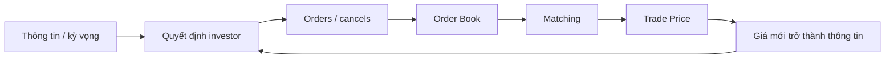
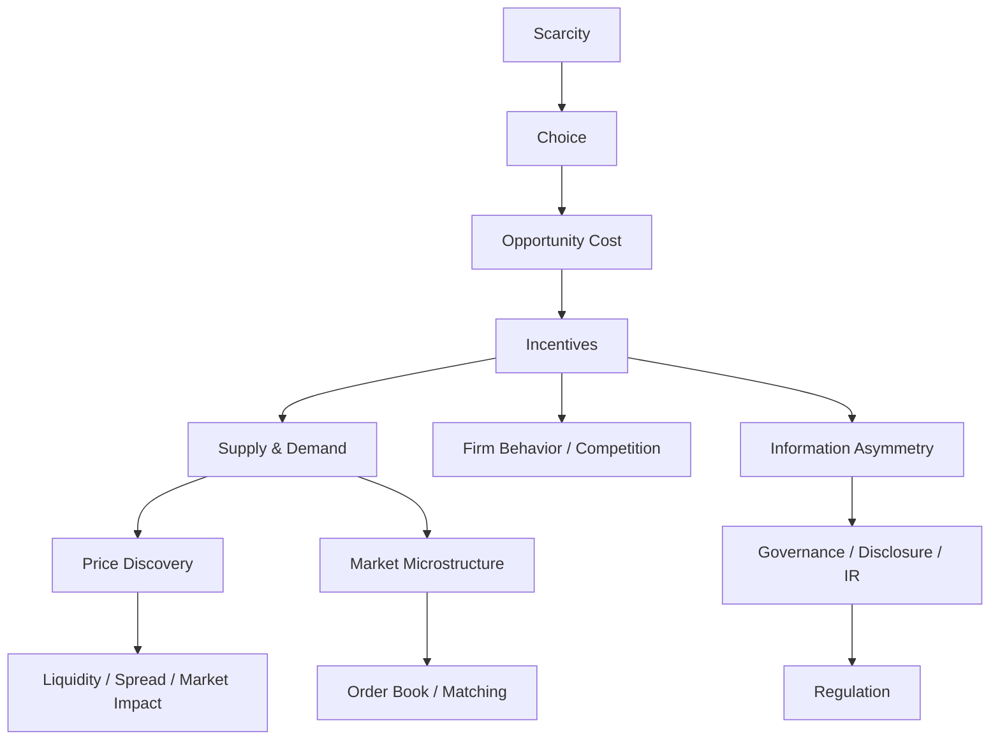

# Bài 01 — Kinh tế học vi mô: vì sao giá hình thành?

<div class="lesson-meta">
  <span><strong>Track</strong> Economics & Finance</span>
  <span><strong>Mức độ</strong> Foundation</span>
  <span><strong>Mục tiêu</strong> Hiểu logic kinh tế đứng sau giá, thanh khoản và hành vi thị trường</span>
</div>

Giả sử lúc 10:15, cổ phiếu FPT đang giao dịch quanh `120.000` đồng. Một câu hỏi rất tự nhiên là:

> **Tại sao lại là 120.000? Tại sao không phải 100.000 hay 150.000?**

Một câu trả lời hời hợt là: “vì thị trường đang định giá như vậy”. Kinh tế học vi mô đi sâu hơn. Giá hình thành vì nhiều người tham gia có **nguồn lực hữu hạn, kỳ vọng khác nhau, thông tin khác nhau, mức chịu rủi ro khác nhau và động cơ khác nhau**, rồi họ tương tác thông qua một cơ chế thị trường.

Với securities engineer, vi mô không phải môn để học thuộc đồ thị cung–cầu. Nó là nền để hiểu:

```text
Scarcity
  ↓
Choice / Opportunity Cost
  ↓
Incentives
  ↓
Supply & Demand
  ↓
Price Discovery
  ↓
Liquidity / Spread / Market Impact
  ↓
Order Book / Matching / Risk / Regulation
```

<div class="learning-objectives">
<strong>Sau bài này bạn phải giải thích được:</strong>

- vì sao mọi quyết định đầu tư đều có opportunity cost;
- cung–cầu hình thành giá và thay đổi ra sao khi có shock;
- elasticity liên quan thế nào đến thanh khoản và market impact;
- marginal thinking giúp doanh nghiệp và nhà đầu tư ra quyết định thế nào;
- market structure tạo hoặc phá pricing power ra sao;
- information asymmetry dẫn tới disclosure, IR, governance và regulation vì sao;
- vì sao order book là một biểu hiện rất cụ thể của cung–cầu nhưng không phải toàn bộ kinh tế học vi mô.
</div>

## 1. Scarcity — điểm bắt đầu của mọi quyết định kinh tế

**Scarcity** nghĩa là nguồn lực có giới hạn trong khi mong muốn gần như không giới hạn.

Nhà đầu tư có thể muốn đồng thời:

```text
lợi nhuận cao
+ rủi ro thấp
+ thanh khoản cao
+ không mất vốn
+ rút tiền bất kỳ lúc nào
```

Nhưng không thể tối đa tất cả cùng lúc. Vì thế kinh tế học bắt đầu từ **trade-off**.

### Ví dụ: 1 tỷ đồng chỉ được sử dụng một lần tại một thời điểm

Bạn có `1.000.000.000 VND` và ba lựa chọn:

```text
A. Mua cổ phiếu
B. Mua trái phiếu
C. Gửi tiết kiệm / giữ tiền mặt
```

Nếu chọn A, bạn từ bỏ lợi ích có thể nhận từ B và C.

Đó là **opportunity cost — chi phí cơ hội**.

```text
Return của lựa chọn đã chọn
phải được đánh giá tương đối với
return + risk của lựa chọn tốt nhất bị bỏ qua
```

Đây là cây cầu đầu tiên từ microeconomics sang finance:

```text
Opportunity Cost
      ↓
Required Return
      ↓
Discount Rate
      ↓
Valuation
```

### Góc nhìn engineering

Một hệ thống recommendation hoặc portfolio không nên chỉ nói:

```text
FPT expected return = 12%
```

mà phải đặt trong context:

```text
risk-free ≈ ?
market alternative ≈ ?
risk premium ≈ ?
liquidity cost ≈ ?
```

Giá trị của một cơ hội luôn mang tính **tương đối**.

---

## 2. Preferences, Utility và Budget Constraint

Kinh tế vi mô không giả định mọi người muốn cùng một thứ. Mỗi người có **preferences** khác nhau.

Hai nhà đầu tư cùng có 1 tỷ đồng:

```text
Investor A
- 28 tuổi
- thu nhập ổn định
- chịu drawdown tốt
- horizon 10 năm

Investor B
- 62 tuổi
- cần dòng tiền đều
- ưu tiên bảo toàn vốn
- horizon 2 năm
```

Cùng một tài sản có thể hấp dẫn với A nhưng không phù hợp với B.

### Utility

`Utility` là cách mô hình hóa mức độ một lựa chọn thỏa mãn sở thích của người ra quyết định.

Không cần hiểu utility như một con số “hạnh phúc thật”. Hãy xem nó là abstraction giúp trả lời:

> Với cùng một ngân sách, nhà đầu tư ưu tiên combination nào giữa return, risk, liquidity và consumption?

### Budget constraint

Nguồn lực hữu hạn tạo ra ràng buộc:

```text
Money spent on Asset A
+ Money spent on Asset B
+ Cash retained
<= Total Wealth
```

Trong hệ thống chứng khoán, khái niệm này sẽ xuất hiện lại dưới dạng rất cụ thể:

```text
Available Cash
Buying Power
Credit Limit
Margin Limit
Sellable Quantity
```

Một pre-trade risk engine thực chất đang thực thi một tập **economic constraints** bằng code.

---

## 3. Demand — tại sao người mua muốn mua nhiều hơn ở một số mức giá?

Demand mô tả mối quan hệ giữa **giá** và **lượng mà người mua sẵn sàng mua**, giữ các yếu tố khác không đổi.

Mental model cơ bản:

```text
Price ↓
→ tài sản trở nên hấp dẫn hơn với một số buyer
→ quantity demanded có xu hướng ↑
```

Nhưng demand không chỉ phụ thuộc giá hiện tại.

Với cổ phiếu, demand có thể thay đổi vì:

- kỳ vọng lợi nhuận doanh nghiệp;
- lãi suất;
- risk appetite;
- dòng tiền ETF/quỹ;
- thông tin mới;
- quy định margin;
- liquidity requirement;
- alternative investment opportunities.

### Movement vs Shift — distinction rất quan trọng

**Movement along demand curve**: quantity demanded đổi vì **chính giá của tài sản đổi**.

**Shift of demand curve**: toàn bộ nhu cầu đổi vì một yếu tố khác.

Ví dụ:

```text
FPT price giảm 125k → 120k
→ movement along demand
```

nhưng:

```text
earnings outlook tăng mạnh
→ ở mọi mức giá cũ, nhiều investor sẵn sàng mua hơn
→ demand curve shifts right
```

Nếu không phân biệt hai loại này, rất dễ giải thích thị trường theo kiểu “giá giảm nên cầu giảm” mà không biết causal direction.

---

## 4. Supply — tại sao người bán xuất hiện?

Supply mô tả lượng mà seller sẵn sàng bán ở các mức giá khác nhau.

Trong chứng khoán, seller có thể bán vì:

```text
take profit
stop loss
portfolio rebalance
fund redemption
margin call
liquidity need
change in valuation
risk reduction
index rebalance
```

Điểm quan trọng: một lệnh SELL không có nghĩa seller “ghét doanh nghiệp”. Động cơ giao dịch có thể hoàn toàn khác nhau.

Đây là lý do backend/analytics không nên suy diễn sentiment trực tiếp từ một transaction đơn lẻ.

---

## 5. Equilibrium — giá cân bằng không phải một con số bất biến

Trong textbook, equilibrium là điểm:

```text
Quantity Demanded = Quantity Supplied
```

Trong thị trường tài chính điện tử, equilibrium thực tế mang tính **động**.

Mỗi khi có:

```text
new information
new order
cancel
execution
risk limit change
market maker quote change
```

thì trạng thái cung–cầu có thể thay đổi.

Vì vậy price discovery là một **process**, không phải một phép tính chạy một lần.



Giá vừa là **kết quả** của hành vi thị trường, vừa trở thành **input** cho hành vi tiếp theo.

---

## 6. Supply–Demand Shock

Hãy xét một ví dụ đơn giản.

Trước tin tức:

```text
Best Ask = 120.0
Best Bid = 119.9
```

Sau khi doanh nghiệp công bố kết quả tốt hơn kỳ vọng, nhiều buyer cập nhật valuation.

Không phải chỉ có “một người mua thêm”. Có thể xảy ra đồng thời:

```text
buyers raise bid
existing sellers cancel low-price asks
new buyers enter
short sellers cover
algorithms reprice
```

Kết quả là demand và supply schedule cùng thay đổi.

Giá tăng là **output của một thay đổi trong tập quyết định**, không phải một nguyên nhân thần bí.

<div class="key-takeaway">
<strong>Takeaway:</strong> Khi đọc chart, đừng chỉ hỏi “giá đang tăng hay giảm?”. Hãy hỏi “điều gì đã làm willingness-to-buy hoặc willingness-to-sell thay đổi?”.
</div>

---

## 7. Elasticity — độ nhạy của hành vi

**Price elasticity of demand** đo mức quantity demanded phản ứng mạnh đến đâu khi giá thay đổi.

Công thức khái niệm:

```text
Elasticity = % thay đổi Quantity / % thay đổi Price
```

Không cần dùng công thức này trực tiếp cho từng order book snapshot. Điều quan trọng là mental model về **độ nhạy**.

### Tài sản thanh khoản cao

Một lượng giao dịch tương đối lớn có thể được hấp thụ với thay đổi giá nhỏ hơn.

```text
deep book
+ nhiều buyer/seller
+ spread nhỏ
→ lower immediate price impact
```

### Tài sản thanh khoản thấp

```text
thin book
+ ít resting orders
+ spread rộng
→ một order vừa phải cũng có thể quét nhiều price levels
```

Ví dụ:

```text
ASK
100.0   1,000
100.5     800
101.0     700
102.0     500
```

Marketable BUY 2.000 không thể giả định:

```text
2,000 × 100.0
```

Nó có thể consume nhiều mức:

```text
1,000 @ 100.0
  800 @ 100.5
  200 @ 101.0
```

Đó là **market impact**.

---

## 8. Bid, Ask, Spread và Order Book — cung cầu được “materialize” thành dữ liệu

Một simplified order book:

```text
SELL / ASK
Price      Qty
121.0      2,000
120.5      1,500
120.0      3,000   ← best ask
-----------------
119.9      2,500   ← best bid
119.5      4,000
119.0      1,000
BUY / BID
```

### Best Bid

Giá mua cao nhất đang chờ.

### Best Ask

Giá bán thấp nhất đang chờ.

### Spread

```text
Spread = Best Ask - Best Bid
       = 120.0 - 119.9
       = 0.1
```

Spread thường được xem như một phần của **transaction cost / liquidity cost**.

### Depth

Depth cho biết quantity có sẵn ở nhiều price level.

Nhưng cần nhớ:

> Order book chỉ là **visible state tại một thời điểm** theo rule/feed của thị trường. Nó không chứa toàn bộ nhu cầu tiềm ẩn của tất cả investor.

Một investor chưa gửi order vẫn có demand, nhưng demand đó chưa xuất hiện trên book.

---

## 9. Consumer Surplus và Producer Surplus — “giá trị giao dịch” khác “giá giao dịch”

Giả sử một buyer sẵn sàng trả tối đa `125.000` nhưng mua được ở `120.000`.

```text
Willingness to Pay = 125k
Transaction Price  = 120k
Difference         = 5k
```

Trong microeconomics, phần chênh này liên quan **consumer surplus**.

Ngược lại, seller sẵn sàng bán từ `115.000` nhưng bán được `120.000` thì có producer surplus.

Điểm quan trọng với markets:

```text
transaction price
!=
private valuation của buyer
!=
private valuation của seller
```

Một trade xảy ra chính vì hai bên có valuation/constraint khác nhau.

---

## 10. Marginal Thinking — quyết định ở đơn vị tiếp theo

Microeconomics nhấn mạnh ra quyết định **at the margin**.

Không hỏi:

> Công ty có nên sản xuất không?

mà hỏi:

> Có nên sản xuất **thêm một đơn vị** không?

Nếu:

```text
Marginal Revenue > Marginal Cost
```

thì sản xuất thêm có thể tạo lợi ích.

Trong investment/risk, mental model tương tự:

```text
Thêm 1 tỷ exposure
        ↓
Additional Expected Return
        vs
Additional Risk
Additional Margin
Additional Capital Usage
Additional Concentration
```

Đây là nền cho:

- portfolio construction;
- risk-adjusted return;
- position sizing;
- marginal VaR / incremental risk thinking;
- capital allocation.

---

## 11. Firm Economics — doanh nghiệp tạo lợi nhuận như thế nào?

Để phân tích cổ phiếu, engineer không cần trở thành economist nhưng phải hiểu economics của doanh nghiệp.

Một cấu trúc đơn giản:

```text
Revenue
- Variable Costs
= Contribution
- Fixed Costs
= Operating Profit
```

Các khái niệm quan trọng:

### Fixed Cost

Chi phí ít thay đổi theo sản lượng trong một range nhất định.

Ví dụ:

```text
data center lease
factory building
core software license
management overhead
```

### Variable Cost

Thay đổi theo sản lượng/activity.

```text
raw materials
payment fee per transaction
shipping per order
```

### Marginal Cost

Chi phí để tạo thêm một đơn vị output.

### Economies of Scale

Khi scale tăng, average cost có thể giảm.

Ví dụ software platform:

```text
Build core platform: fixed cost lớn
Serve thêm 1 user: marginal cost tương đối thấp
```

Điều này giúp giải thích vì sao nhiều digital business có operating leverage cao.

---

## 12. Pricing Power — một trong những cầu nối quan trọng nhất sang valuation

Doanh nghiệp có pricing power khi có thể tăng giá mà không mất quá nhiều demand.

Nguồn pricing power có thể đến từ:

- brand;
- switching cost;
- network effect;
- regulation/license;
- distribution advantage;
- intellectual property;
- scale;
- differentiated product;
- limited substitutes.

Khi phân tích cổ phiếu, đừng bắt đầu duy nhất bằng:

```text
P/E = 15x
```

Hãy hỏi trước:

```text
Why can this firm earn excess returns?
What protects margins?
What can destroy that advantage?
How long can it persist?
```

Valuation multiple chỉ có ý nghĩa khi gắn với **economics of the business**.

---

## 13. Market Structure — competition thay đổi economics như thế nào?

### Perfect Competition

Nhiều seller, sản phẩm tương đối đồng nhất, pricing power thấp.

### Monopoly

Một seller chi phối; có thể có pricing power cao nhưng thường chịu regulatory scrutiny lớn.

### Oligopoly

Một số ít player lớn. Hành vi của mỗi player ảnh hưởng đáng kể tới player khác.

### Monopolistic Competition

Nhiều seller nhưng sản phẩm differentiated.

### Tại sao investor cần hiểu market structure?

Hai doanh nghiệp có cùng doanh thu hôm nay nhưng economics tương lai có thể hoàn toàn khác:

```text
Company A
- commoditized market
- low switching cost
- price war

Company B
- high switching cost
- network effect
- limited credible competitors
```

Cash flow durability khác nhau → valuation hợp lý khác nhau.

---

## 14. Game Theory — khi quyết định của bạn phụ thuộc quyết định của người khác

Nhiều business decision mang tính strategic.

Ví dụ hai broker cạnh tranh phí giao dịch:

```text
Broker A giảm fee?
Broker B phản ứng thế nào?
```

Nếu A giảm fee, B có thể:

```text
match fee cut
keep fee but improve service
subsidize another product
exit low-value segment
```

Decision tốt không thể chỉ nhìn payoff của chính mình; phải dự đoán **reaction của đối thủ**.

Trong markets cũng vậy:

```text
large trader action
→ other participants observe
→ quotes/orders adjust
→ original strategy payoff changes
```

Đây là lý do market behavior mang tính adaptive.

---

## 15. Information Asymmetry — không phải ai cũng biết như nhau

**Information asymmetry** xảy ra khi các bên có mức thông tin khác nhau.

Trong finance, đây là khái niệm cực kỳ quan trọng.

### Adverse Selection

Trước giao dịch, một bên có thể biết quality/risk tốt hơn bên còn lại.

Ví dụ generic:

```text
Seller biết tài sản có vấn đề
Buyer không biết đầy đủ
```

### Moral Hazard

Sau khi một arrangement được thiết lập, một bên có thể thay đổi hành vi vì người khác chịu một phần hậu quả.

### Signaling

Bên có thông tin tốt tìm cách phát tín hiệu đáng tin cậy cho thị trường.

### Finance bridge

Information asymmetry là một trong những lý do cần:

```text
financial disclosure
independent audit
corporate governance
investor relations
insider trading rules
market surveillance
```

Investor Relations không chỉ là “đăng press release”. Nó là một phần của cơ chế giảm information gap giữa issuer và capital market.

---

## 16. Principal–Agent Problem — cổ đông và người điều hành không phải lúc nào cùng động cơ

Shareholder sở hữu doanh nghiệp nhưng management điều hành hằng ngày.

Mục tiêu có thể lệch nhau:

```text
Shareholder
→ long-term value

Manager
→ compensation
→ empire building
→ short-term target
→ personal risk minimization
```

Đây là **principal–agent problem**.

Nó dẫn tới nhu cầu về:

- board oversight;
- compensation design;
- disclosure;
- audit;
- voting rights;
- governance controls.

Khi đọc annual report, governance không phải phần “phụ”. Nó phản ánh mechanism kiểm soát incentive.

---

## 17. Externalities, Market Failure và Regulation

Thị trường tự do không đảm bảo mọi outcome đều tối ưu.

### Externality

Một hành vi tạo cost/benefit cho bên thứ ba nhưng không được phản ánh đầy đủ vào transaction price.

### Public Goods

Có những hàng hóa/dịch vụ khó exclude người dùng và consumption của một người không nhất thiết loại trừ người khác.

### Market Failure trong finance

Finance có các vấn đề như:

```text
systemic risk
information asymmetry
market manipulation
conflict of interest
principal-agent problem
coordination failure
```

Do đó xuất hiện:

```text
regulator
exchange rules
capital requirements
margin rules
clearing mechanisms
disclosure obligations
surveillance
investor protection
```

Regulation không phải phần đứng ngoài economics; nó là response đối với incentive và market failure cụ thể.

---

## 18. Từ Supply–Demand sang Market Microstructure

Đây là đoạn quan trọng nhất với securities engineer.

Textbook nói:

```text
Supply + Demand
→ Equilibrium Price
```

Trading system phải hiện thực hóa quá trình đó thành dữ liệu và state transition:

```text
Investor Intent
      ↓
Order
      ↓
Broker Validation
      ↓
Venue / Order Book
      ↓
Priority Rule
      ↓
Matching
      ↓
Execution
      ↓
Trade Price
```

### Nhưng đừng đồng nhất hai thứ

Microeconomics trả lời:

> **Tại sao** agent muốn mua/bán và willingness-to-pay hình thành thế nào?

Market microstructure trả lời:

> Những ý định đó được **biến thành price/trade** thông qua market design cụ thể như thế nào?

Đây là lý do Bài 06 về Order & Matching chỉ thực sự dễ hiểu khi mental model vi mô đã vững.

---

## 19. Ví dụ xuyên suốt — vì sao một order lớn có thể đẩy giá?

Giả sử order book:

```text
ASK
120.0   1,000
120.1   1,000
120.2   2,000
120.5   5,000

BID
119.9   2,500
119.8   3,000
```

Một buyer muốn mua ngay `4.000` cổ phiếu.

Nếu order của họ marketable đủ để quét ask:

```text
1,000 @ 120.0
1,000 @ 120.1
2,000 @ 120.2
```

Average execution price:

```text
(1000×120.0 + 1000×120.1 + 2000×120.2) / 4000
= 120.125
```

Buyer không mua toàn bộ ở best ask `120.0` vì supply tại mức đó chỉ có `1.000`.

Đây là microeconomics được nhìn dưới dạng system state:

```text
limited supply at each price
+ immediate demand shock
→ multiple levels consumed
→ market impact
```

---

## 20. Vi mô giúp đọc một doanh nghiệp niêm yết thế nào?

Trước khi tính DCF/P/E, hãy lập một **economic map**.

### Demand

- customer thực sự là ai?
- demand tăng do structural trend hay promotion?
- customer nhạy với giá đến đâu?

### Supply / Capacity

- capacity có giới hạn không?
- mở rộng capacity mất bao lâu?
- input cost có biến động lớn không?

### Competition

- bao nhiêu đối thủ credible?
- switching cost?
- product differentiation?
- barriers to entry?

### Unit Economics

- revenue per customer/unit?
- variable cost?
- contribution margin?
- customer acquisition cost nếu phù hợp?

### Incentives

- management được thưởng theo gì?
- distributor/channel có incentive gì?
- regulator đang khuyến khích/hạn chế gì?

### Information

- disclosure quality?
- related-party transactions?
- governance quality?

Một analyst giỏi thường đang làm microeconomics trước khi họ gọi đó là valuation.

---

## 21. Liên hệ trực tiếp với software architecture

Vi mô không chỉ dành cho analyst.

| Economic concept | Securities system concern |
|---|---|
| Scarcity | cash, credit, collateral, inventory constraints |
| Opportunity Cost | portfolio allocation, capital usage |
| Supply / Demand | order flow, order book, price discovery |
| Elasticity | liquidity, depth, market impact |
| Marginal Thinking | incremental risk, position sizing |
| Incentives | fee rules, loyalty, broker/customer behavior |
| Information Asymmetry | disclosure, audit, entitlement, surveillance |
| Principal–Agent | governance, approval, maker/checker |
| Market Failure | risk controls, clearing, regulation |
| Competition | pricing model, product strategy |

Một backend engineer hiểu các concept này sẽ ít có xu hướng model business như các CRUD table rời rạc.

---

## 22. Những hiểu lầm thường gặp

### “Supply–demand nghĩa là giá tăng vì buyer nhiều hơn seller”

Mỗi trade luôn có buyer và seller. Vấn đề là **willingness to transact ở các mức giá**, aggressiveness và available liquidity.

### “Order book chính là toàn bộ supply–demand”

Không. Nó chỉ chứa các order visible/eligible theo market design tại thời điểm đó. Latent demand chưa gửi lệnh không xuất hiện.

### “Giá thị trường bằng intrinsic value”

Không bắt buộc. Market price là kết quả của current trading process; intrinsic value là estimate dựa trên assumptions về future cash flow/risk.

### “Công ty tăng giá bán thì doanh thu chắc chắn tăng”

Không nếu demand đủ elastic. Phải xét volume response.

### “Regulation là thứ thuần pháp lý, không liên quan economics”

Nhiều regulation tồn tại chính vì incentive, information asymmetry, systemic externality hoặc market failure.

---

## 23. Mental model cần giữ lại



<div class="key-takeaway">
<strong>Ý chính của Bài 01:</strong> Giá không xuất hiện từ một công thức duy nhất. Nó xuất hiện từ các quyết định có ràng buộc của nhiều tác nhân, mỗi tác nhân có thông tin, kỳ vọng và incentive khác nhau, tương tác qua một market mechanism cụ thể.
</div>

---

## 24. Checklist tự kiểm tra

Sau bài này, bạn nên tự trả lời được mà không nhìn tài liệu:

- [ ] Scarcity dẫn tới trade-off như thế nào?
- [ ] Opportunity cost khác accounting cost ra sao?
- [ ] Movement along demand khác demand shift thế nào?
- [ ] Elasticity nói gì về reaction của quantity trước price change?
- [ ] Vì sao liquidity thấp làm market impact lớn hơn?
- [ ] Bid, ask, spread và depth phản ánh gì?
- [ ] Transaction price khác private valuation thế nào?
- [ ] Marginal cost / marginal benefit dùng để ra quyết định ra sao?
- [ ] Pricing power đến từ đâu?
- [ ] Monopoly, oligopoly và competitive market khác nhau ở incentive nào?
- [ ] Adverse selection khác moral hazard thế nào?
- [ ] Principal–agent problem xuất hiện trong listed company thế nào?
- [ ] Information asymmetry liên quan tới IR/disclosure vì sao?
- [ ] Market failure giải thích nhu cầu regulation thế nào?
- [ ] Microeconomics khác market microstructure ở câu hỏi nào?

---

## 25. Bài tập thực hành

### Bài tập 1 — Order Book Observation

Chọn:

- một mã thanh khoản cao;
- một mã thanh khoản thấp.

Quan sát trong cùng một thời điểm:

```text
Best Bid
Best Ask
Spread
Depth top 3–5 levels
Volume
```

Giải thích vì sao một marketable order cùng giá trị có thể gây impact khác nhau.

### Bài tập 2 — Demand Shock

Chọn một sự kiện public của doanh nghiệp: earnings, dividend, guidance hoặc corporate action.

Viết causal chain:

```text
New Information
→ Investor expectation thay đổi thế nào?
→ willingness-to-pay thay đổi thế nào?
→ demand/supply shift thế nào?
→ order flow có thể phản ứng thế nào?
```

Không dùng câu “tin tốt nên giá tăng” mà phải giải thích mechanism.

### Bài tập 3 — Firm Economics

Chọn một doanh nghiệp niêm yết và trả lời:

```text
Customer là ai?
Pricing power đến từ đâu?
Main substitute là gì?
Fixed vs variable cost?
Barrier to entry?
Network effect / switching cost?
Management incentive?
```

Sau đó mới xem valuation multiple.

### Bài tập 4 — Engineering Translation

Thiết kế input/output cho một `PreTradeRiskDecision` và chỉ ra concept vi mô nào đứng sau từng field:

```text
AvailableCash
CreditLimit
ReservedAmount
RequiredAmount
ConcentrationLimit
InstrumentLiquidityClass
Decision
ReasonCode
```

Mục tiêu là chứng minh economics có thể đi thẳng vào domain model.

---

## 26. Đọc thêm

Đọc theo mục tiêu, không cần đọc hết một textbook trước khi sang bài tiếp theo:

- N. Gregory Mankiw — *Principles of Economics*: scarcity, supply–demand, elasticity, firms và market structures.
- Hal R. Varian — *Intermediate Microeconomics*: consumer choice, firm behavior và information economics sâu hơn.
- CORE Econ — *The Economy*: cách trình bày economics theo incentives, institutions và real-world problems.
- Larry Harris — *Trading and Exchanges*: cầu nối từ economics sang market microstructure.

## Tiếp theo

Ở Bài 01 ta nhìn quyết định ở cấp **cá nhân, doanh nghiệp và thị trường đơn lẻ**. Bài 02 chuyển camera ra toàn nền kinh tế:

> Lãi suất, lạm phát, tăng trưởng, tỷ giá và chính sách tiền tệ tác động đến định giá tài sản như thế nào?

→ [Bài 02 — Kinh tế học vĩ mô](../02-macroeconomics/)
