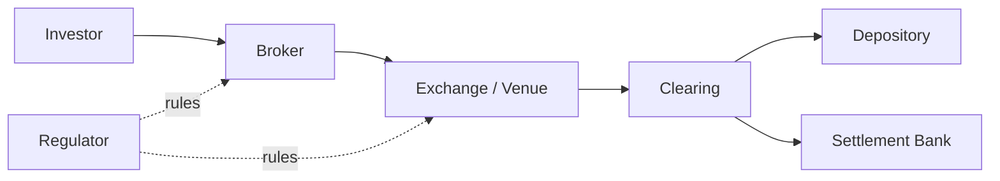

# Bài 04 — Thị trường chứng khoán: từ doanh nghiệp cần vốn đến nhà đầu tư giao dịch

<div class="lesson-meta">
  <span><strong>Track</strong> Economics & Finance</span>
  <span><strong>Mức độ</strong> Foundation</span>
  <span><strong>Mục tiêu</strong> Hiểu market structure và lifecycle của securities</span>
</div>

Một app chứng khoán chỉ là lớp ngoài cùng. Phía sau một nút BUY là issuer, broker, exchange, clearing, depository, bank và regulator cùng tham gia.

<div class="learning-objectives">
<strong>Sau bài này bạn phải giải thích được:</strong>

- primary vs secondary market;
- equity, bond, fund, derivative khác nhau ở economic claim nào;
- broker, exchange, depository, custodian, settlement bank có vai trò gì;
- order khác execution/trade/settlement thế nào;
- market, instrument, account và position nên được model tách biệt ra sao.
</div>

## 1. Vì sao securities market tồn tại?

```text
Capital Surplus Units
        ↓
      Market
        ↓
Capital Deficit Units
```

Doanh nghiệp/chính phủ cần vốn; investor cần nơi allocate capital và nhận return.

## 2. Primary Market

Primary market là nơi security được phát hành lần đầu hoặc phát hành thêm.

Ví dụ:

```text
Issuer
→ offering
→ investor subscribes
→ capital goes to issuer
```

## 3. Secondary Market

Sau phát hành, investor giao dịch với nhau.

```text
Investor A sells
↔ Exchange / Market
Investor B buys
```

Issuer thường không nhận tiền từ từng secondary trade.

## 4. Equity

Cổ phiếu đại diện residual ownership claim.

Investor quan tâm:

- earnings;
- dividends;
- voting/governance;
- growth;
- liquidation priority thấp hơn debt.

## 5. Bond

Bond là contractual debt claim.

Core terms:

```text
Face Value
Coupon
Coupon Schedule
Maturity
Yield
Credit Risk
Accrued Interest
```

## 6. Fund Certificate

Investor sở hữu units của fund, không trực tiếp sở hữu từng asset trong portfolio fund theo nghĩa operational.

Core concepts:

```text
NAV
NAV per Unit
Subscription
Redemption
Cut-off
Pricing Date
Settlement
```

## 7. Derivative

Derivative value phụ thuộc underlying/reference.

```text
Futures
Options
Forwards
Swaps
```

Ở brokerage engineering, derivatives kéo theo position, margin, mark-to-market và liquidation.

## 8. Participants

```text
Investor
Broker / Securities Company
Exchange / Trading Venue
Clearing / Depository Infrastructure
Custodian
Settlement Bank
Regulator
Issuer
Market Maker / Liquidity Provider
```

Mỗi actor có authority và obligation khác nhau.

## 9. Account model

Đừng chỉ có `UserAccount`.

Một platform có thể phải phân biệt:

```text
Customer
Trading Account
Cash Account
Securities Account
Margin Account
Derivatives Account
Custody Account
```

Tên thực tế phụ thuộc business/legal model.

## 10. Order ≠ Execution ≠ Trade ≠ Settlement

```text
Order      = intention
Execution  = một lần khớp
Trade      = business transaction formed from execution
Settlement = transfer of cash/securities obligations
```

Một order có thể có nhiều executions.

## 11. Position

Position trả lời:

> account hiện có exposure/holding gì?

Không đồng nghĩa sellable quantity.

```text
Total Position
Settled
Pending Buy
Pending Sell
Reserved
Blocked
Sellable
```

## 12. Market Session

Trading rules phụ thuộc session:

```text
Pre-open
Opening Auction
Continuous Trading
Closing Auction
After-hours / Other sessions
```

Backend phải model `BusinessDate`, `TradingSession`, timezone và calendar.

## 13. Reference Data

Security master cần tối thiểu:

```text
InstrumentId
Symbol
Venue
Board
Currency
InstrumentType
Lot/Tick Rules
Trading Status
Effective Dates
```

## 14. Market Infrastructure Map



## 15. Front-office / Middle-office / Back-office mental model

```text
Front Office
→ client/order/trading

Middle Office
→ risk/control/reconciliation

Back Office
→ settlement/accounting/corporate actions/reporting
```

Không phải tổ chức nào cũng chia đúng ba khối này nhưng mental model hữu ích.

## 16. Common mistakes

- model Order = Trade;
- chỉ lưu balance/position hiện tại không có history;
- không lưu external IDs;
- dùng Symbol làm immutable identity;
- bỏ qua business calendar;
- coi FILLED là lifecycle kết thúc.

<div class="key-takeaway">
<strong>Takeaway</strong>

Securities market là **một chuỗi ownership + obligations + state transitions**, không chỉ là bảng giá và API đặt lệnh.
</div>

## Checklist

- [ ] Primary vs secondary market.
- [ ] Equity/bond/fund/derivative khác nhau.
- [ ] Vai trò broker/exchange/VSDC/bank.
- [ ] Order/Execution/Trade/Settlement tách biệt.
- [ ] Position khác SellableQty.
- [ ] Instrument/account/session model rõ.

## Bài tập

1. Vẽ lifecycle một equity BUY từ investor đến settlement.
2. So sánh entity model Equity/Bond/Fund/Derivative.
3. Thiết kế `SecurityMaster` có effective-dated rules.
4. Giải thích vì sao một customer có thể cần nhiều account types.

## Đọc tiếp

Tiếp theo: [Bài 05 — Phân tích đầu tư](../05-investment-analysis/).