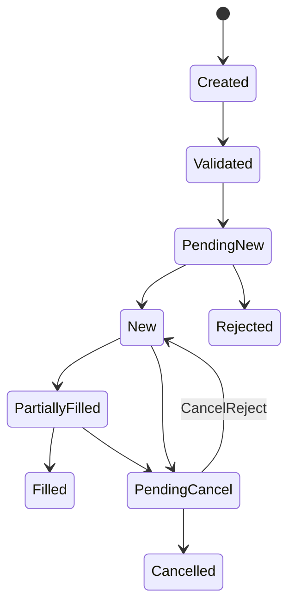

# Bài 06 — Order Lifecycle, Order Book và Matching Engine

Đây là bài chuyển từ “người dùng app chứng khoán” sang “engineer hiểu trading core”. Câu hỏi trung tâm:

> Khi khách bấm BUY, hệ thống thực sự làm những gì trước, trong và sau khi khớp?

## 1. Order không phải Trade

```text
Order      = ý định mua/bán
Execution  = một lần khớp một phần/toàn bộ order
Trade      = giao dịch hình thành từ execution
Settlement = chuyển giao money/securities sau trade
```

Ví dụ:

```text
BUY 10,000 FPT @ 120,000
  ├── Execution #1: 2,000 @ 119,900
  ├── Execution #2: 3,000 @ 120,000
  └── Execution #3: 5,000 @ 120,000
```

Invariant:

```text
CumQty + LeavesQty = OrderQty
CumQty không bao giờ giảm
LeavesQty không âm
Một ExecID không được book hai lần
```

## 2. Pre-trade

Trước khi gửi lệnh ra thị trường:

```text
Authentication
   ↓
Account Status
   ↓
Market / Session Validation
   ↓
Instrument / Price / Lot Validation
   ↓
Buying Power / Sellable Quantity
   ↓
Risk Limits
   ↓
Reserve Cash / Securities
   ↓
Submit to OMS
```

Ví dụ BUY:

```text
Available Cash = 200m
Order Value    = 120m
Estimated Fee  = 0.2m
Required       = 120.2m
```

Không nên `Balance -= 120.2m` ngay. Mental model tốt hơn:

```text
Available ↓
Reserved  ↑
```

Sau execution/cancel/reject, reservation được consume/release theo state.

## 3. Order State Machine

Một model tối thiểu:



Tên trạng thái production phụ thuộc protocol/exchange, nhưng tư duy state machine là bắt buộc.

## 4. Order Book

```text
ASK / SELL
Price      Qty
121.0      2,000
120.5      1,500
120.0      3,000  ← best ask
-----------------
119.9      2,500  ← best bid
119.5      4,000
119.0      1,000
BID / BUY
```

Các khái niệm:

- best bid;
- best ask;
- spread;
- depth;
- liquidity;
- market impact.

## 5. Price–Time Priority

Mental model phổ biến:

1. giá tốt hơn được ưu tiên;
2. cùng giá thì thời gian vào sổ sớm hơn được ưu tiên.

Ví dụ SELL:

```text
A: 1,000 @ 120.0, 09:10
B: 1,000 @ 120.0, 09:11
```

Nếu có BUY match với mức 120, A đi trước B theo time priority.

> Quy tắc chi tiết luôn phải đọc rulebook/spec của đúng market; không hard-code assumption toàn cầu.

## 6. Continuous vs Periodic Auction

### Continuous matching
Order được xem xét khớp khi vào book.

### Periodic auction
Tập hợp order trong một khoảng và xác định mức giá theo rule của auction.

System phải biết `TradingSession`, vì cùng một order type có thể hợp lệ ở session này nhưng không ở session khác.

## 7. Partial Fill

Ví dụ order BUY 10,000 nhưng book chỉ có 5,000 phù hợp:

```text
OrderQty  = 10,000
CumQty    = 5,000
LeavesQty = 5,000
Status    = PARTIALLY_FILLED
```

Không được release toàn bộ reservation khi partial fill; phải consume phần đã fill và giữ/recalculate phần còn working.

## 8. Cancel và Replace

Đừng implement sửa lệnh bằng:

```sql
UPDATE orders SET price = ...
```

Cancel/replace là một **business operation có lifecycle**:

```text
Original Order
   ↓
Cancel/Replace Request
   ↓
Exchange Accept / Reject
   ↓
New effective state
```

Trong race condition, execution có thể đến trong lúc cancel đang pending. Vì vậy cần define rõ state transition và quantities sau mỗi event.

## 9. Unknown State — bài toán khó nhất

```text
Broker sends order
      ↓
Network timeout
```

Timeout không chứng minh exchange chưa nhận order.

Có hai thế giới đều hợp lý:

```text
A. packet chưa tới exchange
B. exchange đã accept, response bị mất
```

Nếu resend mù quáng, có thể double order. Vì vậy cần idempotency/business identifiers, protocol recovery và reconciliation.

## 10. Domain Model gợi ý

```text
Order
├── ClientOrderId
├── InternalOrderId
├── ExchangeOrderId?
├── Account
├── Instrument
├── Side
├── Type
├── Price
├── OrderQty
├── CumQty
├── LeavesQty
└── Status

Execution
├── ExecId
├── OrderId
├── LastQty
├── LastPx
└── ExecTime
```

## Checklist production

- [ ] Order ≠ Execution ≠ Trade.
- [ ] Có state machine rõ ràng.
- [ ] Reservation đi theo lifecycle.
- [ ] Partial fill đúng quantities.
- [ ] Cancel/replace xử lý race với fill.
- [ ] Duplicate execution không gây double booking.
- [ ] Timeout không bị coi mặc định là failure.
- [ ] Có reconciliation với exchange.

## Bài tập

Mô phỏng 1 order BUY 10,000; fill 2,000; user cancel; trong lúc cancel pending nhận thêm fill 3,000; sau đó cancel accepted. Viết bảng state cho `CumQty`, `LeavesQty`, `ReservedCash`, `OrderStatus` sau từng event.