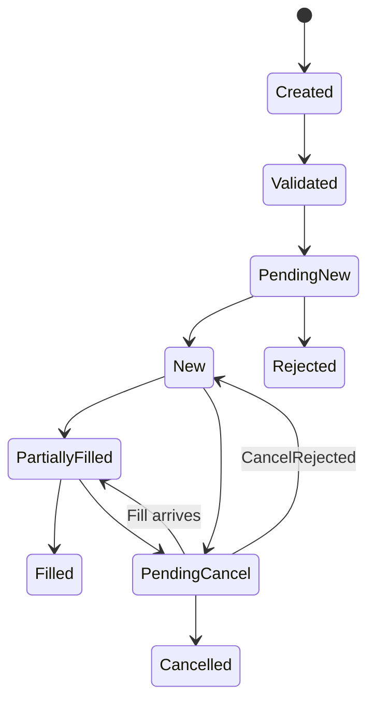

# Bài 06 — Order Lifecycle & Matching: khi khách bấm BUY, chuyện gì thực sự xảy ra?

<div class="lesson-meta">
  <span><strong>Track</strong> Market & Brokerage Core</span>
  <span><strong>Mức độ</strong> Core</span>
  <span><strong>Mục tiêu</strong> Hiểu order lifecycle, matching và các invariant đầu tiên của trading core</span>
</div>

`POST /orders` chỉ là điểm bắt đầu. Một lệnh thực sự đi qua validation, reservation, routing, exchange acknowledgement, executions, cancel/replace và cuối cùng mới tới trade/post-trade.

<div class="learning-objectives">
<strong>Sau bài này bạn phải giải thích được:</strong>

- Order khác Execution và Trade;
- price-time priority;
- partial fill ảnh hưởng quantities/reservation ra sao;
- cancel/replace vì sao là lifecycle chứ không phải SQL UPDATE;
- timeout khi submit vì sao tạo UNKNOWN outcome;
- invariant nào OMS phải bảo vệ.
</div>

## 1. Order không phải Trade

```text
Order      = ý định mua/bán
Execution  = một lần khớp
Trade      = business transaction hình thành từ execution
Settlement = chuyển giao obligations sau trade
```

Ví dụ:

```text
BUY 10,000 FPT @ 120,000
  ├─ Exec 1: 2,000 @ 119,900
  ├─ Exec 2: 3,000 @ 120,000
  └─ Exec 3: 5,000 @ 120,000
```

## 2. Invariant số lượng

```text
CumQty + LeavesQty = OrderQty
CumQty >= 0
LeavesQty >= 0
CumQty không giảm
Một ExecId không apply business effect hai lần
```

## 3. Pre-trade Flow

```text
Authenticate
→ Account Status
→ Market / Session
→ Instrument Rules
→ Price / Qty Validation
→ Buying Power / Sellable Qty
→ Risk Limits
→ Reserve Cash / Securities
→ Create / Submit Order
```

## 4. Reservation

BUY không nên trừ settled cash ngay.

```text
Available ↓
Reserved  ↑
```

SELL tương tự với securities reservation.

## 5. Order State Machine



## 6. Order Book

```text
ASK
121.0  2,000
120.5  1,500
120.0  3,000 ← best ask
--------------
119.9  2,500 ← best bid
119.5  4,000
119.0  1,000
BID
```

## 7. Spread và Depth

```text
Spread = Best Ask - Best Bid
```

Depth cho biết quantity sẵn có tại nhiều price levels.

## 8. Price-Time Priority

Price tốt hơn trước; cùng price thì timestamp/priority rule của venue quyết định theo market-specific specification.

Không hard-code global assumptions nếu rulebook thị trường khác.

## 9. Continuous vs Auction

Continuous: order được xem xét khi vào book.

Auction: tập hợp order rồi xác định clearing/matching price theo rule.

Trading session vì vậy là domain state.

## 10. Partial Fill

```text
OrderQty  = 10,000
CumQty    = 5,000
LeavesQty = 5,000
Status    = PARTIALLY_FILLED
```

Reservation phải consume phần executed và giữ/recalculate phần còn working.

## 11. Cancel Race

```text
NEW
→ Cancel Requested
→ Execution arrives
→ Cancel Accepted
```

Fill có thể hợp lệ trong lúc cancel pending. OMS phải process theo authoritative ordering/protocol semantics.

## 12. Replace

Không làm:

```sql
UPDATE orders SET price = @newPrice;
```

Mental model:

```text
Original Order
→ Replace Request
→ Venue Accept/Reject
→ effective order state
```

## 13. Unknown Outcome

```text
Broker sends order
→ network timeout
```

Hai thế giới đều có thể đúng:

```text
A. Venue chưa nhận
B. Venue đã nhận, response bị mất
```

`timeout != failed`.

## 14. Idempotency

Client retry cùng `ClientOrderId` không được tạo hai business orders ngoài ý muốn.

Cần stable identity + conflict rule nếu cùng idempotency key nhưng payload khác.

## 15. Persistence Model

Một model tối thiểu:

```text
Order
OrderCommand/Request
Execution
Trade
Reservation
ExternalIds
StateTransitionHistory
```

Không cần full event sourcing, nhưng phải có audit đủ để giải thích transition.

## 16. Observability

Business metrics:

```text
submit latency
venue ack latency
reject rate
partial-fill aging
pending cancel age
unknown orders
reservation leaks
duplicate executions
```

## 17. Common mistakes

- Order == Trade;
- cancel = SQL update;
- timeout = failed;
- retry without idempotency;
- release reservation quá sớm;
- dùng read model stale để bảo vệ critical invariant.

<div class="key-takeaway">
<strong>Takeaway</strong>

Trading core là **state machine + resource reservation + external authority**. API chỉ là lớp vào.
</div>

## Checklist

- [ ] Order/Execution/Trade tách biệt.
- [ ] Quantity invariant rõ.
- [ ] Reservation lifecycle rõ.
- [ ] Cancel/replace race có test.
- [ ] Unknown outcome explicit.
- [ ] Duplicate không double effect.

## Bài tập

1. Implement state machine với partial fill + cancel race.
2. Simulate two concurrent BUY orders dùng cùng cash pool.
3. Inject timeout sau outbound submit và thiết kế recovery path.
4. Viết property test cho `CumQty + LeavesQty = OrderQty`.

## Đọc tiếp

Tiếp theo: [Bài 07 — KRX / FIX / VSDC](../07-clearing-settlement-krx-fix-vsdc/).