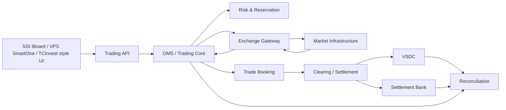

# Bài 07 — KRX / FIX / VSDC: một lệnh trên SSI, VPS hoặc TCBS đi đâu sau khi bấm “Đặt lệnh”?

<div class="lesson-meta">
  <span><strong>Track</strong> Market & Brokerage Core</span>
  <span><strong>Mức độ</strong> Core</span>
  <span><strong>Ví dụ xuyên suốt</strong> BUY 1.000 FPT @ 120.000</span>
</div>

Nếu đang dùng **SSI iBoard**, **VPS SmartOne** hoặc **TCInvest**, thứ nhà đầu tư nhìn thấy thường rất đơn giản:

```text
Chọn mã FPT
→ chọn Mua
→ nhập giá
→ nhập khối lượng
→ xác nhận
→ xem Sổ lệnh / Trạng thái lệnh
```

Nhưng phía sau nút **Xác nhận** là nhiều hệ thống có trách nhiệm hoàn toàn khác nhau:

```text
Investor App
   ↓
Broker Trading API
   ↓
OMS + Risk + Cash/Securities Reservation
   ↓
Exchange Gateway
   ↓
Market / Matching Infrastructure
   ↓
Execution / Fill
   ↓
Trade Booking
   ↓
Clearing
   ↓
Settlement
   ↓
VSDC + Settlement Bank
   ↓
Reconciliation
```

Bài này không giả định bạn đã biết `OMS`, `FIX`, `KRX`, `VSDC`, `DVP`, `netting`, `ExecutionReport` hay `T+2`. Mỗi thuật ngữ sẽ được giải thích trước khi dùng.

> **Lưu ý về SSI/VPS/TCBS:** các tài liệu công khai cho thấy trải nghiệm người dùng và chức năng của nền tảng. Chúng ta dùng chúng để minh họa **business lifecycle chung**. Tài liệu này **không khẳng định architecture nội bộ, FIX engine, message dictionary hay topology production riêng của SSI, VPS hoặc TCBS**, vì các chi tiết đó không được suy ra từ UI công khai.

<div class="callout">
<strong>Broker UI authenticated (🟢 19/08/2026)</strong><br/>
Trên SSI iBoard, sau đăng nhập người dùng vẫn thấy cùng nút <em>Đặt lệnh</em> cạnh bảng giá và <em>Sổ lệnh</em> trong menu — đó là command + read model, không phải bằng chứng SSI dùng FIX session nào. Trên VPS SmartOne, wording <em>chờ khớp tại VPS</em> vs <em>chờ khớp tại sàn</em> (guide + label SPA) minh họa Broker Accepted ≠ Market Accepted. Bài này giải thích infrastructure <em>chung</em> sau nút Đặt lệnh; không mô tả backend riêng của từng CTCK.
</div>

<div class="learning-objectives">
<strong>Sau bài này bạn phải giải thích được:</strong>

- SSI iBoard, VPS SmartOne hoặc TCInvest đang che giấu những bước backend nào sau nút Đặt lệnh;
- Broker Core, OMS, Exchange Gateway, KRX, FIX 4.4 và VSDC khác nhau thế nào;
- Order, ACK, Execution/Fill và Trade khác nhau ra sao;
- FIX Application Layer khác FIX Session Layer;
- `MsgSeqNum`, `Heartbeat`, `ResendRequest`, `PossDup` giải quyết vấn đề gì;
- timeout vì sao không đồng nghĩa thất bại;
- Clearing khác Settlement;
- Netting và Settlement Obligation là gì;
- T+2 nghĩa là gì;
- DVP giảm principal risk ra sao;
- VSDC và settlement bank nằm ở đâu trong post-trade;
- reconciliation dùng để chứng minh broker state khớp external reality thế nào.
</div>

## 1. Trước hết: nhìn từ ba app thật

### 1.1 SSI iBoard — người dùng thấy gì?

Theo hướng dẫn chính thức của SSI, flow giao dịch chứng khoán cơ sở trên iBoard Web có dạng:

```text
Đăng nhập iBoard
→ Đặt lệnh
→ nhập Mã CK / Loại lệnh / Khối lượng / Giá
→ Mua hoặc Bán
→ xác thực
→ Xác nhận
→ mở Sổ lệnh
→ theo dõi / Sửa / Hủy lệnh chờ khớp
```

Nguồn: [SSI — Giao dịch chứng khoán trên iBoard Web](https://www.ssi.com.vn/khach-hang-ca-nhan/giao-dich-chung-khoan-ib-web).

SSI cũng công khai **Fast Connect API** như dịch vụ tích hợp để nhận market information và/hoặc chuyển lệnh vào hệ thống SSI. Đây là ví dụ dễ thấy rằng UI chỉ là một trong nhiều channel đi vào trading platform. Nguồn: [SSI — iBoard Web](https://www.ssi.com.vn/khach-hang-ca-nhan/nen-tang-giao-dich/nen-tang-giao-dich-web-trading/iboard-web).

Backend mental model:

```text
SSI iBoard UI
   ↓
Authenticated Trading Request
   ↓
Internal Trading / Order Platform
   ↓
Market Connectivity
```

**Sổ lệnh** trên UI là projection dễ đọc cho khách hàng. Nó không có nghĩa toàn bộ business state chỉ nằm trong một bảng tên `Orders`.

### 1.2 VPS SmartOne — trạng thái UI giúp ta hiểu lifecycle backend

Tài liệu hướng dẫn chính thức của VPS mô tả các trạng thái rất hữu ích cho người học core securities:

```text
Đang chờ khớp tại VPS
→ Đang chờ khớp tại sàn
→ Khớp 1 phần
→ Khớp hoàn toàn
```

Nguồn: [VPS SmartOne — Hướng dẫn sử dụng](https://smartone.vps.com.vn/vi-VN/Home/BriefUserGuide).

Đây là ví dụ tuyệt vời để hiểu rằng:

```text
"broker đã nhận request"
≠
"market đã nhận order"
≠
"order đã được matching"
≠
"order đã khớp toàn bộ"
```

Ta có thể map **ở mức khái niệm**, không phải khẳng định tên internal state của VPS:

| VPS UI wording | Mental model backend |
|---|---|
| Chờ khớp tại VPS | broker/internal processing chưa hoàn tất market handoff |
| Chờ khớp tại sàn | order đã tới market lifecycle và đang working |
| Khớp 1 phần | có một hoặc nhiều execution nhưng `LeavesQty > 0` |
| Khớp hoàn toàn | `CumQty = OrderQty`, `LeavesQty = 0` |

### 1.3 TCInvest — tại sao đặt đúng giá vẫn có thể chưa khớp?

TCBS công khai rằng khách hàng có thể đặt lệnh cổ phiếu tại **TCInvest**, sửa/hủy lệnh chưa khớp trong **Sổ lệnh cổ phiếu**, và giải thích rằng lệnh được khớp theo **ưu tiên giá và thời gian**. Do đó, đặt ở mức giá đang thấy trên bảng chưa đảm bảo mình đứng đầu queue nếu đã có nhiều lệnh cùng giá vào trước.

Nguồn: [TCBS Help — Cổ phiếu](https://help.tcbs.com.vn/hoi-nhanh-dap-hay/co-phieu/?Display_FAQ=40327).

Ví dụ:

```text
Best Sell = 120.000

10:00:00  Sell 500 @ 120.000   ← vào trước
10:00:01  Sell 700 @ 120.000
10:00:02  BUY của bạn ở giá phù hợp
```

Matching phụ thuộc rule của phiên/loại lệnh/market và quantity đối ứng, không phải chỉ một phép so sánh `buyPrice >= sellPrice`.

TCInvest còn hỗ trợ lô lẻ 1–99 tại giao diện đặt lệnh cổ phiếu, với rule riêng cho lô lẻ. Đây là ví dụ cho một nguyên tắc engineering quan trọng:

> **Market rules phải là domain/reference configuration; đừng giả định mọi order đều cùng lot size và cùng matching context.**

Nguồn: [TCBS Help — Giao dịch lô lẻ trên TCInvest](https://help.tcbs.com.vn/ufaq/huong-dan-giao-dich-lo-le-tren-tcinvest/).

## 2. Một bảng map UI → backend để nhớ

| Người dùng nhìn thấy | Backend phải giải quyết |
|---|---|
| Sức mua | cash, credit, reservation, risk rules |
| Đặt lệnh | validation + idempotency + OMS state |
| Chờ xử lý | internal workflow/gateway handoff |
| Chờ khớp | market order working state |
| Khớp một phần | execution booking + remaining quantity |
| Khớp hết | order terminal state về matching, nhưng chưa chắc settlement xong |
| Sửa/Hủy | cancel/replace lifecycle + race với execution |
| Danh mục | position projection từ trade/settlement/ledger facts |
| Tiền chờ về | pending settlement receivable |
| Lịch sử lệnh | audit/read model, không nhất thiết source of truth duy nhất |

<div class="key-takeaway">
<strong>Điểm đầu tiên cần nhớ:</strong>

App như SSI iBoard, VPS SmartOne hay TCInvest là **front door**. Nghiệp vụ thật nằm ở lifecycle của Order, Execution, Trade, Cash, Securities và Settlement phía sau.
</div>

## 3. Từ điển thuật ngữ — đọc trước khi đi tiếp

| Thuật ngữ | Giải thích dễ hiểu | Ví dụ |
|---|---|---|
| **Investor** | Nhà đầu tư đặt lệnh | Khách BUY FPT |
| **Broker / CTCK** | Công ty chứng khoán làm trung gian, quản lý account/order và kết nối hạ tầng thị trường | SSI, VPS, TCBS là các CTCK |
| **Trading Core** | Nghiệp vụ lõi quản lý account, cash, position, order, risk | kiểm tra sức mua |
| **OMS** | Order Management System — hệ thống quản lý vòng đời lệnh | NEW → PARTIAL → FILLED |
| **Order** | Ý định mua/bán | BUY 1.000 FPT @ 120.000 |
| **Exchange / Venue** | Nơi order tham gia cơ chế giao dịch/matching | HOSE/HNX tùy instrument |
| **Matching Engine** | Hệ thống ghép lệnh theo rule thị trường | BUY gặp SELL phù hợp |
| **Exchange Gateway** | Cầu nối kỹ thuật từ broker core sang external market interface | mapping, session, network |
| **KRX** | Nhà cung cấp/nền tảng công nghệ cho hệ thống CNTT mới của thị trường chứng khoán Việt Nam | hệ thống mới vận hành từ 05/05/2025 |
| **FIX** | Financial Information eXchange — standard message tài chính | NewOrderSingle, ExecutionReport |
| **FIX Session** | Phiên liên lạc FIX quản lý logon, heartbeat, sequence, replay | `MsgSeqNum` |
| **ACK** | Xác nhận một bước đã được tiếp nhận/xử lý | accepted/new, chưa chắc fill |
| **Execution / Fill** | Một lần order được khớp | 300 FPT @ 119.900 |
| **Trade** | Business transaction được book từ execution hợp lệ | Trade T001 |
| **Trade Booking** | Ghi execution vào hệ thống như một business effect | create trade + pending ledger effects |
| **Clearing** | Tính nghĩa vụ phải giao/nhận | phải trả bao nhiêu tiền, nhận bao nhiêu CK |
| **Netting** | Bù trừ nghĩa vụ đối ứng để còn nghĩa vụ ròng | trả 120m, nhận 30m → net trả 90m |
| **Obligation** | Nghĩa vụ còn phải hoàn thành | cash payable, securities receivable |
| **Settlement** | Thực hiện chuyển tiền/chứng khoán | cash leg + securities leg |
| **DVP** | Delivery versus Payment — gắn giao chứng khoán với thanh toán tiền | giảm principal risk |
| **VSDC** | Tổng công ty Lưu ký và Bù trừ Chứng khoán Việt Nam | post-trade/depository/clearing-settlement functions |
| **Settlement Bank** | Ngân hàng xử lý chân tiền settlement theo arrangement của thị trường | cash leg |
| **T+2** | Ngày thanh toán thứ hai sau trade date theo business calendar/rule | cổ phiếu thuộc nhóm T+2 hiện hành |
| **Reconciliation** | Đối chiếu internal state với external evidence | broker trade ↔ external trade result |
| **Idempotency** | retry/duplicate không tạo effect lần hai | ExecID E001 replay vẫn book 1 lần |
| **Unknown Outcome** | timeout khiến chưa biết success/failure | gửi order rồi mất response |

## 4. KRX, FIX và VSDC — ba thứ hoàn toàn khác nhau

```text
KRX
= bối cảnh/nền tảng công nghệ market infrastructure

FIX
= standard/protocol message tài chính

VSDC
= tổ chức/hạ tầng post-trade của Việt Nam

Broker Core
= hệ thống nội bộ của công ty chứng khoán
```

### 4.1 KRX trong bối cảnh Việt Nam

Hệ thống CNTT mới của thị trường chứng khoán Việt Nam do nhà thầu KRX cung cấp được đưa vào vận hành từ **05/05/2025**. VSDC cũng ghi nhận mốc vận hành hệ thống KRX từ ngày này.

Nguồn:

- [VSDC — Lịch sử hoạt động](https://web.vsd.vn/vi/ads/qAvcirUlO9cfJnF4OqtNOg)
- [VSDC — triển khai hệ thống CNTT mới từ 05/05/2025](https://vsd.vn/vi/ad/182429)

Điều **không được suy luận**:

```text
KRX go-live
≠ tất cả feature tiềm năng tự động được bật
≠ tất cả production interface là vanilla FIX 4.4
≠ cài một open-source FIX library là kết nối production được
```

Actual member connectivity phụ thuộc specification, message dictionary, business rules, network, certificate, testing và certification của đúng interface.

## 5. Case xuyên suốt — BUY 1.000 FPT @ 120.000

Giả sử nhà đầu tư trên một trong các app có:

```text
Available Cash = 200.000.000 VND
```

Khách nhập:

```text
Symbol      = FPT
Side        = BUY
Quantity    = 1.000
Limit Price = 120.000 VND
```

Notional tối đa:

```text
1.000 × 120.000
= 120.000.000 VND
```

Giả sử broker cần một fee buffer minh họa `180.000`:

```text
Required Cash ≈ 120.180.000
```

> Fee chỉ dùng để minh họa calculation flow; không phải biểu phí của SSI, VPS hay TCBS.

### Bước 1 — App gửi request

Ví dụ API mang tính minh họa:

```http
POST /orders
Content-Type: application/json
Idempotency-Key: C-20260818-0001

{
  "accountId": "A123",
  "symbol": "FPT",
  "side": "BUY",
  "quantity": 1000,
  "limitPrice": 120000
}
```

### Bước 2 — Broker kiểm tra trước giao dịch

```text
Account active?
Customer authenticated?
Trading session open?
Instrument tradable?
Price/tick valid?
Quantity/lot valid?
Buying Power đủ?
Risk limit đủ?
Duplicate request?
```

### Bước 3 — Reservation

**Reservation = giữ tạm tiền** để cùng một khoản tiền không bị dùng cho nhiều working orders.

```text
Before
Available = 200.000.000
Reserved  = 0

After
Available ≈ 79.820.000
Reserved  ≈ 120.180.000
```

Đây chưa phải tiền đã chuyển ra settlement bank.

### Bước 4 — OMS tạo order

```text
OrderId       = O10001
ClientOrderId = C-20260818-0001
Status        = PENDING_NEW
OrderQty      = 1.000
CumQty        = 0
LeavesQty     = 1.000
```

Trong đó:

- `CumQty`: tổng quantity đã khớp;
- `LeavesQty`: quantity còn working (chưa khớp, chưa hủy);
- invariant khi order còn working: `OrderQty = CumQty + LeavesQty + CancelledQty` (nếu model có `CancelledQty`).

Sau partial fill + cancel, `LeavesQty = 0` nhưng **không** có nghĩa `CumQty + LeavesQty = OrderQty` — phần còn lại nằm ở `CancelledQty`.

## 6. Exchange Gateway là gì?

Core muốn nói ngôn ngữ business:

```text
SubmitOrder
CancelOrder
ReplaceOrder
```

External market interface muốn format/protocol riêng.

Do đó cần anti-corruption/mapping boundary:

```text
Trading Core
   ↓ Domain Command
Exchange Adapter
   ↓ Venue-specific mapping
Gateway / Session Engine
   ↓ Wire Protocol
Market Infrastructure
```

Không nên để domain code đầy các tag kiểu:

```text
35=D
54=1
38=1000
44=120000
```

## 7. FIX 4.4 là gì?

**FIX — Financial Information eXchange** là standard message được dùng rộng rãi trong trading systems.

Classic FIX message dùng cặp `tag=value`.

Ví dụ học thuật:

```text
8=FIX.4.4|
35=D|
49=BROKER|
56=VENUE|
34=1001|
11=C-20260818-0001|
55=FPT|
54=1|
38=1000|
40=2|
44=120000|
...
```

Dấu `|` chỉ dùng để dễ đọc; FIX wire format classic thường dùng SOH separator.

| Tag | Tên | Ý nghĩa |
|---:|---|---|
| `8` | BeginString | version FIX |
| `35` | MsgType | loại message |
| `49` | SenderCompID | phía gửi |
| `56` | TargetCompID | phía nhận |
| `34` | MsgSeqNum | sequence number |
| `11` | ClOrdID | client order identity |
| `55` | Symbol | mã CK |
| `54` | Side | buy/sell |
| `38` | OrderQty | quantity |
| `40` | OrdType | order type |
| `44` | Price | giá |

Nguồn chuẩn: [FIX Trading Community — FIX 4.4 Message Summary](https://fiximate.fixtrading.org/legacy/en/FIX.4.4/messages_sorted_by_category.html).

> Đây là **generic FIX example để học**. Không copy rồi giả định gửi trực tiếp vào production KRX.

## 8. FIX có hai lớp: Application và Session

### Application Layer — “business đang làm gì?”

| MsgType | Message | Dễ hiểu |
|---|---|---|
| `D` | NewOrderSingle | gửi order mới |
| `F` | OrderCancelRequest | yêu cầu hủy |
| `G` | OrderCancelReplaceRequest | yêu cầu sửa |
| `8` | ExecutionReport | báo lifecycle/status/fill/reject tùy nội dung |
| `9` | OrderCancelReject | hủy/sửa bị reject |
| `H` | OrderStatusRequest | hỏi trạng thái |

### Session Layer — “hai đầu có đang nói đúng nhịp?”

```text
Logon
Heartbeat
TestRequest
MsgSeqNum
ResendRequest
SequenceReset
Logout
```

Session layer không biết khách đang mua FPT vì sao. Nó bảo vệ continuity/recovery của message stream.

## 9. ACK không phải Fill

Giả sử order được market accept:

```text
BUY 1.000 FPT @ 120.000
        ↓
Order accepted / working
```

Điều đó **không có nghĩa** 1.000 FPT đã khớp.

Sau đó mới có thể có execution:

```text
Exec E001 = 300 @ 119.900
Exec E002 = 200 @ 120.000
Exec E003 = 500 @ 120.000
```

OMS state:

```text
After E001
CumQty    = 300
LeavesQty = 700
Status    = PARTIALLY_FILLED

After E002
CumQty    = 500
LeavesQty = 500
Status    = PARTIALLY_FILLED

After E003
CumQty    = 1.000
LeavesQty = 0
Status    = FILLED
```

Đây chính là lý do trạng thái “khớp một phần” trên các app không phải cosmetic text; nó phản ánh business state thực.

## 10. Order, Execution và Trade

```text
Order
= ý định mua/bán

Execution / Fill
= một lần matching thành công

Trade
= business transaction được booking từ execution hợp lệ
```

Một order có nhiều fills:

```text
Order O10001
├── E001: 300 @ 119.900
├── E002: 200 @ 120.000
└── E003: 500 @ 120.000
```

Không được model:

```text
Order == Trade
```

## 11. Sửa/Hủy trên iBoard, SmartOne, TCInvest thực ra khó ở đâu?

UI cho phép khách nhấn **Hủy** hoặc **Sửa** khi lệnh còn điều kiện cho phép. Nhưng distributed lifecycle có race:

```text
10:00:00.000  Order còn 700
10:00:00.010  User bấm Hủy
10:00:00.015  Market fill thêm 200
10:00:00.020  Cancel request tới market
10:00:00.030  Market cancel phần còn lại 500
```

Final state hợp lý:

```text
CumQty       = 500
CancelledQty = 500
```

Không được giả định:

```text
user bấm Hủy
→ tất cả quantity lập tức biến mất
```

VPS yêu cầu người dùng kiểm tra trạng thái lệnh trước khi hủy; SSI hướng dẫn Sửa/Hủy lệnh chờ khớp; TCInvest cũng cho hủy/sửa lệnh thường chưa khớp trong Sổ lệnh. Ba UI khác nhau nhưng đều dẫn tới cùng bài toán core: **cancel/replace là lifecycle operation, không phải SQL UPDATE tùy ý.**

## 12. FIX sequence — tại sao cần `MsgSeqNum`?

Receiver mong:

```text
100
101
102
103
```

nhưng nhận:

```text
100
101
103
```

→ thiếu `102`.

```text
Expected = 102
Received = 103
        ↓
SEQUENCE GAP
```

FIX có `ResendRequest` để recovery lost/gapped message theo session semantics.

Nguồn: [FIX 4.4 — ResendRequest](https://fiximate.fixtrading.org/legacy/en/FIX.4.4/body_5150.html).

## 13. Heartbeat / TestRequest — TCP connected vẫn chưa đủ

```text
TCP connected
≠ FIX session healthy
≠ trading application ready
≠ market open for order flow
```

`Heartbeat` giúp chứng minh session vẫn sống theo protocol expectation.

`TestRequest` dùng khi một đầu muốn kiểm tra responsiveness của đầu kia.

Production readiness cần nhiều dimension hơn chỉ `socket.IsConnected`.

## 14. FIX session state phải được persist

Một session production thường cần durable state kiểu:

```text
SessionId
SenderCompID
TargetCompID
NextSenderSeqNum
NextTargetSeqNum
LastLogon
Message Store / replay metadata
```

Nếu gateway crash ở sequence 54.200 rồi restart thành `1`, counterparty không đơn giản coi đó là continuation bình thường.

## 15. Resend và duplicate — business vẫn phải tự bảo vệ

Giả sử đã xử lý execution:

```text
ExecID = E001
Qty    = 300
```

Sau recovery, E001 đến lại.

Sai:

```csharp
position.Quantity += execution.Quantity;
```

Đúng về mental model:

```text
Receive E001
   ↓
(Venue, ExecID) đã processed?
   ├─ Yes → không tạo effect mới
   └─ No  → booking + ledger + projection
```

Ví dụ unique business key:

```text
UNIQUE(Venue, ExecID)
```

Đây là lý do **transport sequence correctness không thay thế domain idempotency**.

## 16. `PossDup` là gì?

FIX có semantics để đánh dấu message có thể là retransmission/duplicate, ví dụ `PossDupFlag`.

Dễ hiểu:

> “Message này có khả năng là bản gửi lại trong recovery flow.”

Nhưng application vẫn phải biết business identity thực sự là gì.

## 17. Timeout != Failure — lỗi tư duy nguy hiểm nhất

```text
Broker ───── New Order ─────▶ Market
```

Market nhận order, nhưng response bị mất:

```text
Broker ◀────── X ─────────── Market
```

Broker thấy timeout.

Hai khả năng:

```text
A. Request chưa tới market
B. Market đã nhận nhưng response mất
```

Do đó:

```text
timeout
≠ rejected
≠ safe to create another order blindly
```

Có thể cần state:

```text
PENDING_RECOVERY / UNKNOWN
```

và recovery dựa trên:

```text
stable identity
+ session recovery
+ status/replay flow
+ reconciliation
```

## 18. `FILLED` chưa phải kết thúc

App thường làm người mới có cảm giác:

```text
Khớp hết
→ done
```

Core securities nhìn:

```text
FILLED
   ↓
Trade Booking
   ↓
Clearing
   ↓
Settlement Obligation
   ↓
Cash + Securities Settlement
   ↓
Reconciliation
```

## 19. Trade Booking bằng ví dụ số

Execution đầu tiên:

```text
E001
Qty   = 300 FPT
Price = 119.900
```

Gross amount:

```text
300 × 119.900
= 35.970.000 VND
```

Business trade record minh họa:

```text
TradeId         = T001
OrderId         = O10001
ExecId          = E001
Symbol          = FPT
Qty             = 300
Price           = 119.900
GrossAmount     = 35.970.000
SettlementState = PENDING
```

## 20. Clearing là gì?

**Clearing = tính nghĩa vụ**, chưa phải chuyển tài sản thật.

Câu hỏi:

> Sau hàng nghìn/millions trade, mỗi participant cuối cùng phải trả/nhận bao nhiêu?

Ví dụ toán học:

```text
Broker A phải trả       120m
Broker A được nhận       30m
```

Nếu được net theo rule:

```text
Net Cash Payable
= 120m - 30m
= 90m
```

Securities cũng có thể hình dung:

```text
FPT deliver  = 1.000
FPT receive  =   300
---------------------
Net deliver  =   700
```

**Netting = bù trừ để tính nghĩa vụ ròng.**

> Đây là ví dụ để hiểu khái niệm, không thay thế quy chế bù trừ chi tiết của từng product/account type.

VSDC mô tả bù trừ chứng khoán theo từng mã có cùng ngày thanh toán và thanh toán theo kết quả bù trừ đa phương đối với các nhóm giao dịch phù hợp. Nguồn: [VSDC — Bù trừ và Thanh toán](https://vsd.vn/vi/sd/XAz40d2Q-9j569TvBgLQaQ).

## 21. Settlement Obligation là gì?

Sau clearing:

```text
Cash Payable       = 90.000.000
FPT Receivable     = 700
Settlement Date    = D
Status             = OPEN
```

Đây là **nghĩa vụ phải hoàn thành**, chưa phải proof settlement finished.

## 22. Settlement là gì?

Settlement = thực sự chuyển giao tài sản theo nghĩa vụ.

Hai chân dễ hình dung:

```text
Cash Leg        = chân tiền
Securities Leg  = chân chứng khoán
```

Buyer:

```text
Cash       ↓
Securities ↑
```

Seller:

```text
Cash       ↑
Securities ↓
```

## 23. T+2 — giải thích bằng lịch thực tế

`T` = Trade Date.

Với cổ phiếu, chứng chỉ quỹ và chứng quyền có bảo đảm thuộc nhóm T+2 trong thông tin hiện hành của VSDC. Nguồn: [VSDC — Bù trừ và Thanh toán](https://vsd.vn/vi/sd/XAz40d2Q-9j569TvBgLQaQ).

Giả sử không có holiday:

```text
Monday     = T
Tuesday    = T+1
Wednesday  = T+2 settlement
```

Nhưng production tuyệt đối không dùng:

```csharp
tradeDate.AddDays(2)
```

Vì calendar có:

```text
weekend
holiday
market closure
business day rules
product-specific settlement cycle
```

Ví dụ thực tế: VSDC từng thông báo các giao dịch T+2 ngày 28–29/04/2025 được dời settlement do kỳ nghỉ 30/4–1/5. Điều này cho thấy **settlement calendar là domain rule**, không phải phép cộng ngày. Nguồn: [VSDC — thông báo nghỉ thanh toán 30/4–1/5/2025](https://web.vsd.vn/vi/ad/181872).

## 24. DVP — Delivery versus Payment

Nếu tách hoàn toàn:

```text
08:00 buyer trả tiền
14:00 seller mới giao chứng khoán
```

buyer có khoảng thời gian đã mất cash control nhưng chưa nhận securities.

Đó là **principal risk**.

DVP hướng tới phối hợp delivery và payment:

```text
Securities Delivery
        ↕
      Payment
```

Dễ nhớ:

> “Giao chứng khoán gắn với trả tiền theo settlement mechanism.”

## 25. VSDC là gì?

**VSDC — Vietnam Securities Depository and Clearing Corporation** là Tổng công ty Lưu ký và Bù trừ Chứng khoán Việt Nam, thực hiện các nghiệp vụ post-trade theo phạm vi pháp lý/quy chế như đăng ký, lưu ký, bù trừ, thanh toán, thực hiện quyền và các dịch vụ liên quan.

VSDC công bố các quy chế mới ngày 29/04/2025 để chuẩn bị triển khai hệ thống KRX, trong đó có Quyết định 39/QĐ-HĐTV về hoạt động bù trừ và thanh toán. Nguồn: [VSDC — ban hành quy chế nghiệp vụ chuẩn bị KRX](https://vsd.vn/vi/ad/182410).

Không nên hiểu VSDC là:

```text
"một REST API để broker gọi sau trade"
```

Market infrastructure integration có network/gateway/certificate/operational procedure/specification riêng.

## 26. Settlement Bank nằm ở đâu?

Post-trade cần xử lý cả securities leg và cash leg.

```text
Clearing / Settlement Process
           ↓
     Obligation Results
       ↙          ↘
Securities        Cash
   ↓               ↓
VSDC side      Settlement Bank
```

Broker phải đối chiếu movement của tiền và chứng khoán, không chỉ order status.

## 27. Reconciliation — bằng chứng hệ thống thật sự đúng

Giả sử external evidence nói:

```text
Exec E001 = 300 FPT
```

Internal DB lại có:

```text
Exec E001 applied twice
Position impact = 600 FPT
```

API vẫn chạy 200 OK, nhưng business đã sai.

Reconciliation phải phát hiện break.

Matrix:

```text
Internal Orders      ↔ Market Orders
Internal Executions  ↔ Market Executions/Trades
Internal Trades      ↔ Post-trade Evidence
Internal Cash        ↔ Settlement Bank
Internal Securities  ↔ VSDC/Depository Evidence
Internal Obligations ↔ External Settlement Result
```

Mỗi break nên có:

```text
BreakId
BusinessDate
EntityType
InternalValue
ExternalValue
Difference
Severity
Owner
Status
Resolution
AuditTrail
```

## 28. Từ app trở lại backend — ba case cụ thể

### Case A — SSI iBoard: “Sổ lệnh thấy chờ khớp”

User thấy:

```text
Đã xác nhận lệnh
→ Sổ lệnh
→ lệnh đang chờ
```

Backend questions:

```text
Broker đã accept request?
Order đã route ra market chưa?
Market order id đã có chưa?
Reservation đang giữ bao nhiêu?
Có ACK chưa?
Có execution nào chưa?
```

UI chỉ cần một dòng dễ hiểu; backend phải giữ đủ identity và state để trả lời từng câu trên.

### Case B — VPS SmartOne: “chờ tại VPS” → “chờ tại sàn”

Đây là ví dụ trực quan nhất cho hai boundary:

```text
Client → Broker Boundary
Broker → Market Boundary
```

Nếu service chết ở giữa hai boundary, recovery phải biết order đã qua boundary nào. Không được chỉ lưu `Status = Pending` rồi đoán.

### Case C — TCInvest: “đặt giá đang dư bán nhưng vẫn chưa khớp”

TCBS giải thích nguyên tắc price-time priority.

Backend mental model:

```text
Price Level Queue
120.000:
  Order A @ 10:00:00
  Order B @ 10:00:01
  Order C @ 10:00:02  ← của bạn
```

Nếu liquidity đối ứng chỉ đủ cho A+B, C vẫn chưa fill dù đang cùng price level.

Đây là lý do chart/bảng giá không phải guarantee về fill.

## 29. So sánh ba app — chỉ ở góc nhìn public/user-facing

| Nền tảng | Public user flow hữu ích để học | Core concept minh họa |
|---|---|---|
| **SSI iBoard** | Đặt lệnh → xác thực → Sổ lệnh → Sửa/Hủy | order lifecycle, auth, read model, cancel/replace |
| **VPS SmartOne** | chờ tại VPS → chờ tại sàn → partial/full fill | internal vs market boundary, partial execution |
| **TCInvest** | Đặt lệnh cổ phiếu, Sổ lệnh, price-time priority, odd lot | matching rule, market configuration, queue priority |

TCBS hiện mô tả TCInvest là nền tảng quản lý/giao dịch nhiều loại tài sản với một lần đăng nhập; sản phẩm public bao gồm cổ phiếu, margin, trái phiếu, quỹ, phái sinh và các giải pháp khác. Nguồn: [TCBS — Sản phẩm](https://www.tcbs.com.vn/ca-nhan/san-pham/).

Điều không nên làm:

```text
Nhìn thấy UI giống nhau
→ kết luận architecture SSI = VPS = TCBS
```

Không có cơ sở.

Điều nên học:

```text
Ba UI khác nhau
→ cùng phải giải bài toán business invariants giống nhau:
   identity
   validation
   reservation
   state transition
   execution dedup
   post-trade
   reconciliation
```

## 30. External IDs — thứ cứu bạn khi incident xảy ra

Một hệ thống tốt giữ mapping rõ:

```text
ClientOrderId
InternalOrderId
VenueOrderId
ExecId
TradeId
SettlementInstruction/ObligationId
BatchId
BusinessDate
```

Ví dụ incident:

```text
User báo:
"Lệnh FPT 10:02 của tôi bị treo"
```

Support/ops cần trace:

```text
ClientOrderId
→ InternalOrderId
→ VenueOrderId
→ Execution(s)
→ Trade(s)
→ Settlement
```

Nếu chỉ có một UUID nội bộ không map external IDs, incident investigation rất khó.

## 31. State machine tổng hợp cho case FPT

```text
CLIENT_SUBMITTED
    ↓
VALIDATING
    ↓
RESERVED
    ↓
PENDING_ROUTE
    ↓
WORKING_AT_MARKET
    ↓
PARTIALLY_FILLED
    ↓
FILLED
    ↓
TRADE_BOOKED
    ↓
CLEARING_PENDING
    ↓
SETTLEMENT_PENDING
    ↓
SETTLED
    ↓
RECONCILED
```

Đây là mental model học tập, không phải danh sách status bắt buộc của một CTCK cụ thể.

## 32. Các lỗi thiết kế phổ biến

### Sai 1 — `timeout = failed`

Sai vì external system có thể đã nhận request.

### Sai 2 — `FILLED = settlement done`

Sai vì matching và asset transfer là hai giai đoạn khác nhau.

### Sai 3 — `Order = Trade`

Sai vì một order có thể nhiều executions/trades.

### Sai 4 — retry execution không dedup

Dẫn đến double position/double ledger.

### Sai 5 — `tradeDate.AddDays(2)`

Sai vì settlement dùng business calendar.

### Sai 6 — “support FIX 4.4 = support KRX production”

Sai vì standard protocol không thay thế market-specific contract.

### Sai 7 — chỉ nhìn app UI để suy architecture nội bộ broker

UI là projection/experience layer; internals có thể rất khác.

## 33. Architecture tối thiểu để backend developer hình dung



## 34. Database mental model tối thiểu

```text
orders
order_events
executions
trades
cash_reservations
securities_reservations
cash_ledger
securities_ledger
clearing_obligations
settlement_instructions
settlement_results
reconciliation_breaks
external_id_mappings
```

Không có nghĩa phải tạo đúng 13 bảng này. Mục tiêu là nhìn thấy **các business facts khác nhau**, thay vì nhét tất cả vào `orders`.

## 35. Checklist tự kiểm tra

Sau bài này, nếu tôi hỏi, bạn phải giải thích được bằng lời đơn giản:

- [ ] Khi SSI/VPS/TCBS hiển thị “chờ khớp”, backend có thể đang giữ những state/fact nào?
- [ ] Vì sao VPS “chờ tại VPS” và “chờ tại sàn” là hai boundary khác nhau?
- [ ] Vì sao TCInvest đặt đúng best price vẫn có thể chưa khớp?
- [ ] Order, Execution, Trade khác nhau thế nào?
- [ ] ACK khác Fill thế nào?
- [ ] FIX Session khác FIX Application thế nào?
- [ ] Sequence gap cần recovery ra sao?
- [ ] Duplicate execution chống bằng business identity nào?
- [ ] Clearing khác Settlement thế nào?
- [ ] Netting là gì?
- [ ] T+2 tại sao không dùng `AddDays(2)`?
- [ ] DVP giải quyết rủi ro gì?
- [ ] VSDC nằm ở bước nào?
- [ ] Reconciliation so sánh những gì?

## 36. Bài tập thực hành

### Bài tập 1 — từ VPS UI sang state machine

Dùng các trạng thái public:

```text
Chờ tại VPS
Chờ tại sàn
Khớp một phần
Khớp hoàn toàn
```

Thiết kế internal state machine chi tiết hơn và nêu external evidence cần có cho mỗi transition.

### Bài tập 2 — SSI cancel race

Mô phỏng:

```text
SSI-style user flow:
Order 1.000
→ fill 300
→ user bấm Hủy
→ fill thêm 200 trong lúc cancel pending
→ cancel phần còn lại thành công
```

Final quantity phải là bao nhiêu? Reservation release thế nào?

### Bài tập 3 — TCInvest price-time priority

Order book:

```text
ASK 120.000
A: 400 shares @ 10:00:00
B: 500 shares @ 10:00:01
C: 300 shares @ 10:00:02
```

Một BUY marketable quantity 700 tới. Hãy xác định A/B/C được fill thế nào theo mental model price-time priority.

### Bài tập 4 — duplicate FIX execution

```text
E001 = 300 FPT
```

E001 đến lần đầu, DB commit thành công nhưng ACK nội bộ fail. Sau recovery E001 đến lại. Thiết kế transaction/dedup để trade chỉ book một lần.

### Bài tập 5 — T+2 với holiday

Viết `ISettlementCalendar` thay vì `AddDays(2)` và test weekend + holiday.

## 37. Nguồn đọc chính thức

### Broker platforms

- [SSI iBoard](https://iboard.ssi.com.vn/)
- [SSI — hướng dẫn giao dịch iBoard Web](https://www.ssi.com.vn/khach-hang-ca-nhan/giao-dich-chung-khoan-ib-web)
- [SSI — iBoard Web / Fast Connect API](https://www.ssi.com.vn/khach-hang-ca-nhan/nen-tang-giao-dich/nen-tang-giao-dich-web-trading/iboard-web)
- [VPS SmartOne Web](https://smartoneweb.vps.com.vn/)
- [VPS SmartOne — hướng dẫn sử dụng](https://smartone.vps.com.vn/vi-VN/Home/BriefUserGuide)
- [VPS — hướng dẫn giao dịch chứng khoán cơ sở](https://www.vps.com.vn/bai-viet/huong-dan-giao-dich-chung-khoan-co-so-tai-vpsv)
- [TCBS — hệ sinh thái sản phẩm / TCInvest](https://www.tcbs.com.vn/ca-nhan/san-pham/)
- [TCBS Help — cổ phiếu / Sổ lệnh / price-time priority](https://help.tcbs.com.vn/hoi-nhanh-dap-hay/co-phieu/?Display_FAQ=40327)
- [TCBS Help — giao dịch lô lẻ](https://help.tcbs.com.vn/ufaq/huong-dan-giao-dich-lo-le-tren-tcinvest/)

### Market infrastructure

- [VSDC — lịch sử vận hành KRX](https://web.vsd.vn/vi/ads/qAvcirUlO9cfJnF4OqtNOg)
- [VSDC — Bù trừ và Thanh toán](https://vsd.vn/vi/sd/XAz40d2Q-9j569TvBgLQaQ)
- [VSDC — Quy chế nghiệp vụ chuẩn bị KRX](https://vsd.vn/vi/ad/182410)
- [FIX Trading Community — FIX 4.4 messages](https://fiximate.fixtrading.org/legacy/en/FIX.4.4/messages_sorted_by_category.html)

<div class="key-takeaway">
<strong>Takeaway cuối cùng</strong>

Khi bạn bấm **Mua FPT** trên SSI iBoard, VPS SmartOne hoặc TCInvest, đừng chỉ nghĩ “API tạo Order”. Hãy nghĩ:

```text
UI Command
→ Authentication
→ Validation
→ Reservation
→ OMS State
→ Market Handoff
→ ACK
→ Execution(s)
→ Trade Booking
→ Clearing Obligation
→ Settlement
→ VSDC / Bank Evidence
→ Reconciliation
```

Đó là bước chuyển từ **backend developer biết API** sang **engineer hiểu core securities**.
</div>

## Đọc tiếp

Tiếp theo: [Bài 08 — Account, Cash, Position & Buying Power](../08-account-cash-position-buying-power/).