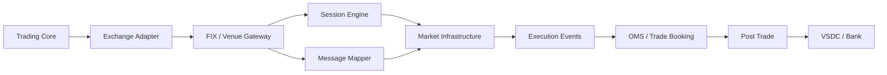

# Bài 07 — Clearing, Settlement, KRX, FIX 4.4 và VSDC

Một engineer chỉ biết REST API đặt lệnh chưa hiểu market infrastructure. Bài này nối toàn bộ vòng đời:

```text
Investor
  ↓
Broker OMS / Risk
  ↓
Exchange Gateway
  ↓
Trading / Matching Infrastructure
  ↓
Execution / Trade
  ↓
Clearing
  ↓
Settlement
  ↓
Depository + Settlement Bank
  ↓
Reconciliation
```

## 1. KRX trong bối cảnh Việt Nam

Hệ thống công nghệ thông tin mới của thị trường chứng khoán Việt Nam do KRX cung cấp đã chính thức go-live ngày **05/05/2025**, kết nối các thành phần như HOSE, HNX, VSDC và thành viên thị trường trên một nền tảng tích hợp.

Nguồn: [Ủy ban Chứng khoán Nhà nước — Chính thức vận hành hệ thống KRX](https://ssc.gov.vn/webcenter/portal/ubck/pages_r/l/chitit?dDocName=APPSSCGOVVN1620154578)

### Distinction quan trọng

```text
KRX        = market technology/infrastructure context
FIX 4.4    = financial messaging protocol standard
VSDC       = depository / clearing / settlement infrastructure
Broker OMS = internal order/risk/accounting system của CTCK
```

Không được suy luận:

```text
"hỗ trợ vanilla FIX 4.4" = "kết nối production KRX hoàn chỉnh"
```

Triển khai thật luôn phải theo **member interface specification, message dictionary, custom field/rule, network/certification requirements** của đúng venue.

## 2. FIX 4.4 — Application Layer

FIX là Financial Information eXchange protocol.

Một số message quan trọng:

| MsgType | Message | Vai trò |
|---|---|---|
| `D` | NewOrderSingle | gửi order mới |
| `F` | OrderCancelRequest | yêu cầu hủy |
| `G` | OrderCancelReplaceRequest | yêu cầu sửa |
| `8` | ExecutionReport | ack/status/fill/reject |
| `9` | OrderCancelReject | từ chối cancel/replace |
| `H` | OrderStatusRequest | hỏi trạng thái |
| `AE` | TradeCaptureReport | trade report |

Nguồn chuẩn: [FIX Trading Community — FIX 4.4 message summary](https://fiximate.fixtrading.org/legacy/en/FIX.4.4/messages_sorted_by_category.html)

### Ví dụ NewOrderSingle

```text
8=FIX.4.4|35=D|49=BROKER|56=VENUE|34=1001|
11=CL-123|55=FPT|54=1|38=1000|40=2|44=120000|...
```

Trong wire format classic FIX, separator thực tế là SOH, ký tự `|` ở đây chỉ để dễ đọc.

Các field cần nhận diện:

```text
8   BeginString
35  MsgType
49  SenderCompID
56  TargetCompID
34  MsgSeqNum
11  ClOrdID
55  Symbol
54  Side
38  OrderQty
40  OrdType
44  Price
```

## 3. ExecutionReport

`ExecutionReport (35=8)` có thể được dùng để xác nhận nhận order, báo status, báo fill hoặc reject theo FIX 4.4.

Nguồn: [FIX 4.4 ExecutionReport](https://fiximate.fixtrading.org/legacy/en/FIX.4.4/body_5756.html)

Quan trọng:

```text
NewOrderSingle  ─────────────▶
                ◀──────────── ExecutionReport: NEW
                ◀──────────── ExecutionReport: PARTIAL_FILL
                ◀──────────── ExecutionReport: FILLED
```

Business core không nên phụ thuộc trực tiếp tag number. Dùng adapter/anti-corruption layer:

```text
Domain Command
SubmitOrder
    ↓
Exchange Adapter
    ↓
FIX Mapper / Venue Mapper
    ↓
Wire Message
```

## 4. FIX Session Layer — phần khó hơn parsing tag

```text
Logon
Logout
Heartbeat
TestRequest
MsgSeqNum
ResendRequest
SequenceReset
PossDupFlag
Session recovery
```

Ví dụ receiver chờ:

```text
100
101
102
```

nhưng nhận:

```text
100
102
```

→ phát hiện sequence gap.

FIX `ResendRequest (35=2)` được dùng để yêu cầu retransmission khi có sequence gap/lost message hoặc trong quá trình initialization.

Nguồn: [FIX 4.4 ResendRequest](https://fiximate.fixtrading.org/legacy/en/FIX.4.4/body_5150.html)

### Session state phải bền vững

```text
FIX Session
├── SenderCompId
├── TargetCompId
├── NextSenderSeqNum
├── NextTargetSeqNum
├── Logon state
└── Message store / replay metadata
```

Restart process không được làm sequence biến mất nếu session contract yêu cầu continuity.

## 5. Timeout != Failure

```text
Broker ── NewOrder ──▶ Venue
Broker ◀── X ───────── Response lost
```

Broker có thể đang ở trạng thái **UNKNOWN**, không phải FAILED.

Reliability cần phối hợp:

- stable business identity (`ClOrdID`, internal id);
- session sequence;
- duplicate semantics;
- status/recovery flow;
- reconciliation.

## 6. Trade xong chưa phải settlement xong

```text
FILLED
  ↓
Trade Booking
  ↓
Clearing
  ↓
Settlement Obligation
  ↓
Money + Securities Transfer
  ↓
Reconciliation
```

## 7. Clearing là gì?

Clearing trả lời:

> Sau các trade, từng thành viên có nghĩa vụ tiền và chứng khoán bao nhiêu?

Có thể có gross obligations rồi netting theo rule thị trường:

```text
Trades
  ↓
Validation / Confirmation
  ↓
Netting
  ↓
Cash Obligation
Securities Obligation
```

Clearing **tính nghĩa vụ**; Settlement **thực hiện chuyển giao**.

## 8. Settlement và DVP

VSDC mô tả cơ chế DVP nhằm giảm principal risk: bên mua nhận chứng khoán gắn với thanh toán tiền, bên bán nhận tiền gắn với chuyển giao chứng khoán.

Nguồn: [VSDC — Bù trừ và Thanh toán](https://vsd.vn/vi/sd/XAz40d2Q-9j569TvBgLQaQ)

Quy chế 39/QĐ-HĐTV năm 2025 quy định ngày thanh toán:

```text
T+1: trái phiếu doanh nghiệp thuộc phạm vi quy chế
T+2: cổ phiếu, chứng chỉ quỹ, chứng quyền có bảo đảm
```

Nguồn tham khảo văn bản: [Quyết định 39/QĐ-HĐTV 2025](https://thuvienphapluat.vn/van-ban/Chung-khoan/Quyet-dinh-39-QD-HDTV-2025-Quy-che-hoat-dong-bu-tru-va-thanh-toan-giao-dich-chung-khoan-655003.aspx)

> Luôn kiểm tra quy chế hiện hành khi triển khai production. Settlement calendar không được viết bằng `tradeDate.AddDays(2)`; phải tính business day/holiday/market calendar.

## 9. VSDC

Mental model:

```text
VSDC
├── Registration / Depository
├── Clearing
├── Settlement
├── Corporate Actions
└── Post-trade services
```

Broker post-trade core phải đối chiếu được state nội bộ với external source.

## 10. Reconciliation

```text
Internal Orders    ↔ Venue Orders
Internal Trades    ↔ Venue Trades
Settlement Book    ↔ VSDC obligations/results
Cash Ledger        ↔ Settlement Bank
Securities Ledger  ↔ Depository position
```

HTTP/FIX ACK không thay thế reconciliation.

## 11. Gateway Architecture



## 12. Production questions phải trả lời được

- FIX process crash thì sequence ở đâu?
- Node B failover có tiếp tục session được không?
- Exchange accepted nhưng response mất thì làm gì?
- Duplicate ExecutionReport có double position không?
- EOD internal trades lệch venue thì workflow nào xử lý?
- Settlement obligation lệch VSDC thì ai là source of truth?
- Business calendar/version thay đổi thì historical settlement được audit thế nào?

## Definition of Done

Bạn chỉ thực sự “biết FIX/KRX/VSDC” khi có thể giải thích **business effect + session recovery + post-trade reconciliation**, chứ không chỉ biết parse message.