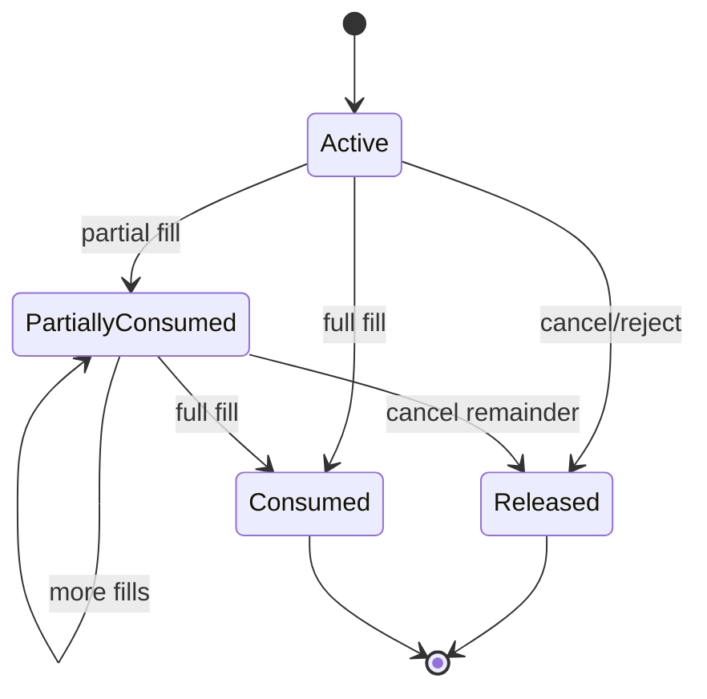
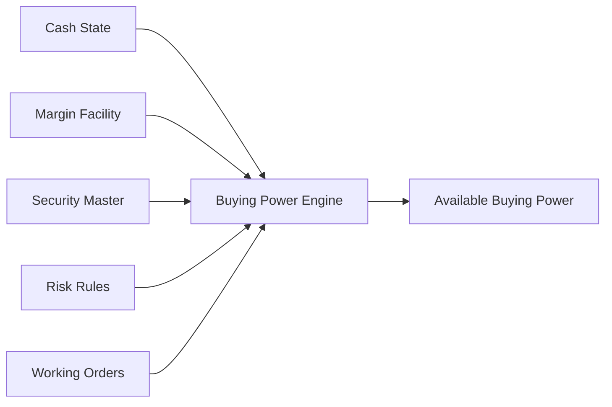

# Bài 08 — Account, Cash, Position và Buying Power

Một trading system không thể chỉ có `Account.Balance` và `Portfolio.Quantity`. Core securities cần phân biệt **quyền sở hữu**, **khả năng sử dụng ngay**, **phần đang bị giữ**, và **phần đang chờ settlement**.

## 1. Bốn câu hỏi khác nhau

```text
Có bao nhiêu tiền?                 → cash balance
Được dùng bao nhiêu để mua?        → buying power
Đang sở hữu bao nhiêu chứng khoán? → position/holding
Được bán bao nhiêu ngay bây giờ?   → sellable quantity
```

Các con số này không nhất thiết bằng nhau.

## 2. Cash không phải một con số

```text
Total Cash
├── Available
├── Reserved for working orders
├── Pending settlement
├── Blocked / restricted
└── Receivable / payable
```

Ví dụ:

```text
Cash ledger balance        500m
Working BUY reservation   -120m
Withdrawal hold            -30m
--------------------------------
Immediately usable         350m
```

`AvailableCash` nên là kết quả của rule/projection rõ ràng, không phải field được sửa tùy ý ở nhiều service.

## 3. Reservation là business entity

Khách gửi `BUY 1,000 FPT @ 120,000`. Nếu policy yêu cầu giữ giá trị order + fee buffer:

```text
CashReservation
-----------------
ReservationId
AccountId
OrderId
ReservedAmount
ConsumedAmount
ReleasedAmount
Status
Version
```



Invariant: `Consumed + Released <= Reserved`, và terminal order không được để reservation bị leak.

## 4. Position cũng có nhiều lớp

```text
Position
├── Settled quantity
├── Pending buy
├── Pending sell
├── Blocked quantity
└── Sellable quantity
```

Không nên suy `SellableQty = TotalQty` vì còn settlement, restriction, pending sell và corporate action.

## 5. Buying Power là policy output

Buying power có thể phụ thuộc available cash, cash receivable policy, margin facility, symbol marginability, haircut, concentration limit, account risk tier, pending orders và fee/tax buffer.



`BuyingPower = Cash` chỉ đúng với mô hình cực kỳ đơn giản.

## 6. Pre-trade check phải bảo vệ race

```text
Available = 100m
Request A BUY 80m
Request B BUY 80m
```

Nếu hai request cùng đọc 100m rồi cùng pass, reserved thành 160m. Vì vậy `validate buying power + create order + reserve resource` cần concurrency control phù hợp: transaction + locking/version, compare-and-swap, serialized aggregate ownership hoặc cơ chế tương đương.

## 7. Partial fill ảnh hưởng reservation

Order `BUY 10,000 @ 100,000`, sau đó fill `2,000 @ 99,500` và `3,000 @ 100,000`. System phải quyết định rõ phần reservation đã consumed, phần tiếp tục giữ cho `LeavesQty`, price improvement giải phóng lúc nào và fee buffer tính lại ra sao.

Đây là policy, không nên rải logic ở controller và consumer.

## 8. Ledger vs Projection

```text
Durable business entries/events
        ↓
Projection
        ↓
Available Cash / Position / Buying Power
```

Ledger giữ lịch sử effect; projection phục vụ query nhanh. Nếu projection sai, phải có khả năng rebuild hoặc reconcile.

## 9. Failure scenarios phải test

- Duplicate order request: cùng `ClientOrderId` không reserve hai lần.
- Crash sau reserve trước ACK: retry không tạo order mới ngoài ý muốn.
- Fill đến trong lúc cancel: không release quá sớm.
- Duplicate execution: không consume reservation và tăng position lần hai.
- Projection lag: pre-trade không dựa read model trễ nếu có thể phá invariant.

## 10. Data ownership

Có thể tách Trading Account, Cash Ledger, Securities Ledger, Reservation, OMS, Risk; nhưng phải chỉ rõ context nào có quyền quyết định `Available`, `Reserved`, `Sellable`.

Nếu ba service tự tính ba công thức khác nhau, production sẽ có reconciliation break liên tục.

## Checklist

- [ ] Cash có available/reserved/pending semantics rõ.
- [ ] Position khác sellable quantity.
- [ ] Buying power là policy có version/effective date khi cần.
- [ ] Reservation có lifecycle và audit.
- [ ] Concurrent orders không overspend/oversell.
- [ ] Partial fill/cancel không leak reservation.
- [ ] Duplicate request/execution không double effect.
- [ ] Projection có source of truth và rebuild/reconcile.

## Bài tập

Thiết kế transaction boundary cho hai request BUY chạy đồng thời trên cùng account. Sau đó thêm margin facility và giải thích invariant nào thay đổi, invariant nào không đổi.
