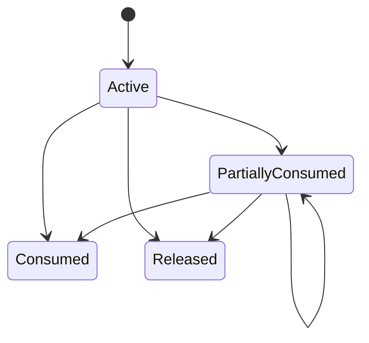

# Bài 08 — Account, Cash, Position & Buying Power: tại sao Balance không đủ?

<div class="lesson-meta"><span><strong>Track</strong> Market & Brokerage Core</span><span><strong>Mức độ</strong> Core</span><span><strong>Mục tiêu</strong> Model đúng usable resources và reservation</span></div>

Một account có 500 triệu không có nghĩa được mua thêm 500 triệu; sở hữu 10.000 cổ phiếu cũng không có nghĩa bán được cả 10.000 ngay lập tức.

<div class="learning-objectives">
<strong>Sau bài này bạn phải giải thích được:</strong>

- cash balance, available cash và buying power khác nhau;
- total position khác sellable quantity;
- reservation là business state chứ không phải temporary cache;
- concurrent orders gây overspend/oversell thế nào;
- ledger và projection phối hợp ra sao.
</div>

## 1. Bốn câu hỏi khác nhau

```text
Có bao nhiêu tiền?                 → cash balance
Dùng được bao nhiêu để mua?        → buying power
Đang sở hữu bao nhiêu?             → position
Bán được bao nhiêu ngay?           → sellable quantity
```

<div class="callout">
<strong>Broker UI (🟢)</strong><br/>
SSI iBoard có <em>Margin - Vay ký quỹ</em> với Tỷ lệ KQ và trạng thái An toàn — sức mua không đồng nghĩa cash. VPS SmartOne có label <em>Sức mua từ tiền mặt</em> tách khỏi sức mua tổng. Guide VPS: CK khả dụng ≠ tổng vị thế; tiền chờ về ≠ settled cash. Số liệu dưới đây là ví dụ tham chiếu, không phải số tài khoản thật.
</div>

## 2. Cash State

```text
Total Cash
├─ Available
├─ Reserved
├─ Pending Receivable
├─ Pending Payable
├─ Blocked
└─ Settled
```

## 3. Reservation Entity

```text
CashReservation
ReservationId
AccountId
OrderId
ReservedAmount
ConsumedAmount
ReleasedAmount
Status
Version
```

Invariant:

```text
Consumed + Released <= Reserved
```

## 4. Reservation Lifecycle



## 5. Position Layers

```text
Settled
Pending Buy
Pending Sell
Reserved Sell
Blocked
Total
Sellable
```

## 6. Buying Power

Buying power có thể phụ thuộc:

```text
Available Cash
+ eligible receivable
+ margin facility
- reservations
- risk haircut
- concentration constraints
- fee buffer
```

## 7. Concurrent BUY Race

```text
Available = 100m
Order A = 80m
Order B = 80m
```

Nếu cả hai read snapshot 100m và pass, reserved = 160m.

Critical invariant cần transaction/lock/version/serialized ownership phù hợp.

## 8. Concurrent SELL Race

Tương tự với sellable quantity.

```text
Sellable = 1,000
SELL A = 800
SELL B = 800
```

Không được oversell do race.

## 9. Partial Fill

Reservation không chỉ “giữ rồi xóa”. Nó phải consume/release theo fills, cancel/reject và policy price improvement/fees.

## 10. Ledger vs Projection

```text
Durable Entries
→ Projection
→ Available / Reserved / Position / Buying Power
```

Projection nhanh nhưng source history phải audit/rebuild được khi cần.

## 11. Data Authority

Nếu CashService, OMS và Risk đều tự tính `available` bằng công thức khác nhau, production sẽ break.

Document ai có quyền quyết định:

```text
Available Cash
Sellable Qty
Margin Limit
Reservation State
```

## 12. Common mistakes

- `Account.Balance` là mọi thứ;
- reservation lưu Redis rồi mất là thôi;
- pre-trade dựa read replica lag;
- duplicate order reserve hai lần;
- cancel release toàn bộ trước khi xử lý late fill.

<div class="key-takeaway"><strong>Takeaway</strong>Usable resource là **derived business state có reservation + pending + restrictions**, không phải một column balance.</div>

## Checklist

- [ ] Cash states rõ.
- [ ] Position vs sellable rõ.
- [ ] Reservation lifecycle rõ.
- [ ] Concurrent orders không overspend/oversell.
- [ ] Duplicate không double reserve.
- [ ] Projection có source of truth.

## Bài tập

1. Thiết kế transaction cho hai BUY concurrent.
2. Viết state machine reservation có partial fill/cancel.
3. Thiết kế `BuyingPowerDecision` có reason codes.
4. Inject crash sau reserve trước outbound submit và mô tả recovery.

## Đọc tiếp

[Bài 09 — Security Master & Corporate Actions](../09-security-master-corporate-actions/).