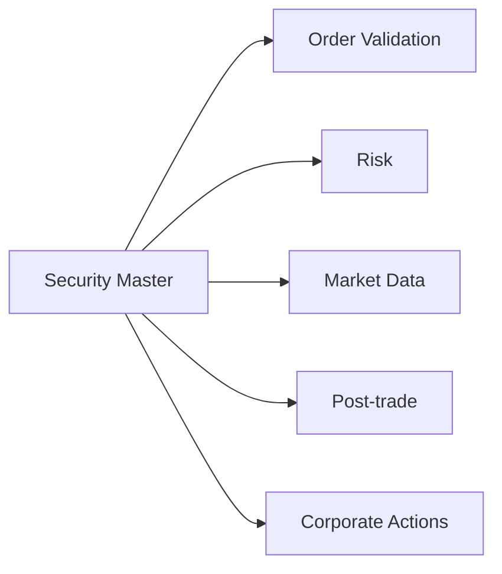

# Bài 09 — Security Master và Corporate Actions

Trading core không thể hoạt động chỉ với `Symbol = FPT`. Một instrument có **identity, venue, board, currency, trading rules, lifecycle và corporate-action history**. Tập dữ liệu quản lý các thuộc tính đó thường được gọi là **Security Master / Instrument Master / Reference Data**.

## 1. Symbol không phải identity ổn định

Một instrument model có thể cần:

```text
InstrumentId
Symbol
ISIN / external identifiers
Exchange / venue
Board / market
InstrumentType
Currency
ParValue
LotSize
TickSizeRule
TradingStatus
ListingDate
DelistingDate
EffectiveFrom / EffectiveTo
```

Không nên dùng symbol làm primary identity xuyên mọi lịch sử nếu symbol có thể đổi hoặc tái sử dụng theo rule của thị trường.

## 2. Reference data ảnh hưởng trực tiếp pre-trade

Order quantity có hợp lệ hay không phụ thuộc lot size/odd-lot rule; order price có hợp lệ hay không phụ thuộc tick size, price band, board và session.



Reference data sai có thể làm trading, risk và settlement sai cùng lúc.

## 3. Effective-dated configuration

Rule có thể thay đổi theo ngày. Không nên `UPDATE Instrument SET LotSize = 100` rồi mất lịch sử rule cũ.

```text
InstrumentRuleVersion
---------------------
InstrumentId
EffectiveFrom
EffectiveTo
LotSize
TickRuleId
PriceBandRuleId
SettlementRuleId
```

Khi audit order ngày D, hệ thống cần biết rule có hiệu lực tại D, không phải rule hôm nay.

## 4. Corporate action là lifecycle

Các loại thường gặp:

- cash dividend;
- stock dividend;
- bonus shares;
- rights issue;
- stock split/reverse split;
- merger/exchange;
- redemption/maturity với sản phẩm phù hợp;
- voting/meeting entitlement.

```text
Announcement
    ↓
Event Definition
    ↓
Key Dates
    ↓
Entitlement Calculation
    ↓
Instruction / Election nếu có
    ↓
Allocation / Payment
    ↓
Reconciliation
```

## 5. Key dates

Tùy event/market, cần phân biệt `Announcement Date`, `Ex Date`, `Record Date`, `Election Deadline`, `Payment Date`. Không hard-code ý nghĩa ngày theo một loại corporate action duy nhất.

## 6. Entitlement phải trace được

Ví dụ cổ tức tiền mặt:

```text
EligibleQty = 1,000
CashPerShare = 2,000
Gross = 2,000,000
Tax = policy(...)
Net = Gross - Tax
```

Hệ thống cần lưu `EventId`, `AccountId`, `EligibleQty`, `Rate`, `GrossAmount`, `TaxAmount`, `NetAmount`, `SourceSnapshotVersion`, `Status` để giải thích kết quả.

## 7. Position snapshot và record date

Entitlement không được dựa trên `current position` tại lúc job chạy. Phải dựa trên position/ownership theo rule tại record date/effective timeline, hoặc dữ liệu entitlement chính thức từ depository/custodian theo flow nghiệp vụ.

Đây là lý do temporal data và ledger quan trọng.

## 8. Corporate action và market data

Split/bonus/dividend có thể ảnh hưởng historical price series. Analytics cần phân biệt:

```text
Raw Price
Adjusted Price
Adjustment Factor
Corporate Action Version
```

Nếu không version adjustment factor, indicator/backtest có thể đổi mà không audit được.

## 9. Corporate action và open orders

Một event có thể kéo theo rule xử lý open orders/price reference tùy thị trường. Core không nên tự suy generic; cần đọc market-specific rule/specification có hiệu lực và model thành policy/config.

## 10. Failure scenarios

- Duplicate event import: cùng external event không tạo entitlement hai lần.
- Event amended: version/amend, không silently overwrite.
- Job rerun: idempotent hoặc adjustment/reversal có audit.
- Late position correction: xác định entitlement nào cần recalculation/exception.
- External mismatch: internal entitlement khác VSDC/custodian → reconciliation break.

## Checklist

- [ ] Instrument identity tách khỏi display symbol.
- [ ] Trading/reference rules có effective date.
- [ ] Security Master có source và data-quality controls.
- [ ] Corporate Action có event identity và version.
- [ ] Entitlement trace về source snapshot/rule.
- [ ] Rerun không double-credit.
- [ ] Adjustment/reversal có audit trail.
- [ ] Analytics biết raw vs adjusted data.
- [ ] External entitlement có reconciliation.

## Bài tập

Thiết kế flow cho cash dividend từ announcement tới payment. Sau đó giả lập event bị amend sau khi entitlement đã tính và trình bày cách tránh `UPDATE` mất lịch sử.
