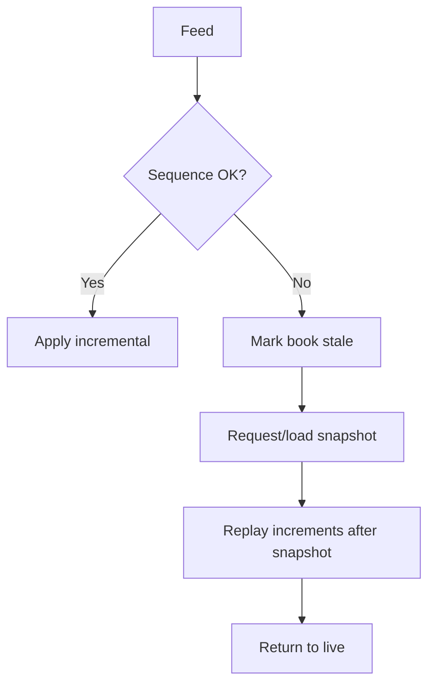
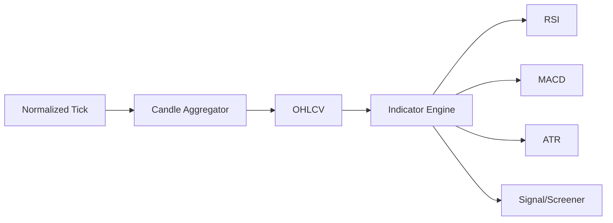

# Bài 10 — Market Data Engineering

Market data là hệ thần kinh của trading platform. Giá chậm, mất sequence hoặc apply duplicate có thể làm chart sai, signal sai, conditional order sai và risk sai.

## 1. Các dạng dữ liệu

Tùy nguồn và sản phẩm:

```text
Reference data
Trade ticks
Quotes / best bid-ask
Order book depth
Index values
Auction indicative data
Trading status
Corporate-action adjustments
```

Không phải mọi feed đều có cùng semantics.

## 2. Snapshot + Incremental

Pattern phổ biến:

```text
Snapshot at sequence N
        ↓
Incremental N+1
Incremental N+2
Incremental N+3
```

Nếu nhận `N+1` rồi `N+3` thì `N+2` bị thiếu. Không được cứ apply tiếp và hy vọng.



## 3. Event time và processing time

Tick xảy ra lúc `10:00:00.120` nhưng service nhận lúc `10:00:00.450`. Candle/indicator thường cần event-time semantics; monitoring latency cần cả hai.

## 4. Duplicate

Nếu trade tick `TradeId=T100` được replay hai lần thì volume có thể bị cộng hai lần. Dedup strategy phụ thuộc feed identity/sequence/specification; không tự chế `hash(timestamp+price)` nếu feed cung cấp stable identity tốt hơn.

## 5. Out-of-order

Policy có thể là reorder trong bounded buffer, accept late update cho candle chưa đóng, emit correction, drop sau allowed lateness hoặc rebuild downstream window. Quan trọng là policy phải explicit và test được.

## 6. Candle Aggregation

Một minute bar:

```text
Open  = first eligible trade
High  = max
Low   = min
Close = last eligible trade
Volume = sum eligible volume
```

Nhưng “eligible trade” và session boundary là market-specific. Cần model `TradingCalendar`, `Session`, `InstrumentStatus`, `Timezone`, `EventTime` thay vì group đơn giản bằng `timestamp.Minute`.

## 7. Indicator Engine



Indicator nên deterministic với cùng input version + parameters + corporate-action adjustment version.

## 8. Hot path và cold path

Không dùng một storage cho mọi workload.

```text
Hot state       → in-memory/cache/book state
Durable stream  → replayable event log nếu phù hợp
Historical bars → time-series/analytical store
Reference data  → relational/master-data store
```

## 9. Fan-out và backpressure

Một normalized tick có thể đi tới WebSocket push, Chart, Analytics, Conditional Orders, Risk, Recording và Alerts. Consumer chậm không được kéo sập critical path.

Cần nghĩ về partitioning, bounded queues, lag monitoring, backpressure/drop policy, priority giữa consumer và replay source.

## 10. Stale data nguy hiểm hơn no data

Nếu feed chết nhưng UI vẫn hiển thị giá cũ như live, user dễ hiểu sai. Phải có:

```text
LastEventTime
LastReceiveTime
FeedState
BookState = LIVE | STALE | RECOVERING
```

và propagate quality/status xuống consumer khi cần.

## 11. Conditional Order dependency

Nếu conditional engine trigger theo `FPT <= 100`, phải xác định nguồn giá, trade hay quote, stale threshold, duplicate/out-of-order policy, session được phép trigger và replay sau restart có được trigger lịch sử hay không.

## 12. Metrics

```text
feed messages/sec
sequence gaps
resync count
stale instruments
receive latency
processing latency
consumer lag
late-event rate
duplicate rate
bar correction count
```

## Checklist

- [ ] Có sequence/gap strategy.
- [ ] Snapshot/incremental resync được test.
- [ ] Event time khác processing time.
- [ ] Duplicate không double-count.
- [ ] Late/out-of-order policy rõ.
- [ ] Session/calendar đúng timezone.
- [ ] Feed stale được phát hiện và propagate.
- [ ] Có replay source cho recovery khi cần.
- [ ] Consumer chậm không phá critical path.
- [ ] Corporate-action adjustment có version.

## Bài tập

Xây candle aggregator 1 phút có xử lý duplicate, late tick và session boundary. Sau đó inject mất một sequence và chứng minh hệ thống chuyển sang STALE rồi resync thay vì tiếp tục publish book sai.
