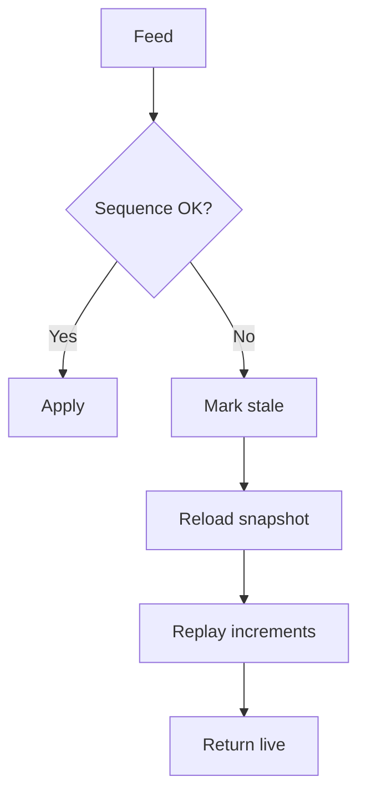

# Bài 10 — Market Data Engineering: giá sai một tick có thể phá bao nhiêu hệ thống?

<div class="lesson-meta"><span><strong>Track</strong> Market & Brokerage Core</span><span><strong>Mức độ</strong> Core</span><span><strong>Mục tiêu</strong> Xây pipeline market data đúng sequence, time và quality</span></div>

Market data là hệ thần kinh của trading platform. Một sequence gap có thể làm order book sai; stale price có thể làm risk và conditional order sai.

<div class="learning-objectives"><strong>Sau bài này bạn phải giải thích được:</strong>

- snapshot + incremental;
- sequence/gap/resync;
- event time vs processing time;
- duplicate/out-of-order;
- candle/indicator deterministic calculation;
- fan-out, backpressure và feed staleness.
</div>

## 1. Data Types

```text
Reference Data
Trade Ticks
Quotes / BBO
Depth / Order Book
Index Values
Auction Data
Trading Status
```

## 2. Snapshot + Incremental

```text
Snapshot @ N
→ N+1
→ N+2
→ N+3
```

Missing N+2 phải trigger recovery strategy, không tiếp tục silently.

## 3. Gap Detection



## 4. Event Time vs Processing Time

```text
Exchange/Event Time
Receive Time
Processing Time
Publish Time
```

Latency observability cần nhiều timestamps.

## 5. Duplicate

Replay tick/trade hai lần không được double volume nếu identity/sequence cho phép dedup.

## 6. Out-of-order

Policies:

```text
bounded reorder buffer
late update
correction event
drop after allowed lateness
rebuild window
```

Phải explicit.

## 7. OHLCV

```text
Open  = first eligible trade
High  = max
Low   = min
Close = last eligible trade
Volume = sum eligible volume
```

Session boundaries và eligible trade rule là market-specific.

## 8. Indicator Engine

```text
Ticks
→ Bars
→ Indicators
→ Signals / Screener
```

Cùng inputs + parameters + adjustment version phải cho cùng output.

## 9. Stale Data

No data dễ nhận biết hơn stale data.

```text
FeedState = LIVE | STALE | RECOVERING
LastEventTime
LastReceiveTime
```

Consumer cần biết quality state khi critical.

## 10. Hot Path / Cold Path

```text
Hot state      → memory/cache
Replay source  → durable stream/log nếu cần
Historical     → analytical/time-series store
Reference      → relational/master-data
```

Không một DB tối ưu mọi workload.

## 11. Fan-out

Normalized market event có thể đi tới:

```text
WebSocket UI
Chart
Analytics
Conditional Orders
Risk
Recorder
Alerts
```

Consumer chậm không nên block critical path.

## 12. Backpressure

Cần bounded queues, lag metrics, drop/priority policy và recovery strategy.

Unbounded queue chỉ hoãn outage.

## 13. Partitioning

Partition theo instrument/venue có thể giữ ordering cục bộ nhưng phải cân bằng hot symbols và scale profile.

## 14. Corporate Action Adjustment

Raw vs adjusted data phải tách và version.

## 15. Metrics

```text
messages/sec
sequence gaps
resync count
stale symbols
receive latency
processing latency
consumer lag
late-event rate
duplicate rate
```

## 16. Common mistakes

- tiếp tục publish book sau gap;
- stale price vẫn gắn nhãn live;
- group candle bằng `timestamp.Minute` không xét session/timezone;
- duplicate double-count volume;
- replay historical events kích hoạt live side effect.

<div class="key-takeaway"><strong>Takeaway</strong>Market data correctness = **ordering + time semantics + recovery + quality state**, không chỉ throughput cao.</div>

## Checklist

- [ ] Gap strategy.
- [ ] Resync snapshot/incremental.
- [ ] Event vs processing time.
- [ ] Duplicate/out-of-order policy.
- [ ] Stale state propagated.
- [ ] Backpressure bounded.
- [ ] Replay safe.

## Bài tập

1. Build 1-minute candle aggregator.
2. Inject missing sequence và resync.
3. Mô phỏng duplicate trade tick.
4. Thiết kế feed-health dashboard.

## Đọc tiếp

[Bài 11 — Risk, Margin & Controls](../11-risk-margin-controls/).