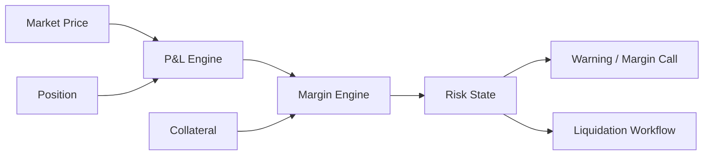

# Bài 11 — Risk, Margin và Trading Controls

Risk engine không phải một `if (balance >= amount)`. Trong brokerage platform, risk kiểm soát **khả năng đặt lệnh, exposure, margin, concentration và trạng thái tài khoản** trước, trong và sau giao dịch.

## 1. Ba lớp risk

```text
Pre-trade
  ↓
Intra-day / real-time
  ↓
Post-trade / end-of-day
```

### Pre-trade

- buying power;
- sellable quantity;
- price/quantity limits;
- account restriction;
- instrument eligibility;
- concentration/exposure;
- marginability.

### Intra-day

- position/P&L;
- margin utilization;
- market move;
- concentration;
- credit line;
- liquidation threshold.

### Post-trade

- settlement exposure;
- unresolved breaks;
- limit breach review;
- end-of-day margin/risk recomputation.

## 2. Risk rule cần version

Không hard-code `if (ratio > 0.8) reject;` mà không biết `0.8` đến từ policy nào.

```text
RiskPolicy
PolicyVersion
EffectiveFrom
Scope
Parameters
Decision
DecisionReason
InputSnapshotVersion
```

Khi khách hỏi tại sao order bị reject hôm qua, system phải giải thích bằng rule hôm qua.

## 3. Margin account

Khái niệm tổng quát:

```text
Equity / Collateral Value
Exposure / Debit
Initial Margin
Maintenance Margin
Available Margin
Margin Ratio
```

Công thức cụ thể phụ thuộc sản phẩm, công ty và quy định có hiệu lực; điều engineering quan trọng là **input lineage + deterministic calculation**.

## 4. Derivatives P&L



## 5. Risk state machine

Không chỉ có boolean `IsMarginCall`.

```text
NORMAL
  ↓
WARNING
  ↓
MARGIN_CALL
  ↓
RESTRICTED
  ↓
LIQUIDATION_REQUIRED
```

Transitions phải có reason, timestamp, policy version và audit.

## 6. Forced liquidation là workflow nguy hiểm

Không viết `if margin < threshold: sell everything`.

Cần giải quyết instrument nào liquidate trước, quantity bao nhiêu, price/order type policy, partial fill, market closed, order rejected, market price tiếp tục chạy, nhiều liquidation worker cạnh tranh và account nạp thêm collateral giữa chừng.

Đây là orchestration có state, không phải fire-and-forget.

## 7. Atomic risk reservation

```text
Credit limit = 1bn
Order A exposure +700m
Order B exposure +700m
```

Hai request cùng pass snapshot cũ sẽ vượt limit. Critical limits cần concurrency strategy tại source of truth, không dựa read model trễ.

## 8. Kill switch và trading controls

Production platform cần control operations như:

```text
Disable account trading
Disable symbol
Disable market/board
Disable new BUY
Cancel all working orders theo scope
Global emergency stop
```

Các thao tác này cần authorization mạnh, maker/checker nếu policy yêu cầu, audit, propagation nhanh và observable completion.

## 9. Stale market data

Risk tính theo giá cũ có thể nguy hiểm. Policy phải xác định khi feed stale thì dùng fallback price, apply haircut, stop new orders hay escalate. Không được âm thầm dùng cached price vô thời hạn.

## 10. Explainable decision

```json
{
  "decision": "REJECT",
  "reasonCode": "BUYING_POWER_EXCEEDED",
  "policyVersion": "BP-2026-08-01",
  "required": 120180000,
  "available": 100000000
}
```

Không trả mọi lỗi thành `RISK_FAILED`.

## 11. Failure scenarios

- Risk service timeout: fail-open hay fail-closed phải có policy theo operation.
- Duplicate risk command: reservation/limit consumption không double.
- Recalculation after late execution: risk state phải converge đúng.
- Failover: không để hai active risk owner cùng cấp limit từ cùng pool mà thiếu fencing/coordination.

## Checklist

- [ ] Risk tách pre/intra/post-trade.
- [ ] Rule/policy có version và effective date.
- [ ] Decision có reason + input lineage.
- [ ] Critical limit có atomic/concurrency control.
- [ ] Stale market data có policy.
- [ ] Margin state là state machine.
- [ ] Liquidation có orchestration/recovery.
- [ ] Kill switch có authorization/audit.
- [ ] Duplicate/replay không double exposure.
- [ ] Failover không tạo double owner.

## Bài tập

Thiết kế risk decision cho hai concurrent BUY orders sử dụng cùng credit limit. Tiếp theo mô phỏng market-data feed stale và giải thích hệ thống chọn fail-closed/fallback thế nào, cùng trade-off business của quyết định đó.
