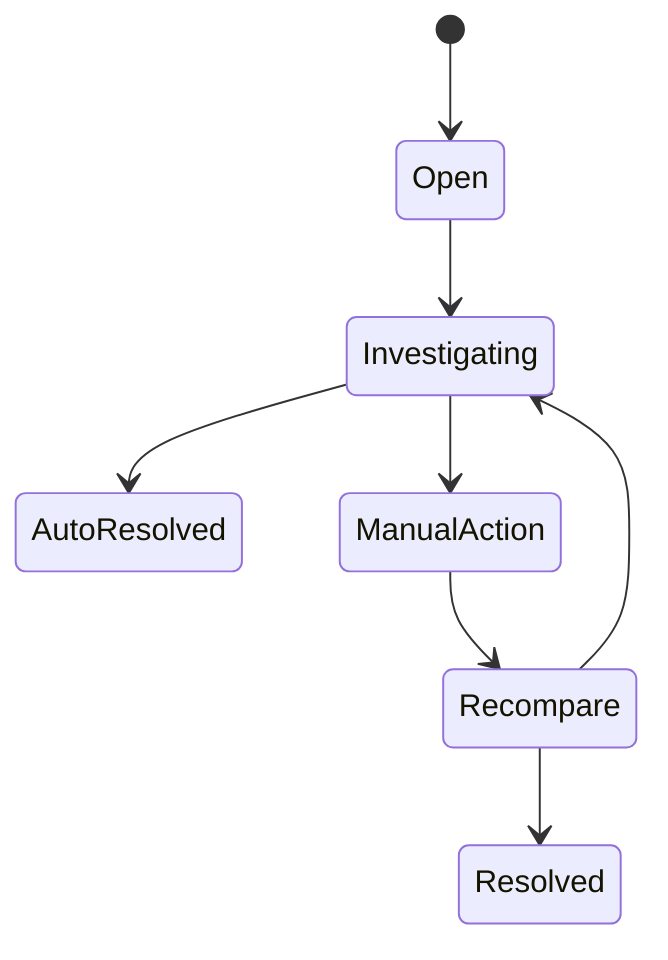

# Bài 12 — EOD & Reconciliation: làm sao chứng minh hệ thống đúng sau khi thị trường đóng cửa?

<div class="lesson-meta"><span><strong>Track</strong> Market & Brokerage Core</span><span><strong>Mức độ</strong> Core</span><span><strong>Mục tiêu</strong> Productize EOD/reconciliation thay vì coi là script vận hành</span></div>

Trading chạy nhanh trong phiên chưa đủ. Sau phiên phải chứng minh internal state khớp venue, depository, bank và accounting evidence.

<div class="learning-objectives"><strong>Sau bài này bạn phải giải thích được:</strong>

- FILLED vì sao chưa phải done;
- reconciliation cần independent source;
- break lifecycle;
- EOD là dependency graph;
- business date khác wall-clock date;
- rerun/manual adjustment phải idempotent và auditable.
</div>

<div class="callout">
<strong>Broker UI (🟢 / 🟡)</strong><br/>
SSI có Sao kê tiền cơ sở/phái sinh; VPS có Sao kê tiền, Sao kê VSD, tiền chờ VSD xử lý. Đó là chỗ học reconciliation: FILLED trên sổ lệnh chưa phải tiền/CK đã settled. Không suy ra job EOD nội bộ của broker.
</div>


## 1. Full Lifecycle

```text
Order
→ Execution
→ Trade Booking
→ Clearing Obligation
→ Settlement
→ Ledger Posting
→ External Confirmation
→ Reconciliation
→ EOD Close
```

## 2. Reconciliation Pairs

```text
Internal Orders      ↔ Venue Orders
Internal Executions  ↔ Venue Trades
Internal Cash        ↔ Bank
Internal Securities  ↔ Depository
Internal Obligations ↔ Settlement Results
```

## 3. Stable Keys

```text
ClientOrderId
VenueOrderId
ExecId
TradeId
SettlementInstructionId
AccountId
InstrumentId
BusinessDate
```

## 4. Break Lifecycle



## 5. Break Types

```text
Missing Internal
Missing External
Quantity Mismatch
Cash Mismatch
Timing Mismatch
Status Mismatch
```

## 6. EOD Dependency Graph

```text
Market Close
→ Input Completeness
→ Order/Trade Recon
→ Ledger Finalization
→ Position/Cash Snapshot
→ Settlement Obligations
→ Cash/Securities Recon
→ Reports
→ Business Date Close
```

## 7. Business Date

Không dùng `DateTime.Today` như business truth.

```text
BusinessDate
TradingCalendar
SettlementCalendar
Cutoff
Holiday
Session
```

## 8. Completeness Gates

Trước step tiếp theo:

```text
đủ external files/messages?
feed còn gap?
unknown orders resolved?
settlement batches complete?
high-severity breaks còn mở?
```

## 9. Rerun

Operations sẽ rerun.

Step phải có:

```text
RunId
BusinessKey
Checkpoint
Idempotency
Resume semantics
Audit
```

## 10. Manual Operations

Không sửa DB trực tiếp.

```text
Ops Task
Maker
Checker
Reason
Before/After
Evidence
Approval
Audit
```

## 11. Unknown Queue

```text
UNKNOWN
→ query external source
→ reconcile
→ resolve success/failed
```

Có aging/SLA/alerts.

## 12. EOD Metrics

```text
EOD duration
pending stages
open breaks
oldest break age
unknown orders
unsettled obligations
manual adjustments
reruns
```

## 13. DR and EOD

Sau failover:

```text
recover durable state
→ replay inbound/outbound
→ reconcile external
→ prove convergence
→ resume close
```

## 14. Common mistakes

- recon cùng một DB rồi gọi là independent control;
- break chỉ là log;
- EOD là một cron script opaque;
- rerun double-post;
- manual fix không audit;
- app healthy = business state correct.

<div class="key-takeaway"><strong>Takeaway</strong>Reconciliation là **control plane cho financial correctness**; EOD là stateful workflow có dependency và evidence.</div>

## Checklist

- [ ] Independent recon sources.
- [ ] Stable IDs.
- [ ] Break lifecycle/SLA.
- [ ] EOD dependency graph.
- [ ] BusinessDate explicit.
- [ ] Rerun safe.
- [ ] Manual ops audited.

## Bài tập

1. Thiết kế trade reconciliation table.
2. Build EOD dependency DAG.
3. Mô phỏng late external file.
4. Design manual adjustment workflow maker/checker.

## Đọc tiếp

[Bài 13 — OMS Internals & State Machine](../13-oms-internals-state-machine/).