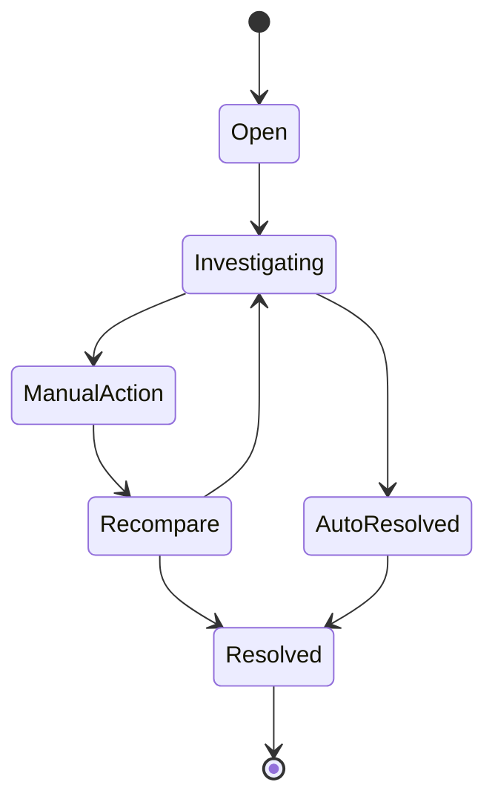
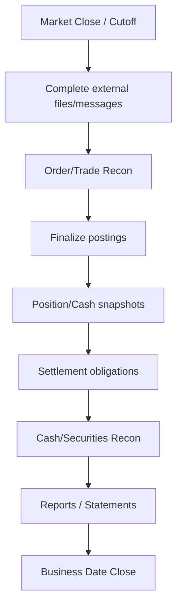

# Bài 12 — EOD, Reconciliation và Securities Operations

Một hệ thống trading tốt không chỉ chạy nhanh trong phiên. Nó phải **chứng minh sau phiên rằng trạng thái nội bộ khớp với exchange, depository, bank và các hệ thống kế toán liên quan**.

Đây là nơi software engineering gặp operations thật sự.

## 1. FILLED không phải kết thúc

```text
Order
→ Execution
→ Trade Booking
→ Clearing Obligation
→ Settlement
→ Ledger Posting
→ External Confirmation
→ Reconciliation
→ EOD Close
```

Một trade có thể FILLED hoàn hảo nhưng post-trade bị break.

## 2. Reconciliation là control độc lập

Không nên coi reconciliation là “query lại cùng database xem giống nhau không”. Phải so hai source có tính độc lập đủ để phát hiện lỗi.

```text
Internal Orders      ↔ Venue Orders
Internal Executions  ↔ Venue Trades
Internal Securities  ↔ VSDC/Custodian
Internal Cash        ↔ Bank
Internal Obligations ↔ Clearing/Settlement result
```

## 3. Reconciliation key

Muốn đối soát được cần stable identity:

```text
ClientOrderId
VenueOrderId
ExecId / TradeId
SettlementInstructionId
AccountId
InstrumentId
BusinessDate
```

Nếu hệ thống mất mapping external IDs, reconciliation sẽ cực kỳ khó.

## 4. Break lifecycle

Break không nên chỉ là log text.



Break record có thể gồm `BreakId`, `ReconType`, `BusinessKey`, `InternalValue`, `ExternalValue`, `Difference`, `Severity`, `DetectedAt`, `Owner`, `Status`, `ResolutionCode`, `ResolvedAt`, `AuditTrail`.

## 5. Các loại mismatch

### Missing internal

External có trade, nội bộ không có.

### Missing external

Nội bộ nghĩ đã gửi/book nhưng venue/external không có.

### Quantity mismatch

```text
Internal ExecQty 1,000
External ExecQty 1,500
```

### Cash mismatch

Fee, tax, settlement amount hoặc posting sai.

### Timing mismatch

Hai bên đúng nhưng cutoff/data arrival khác nhau. Reconciliation cần tolerance/window thay vì báo false break hàng loạt.

## 6. EOD không phải một cron job khổng lồ

End-of-day nên được nhìn như **dependency graph**.



Mỗi step cần input completeness, retryability và observable status.

## 7. Business Date khác wall-clock date

Trading system cần concept:

```text
BusinessDate
TradingCalendar
SettlementCalendar
Cutoff
Holiday
Session
```

Không dùng `DateTime.Today` làm business truth. Job chạy lúc 00:05 không có nghĩa mọi market operation đã chuyển sang business date mới.

## 8. Completeness check

Trước khi EOD bước tiếp, hỏi:

```text
Đã nhận đủ file/message chưa?
Sequence feed có gap không?
Có unknown order nào chưa resolve?
Có settlement batch nào pending?
Có reconciliation break severity cao không?
```

Nếu không, close date có thể phải block/escalate theo policy.

## 9. Rerun phải an toàn

Operations sẽ rerun job. Nếu rerun làm `post fee` hai lần thì core sai ngay.

EOD step cần:

- idempotency/business key;
- checkpoint;
- immutable run record;
- rerun/resume semantics;
- adjustment thay vì silent overwrite khi đã finalized.

## 10. Manual operations phải là first-class workflow

Production chắc chắn có exception cần con người xử lý. Đừng sửa DB trực tiếp rồi gửi Slack.

Nên có:

```text
Ops Task
Maker
Checker
Reason Code
Before/After
Attachment/Evidence
Approval
Audit
```

Manual adjustment trong financial core phải trace được.

## 11. Unknown outcome queue

Những case như order submit timeout, settlement instruction timeout hoặc bank transfer timeout không nên bị ép thành failed.

```text
UNKNOWN
→ query external source
→ reconcile
→ resolve SUCCESS / FAILED
```

Unknown queue cần aging/SLA/alert.

## 12. EOD metrics

```text
EOD start/end duration
pending stages
unknown orders
open breaks by severity
oldest break age
unbalanced ledger count
unsettled obligations
external file lateness
manual adjustments
rerun count
```

## 13. DR và EOD

Sau failover/DR:

1. xác định last durable checkpoint;
2. recover/replay inbound/outbound state;
3. reconcile với external systems;
4. chỉ tiếp tục business date close khi convergence được chứng minh.

DR “app lên xanh” chưa có nghĩa business state đúng.

## Checklist

- [ ] Reconciliation so hai nguồn độc lập phù hợp.
- [ ] Stable external/internal IDs được giữ.
- [ ] Break có lifecycle, owner, SLA, audit.
- [ ] EOD là dependency graph, không phải script opaque.
- [ ] BusinessDate/calendar explicit.
- [ ] Input completeness được kiểm tra.
- [ ] Rerun/resume idempotent.
- [ ] Manual adjustment có maker/checker/audit khi cần.
- [ ] Unknown outcome có queue và recovery.
- [ ] DR kết thúc bằng reconciliation, không chỉ health check.

## Bài tập

Thiết kế EOD run cho một ngày có 1 triệu executions. Inject ba lỗi: thiếu một external trade file, duplicate fee posting khi rerun, và một bank settlement chưa biết kết quả. Chỉ ra stage nào block, stage nào retry, và break nào cần manual operation.
