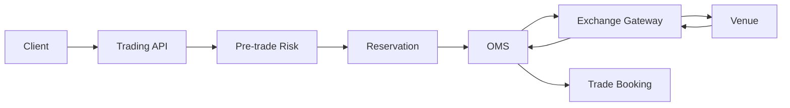
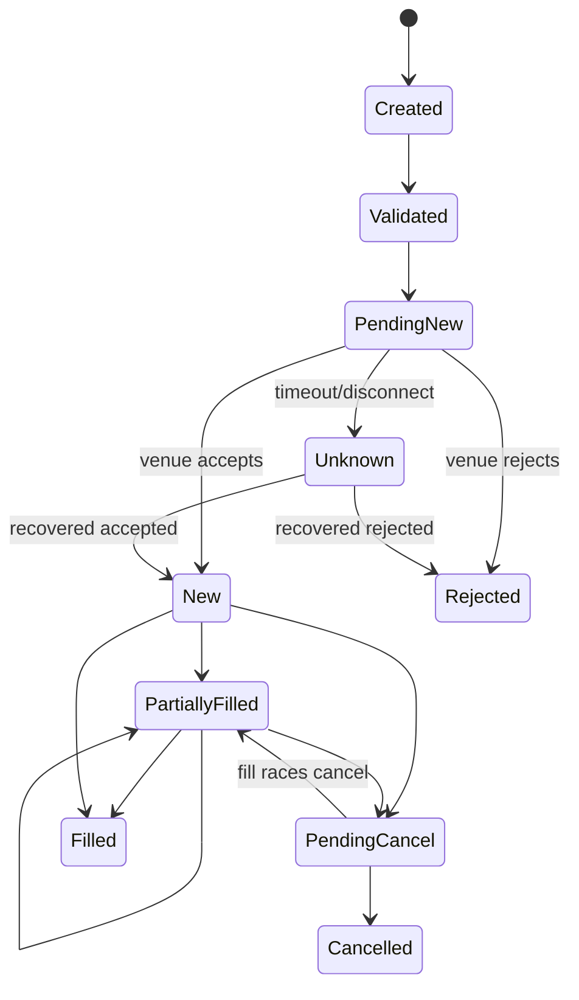

# Bài 13 — OMS Internals: từ API đặt lệnh đến State Machine có thể phục hồi

Order Management System (OMS) là nơi biến một ý định giao dịch thành một lifecycle có kiểm soát. Nếu chỉ nghĩ OMS là `POST /orders` + bảng `orders`, bạn sẽ bỏ qua phần khó nhất: **reservation, state transition, external identity, race condition, unknown outcome và recovery**.

## Câu hỏi trung tâm

> Sau khi client gửi một order, hệ thống nào sở hữu trạng thái của order, trạng thái đó thay đổi bằng event nào, và làm sao chứng minh mỗi transition chỉ xảy ra hợp lệ một lần?



## 1. Command khác Event

Command nói **muốn làm gì**:

```text
SubmitOrder
CancelOrder
ReplaceOrder
```

Event/observation nói **đã xảy ra gì**:

```text
OrderAccepted
OrderRejected
OrderPartiallyFilled
OrderFilled
CancelAccepted
CancelRejected
```

OMS không nên coi `SubmitOrder()` thành công chỉ vì đã ghi DB. Business outcome còn phụ thuộc venue.

## 2. Identity phải tách lớp

Một order thường có nhiều identity:

```text
InternalOrderId   — identity nội bộ
ClientOrderId     — identity ổn định từ client/business command
VenueOrderId      — identity do venue cấp
Session/Sequence  — transport/session identity nếu protocol có
ExecId            — identity của execution
```

Không dùng một field `OrderId` cho mọi ngữ cảnh rồi hy vọng mapping luôn rõ.

## 3. State Machine phải explicit

Ví dụ mental model:



Tên trạng thái production phụ thuộc venue/protocol. Điều bắt buộc là transition hợp lệ được định nghĩa và test.

## 4. Quantity invariant

Tối thiểu:

```text
0 <= CumQty <= OrderQty
0 <= LeavesQty <= OrderQty
CumQty không được giảm
Execution đã book không được mất sau restart
Terminal state không được mở lại tùy tiện
```

Với cancel remainder, công thức `CumQty + LeavesQty = OrderQty` cần hiểu theo semantics của working/cancelled quantity. Đừng copy công thức mà không mô hình hóa cancelled quantity nếu domain cần.

## 5. Reservation phải đi cùng lifecycle

BUY giữ buying power/cash resource; SELL giữ sellable securities.

```text
Order Created
    ↓
Reservation Active
    ↓
Partial Fill → consume một phần
    ↓
Cancel remainder → release phần còn lại
```

Invariant quan trọng:

```text
terminal order ⇒ không còn reservation bị treo ngoài policy
```

## 6. Cancel race

Sequence thực tế có thể là:

```text
NEW
→ PARTIAL_FILL 2,000
→ CANCEL_REQUESTED
→ FILL 3,000
→ CANCEL_ACCEPTED remainder
```

Nếu code giả định `PendingCancel` không nhận fill, bạn sẽ mất execution hợp lệ.

Cách học đúng là viết bảng transition:

| Current | Incoming | Next | Business effect |
|---|---|---|---|
| NEW | Fill 2k | PARTIAL | book 2k |
| PARTIAL | CancelRequest | PENDING_CANCEL | none |
| PENDING_CANCEL | Fill 3k | PENDING_CANCEL/PARTIAL* | book 3k |
| PENDING_CANCEL | CancelAck | CANCELLED | release remainder |

`*` State representation tùy model, nhưng CumQty và audit phải chính xác.

## 7. Unknown outcome là first-class state

```text
OMS ── Submit ──▶ Gateway/Venue
OMS ◀──── X ───── ACK bị mất
```

Không biết order đã vào venue hay chưa.

Sai:

```text
timeout => REJECTED
```

Đúng hơn:

```text
timeout => UNKNOWN
          ↓
query/recover/reconcile
          ↓
NEW | REJECTED | other authoritative state
```

## 8. Transaction boundary

Một design đơn giản có thể giữ trong cùng local transaction:

```text
Order mutation
+ Reservation mutation
+ Inbox/Dedup record cho inbound execution
+ Outbox event cho downstream
```

khi chúng cùng bảo vệ một invariant. Đừng tách thành bốn microservice trước rồi biến local invariant thành distributed saga.

## 9. Optimistic concurrency

Ví dụ:

```sql
UPDATE orders
SET status = @next, version = version + 1
WHERE order_id = @id
  AND version = @expectedVersion;
```

Hoặc atomic transition:

```sql
UPDATE orders
SET status = 'PENDING_CANCEL'
WHERE order_id = @id
  AND status IN ('NEW','PARTIALLY_FILLED');
```

Nếu affected rows = 0, caller phải reload/resolve conflict; không silently overwrite.

## 10. OMS recovery khi restart

Khi process lên lại, phải tìm được:

```text
orders đang PendingNew/Unknown
orders đang PendingCancel
unprocessed inbound venue messages
outbox chưa publish
reservation đang active
```

Recovery không nên phụ thuộc RAM.

## 11. Business metrics

```text
orders by state
pending-new age
unknown orders
cancel-pending age
partial-fill age
reservation leaks
execution dedup hits
venue reject reasons
submit-to-ack latency
```

CPU thấp không giúp gì nếu có 2,000 order kẹt `PENDING_NEW`.

## Failure lab

Hãy inject lần lượt:

1. crash sau reserve trước send;
2. crash sau send trước ACK;
3. duplicate ExecutionReport;
4. fill đến trong cancel pending;
5. DB deadlock khi book execution;
6. process restart với 100 order UNKNOWN.

Mỗi case phải trả lời: **state bền vững nằm đâu, retry gì, dedup bằng gì, reconcile với ai?**

## Definition of Done

- [ ] State machine explicit và có transition tests.
- [ ] Identity nội bộ/client/venue/execution được tách rõ.
- [ ] Unknown outcome có recovery path.
- [ ] Duplicate execution không double-book.
- [ ] Reservation không leak sau terminal state.
- [ ] Cancel race được test.
- [ ] Crash/restart không mất business state.
- [ ] Có metrics cho stuck/unknown lifecycle.

## Bài tập

Xây một OMS simulator với `Submit`, `Cancel`, `Execution`, `Reject`, `RecoverUnknown`. Chạy property/invariant tests với event order ngẫu nhiên và chứng minh không thể tạo `CumQty > OrderQty` hoặc apply cùng `ExecId` hai lần.