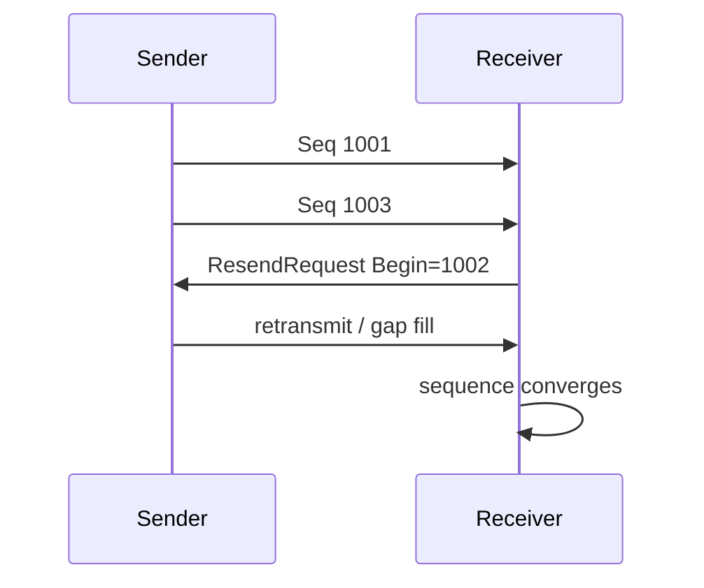

# Bài 14 — FIX 4.4 Session Recovery: sequence, resend, duplicate và restart

Parsing `35=D` hay `35=8` là phần dễ. Phần khó của FIX nằm ở việc hai bên duy trì **một phiên có thứ tự, phát hiện gap, retransmit đúng và không tạo business effect hai lần**.

FIX Trading Community mô tả `ResendRequest (35=2)` dùng khi receiver phát hiện sequence gap/lost message; message retransmit dùng sequence cũ và `PossDupFlag(43)=Y`, còn `SequenceReset (35=4)` có thể được dùng cho gap fill theo session rules.

## 1. Hai lớp phải tách

```text
Application Layer
NewOrderSingle
ExecutionReport
Cancel/Replace
Trade messages

Session Layer
Logon / Logout
Heartbeat / TestRequest
MsgSeqNum
ResendRequest
SequenceReset
PossDupFlag
```

Application layer trả lời “order/trade là gì”. Session layer trả lời “message stream có liên tục và recoverable không”.

## 2. Durable session state

Một FIX gateway production thường phải duy trì ít nhất mental state:

```text
SessionKey
SenderCompID
TargetCompID
NextNumOut
NextNumIn
LastLogon
ConnectionState
MessageStore / replay metadata
```

Nếu process restart làm `NextNumOut` quay về 1 trái contract, peer có thể reject/logout hoặc yêu cầu resync.

## 3. Sequence gap

Receiver mong:

```text
1001
1002
1003
```

nhưng nhận:

```text
1001
1003
```

→ thiếu `1002`.



Không nên cho application tiếp tục tin rằng stream đầy đủ nếu session đang gap/recovery.

## 4. Resend không đồng nghĩa re-apply business effect

Một ExecutionReport có thể quay lại do session recovery.

```text
Message Seq=1002
ExecId=EX-7788
PossDup=Y
```

Application phải phân biệt:

```text
transport message duplicate
≠
business execution mới
```

Business dedup nên dựa identity theo venue contract, ví dụ `Venue + ExecId`, không chỉ `MsgSeqNum`.

## 5. Vì sao không chỉ dedup bằng sequence?

Sequence là session-scoped. Business identity có lifecycle riêng. Session có thể reset/reconnect; một trade/execution cần trace độc lập khỏi transport sequence.

Mental model:

```text
MsgSeqNum  → transport ordering/recovery
ClOrdID    → client order identity
OrderID    → venue order identity
ExecID     → execution identity
```

## 6. Gap Fill

Session layer có những message không cần retransmit như application messages. FIX định nghĩa `SequenceReset` với `GapFillFlag=Y` để receiver tiến qua vùng sequence bị bỏ qua theo rules.

Điều quan trọng với backend engineer không phải học thuộc tag, mà là hiểu invariant:

```text
NextNumIn chỉ tiến khi sequence semantics cho phép
Không bỏ qua application message quan trọng ngoài contract
Gap-fill/replay phải audit được
```

## 7. Restart scenario

Giả sử gateway crash:

```text
Durable NextNumOut = 5010
Durable NextNumIn  = 8800
```

Process mới phải restore state trước khi active session. Nếu node mới kết nối trong khi node cũ vẫn active, có nguy cơ **dual owner**.

Cần:

```text
leader/active ownership
fencing token hoặc equivalent protection
persistent session store
single logical sender
```

## 8. Active/Standby không phải load balancing

Sai mental model:

```text
Load Balancer
 ├─ FIX Node A
 └─ FIX Node B
```

nếu cả hai có thể cùng sở hữu cùng logical session.

Đúng hơn:

```text
Active Node A  ← owns session + fencing
Standby Node B ← replicated state, not sending
      ↓ failover
Node B acquires ownership
      ↓
restore sequence/message store
      ↓
reconnect + recover + reconcile
```

## 9. Unknown application outcome vẫn tồn tại

Session recovery giúp message continuity, nhưng không tự giải quyết mọi business ambiguity.

Ví dụ order đã gửi, socket chết, sau reconnect peer gap-fill một phần. OMS vẫn cần `ClOrdID`/venue status/reconciliation để biết order thực sự tồn tại không.

Session correctness và business correctness là hai lớp liên quan nhưng khác nhau.

## 10. Message store

Một message store tốt cần hỗ trợ:

```text
find outbound messages by sequence range
retain raw/canonical message for audit
reconstruct resend payload theo FIX rules
track processed inbound sequence
survive process restart
```

Retention phụ thuộc operational/spec requirements; không đặt tùy ý rồi xóa message cần recovery.

## 11. Test cases bắt buộc

- Logon với expected sequence.
- Inbound sequence thấp hơn expected.
- Inbound sequence cao hơn expected.
- Resend request một range.
- Gap fill.
- Duplicate `PossDup=Y`.
- Connection drop giữa order và ExecutionReport.
- Process restart.
- Failover active → standby.
- Standby không được send trước khi giành ownership.

FIX Trading Community có session-layer test cases; dùng chúng làm baseline rồi thêm venue-specific certification cases.

## 12. Observability

```text
session state
NextNumIn / NextNumOut
sequence gaps
resend requests
messages replayed
unexpected duplicates
logon failures
heartbeat/test-request latency
connection flap count
active owner identity
recovery duration
```

## Source chính

- FIX Trading Community — FIX Session Layer Online.
- FIX 4.4 `ResendRequest (35=2)`.
- FIX 4.4 `ExecutionReport (35=8)`.
- FIX Session Layer Test Cases.

Các link nằm trong [References](../../resources/references.md).

## Definition of Done

- [ ] Session state durable.
- [ ] Gap detection/resend/gap-fill có test.
- [ ] Business dedup không dựa duy nhất MsgSeqNum.
- [ ] Restart giữ continuity đúng contract.
- [ ] Active/standby có fencing/ownership.
- [ ] Unknown application outcome có recovery ngoài session layer.
- [ ] Có audit và metrics cho sequence/replay.

## Bài tập

Mô phỏng một FIX engine mini: gửi sequence 1..10 nhưng cố tình làm mất 4 và 7, sau đó implement `ResendRequest`, replay application message và gap-fill session message. Inject duplicate execution và chứng minh transport recovery không double-book position.