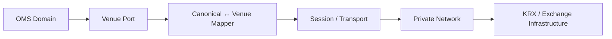
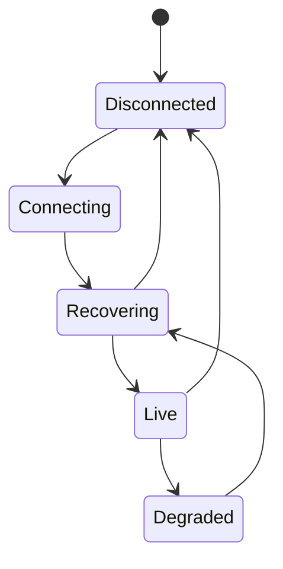

# Bài 15 — Exchange Gateway & KRX Connectivity: Anti-Corruption Layer của trading core

Ngày **05/05/2025**, hệ thống công nghệ thông tin mới do KRX cung cấp đã chính thức vận hành cho thị trường chứng khoán Việt Nam, với HOSE, HNX, VSDC và các thành viên thị trường tham gia trên nền tảng tích hợp. Với backend engineer, điều quan trọng không phải gọi mọi thứ là “KRX API”, mà là thiết kế **một exchange connectivity boundary có thể thay đổi theo specification của venue mà không làm nhiễm domain core**.

> Production implementation phải dùng member interface specification, message dictionary, network/certification rule được cấp cho đúng thành viên/venue. FIX 4.4 generic không đồng nghĩa tự động tương thích toàn bộ giao diện production của KRX.

## 1. Gateway nằm ở đâu?



Core chỉ nên biết các operation kiểu:

```text
SubmitOrder
CancelOrder
ReplaceOrder
QueryOrderStatus
ReceiveExecution
ReceiveTradingStatus
```

Core không nên biết trực tiếp tag/proprietary field, socket framing hay reconnect details.

## 2. Canonical model và venue model

Canonical command:

```text
SubmitOrder
- InternalOrderId
- ClientOrderId
- Account
- InstrumentId
- Side
- Quantity
- Price
- OrderType
- TimeInForce
- TradingSession
```

Adapter map sang message contract của venue.

Khi venue thêm field/rule mới, mục tiêu là thay đổi adapter/config trước, không rewrite toàn bộ OMS.

## 3. Validation ở đâu?

Có ba lớp khác nhau:

```text
Domain validation
→ account/buying power/order state

Market-rule validation
→ session, lot, tick, order type, instrument status

Protocol validation
→ required field, enum, sequence, checksum/session rule
```

Đừng gom mọi reject thành `INVALID_ORDER`.

## 4. Reject taxonomy

Gateway nên chuẩn hóa reason nhưng giữ raw evidence:

```text
CanonicalReasonCode
VenueReasonCode
VenueMessage
RawMessageRef
OccurredAt
SessionId
Sequence
```

OMS có thể phản ứng theo canonical reason; operations vẫn điều tra được raw venue reason.

## 5. Connection lifecycle



Không nên publish trạng thái `READY` chỉ vì TCP socket connected. Gateway chỉ ready khi session/sequence/reference state cần thiết đã đồng bộ theo contract.

## 6. Startup readiness gate

Một service gateway thường phải chờ:

```text
configuration loaded
credentials/certificates ready
session store available
network route available
session logged on
sequence recovered
required reference/trading status synced
```

Sau đó mới `SetReady()` cho order routing. Đây là nơi một readiness gate/TCS phù hợp hơn dùng semaphore để diễn tả “một lần chuyển sang ready”.

## 7. Primary/backup connectivity

Market connectivity cần thiết kế theo failure domain:

```text
Primary DC
Primary route
Primary gateway

Backup route
Standby gateway
DR site
```

Không chỉ hỏi “có 2 server chưa?”. Hỏi:

- hai server có chung switch/firewall failure không?
- session state replicate thế nào?
- ai có quyền active?
- failover mất bao nhiêu giây/phút?
- sau failover reconcile order/trade thế nào?

## 8. Fencing

Kịch bản nguy hiểm:

```text
Node A mất heartbeat với coordinator nhưng vẫn có network tới venue
Node B nghĩ A chết và active
```

Nếu cả A và B send trên cùng logical session/business identity → split brain.

Cần fencing/ownership mechanism phù hợp với deployment và protocol; không dựa duy nhất biến `IsLeader=true` trong RAM.

## 9. Backpressure

Nếu OMS gửi nhanh hơn gateway/venue cho phép:

```text
unbounded queue
→ memory growth
→ latency tăng
→ stale order
→ reconnect/replay storm
```

Gateway cần bounded queue, capacity policy, rate/flow control, metrics và reject/degrade behavior rõ.

## 10. Trading-status event

Gateway không chỉ truyền orders. Nó có thể cần đưa vào canonical model các sự kiện:

```text
market/session open-close
instrument halt/resume
venue connectivity state
sequence/recovery state
reference updates theo interface
```

Downstream risk/order validation phải biết data freshness và authority của event.

## 11. Certification mindset

Trước production, test không chỉ happy-path submit/fill. Certification matrix nên gồm:

```text
new order
reject
partial fill
full fill
cancel
cancel reject
replace
session reconnect
sequence gap
resend
duplicate
invalid message
market close transition
network failover
gateway restart
DR failover
```

## 12. Reconciliation boundary

Gateway giữ mapping:

```text
InternalOrderId ↔ ClientOrderId ↔ VenueOrderId
InternalTradeId ↔ ExecId/TradeId
```

Reconciliation engine dùng mapping này để so internal OMS/trades với venue evidence.

Mất mapping external IDs là một operational incident, không phải lỗi nhỏ.

## 13. Security

Tùy interface/specification có thể cần private circuits, certificate, IP allowlist, HSM/PKI hoặc control khác. Architecture phải tách:

```text
application credentials
transport/session credentials
certificate/private key ownership
rotation
privileged access
network zone
```

Không log raw secrets/private keys.

## 14. Observability

```text
connection/session state
active gateway node
orders sent/sec
venue ACK latency
reject rate by reason
unknown submit count
outbound queue depth
sequence gaps/resends
reconnect count
last inbound timestamp
mapping failures
reconciliation breaks
```

## Nguồn kiểm tra

Thông tin KRX go-live: Ủy ban Chứng khoán Nhà nước, công bố ngày 05/05/2025. Link được lưu tại [References](../../resources/references.md).

## Definition of Done

- [ ] Domain không phụ thuộc wire protocol.
- [ ] Canonical ↔ venue mapping version/test được.
- [ ] Ready state bao gồm session recovery, không chỉ socket up.
- [ ] Primary/standby có ownership/fencing.
- [ ] Queue/backpressure bounded.
- [ ] External IDs được lưu bền vững.
- [ ] Certification test có recovery/failure scenarios.
- [ ] Reconciliation có thể trace về raw venue evidence.

## Bài tập

Thiết kế `IExchangeVenue` port và adapter giả lập hai venue có message contract khác nhau. Sau đó failover từ gateway A sang B giữa lúc có 100 working orders và trình bày từng bước để B khôi phục session, mapping, unknown orders và chỉ mở routing khi reconciliation đạt điều kiện.