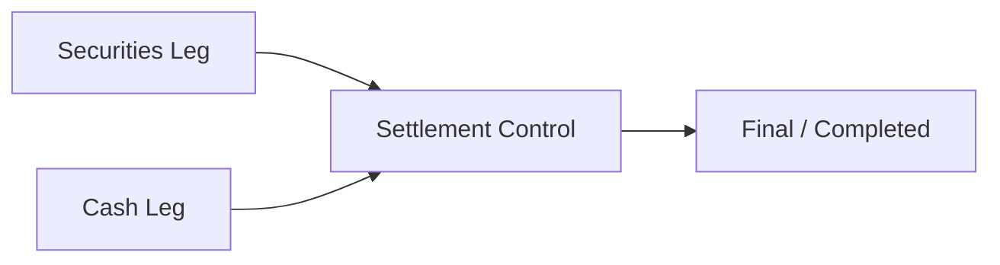
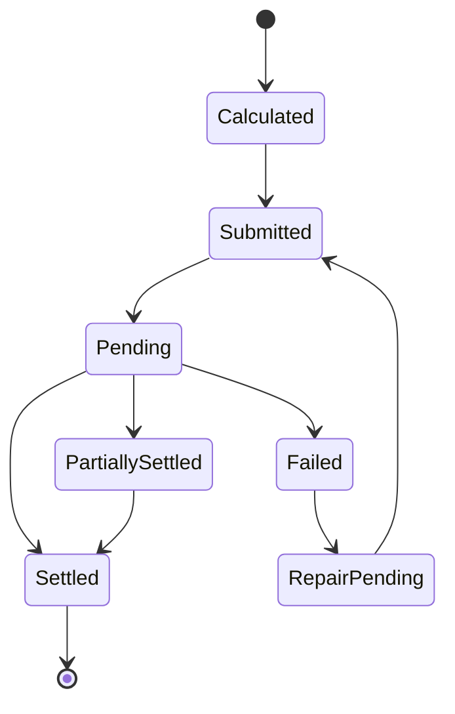

# Bài 17 — Clearing, Netting & Settlement: phần hậu giao dịch mà backend thường bỏ quên

Trading trả lời **đã mua/bán gì**. Clearing trả lời **sau các giao dịch, mỗi bên có nghĩa vụ gì**. Settlement trả lời **tiền và chứng khoán đã thực sự được chuyển giao chưa**.

```text
Execution
→ Trade
→ Clearing
→ Net Obligation
→ Settlement Instruction
→ Cash Leg + Securities Leg
→ Finality
→ Reconciliation
```

## 1. Clearing khác Settlement

### Clearing

Tính nghĩa vụ:

```text
Member A owes Cash X
Member A receives Security Y
```

### Settlement

Thực hiện chuyển giao các nghĩa vụ đó qua hạ tầng liên quan.

Nếu model chỉ có `Trade.Status = Settled`, bạn đang mất quá nhiều state để vận hành/reconcile.

## 2. Obligation là entity riêng

Một model có thể cần:

```text
ObligationId
Member/Account Scope
Instrument/Currency
Side: PAY / RECEIVE / DELIVER
GrossAmount
NetAmount
TradeDate
SettlementDate
Status
ExternalReference
BatchId
```

Nghĩa vụ có lifecycle độc lập với order.

## 3. Gross vs Net

Ví dụ trong cùng clearing scope:

```text
BUY  FPT  +100m cash payable
SELL VNM   -70m cash receivable
BUY  HPG   +20m cash payable
```

Sau netting theo rule phù hợp:

```text
Net cash payable = 50m
```

Đây chỉ là minh họa. Netting scope/algorithm phải theo rule của clearing system/market, không generic hóa từ ví dụ.

## 4. DVP mental model

Delivery versus Payment nhằm giảm principal risk bằng cách gắn chuyển giao securities với chuyển giao cash theo settlement mechanism.



Application cần model hai leg và authoritative result thay vì tự coi một bên thành công là toàn settlement thành công.

## 5. Settlement calendar

Settlement date phụ thuộc:

```text
Instrument type
Market rule
Trade date
Business calendar
Holiday
Exceptional market day
```

Không hard-code `AddDays(2)`.

Tạo `SettlementCalendar`/rule effective-dated để historical calculation reproduce được.

## 6. State machine



State thực tế tùy external infrastructure. Mục tiêu là giữ đủ evidence để biết **đang chờ gì và ai là authority**.

## 7. Settlement failure

Một obligation có thể fail vì:

```text
insufficient cash
insufficient securities
invalid instruction/reference
external system unavailable
data mismatch
cutoff missed
```

Không retry mọi failure giống nhau. Business failure cần operations/risk workflow; transient technical failure mới phù hợp retry.

## 8. VSDC integration boundary

Trong bối cảnh Việt Nam, VSDC là một thành phần hạ tầng lưu ký/bù trừ/thanh toán quan trọng. Core nên tách adapter:

```text
PostTrade Domain
      ↓
Depository/Clearing Port
      ↓
VSDC Adapter
      ↓
Electronic gateway / message/file interface theo spec
```

Không để domain phụ thuộc tên cột/file/protocol cụ thể.

## 9. Bank/cash leg

Cash leg có thể liên quan settlement bank/banking integration. Cần giữ:

```text
PaymentInstructionId
BankReference
Amount
Currency
ValueDate
Status
ExternalTimestamp
```

Timeout với bank cũng có thể là UNKNOWN. Không gửi lại payment mù quáng.

## 10. Securities leg

Tương tự, chứng khoán cần:

```text
Instrument
Quantity
Deliver/Receive
Depository account
Settlement reference
Status
```

Internal position phải tách pending settlement khỏi settled position theo business model.

## 11. Reconciliation

Tối thiểu:

```text
Internal trades        ↔ external trade evidence
Internal obligations   ↔ clearing result
Internal cash          ↔ bank result
Internal securities    ↔ depository result
```

Reconciliation không chỉ EOD; critical break có thể cần intraday detection.

## 12. Break classification

```text
Missing Internal
Missing External
Amount mismatch
Quantity mismatch
Status mismatch
Date mismatch
Reference mismatch
Timing-only difference
```

Mỗi break cần severity, owner, SLA, resolution code và recompare.

## 13. Settlement finality và ledger

Ledger posting policy phải biết thời điểm nào effect là pending, settled, reversed hoặc adjusted.

Ví dụ mental model:

```text
Trade booked
→ pending receivable/payable
→ settlement confirmed
→ move/reclassify to settled state
```

Đừng mutate một `Balance` field không trace được transition.

## 14. Current rules phải verify

Settlement cycle và chi tiết bù trừ có thể thay đổi theo quy định. Tài liệu này cố ý tập trung vào architecture semantics. Khi implement thật, kiểm tra quy chế mới nhất từ cơ quan/đơn vị thị trường và specification dành cho thành viên.

## Definition of Done

- [ ] Clearing khác settlement trong domain model.
- [ ] Obligation có identity/lifecycle.
- [ ] Settlement calendar không hard-code.
- [ ] Cash và securities legs trace được.
- [ ] Timeout có unknown-outcome strategy.
- [ ] Business failure khác technical retry.
- [ ] Internal ↔ VSDC/depository/bank reconciliation có thiết kế.
- [ ] Break có workflow và SLA.

## Bài tập

Tạo 20 trades trong một ngày, tính gross obligations rồi áp dụng một netting rule giả lập. Sau đó inject thiếu tiền ở cash leg, retry transport, duplicate confirmation và external/internal amount mismatch. Thiết kế state transitions sao cho kết quả cuối audit được.