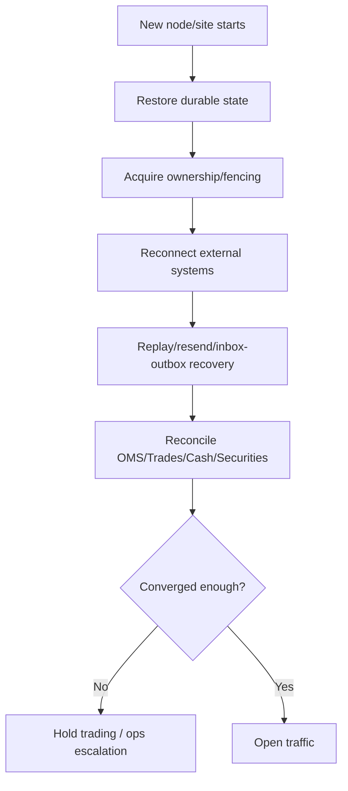

# Bài 20 — HA, DR, BCP & Observability: hệ thống lên xanh chưa có nghĩa business đã an toàn

Trong trading, High Availability không phải chạy hai pod; Disaster Recovery không phải restore database rồi tuyên bố xong. Một hệ thống chỉ thực sự recover khi **business state, session state và external reality hội tụ trở lại**.

## 1. Bốn khái niệm

```text
HA  — giảm downtime bằng redundancy/failover
DR  — khôi phục sau sự cố lớn/site loss
BCP — duy trì hoạt động kinh doanh trong khủng hoảng
Observability — biết hệ thống/business đang ở trạng thái gì
```

## 2. RTO và RPO

```text
RTO = tối đa bao lâu để dịch vụ phục hồi
RPO = tối đa chấp nhận mất bao nhiêu dữ liệu/state
```

Không đặt RTO/RPO chung cho cả công ty. Market data cache, FIX session store, ledger và reporting có criticality khác nhau.

## 3. Stateful component inventory

Trước HA design, liệt kê:

```text
OMS DB
Ledger DB
FIX session/message store
Outbox/Inbox
Market-data sequence state
Conditional-order state
Risk limits/reservations
Settlement state
Reconciliation breaks
```

Nếu không biết state nằm đâu, failover chỉ là đoán.

## 4. Active/Active vs Active/Standby

Stateless API dễ active/active hơn. Session-sensitive gateway thường cần single logical owner.

```text
API: A + B active
OMS workers: partition/ownership
FIX gateway: Active A, Standby B
Ledger: primary/replica theo DB architecture
```

Không dùng một topology cho mọi component.

## 5. Fencing chống split brain

Failover system cần bảo đảm old owner mất quyền trước/new owner có quyền mutation.

Cơ chế có thể là lease + fencing token, database lock/epoch, orchestrator ownership, network fencing hoặc phương án tương đương tùy stack.

Invariant:

```text
At most one authorized owner for a single-owner resource/session
```

## 6. Recovery sequence

Sau crash/site failover:



Đừng mở order routing trước khi session/reconciliation prerequisites đạt policy.

## 7. DR database restore chưa đủ

Backup snapshot lúc 10:00, venue đã xử lý thêm trades tới 10:05. Restore 10:00 tạo divergence.

Cần external replay/reconciliation để tìm:

```text
orders/trades venue có nhưng internal thiếu
payments/settlements external đã hoàn thành
messages cần redeliver
sequence cần resync
```

## 8. BCP nhìn từ business

Trong sự cố lớn, business có thể cần degraded mode:

```text
allow cancel but block new orders
read-only portfolio
manual order route theo approved procedure
pause conditional orders
freeze risky products
switch customer communication channel
```

Các mode phải được định nghĩa/test trước sự cố.

## 9. Observability theo tầng

### Infrastructure

CPU, RAM, disk, network, DB health.

### Application

HTTP latency/error, queue depth, worker lag.

### Protocol

FIX session state, sequence gap, reconnect, feed stale.

### Business

```text
orders PendingNew quá SLA
unknown orders
unbooked executions
reservation leak
ledger imbalance
margin calculation lag
settlement breaks
reconciliation breaks
```

Business metrics mới nói hệ thống có đúng hay không.

## 10. SLO theo flow

Ví dụ:

```text
Client submit → OMS accepted
OMS → venue ACK
Venue execution → internal trade booked
Trade booked → ledger posted
Market tick → client push
Settlement result → internal update
Break detected → assigned ops task
```

Mỗi flow có latency/error budget khác nhau.

## 11. Synthetic probe

Có thể chạy health probe kiểm tra end-to-end non-destructive path hoặc simulator/certification environment. Liveness `/health=200` không phát hiện OMS mất khả năng route order vì session degraded.

## 12. Alert design

Alert theo actionability:

```text
P1: business loss/correctness risk đang xảy ra
P2: redundancy mất, service còn chạy
P3: trend/capacity cần xử lý
```

Đừng page on-call vì mọi warning log.

## 13. DR drill

Drill nên kiểm chứng:

- cut primary route/site;
- promote standby;
- restore session state;
- handle in-flight orders;
- replay outbox/inbox;
- reconcile venue/bank/depository;
- measure RTO/RPO thực tế;
- record manual steps và gaps.

Runbook chưa drill chỉ là tài liệu giả định.

## 14. Capacity during recovery

Sau outage, backlog drain tạo spike. DR site cần capacity cho:

```text
live traffic + replay backlog + reconciliation
```

Nếu sizing chỉ bằng average live load, recovery có thể kéo dài vô hạn.

## 15. Definition of Ready after recovery

```text
DB healthy
+ single owner established
+ protocol sessions recovered
+ no critical sequence gap
+ unknown-order queue under threshold
+ critical reconciliations passed
+ risk/reference data fresh
= business ready
```

## Definition of Done

- [ ] RTO/RPO theo component/business flow.
- [ ] Stateful inventory đầy đủ.
- [ ] Single-owner resources có fencing.
- [ ] Recovery order được document.
- [ ] External reconciliation là một bước DR.
- [ ] Degraded business modes được định nghĩa.
- [ ] Business metrics/SLO tồn tại.
- [ ] DR drill đo được kết quả thực.

## Bài tập

Giả lập mất primary DC lúc 10:15 trong khi có 5,000 working orders, 300 outbound messages chưa ACK và 50 trades vừa execute. Viết runbook từng bước để DR site lên, không double-send, khôi phục unknown outcomes và chứng minh ledger/venue state hội tụ trước khi mở lại trading.