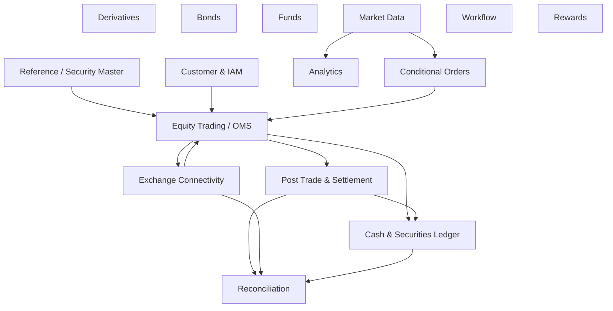

# Bài 24 — Architecture Boundaries: DDD, Modular Monolith, Microservices và dữ liệu trong Core Securities

Sau 23 bài, đây mới là lúc hỏi: **nên chia service thế nào?** Nếu hỏi câu này trước khi hiểu Order, Trade, Ledger, Risk, FIX, Settlement và Reconciliation, bạn rất dễ tạo một distributed system phức tạp nhưng sai nghiệp vụ.

## 1. Bắt đầu từ invariant

Không bắt đầu:

```text
OrderService
CashService
PositionService
RiskService
TradeService
```

chỉ vì có năm danh từ.

Bắt đầu:

```text
Invariant nào cần atomic?
State nào có cùng lifecycle?
Ai là authority?
Failure boundary nào cần độc lập?
Scale profile nào khác biệt thật sự?
Team ownership nào ổn định?
```

## 2. Consistency boundary

Ví dụ pre-trade BUY cần:

```text
validate buying power
+ reserve cash
+ create order
```

Nếu tách `CashService` và `OrderService` sớm, một invariant đơn giản trở thành distributed saga.

Một modular monolith với transaction local có thể đúng và đơn giản hơn.

## 3. Bounded Context khác Microservice

DDD bounded context là boundary của model/language/authority. Nó **không bắt buộc** deployment riêng.

```text
One deployable
├── Trading module
├── Ledger module
├── Reference module
└── PostTrade module
```

vẫn có thể giữ boundary code/schema rõ.

## 4. Khi nào tách service hợp lý?

Tín hiệu mạnh:

```text
khác scale profile lớn
khác availability/SLO
khác security/network zone
khác release cadence/team ownership
khác data lifecycle
external integration isolation
failure blast radius cần tách
```

Ví dụ Market Data fan-out và Enterprise Workflow thường có workload rất khác OMS transaction path.

## 5. Candidate context map



Đây là map để suy nghĩ, không phải template bắt buộc.

## 6. Database per service không phải mục tiêu

Data ownership phải rõ, nhưng “mỗi service một database” có trade-off lớn:

```text
local transaction mất
join/report khó
reconciliation tăng
ops/backup/schema migration nhiều
```

Tách storage khi boundary/operational reason đủ mạnh, không vì checklist microservices.

## 7. Shared DB nhưng boundary rõ?

Trong modular monolith, có thể dùng cùng DB instance nhưng tách schema/table ownership và cấm module mutate table module khác trực tiếp.

```text
trading.*
ledger.*
reference.*
posttrade.*
```

Integration qua application/domain contracts hoặc outbox events.

## 8. CQRS

CQRS hữu ích khi write model bảo vệ invariant khác hẳn read workload:

```text
Write: strict order/account state
Read: portfolio dashboard/search/history
```

Không cần hai database/hai microservice ngay lập tức. CQRS là separation of models/responsibility, có nhiều mức triển khai.

## 9. Event Sourcing

Event sourcing có thể phù hợp một số lifecycle/audit-heavy domain, nhưng không phải điều kiện để có ledger/history.

Trước khi chọn, trả lời:

- event schema migration?
- replay side effects?
- temporal query?
- snapshot?
- correction/reversal?
- team có vận hành được không?

Relational transaction + append-only business entries thường đã đủ cho nhiều core.

## 10. Synchronous vs Asynchronous

Synchronous khi caller cần decision ngay:

```text
pre-trade validation
reservation acceptance
```

Async phù hợp fan-out/integration:

```text
TradeBooked → reporting/rewards/notification
```

Không biến critical decision thành async chỉ để “event-driven”.

## 11. Anti-Corruption Layer

External systems nên qua adapter:

```text
Domain Model
→ Port
→ FIX/KRX Adapter
→ VSDC Adapter
→ Bank Adapter
```

Raw external message không lan tới mọi bounded context.

## 12. Source of truth matrix

Ví dụ:

| Fact | Authority |
|---|---|
| Internal order intent | OMS |
| Venue order/execution evidence | Venue/Gateway evidence |
| Internal cash entries | Ledger |
| Instrument rules | Reference Master |
| Depository holding evidence | Depository/VSDC evidence |
| Bank cash evidence | Bank |
| Reconciliation break | Reconciliation context |

Không có một “master database” cho mọi sự thật.

## 13. Architecture evolution path

Một path thực dụng:

```text
Phase 1: Modular Monolith
  strong module boundaries + one transactional core

Phase 2: Extract obvious different workload
  market data / notification / analytics / external gateway

Phase 3: Extract domain where team/scale/failure boundary proves value

Phase 4: continually preserve reconciliation and observability
```

Không cần bắt đầu 30 microservices.

## 14. ADR bắt buộc

Với mỗi split quan trọng ghi:

```text
Context
Decision
Invariant impact
Consistency impact
Failure modes
Operational cost
Migration/reversal path
Metrics proving split value
```

## 15. Smells

```text
service per entity
shared Redis as truth
cross-service transaction everywhere
saga cho simple local invariant
Kafka as database for teams that cannot replay safely
raw FIX event consumed by business modules
three different buying-power formulas
no reconciliation after split
```

## Definition of Done

- [ ] Boundary bắt đầu từ invariant/authority.
- [ ] Bounded context không bị đồng nhất với deployment.
- [ ] Transaction boundary được document.
- [ ] Sync/async có lý do business.
- [ ] External protocol nằm sau ACL/adapter.
- [ ] Source-of-truth matrix rõ.
- [ ] Split service có failure/ops cost analysis.
- [ ] ADR và migration path tồn tại.

## Bài tập cuối lecture

Thiết kế platform ở hai phiên bản: **Modular Monolith** và **Microservices**. Với mỗi phiên bản, trace scenario `BUY → partial fill → cancel → settlement → reconciliation`, đánh dấu transaction boundary và failure point. Chọn phiên bản bằng evidence thay vì số lượng box.