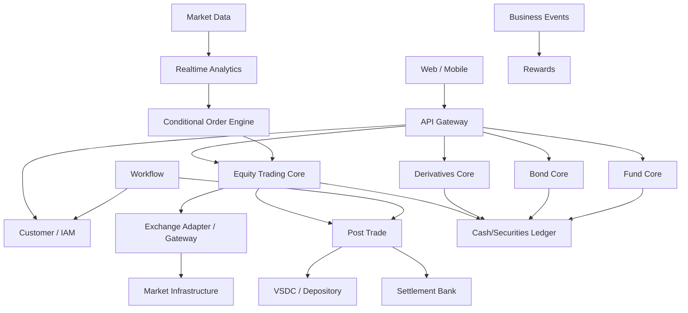

# Project 02 — Thiết kế Brokerage Platform end-to-end

Đây là capstone: thiết kế platform mô phỏng một công ty chứng khoán, kết nối toàn bộ kiến thức của khóa học.

## 1. Scope

Platform hỗ trợ:

```text
Equity Trading
Derivative Position/Margin
Bond Holdings/Cashflows
Fund Subscription/Redemption
Market Data & Analytics
Conditional Orders
Rewards
Enterprise Workflow
```

Không cần implement tất cả production-grade; mục tiêu là thiết kế boundary, invariant, data flow và failure recovery đúng.

## 2. Context Map



## 3. Bounded Contexts

Đề xuất để thảo luận, không phải chân lý:

```text
Customer & Identity
Reference/Security Master
Cash & Securities Ledger
Equity Trading
Derivatives
Bonds
Funds
Market Data
Analytics
Conditional Orders
Exchange Connectivity
Post Trade & Settlement
Reconciliation
Rewards
Workflow
Notification
Reporting
```

Hãy merge/split dựa trên consistency boundary và team/scale, không dựa số lượng danh từ.

## 4. Core Scenario — Equity Buy

Vẽ sequence:

```text
Client
→ Trading API
→ Buying Power
→ Reservation
→ OMS
→ Venue Gateway
→ Matching
→ Execution
→ Trade Booking
→ Ledger/Pending Settlement
→ Clearing
→ Settlement
→ Reconciliation
```

Phải ghi rõ transaction boundary ở mỗi bước.

## 5. Core Scenario — Conditional Order

```text
Market Tick
→ Condition match
→ atomic trigger
→ generated order idempotency key
→ OMS
→ timeout
→ recovery/query
→ final order state
```

## 6. Core Scenario — Derivatives Margin

```text
Market Price
→ Position PnL
→ Margin
→ Threshold breach
→ Margin Call
→ Liquidation Workflow
→ Orders
→ Partial fills
→ New Margin State
```

## 7. Core Scenario — Settlement Break

```text
Internal Obligation
≠ External VSDC result
      ↓
Reconciliation Break
      ↓
Classification
      ↓
Auto Repair / Ops Task
      ↓
Recompare
      ↓
Resolved + Audit
```

## 8. Data Strategy

### Transactional relational DB
Order, ledger, settlement, workflow state.

### Stream/event bus
Market feed fan-out, business integration events.

### Cache/hot state
Order book/market snapshot/read model khi cần.

### Analytical/time-series
OHLCV, indicators, historical analytics.

Không đưa tất cả vào Kafka chỉ vì “event-driven”.

## 9. Consistency Decisions cần document

Với mỗi integration:

| Flow | Delivery | Idempotency | Reconciliation |
|---|---|---|---|
| OMS → Venue | protocol-specific | Client/Order IDs | venue order recon |
| Venue → OMS execution | may duplicate/replay | Exec identity | trade recon |
| Core → Rewards | at-least-once | business event key | reward ledger recon |
| Trade → PostTrade | at-least-once | TradeId | trade/obligation recon |

## 10. Security

Bao gồm:

- authentication/authorization;
- customer/account entitlement;
- secret/certificate management;
- HSM/PKI khi external connectivity yêu cầu;
- encryption;
- audit logs;
- privileged operations;
- segregation of duties.

## 11. Observability

Dashboard không chỉ có CPU.

Business SLO/metrics:

```text
Order submit latency
Venue ACK latency
Unknown orders
Execution processing lag
FIX/session gaps
Market feed staleness
Settlement breaks
Ledger imbalance
Margin calculation lag
Conditional trigger latency
Workflow SLA breach
```

## 12. HA/DR

Document:

```text
RTO
RPO
Primary/Standby
State ownership
Failover
Replay
Reconciliation after failover
DR drill
```

Session-sensitive gateway cần fencing/ownership rõ, tránh hai node cùng active trên cùng logical session nếu protocol không cho phép.

## 13. Deliverables

- [ ] Context map.
- [ ] 5 sequence diagrams.
- [ ] Order state machine.
- [ ] Conditional order state machine.
- [ ] Settlement lifecycle.
- [ ] Data ownership matrix.
- [ ] Idempotency matrix.
- [ ] Reconciliation matrix.
- [ ] Failure-mode table.
- [ ] HA/DR diagram.
- [ ] Business metrics dashboard design.
- [ ] ADR giải thích Modular Monolith vs Microservices.

## Tiêu chí đánh giá

Thiết kế tốt không phải thiết kế có nhiều box nhất. Thiết kế tốt là thiết kế mà reviewer có thể chỉ vào từng failure mode và thấy **cơ chế bảo vệ invariant + recovery + reconciliation**.