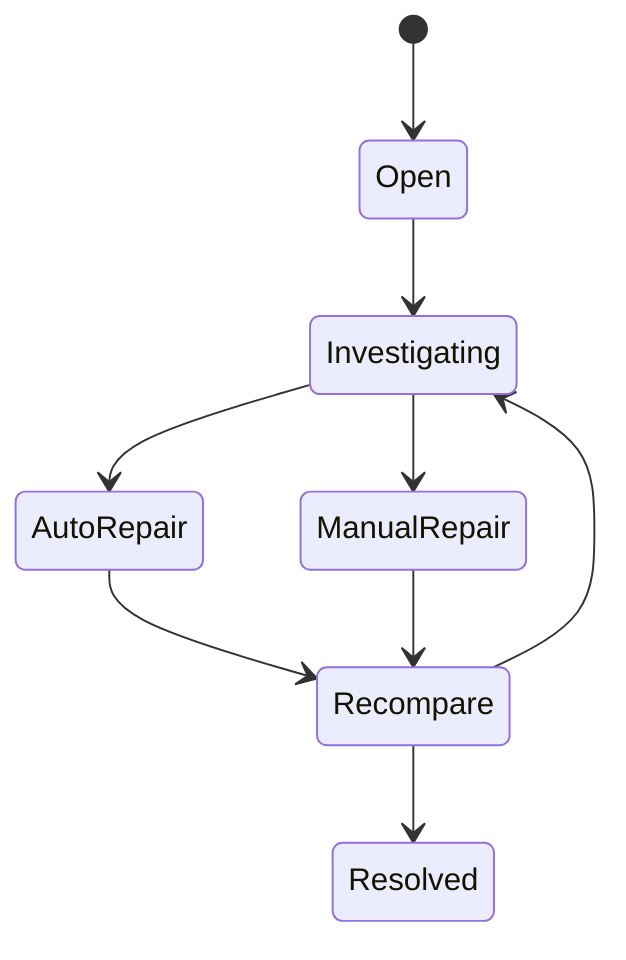

# Project 04 — Ledger & Reconciliation Lab

Mục tiêu: xây một mini sub-ledger cho cash/securities và chứng minh hệ thống **không double-post, rebuild projection được, xử lý reversal và phát hiện mismatch với external statements**.

## Scope

```text
Cash Ledger
Securities Ledger
Projection Engine
External Bank Statement Simulator
External Depository Statement Simulator
Reconciliation Engine
Break Workflow
```

## Scenario nghiệp vụ

Account có 500 triệu và 1,000 FPT.

Thực hiện:

1. BUY 1,000 VNM @ 80,000;
2. partial fill 400;
3. cancel remainder;
4. settle trade;
5. charge fee;
6. nhận cash dividend FPT;
7. manual adjustment có maker/checker;
8. reversal một posting sai.

## Ledger transaction

Model gợi ý:

```text
LedgerTransaction
- TransactionId
- PostingKey
- SourceType
- SourceId
- BusinessDate
- RuleVersion

LedgerEntry
- EntryId
- TransactionId
- Account
- Bucket
- Currency/Instrument
- Amount/Quantity
- Direction
- ReversalOf
```

Nếu dùng double-entry, assert transaction balanced theo model của bạn.

## Projections

Tạo:

```text
CashProjection
PositionProjection
SellableProjection
PendingSettlementProjection
```

Không cho API mutate projection trực tiếp.

## Scenario 1 — Duplicate TradeBooked

Publish cùng `TradeId=T100` 20 lần.

Expected:

```text
1 ledger transaction
1 business effect
19 duplicate/dedup observations
```

## Scenario 2 — Projection crash

Ledger đã có 100k entries, projector crash ở sequence 55,000.

Restart từ checkpoint/snapshot + replay. Final hash/balance phải bằng full rebuild.

## Scenario 3 — Wrong fee correction

Fee ban đầu post 200,000 nhưng đúng là 180,000.

Không update entry cũ. Tạo reversal/correction chain và chứng minh audit history.

## Scenario 4 — Bank mismatch

External bank statement:

```text
Settlement Payment = -32,180,000
```

Internal:

```text
-32,200,000
```

Reconciliation tạo break:

```text
Type = CASH_AMOUNT_MISMATCH
Difference = 20,000
Severity
Owner
Status=OPEN
```

## Scenario 5 — Depository mismatch

Internal settled FPT = 1,000; external statement = 900. Không tự “set position=900”. Tạo break, evidence và controlled repair.

## Break workflow



## Manual Adjustment

Flow:

```text
Maker creates adjustment
→ validation/dry-run
→ Checker approves
→ ledger posting
→ projection update
→ reconciliation
→ audit close
```

## Failure injection

- crash giữa ledger entries trước commit;
- crash sau ledger commit trước event publish;
- duplicate settlement confirmation;
- out-of-order correction;
- projector lag;
- external statement late;
- reconciliation job rerun;
- manual repair replay.

## Metrics

```text
ledger postings/sec
posting duplicates
unbalanced transactions
projection lag
projection rebuild progress
open breaks
oldest break
breaks by source/type
manual adjustments
reversal count
```

## Definition of Done

- [ ] PostingKey uniqueness.
- [ ] Ledger history immutable/controlled reversal.
- [ ] Projection rebuild deterministic.
- [ ] Rerun không double effect.
- [ ] Bank/depository reconciliation hoạt động.
- [ ] Break có lifecycle/owner/SLA/audit.
- [ ] Manual repair có maker/checker.
- [ ] Final current state trace ngược về entries.

## Review cuối

Chọn một con số `AvailableCash` trên UI và chứng minh được chuỗi:

```text
UI value
→ projection version
→ ledger entries
→ source trades/payments/adjustments
→ external reconciliation evidence
```

Nếu không trace được chuỗi đó, project chưa xong.