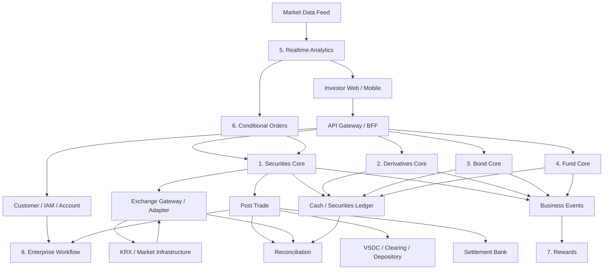

# System Map — Công ty chứng khoán nhìn từ Backend

Sơ đồ này là mental map để định vị 8 domain trong một platform tổng thể.



## Luồng kiến thức

```text
Economics
  ↓ explains incentives / price / macro drivers
Finance
  ↓ explains time value / risk / valuation
Securities
  ↓ defines instruments / orders / positions
Market Microstructure
  ↓ explains book / matching / liquidity
Market Infrastructure
  ↓ KRX / FIX / VSDC / settlement
Core Domains
  ↓ implement product lifecycles
Reliability
  ↓ protects business invariants
Reconciliation
  ↓ proves internal state agrees with external reality
```

## Source-of-truth thinking

Không có một source of truth duy nhất cho toàn platform.

Ví dụ:

```text
Customer profile        → customer/IAM core
Internal order intent   → OMS
Venue-assigned status   → venue message/reconciliation evidence
Internal cash ledger    → ledger core
Depository holdings     → depository/custodian evidence
Settlement result       → post-trade/VSDC/bank evidence
Market price            → approved market data source
```

Kiến trúc tốt document authority cho từng fact thay vì gọi chung một database là “source of truth”.