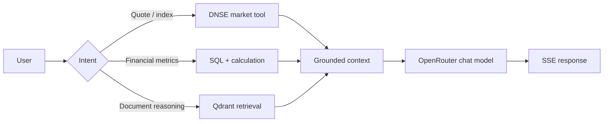

# AI Assistant với OpenRouter: routing, tools và streaming

## Không trộn các capability của model

| Capability | Mục đích |
| --- | --- |
| Chat / reasoning | Tổng hợp câu trả lời và giải thích |
| Fast chat / classifier | Phân loại intent và chuẩn hóa câu hỏi |
| Embedding | Biến query/chunk thành vector cùng không gian |
| Reranking | Xếp lại các chunk đã retrieval |

**Reranker không phải chat model.** Mọi model ID phải được kiểm tra qua danh mục/capability của provider trước khi cấu hình. Tính khả dụng của free endpoint và rate limit có thể thay đổi; không xem `:free` là đảm bảo model đang hoạt động.

Tham khảo: [OpenRouter Models](https://openrouter.ai/models) và [OpenRouter API](https://openrouter.ai/docs).

## Free-only mode

Cấu hình môi trường development với allowlist các model chat free đã xác minh; không tự fallback sang model trả phí. Kiểm tra model + supported endpoint + pricing bằng API/catalog hiện hành trước khi gọi, xử lý 404/429 rõ ràng và hiển thị lỗi thân thiện. Embedding/reranker có thể không có free endpoint phù hợp: khi đó dừng ingestion có thông báo hoặc chọn phương án cục bộ được cấu hình, không âm thầm phát sinh chi phí.

## Query routing

Ví dụ: *“VN-Index hôm nay thế nào?”* phải sử dụng dữ liệu chỉ số thật và thời điểm nguồn. *“Vì sao lợi nhuận SSI tăng?”* cần dữ liệu tài chính và tài liệu có citation. Thiếu bằng chứng phải nêu rõ giới hạn.

## Streaming contract

SSE events có thể gồm `query_started`, `tool_started`, `citation`, `token`, `model_fallback`, `done` và `error`. Nếu fallback thì ghi rõ model thực tế. Không hiển thị raw provider exception hoặc secrets cho người dùng.

## Guardrails

- Không để LLM tính giá, P/E, ROE hay lợi nhuận khi backend có thể tính chính xác.
- Phân biệt dữ kiện từ provider/tài liệu với suy luận của model.
- Trích dẫn phải truy vết đến source và đúng kỳ.
- Không gửi API key, session cookie hoặc dữ liệu riêng tư không cần thiết đến model.
- Lưu latency, model ID, token usage và kết quả retrieval để chẩn đoán mà không log secrets.
