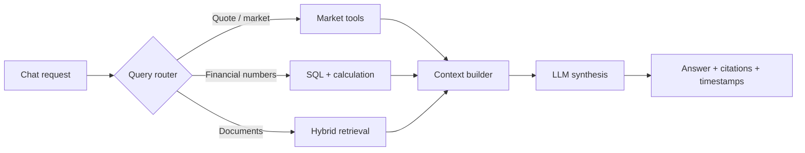

# Kiến trúc StockAI: từ bảng giá đến AI Assistant

## Bài toán

Một AI chứng khoán không chỉ là chatbot trên PDF. Câu hỏi *“Giá SSI hiện tại là bao nhiêu?”* phải đi qua market-data service; câu hỏi *“Vì sao lợi nhuận thay đổi?”* cần báo cáo tài chính và giải trình; câu hỏi so sánh nhiều mã cần dữ liệu có cấu trúc cùng đơn vị, kỳ và phạm vi hợp nhất.

## Các boundary

| Thành phần | Trách nhiệm | Không nên làm |
| --- | --- | --- |
| Next.js | Chat, charts, CMS, hiển thị nguồn và freshness | Giữ khóa DNSE/OpenRouter |
| ASP.NET Core | Query router, API, tool executor, validation | Tin số liệu do LLM tự tạo |
| Market Worker | Subscribe, normalize, reconnect, checkpoint | Phụ thuộc vòng đời HTTP request |
| Redis | Giá/sổ lệnh mới nhất, Pub/Sub | Kho lịch sử vĩnh viễn |
| PostgreSQL | Security master, tài chính, OHLC/history, CMS, audit | Vector retrieval chính |
| Object storage | File gốc và phiên bản | Chỉ lưu text đã chunk |
| Qdrant | Document vectors, payload filters, hybrid retrieval | Lưu từng market tick |
| OpenRouter | Chat và embedding qua các interface riêng | Source of truth cho giá/BCTC |



## Dữ liệu có nguồn gốc

Mỗi kết quả thị trường cần `symbol`, `providerTimestamp`, `receivedAt`, `source` và `freshness/status`. Số liệu tài chính phải ghi loại báo cáo (riêng/hợp nhất), kỳ, đơn vị, phiên bản và nguồn. Chunk tài liệu phải chỉ ngược về `documentId`, `versionId`, trang và URL/file gốc.

## .NET abstraction

```csharp
public interface IMarketDataProvider
{
    Task<Quote?> GetQuoteAsync(string symbol, CancellationToken ct);
    IAsyncEnumerable<MarketEvent> SubscribeAsync(
        MarketSubscription subscription, CancellationToken ct);
}

public interface ILlmProvider
{
    IAsyncEnumerable<LlmStreamEvent> StreamAsync(
        LlmRequest request, CancellationToken ct);
}
```

DNSE và SSI là các infrastructure adapters riêng. Chat model, embedding model và reranker có **capability** khác nhau; không gửi reranker đến Chat Completions.

## Failure semantics

- Provider disconnect: đánh dấu dữ liệu stale và giữ timestamp cuối cùng; không gắn nhãn realtime cho snapshot cũ.
- Không có BCTC: hiển thị unavailable và nói rõ thiếu nguồn; không sinh KPI giả.
- OpenRouter 404/429: chỉ fallback sang model đã kiểm tra capability và chi phí; tránh retry vô hạn.
- Chunk không có citation hợp lệ: không dùng làm bằng chứng cho một nhận định tài chính.
- Ticker thay đổi: hủy request/subscription cũ và sử dụng cache key chứa ticker.

Xem [Checklist vận hành](./delivery-checklist).
