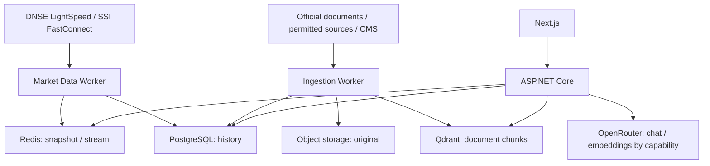

# StockAI — Market Data & AI Assistant Engineering

Trang này bổ sung một **case study kiến trúc**, không thay thế 24 bài giảng, 8 core domains hay hệ thống brokerage production hiện có. Mục tiêu là kết nối Market Data Engineering với việc xây AI Assistant chứng khoán Việt Nam bằng .NET và Next.js.

<strong>Backend</strong> ASP.NET Core<strong>Frontend</strong> Next.js<strong>Retrieval</strong> PostgreSQL + Qdrant<strong>Market</strong> DNSE trước, SSI sau

<a class="course-card" href="./architecture"><strong>01 — Kiến trúc StockAI</strong>Tách dữ liệu realtime, dữ liệu có cấu trúc, tài liệu RAG và AI orchestration.</a>
<a class="course-card" href="./market-data"><strong>02 — DNSE & SSI Market Data</strong>Provider abstraction, WebSocket, Redis, OHLC, dữ liệu cũ và trạng thái thị trường.</a>
<a class="course-card" href="./rag-documents"><strong>03 — RAG & CMS tài liệu</strong>Upload, URL, nguồn tự đồng bộ, PDF, bảng tài chính, hybrid retrieval và citation.</a>
<a class="course-card" href="./ai-assistant"><strong>04 — OpenRouter & AI Assistant</strong>Model routing, free-only policy, tool execution, SSE và kiểm chứng câu trả lời.</a>
<a class="course-card" href="./delivery-checklist"><strong>05 — Kiểm thử & vận hành</strong>Contract test, market freshness, dữ liệu nguồn, failure scenario và checklist go-live.</a>

## Luồng dữ liệu cần phân biệt

**Nguyên tắc:** Không lưu giá realtime vào vector database; không sử dụng LLM để bịa giá, tính toán số liệu hay tạo citation giả. Dữ liệu có thể truy vết đến provider, thời điểm, tài liệu và phiên bản.

## Thứ tự triển khai

1. Chuẩn hóa security master, ticker và market-data provider; ưu tiên DNSE.
2. Hoàn thiện dữ liệu thật và trạng thái freshness; không thay bằng mock khi provider lỗi.
3. Tạo CMS và ingestion pipeline cho tài liệu được phép sử dụng.
4. Xây hybrid retrieval, citation và financial calculation có thể kiểm thử.
5. Tích hợp OpenRouter qua capability-specific interfaces, kiểm tra model còn khả dụng.
6. Thêm SSI adapter khi có quyền truy cập và contract test đạt yêu cầu.

Đọc tiếp [Kiến trúc StockAI](./architecture) hoặc quay lại [Market Data Engineering](../lectures/10-market-data-engineering/).
